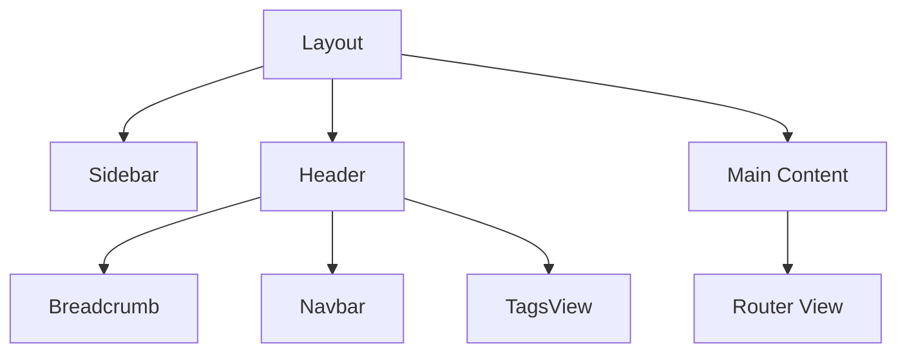

# 后台布局

## 学习目标

- 掌握后台管理系统的布局设计
- 掌握动态侧边栏的实现
- 掌握面包屑导航
- 理解多级路由和嵌套布局

---

## 布局结构



### Layout 组件

```vue
<!-- src/layouts/index.vue -->
<template>
  <div class="app-wrapper" :class="{ hideSidebar: !sidebarOpened }">
    <!-- 侧边栏 -->
    <Sidebar class="sidebar-container" />

    <div class="main-container">
      <!-- 顶部导航 -->
      <Header />

      <!-- 标签页 -->
      <TagsView />

      <!-- 主内容区域 -->
      <div class="app-main">
        <router-view v-slot="{ Component }">
          <transition name="fade" mode="out-in">
            <keep-alive :include="cachedViews">
              <component :is="Component" />
            </keep-alive>
          </transition>
        </router-view>
      </div>
    </div>
  </div>
</template>

<script setup lang="ts">
import { computed } from 'vue';
import { useAppStore } from '@/store/app';
import Sidebar from './components/Sidebar.vue';
import Header from './components/Header.vue';
import TagsView from './components/TagsView.vue';

const appStore = useAppStore();
const sidebarOpened = computed(() => appStore.sidebarOpened);
const cachedViews = computed(() => appStore.cachedViews);
</script>
```

---

## 动态侧边栏

```vue
<!-- src/layouts/components/Sidebar.vue -->
<template>
  <el-menu
    :default-active="route.path"
    :collapse="!sidebarOpened"
    :collapse-transition="false"
    :unique-opened="true"
    router
    background-color="#304156"
    text-color="#bfcbd9"
    active-text-color="#409EFF"
  >
    <SidebarItem
      v-for="route in menuRoutes"
      :key="route.path"
      :item="route"
      :base-path="route.path"
    />
  </el-menu>
</template>

<script setup lang="ts">
import { computed } from 'vue';
import { useRoute } from 'vue-router';
import { useAppStore } from '@/store/app';
import { usePermissionStore } from '@/store/permission';
import SidebarItem from './SidebarItem.vue';

const route = useRoute();
const appStore = useAppStore();
const permissionStore = usePermissionStore();

const sidebarOpened = computed(() => appStore.sidebarOpened);
const menuRoutes = computed(() => permissionStore.routes);
</script>
```

### 递归菜单项

```vue
<!-- src/layouts/components/SidebarItem.vue -->
<template>
  <template v-if="hasChildren">
    <el-sub-menu :index="resolvePath(item.path)">
      <template #title>
        <el-icon><component :is="item.meta?.icon" /></el-icon>
        <span>{{ item.meta?.title }}</span>
      </template>
      <SidebarItem
        v-for="child in item.children"
        :key="child.path"
        :item="child"
        :base-path="resolvePath(child.path)"
      />
    </el-sub-menu>
  </template>

  <template v-else>
    <el-menu-item :index="resolvePath(item.path)">
      <el-icon><component :is="item.meta?.icon" /></el-icon>
      <template #title>{{ item.meta?.title }}</template>
    </el-menu-item>
  </template>
</template>

<script setup lang="ts">
import { computed } from 'vue';
import type { RouteRecordRaw } from 'vue-router';

const props = defineProps<{
  item: RouteRecordRaw;
  basePath: string;
}>();

const hasChildren = computed(() => {
  return props.item.children?.length && !props.item.children[0]?.meta?.hidden;
});

const resolvePath = (path: string) => {
  if (/^(https?:)/.test(path)) return path;
  return path.startsWith('/') ? path : `${props.basePath}/${path}`;
};
</script>
```

---

## Header 组件

```vue
<template>
  <div class="navbar">
    <!-- 折叠按钮 -->
    <div class="left-menu" @click="toggleSidebar">
      <el-icon :size="20">
        <Fold v-if="sidebarOpened" />
        <Expand v-else />
      </el-icon>
    </div>

    <!-- 面包屑 -->
    <Breadcrumb class="breadcrumb-container" />

    <!-- 右侧功能区 -->
    <div class="right-menu">
      <!-- 全屏 -->
      <el-tooltip content="全屏" placement="bottom">
        <el-icon class="right-menu-item" @click="toggleFullscreen">
          <FullScreen />
        </el-icon>
      </el-tooltip>

      <!-- 用户信息 -->
      <el-dropdown class="user-container" trigger="click">
        <div class="user-info">
          <el-avatar :size="30" :src="userStore.avatar" />
          <span class="username">{{ userStore.nickname }}</span>
        </div>
        <template #dropdown>
          <el-dropdown-menu>
            <el-dropdown-item @click="toProfile">个人中心</el-dropdown-item>
            <el-dropdown-item divided @click="logout">退出登录</el-dropdown-item>
          </el-dropdown-menu>
        </template>
      </el-dropdown>
    </div>
  </div>
</template>
```

---

## TagsView

```vue
<template>
  <div class="tags-view">
    <router-link
      v-for="tag in tags"
      :key="tag.path"
      :to="tag.path"
      class="tags-view-item"
      :class="{ active: isActive(tag.path) }"
    >
      {{ tag.title }}
      <el-icon
        class="close-icon"
        @click.prevent="closeTag(tag)"
        v-if="!tag.affix"
      >
        <Close />
      </el-icon>
    </router-link>
  </div>
</template>

<script setup lang="ts">
import { useTagsStore } from '@/store/tags';
const tagsStore = useTagsStore();
const tags = computed(() => tagsStore.visitedTags);
</script>
```

---

## 自测题

### 问题 1
后台管理系统为什么要使用 keep-alive 缓存页面？

<details>
<summary>查看答案</summary>
keep-alive 缓存页面组件的状态，避免切换标签页时重新渲染和重新发送请求。例如表格页面的搜索条件、分页信息、选中状态等都能保持。配合 include 属性可以精确控制哪些页面需要缓存。需要缓存的页面在路由 meta 中设置 keepAlive: true 标志。
</details>

### 问题 2
动态路由菜单的递归组件是如何工作的？

<details>
<summary>查看答案</summary>
递归组件在 template 中调用自身。SidebarItem 组件根据是否有子路由判断：如果有子路由且子路由有可显示的菜单项，渲染 el-sub-menu 并递归调用 SidebarItem 渲染子项；如果没有子路由或子路由被隐藏，渲染 el-menu-item。通过递归可以处理任意深度的嵌套菜单结构。
</details>

### 问题 3
TagsView（标签页）的实现原理是什么？

<details>
<summary>查看答案</summary>
TagsView 在路由守卫中监听路由变化，将访问过的路由信息（path、title、affix 等）存入 Pinia store。用户通过点击标签页切换时，使用 router.push 导航。关闭标签页时从 store 中移除对应的路由记录。部分标签（如首页）设置 affix: true 不可关闭。这是类 IDE 的多标签页管理方案。
</details>