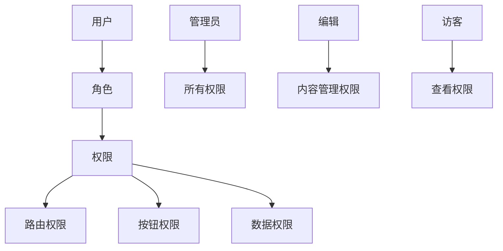

# 权限管理

## 学习目标

- 理解 RBAC 权限模型
- 掌握路由权限控制的实现
- 掌握按钮级权限控制
- 掌握登录流程和 Token 管理

---

## RBAC 权限模型



---

## 登录认证

```typescript
// src/store/user.ts
import { defineStore } from 'pinia';
import { login, getUserInfo, logout } from '@/api/user';
import { setToken, removeToken } from '@/utils/auth';
import router from '@/router';

export const useUserStore = defineStore('user', {
  state: () => ({
    token: '',
    userInfo: null as UserInfo | null,
    roles: [] as string[],
    permissions: [] as string[]
  }),

  actions: {
    async login(loginData: LoginParams) {
      const { token } = await login(loginData);
      this.token = token;
      setToken(token);
    },

    async fetchUserInfo() {
      const { userInfo, roles, permissions } = await getUserInfo();
      this.userInfo = userInfo;
      this.roles = roles;
      this.permissions = permissions;
    },

    async logout() {
      try {
        await logout();
      } finally {
        this.resetState();
        removeToken();
        router.push('/login');
      }
    },

    resetState() {
      this.token = '';
      this.userInfo = null;
      this.roles = [];
      this.permissions = [];
    }
  }
});
```

### 路由守卫

```typescript
// src/router/permission.ts
import router from './index';
import { useUserStore } from '@/store/user';
import { usePermissionStore } from '@/store/permission';
import { getToken } from '@/utils/auth';

const whiteList = ['/login', '/register', '/forgot-password'];

router.beforeEach(async (to, from, next) => {
  const hasToken = getToken();

  if (hasToken) {
    if (to.path === '/login') {
      next('/');
      return;
    }

    const userStore = useUserStore();
    const hasRoles = userStore.roles.length > 0;

    if (hasRoles) {
      next();
    } else {
      try {
        // 获取用户信息
        await userStore.fetchUserInfo();

        // 动态添加路由
        const permissionStore = usePermissionStore();
        const accessRoutes = permissionStore.generateRoutes(userStore.roles);
        accessRoutes.forEach(route => router.addRoute(route));

        // 继续导航
        next({ ...to, replace: true });
      } catch (error) {
        await userStore.resetState();
        next(`/login?redirect=${to.path}`);
      }
    }
  } else {
    if (whiteList.includes(to.path)) {
      next();
    } else {
      next(`/login?redirect=${to.path}`);
    }
  }
});
```

---

## 动态路由

```typescript
// src/store/permission.ts
import { defineStore } from 'pinia';
import { constantRoutes, asyncRoutes } from '@/router';

function hasPermission(roles: string[], route: RouteRecordRaw) {
  if (route.meta?.roles) {
    return roles.some(role => route.meta.roles.includes(role));
  }
  return true;
}

function filterAsyncRoutes(routes: RouteRecordRaw[], roles: string[]) {
  const res: RouteRecordRaw[] = [];
  routes.forEach(route => {
    const tmp = { ...route };
    if (hasPermission(roles, tmp)) {
      if (tmp.children) {
        tmp.children = filterAsyncRoutes(tmp.children, roles);
      }
      res.push(tmp);
    }
  });
  return res;
}

export const usePermissionStore = defineStore('permission', {
  state: () => ({
    routes: [] as RouteRecordRaw[],
    addRoutes: [] as RouteRecordRaw[]
  }),

  actions: {
    generateRoutes(roles: string[]) {
      const accessedRoutes = filterAsyncRoutes(asyncRoutes, roles);
      this.addRoutes = accessedRoutes;
      this.routes = constantRoutes.concat(accessedRoutes);
      return accessedRoutes;
    }
  }
});
```

---

## 按钮权限

```typescript
// 自定义指令
// src/directives/permission.ts
import type { Directive } from 'vue';

export const vPermission: Directive = {
  mounted(el, binding) {
    const { value } = binding;
    const userStore = useUserStore();
    const permissions = userStore.permissions;

    if (value && value instanceof Array && value.length > 0) {
      const hasPermission = permissions.some(p => value.includes(p));
      if (!hasPermission) {
        el.parentNode?.removeChild(el);
      }
    }
  }
};
```

```vue
<template>
  <!-- 通过 v-permission 指令控制按钮显隐 -->
  <el-button v-permission="['user:create']" @click="createUser">
    新增用户
  </el-button>
  <el-button v-permission="['user:delete']" type="danger" @click="deleteUser">
    删除用户
  </el-button>

  <!-- 通过 v-if 配合 store -->
  <el-button v-if="checkPermission('user:edit')" @click="editUser">
    编辑
  </el-button>
</template>

<script setup lang="ts">
import { useUserStore } from '@/store/user';
const userStore = useUserStore();

const checkPermission = (permission: string) => {
  return userStore.permissions.includes(permission);
};
</script>
```

---

## 自测题

### 问题 1
路由权限控制的原理是什么？动态路由和静态路由的区别？

<details>
<summary>查看答案</summary>
路由权限控制将路由分为静态路由（constantRoutes，所有人可访问，如登录页）和动态路由（asyncRoutes，需要权限）。用户登录后获取角色和权限，根据角色过滤出可访问的动态路由，使用 router.addRoute 动态添加到路由表中。静态路由在项目初始化时注册，动态路由在用户登录认证后按需注册。
</details>

### 问题 2
为什么权限路由需要在路由守卫中通过 next({ ...to, replace: true }) 重定向？

<details>
<summary>查看答案</summary>
当动态路由添加完成后，当前路由可能还没有被识别（因为路由表刚刚更新），直接 next() 会进入 404 页面。通过 next({ ...to, replace: true }) 重新触发一次完整的导航，此时路由表中已有新添加的动态路由，能正确匹配到目标页面。replace: true 替换当前历史记录，避免用户回退时回到中间步骤。
</details>

### 问题 3
按钮级权限和路由级权限的控制粒度有何不同？

<details>
<summary>查看答案</summary>
路由级权限控制用户能否访问某个页面，在路由守卫中判断。按钮级权限控制用户能否看到或操作页面内的某个元素（按钮、链接、标签等），通常在组件内通过 v-permission 指令或 v-if 判断。按钮级权限的粒度更细，同一个页面不同用户可以看到不同的操作按钮。两者共同组成完整的权限控制体系。
</details>