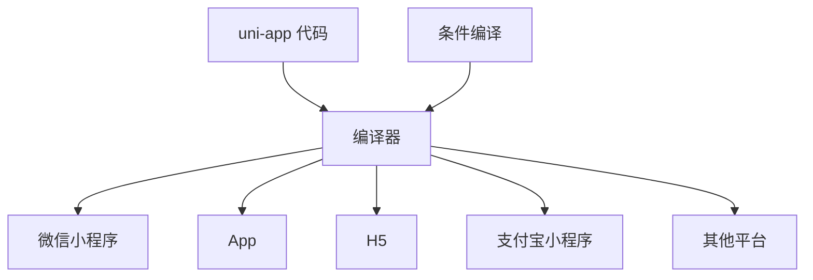

# UniApp 入门

## 学习目标

- 理解 UniApp 的跨平台原理
- 掌握项目创建和目录结构
- 掌握 pages.json 配置

---

## UniApp 介绍

UniApp 是一个使用 Vue.js 开发所有前端应用的框架，开发者编写一套代码，可发布到 iOS、Android、Web 以及各种小程序平台。

### 跨平台原理



### 创建项目

```bash
# 使用 HBuilderX 创建（推荐）
# 文件 -> 新建 -> 项目 -> uni-app

# 使用 CLI 创建
npx @dcloudio/quickstart-cli create-project
```

---

## pages.json 配置

```json
{
  "pages": [
    {
      "path": "pages/index/index",
      "style": {
        "navigationBarTitleText": "首页",
        "enablePullDownRefresh": true
      }
    },
    {
      "path": "pages/category/category",
      "style": { "navigationBarTitleText": "分类" }
    }
  ],
  "globalStyle": {
    "navigationBarTextStyle": "white",
    "navigationBarTitleText": "UniApp",
    "navigationBarBackgroundColor": "#007AFF",
    "backgroundColor": "#F8F8F8"
  },
  "tabBar": {
    "color": "#999",
    "selectedColor": "#007AFF",
    "list": [
      { "pagePath": "pages/index/index", "text": "首页", "iconPath": "static/home.png" },
      { "pagePath": "pages/category/category", "text": "分类", "iconPath": "static/category.png" }
    ]
  },
  "condition": {
    "current": 0,
    "list": [{ "name": "详情页", "path": "pages/detail/detail" }]
  }
}
```

---

## 自测题

### 问题 1
UniApp 是如何实现一套代码多端发布的？

<details>
<summary>查看答案</summary>
UniApp 在编译阶段根据不同平台的目标进行转换：1）Vue 模板编译为对应平台的模板语言（如微信小程序的 WXML）；2）CSS 单位转换（rpx 适配）；3）API 映射转换（uni.request 映射到各平台的请求 API）；4）条件编译处理平台差异代码。编译后的代码在各平台原生环境中运行。
</details>

### 问题 2
pages.json 和微信小程序的 app.json 有什么关系？

<details>
<summary>查看答案</summary>
pages.json 是 UniApp 的全局配置文件，其设计参考了微信小程序的 app.json，但功能更丰富。UniApp 在编译到微信小程序时会将 pages.json 转换为 app.json 和其他配置文件。pages.json 不仅包含了 app.json 的配置项（pages、window、tabBar 等），还增加了平台差异配置（如 App 特有的配置）。
</details>