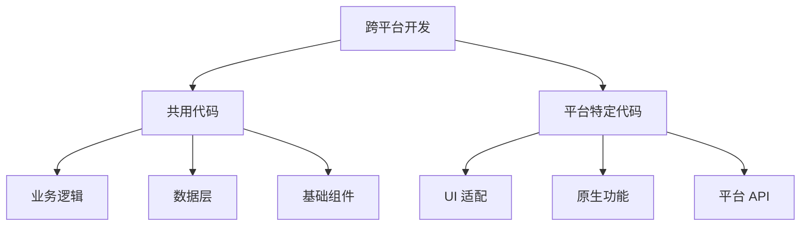

# 跨平台实践

## 学习目标

- 掌握跨平台开发中的常见问题
- 掌握平台差异的处理策略
- 了解项目发布流程

---

## 跨平台开发策略



---

## 平台差异处理

### API 封装

```typescript
// utils/platform.ts
export const getPlatform = () => {
  // #ifdef H5
  return 'h5';
  // #endif
  // #ifdef MP-WEIXIN
  return 'weapp';
  // #endif
  // #ifdef APP-PLUS
  return 'app';
  // #endif
};

// 封装各平台 API 差异
export const login = () => {
  return new Promise((resolve, reject) => {
    // #ifdef H5
    resolve({ code: 'h5-login-code' });
    // #endif
    // #ifdef MP-WEIXIN
    uni.login({
      success: (res) => resolve(res),
      fail: reject
    });
    // #endif
  });
};
```

---

## 样式适配

```css
/* 基础样式统一 */
.container {
  padding: 30rpx;
}

/* 平台特定样式 */
/* #ifdef H5 */
.container {
  max-width: 750px;
  margin: 0 auto;
}
/* #endif */

/* #ifdef MP-WEIXIN */
.container {
  min-height: 100vh;
}
/* #endif */
```

---

## 自测题

### 问题 1
跨平台开发中如何处理平台特有的 UI 差异？

<details>
<summary>查看答案</summary>
1）使用条件编译为不同平台编写不同的模板和样式；2）抽象公共基础组件，通过 props 控制平台特定的渲染逻辑；3）使用 CSS 变量的方式处理差异；4）对于复杂的平台差异，使用适配器模式封装为统一的接口；5）利用框架提供的平台判断 API（Taro.getEnv、uni.getSystemInfoSync）在运行时动态适配。
</details>

### 问题 2
跨平台项目的性能优化有哪些注意事项？

<details>
<summary>查看答案</summary>
1）减少条件编译的使用，优先使用运行时适配；2）注意各平台对组件和 API 的性能差异（如小程序的 setData 限制）；3）合理使用分包（小程序端）；4）控制图片大小，使用 WebP 格式；5）使用虚拟列表处理长列表；6）留意不同平台的渲染机制差异（小程序的双线程模型）。
</details>