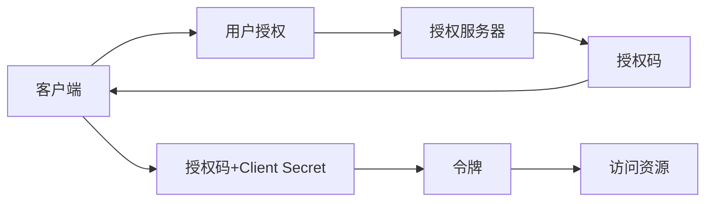

# 用户鉴权

## 学习目标

- 理解 Session 鉴权原理
- 掌握 JWT 的生成和验证
- 了解 OAuth 2.0 流程

---

## Session 鉴权

```javascript
const session = require('express-session');

app.use(session({
  secret: 'secret-key',
  resave: false,
  saveUninitialized: true,
  cookie: {
    maxAge: 24 * 60 * 60 * 1000,
    httpOnly: true,
    secure: false
  }
}));

// 登录
app.post('/login', (req, res) => {
  const { username, password } = req.body;
  if (validUser(username, password)) {
    req.session.userId = user.id;
    res.json({ success: true });
  }
});

// 鉴权中间件
const authMiddleware = (req, res, next) => {
  if (!req.session.userId) {
    return res.status(401).json({ error: '未登录' });
  }
  next();
};
```

---

## JWT

```javascript
const jwt = require('jsonwebtoken');

const SECRET_KEY = 'your-secret-key';

// 生成 Token
function generateToken(payload) {
  return jwt.sign(payload, SECRET_KEY, {
    expiresIn: '7d',
    algorithm: 'HS256'
  });
}

// 验证 Token
function verifyToken(token) {
  try {
    return jwt.verify(token, SECRET_KEY);
  } catch (error) {
    return null;
  }
}

// 登录
app.post('/login', async (req, res) => {
  const user = await authenticate(req.body);
  const token = generateToken({ id: user.id, role: user.role });
  res.json({ token, expiresIn: '7d' });
});

// 鉴权中间件
const authMiddleware = (req, res, next) => {
  const token = req.headers.authorization?.split(' ')[1];
  if (!token) return res.status(401).json({ error: '未提供 Token' });

  const decoded = verifyToken(token);
  if (!decoded) return res.status(401).json({ error: 'Token 无效' });

  req.user = decoded;
  next();
};
```

---

## OAuth 2.0



---

## 自测题

### 问题 1
Session 和 JWT 的主要区别是什么？

<details>
<summary>查看答案</summary>
Session：服务器存储会话数据，客户端只存 Session ID。需要服务器内存或 Redis 存储，扩展时需要共享 Session。JWT：Token 本身包含用户信息，服务器不需要存储会话数据。无状态，扩展性好。但 JWT 无法主动失效（需等待过期），Payload 虽然签名但未加密（不要放敏感信息）。
</details>

### 问题 2
JWT 的 Token 过期后如何处理？

<details>
<summary>查看答案</summary>
两种方案：1）短期 Token + 刷新 Token（Refresh Token）：Access Token 短期有效（如 15 分钟），Refresh Token 长期有效（如 7 天）。Access Token 过期后用 Refresh Token 获取新的 Access Token。2）黑名单机制：服务器维护 Token 黑名单（Redis），每次请求检查是否在黑名单中。方案 1 更常用。
</details>