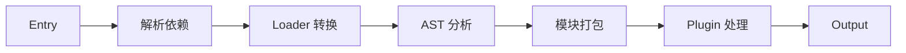

# Webpack 原理

## 学习目标

- 理解 Webpack 的构建流程
- 掌握 Loader 的开发
- 掌握 Plugin 的开发

---

## 构建流程



---

## Loader 开发

```javascript
// my-loader.js
module.exports = function(source) {
  // this 是 Loader 上下文
  const options = this.getOptions();
  const result = source.replace(/Hello/g, 'Hi');
  return result;
};

// 异步 Loader
module.exports = function(source) {
  const callback = this.async();
  setTimeout(() => {
    const result = source.toUpperCase();
    callback(null, result);
  }, 100);
};

// Webpack 配置
{
  test: /\.txt$/,
  use: [
    { loader: 'my-loader', options: { prefix: '>> ' } }
  ]
}
```

---

## Plugin 开发

```javascript
class MyPlugin {
  apply(compiler) {
    // 在 emit 阶段处理
    compiler.hooks.emit.tapAsync('MyPlugin', (compilation, callback) => {
      // compilation: 包含所有资源
      const assets = compilation.getAssets();
      // 添加自定义文件
      compilation.emitAsset('my-file.txt', new compiler.webpack.sources.RawSource('content'));
      callback();
    });

    // 在 compilation 阶段
    compiler.hooks.thisCompilation.tap('MyPlugin', (compilation) => {
      compilation.hooks.processAssets.tap({
        name: 'MyPlugin',
        stage: compiler.webpack.Compilation.PROCESS_ASSETS_STAGE_ADDITIONS
      }, (assets) => {
        // 处理资源
      });
    });
  }
}
```

---

## 自测题

### 问题 1
Loader 的执行顺序是什么样的？如何控制？

<details>
<summary>查看答案</summary>
Loader 的执行顺序是"从右到左，从下到上"。例如 { test: /\.scss$/, use: ['style-loader', 'css-loader', 'sass-loader'] } 的执行顺序为 sass-loader -> css-loader -> style-loader。可以使用 enforce: 'pre'（前置）或 enforce: 'post'（后置）改变执行顺序。普通 Loader 在 pre 之后、post 之前执行。
</details>

### 问题 2
Webpack 的 compiler 和 compilation 对象有什么区别？

<details>
<summary>查看答案</summary>
compiler 对象代表完整的 Webpack 配置和生命周期，在 Webpack 启动时创建，贯穿整个构建过程。compilation 对象代表一次资源构建，在每次文件变化重新构建时创建（watch 模式下）。compiler 的 hooks（如 run、done）在构建的整个过程触发，compilation 的 hooks（如 buildModule、seal）在单次构建过程中触发。
</details>