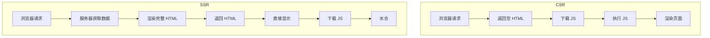

# SSR 概念

## 学习目标

- 理解 CSR 和 SSR 的区别
- 理解同构应用的概念
- 掌握 SSR 的适用场景

---

## CSR vs SSR



### 对比

| 特性 | CSR | SSR |
|-----|-----|-----|
| 首屏加载 | 慢（先下载 JS） | 快（直接返回 HTML）|
| SEO | 差（爬虫看不到内容） | 好（HTML 包含内容）|
| 服务器压力 | 小 | 大 |
| 页面切换 | 快（SPA） | 慢（每次请求页面）|
| 开发复杂度 | 低 | 高 |

---

## 同构应用

同构应用（Isomorphic App/Universal App）指同一套代码同时在客户端和服务端运行：

```javascript
// 同一套 Vue/React 组件
// 服务端：渲染为 HTML 字符串
// 客户端：水合（Hydration）为可交互应用

// 水合过程
// 1. 浏览器接收服务端渲染的 HTML
// 2. 下载并执行 JavaScript
// 3. React/Vue 复用现有的 DOM 节点
// 4. 绑定事件处理函数
// 5. 应用变为可交互
```

---

## 自测题

### 问题 1
SSR 的核心优势是什么？什么场景应该使用 SSR？

<details>
<summary>查看答案</summary>
核心优势：1）更好的首屏加载性能（用户能更快看到内容）；2）更好的 SEO（搜索引擎能抓取到完整内容）；3）更好的社交媒体分享（能生成正确预览）。适用场景：内容型网站（博客、新闻、电商）、需要 SEO 的网站（营销页面）、对首屏性能要求高的应用。不适用场景：需要登录的后台管理系统、实时交互工具。
</details>

### 问题 2
什么是水合（Hydration）？它的作用是什么？

<details>
<summary>查看答案</summary>
水合是 SSR 中服务端渲染的 HTML 转换为客户端可交互应用的过程。浏览器接收到服务端渲染的静态 HTML 后，客户端 JS 接管页面，将事件处理器绑定到已有的 DOM 节点上，使页面变为可交互的 SPA。水合过程要求客户端渲染的虚拟 DOM 结构和服务端生成的 HTML 结构一致，否则会出现水合错误。
</details>