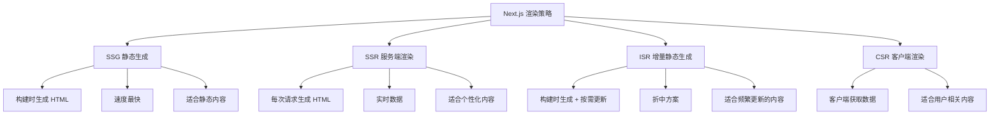

# Next.js 数据获取

## 学习目标

- 理解 SSR、SSG、ISR 的区别
- 掌握服务端组件的数据获取
- 掌握增量静态生成

---

## 渲染策略



---

## 服务端组件数据获取

```tsx
// app/posts/page.tsx - 服务端组件
async function getPosts() {
  const res = await fetch('https://api.example.com/posts', {
    // SSG（默认）：构建时获取
    // cache: 'force-cache'

    // SSR：每次请求获取
    // cache: 'no-store'

    // ISR：每 60 秒重新验证
    next: { revalidate: 60 }
  });
  return res.json();
}

export default async function Posts() {
  const posts = await getPosts();

  return (
    <div>
      {posts.map(post => (
        <article key={post.id}>
          <h2>{post.title}</h2>
          <p>{post.content}</p>
        </article>
      ))}
    </div>
  );
}
```

---

## 动态路由生成

```typescript
// app/posts/[id]/page.tsx

// 生成静态路径（SSG）
export async function generateStaticParams() {
  const posts = await fetch('https://api.example.com/posts')
    .then(res => res.json());

  return posts.map(post => ({
    id: post.id.toString()
  }));
}

// 增量静态生成（ISR）
export const revalidate = 3600; // 每小时重新验证

export default async function Post({ params }: Props) {
  const post = await fetch(
    `https://api.example.com/posts/${params.id}`,
    { next: { revalidate: 60 } }
  ).then(res => res.json());

  return <article>{/* 渲染文章 */}</article>;
}
```

---

## 自测题

### 问题 1
SSG、SSR、ISR 各自适用于什么场景？

<details>
<summary>查看答案</summary>
SSG（静态生成）：内容不经常变化的页面（博客文章、营销页面、文档网站），构建时一次性生成 HTML，CDN 缓存，性能最好。SSR（服务端渲染）：需要实时数据的页面（用户仪表盘、股票行情），每次请求生成 HTML，数据最新但延迟较高。ISR（增量静态生成）：内容定期更新的页面（新闻站、电商产品页），构建时生成静态页，按设置的时间间隔重新生成。
</details>

### 问题 2
Next.js 中 fetch 的 cache 和 next.revalidate 选项如何控制渲染策略？

<details>
<summary>查看答案</summary>
cache: 'force-cache'（默认）表示 SSG，构建时获取数据并缓存。cache: 'no-store' 表示 SSR，每次请求都重新获取数据。next: { revalidate: 60 } 表示 ISR，缓存 60 秒后下次请求时在后台重新生成。这些选项可以精细控制每个数据请求的缓存策略，灵活性高。
</details>