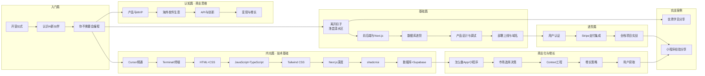

# 课程地图

> 探索从 **Idea to Business** 的完整学习路径

## 学习路径总览



## 模块说明

### 🟢 入门篇（3课）
| 课程 | 说明 | 前置要求 |
|------|------|----------|
| 开营仪式与课程概览 | 课程目标、AI编程六个阶段、学习方法 | 无 |
| 认识你的新伙伴 | AI心智模型 = 超级实习生 | 无 |
| 你不需要会编程 | 课程理念、Vibe Coding、用AI学AI | 无 |

### 🔵 基础篇（6课）
| 课程 | 说明 | 前置要求 |
|------|------|----------|
| 离开扣子编程 | 搭建本地开发环境、TRAE/Cursor | 入门篇 |
| 前后端与Next.js | Web架构、代码结构、SSR/SSG | 基础认识 |
| 数据库进阶 | PostgreSQL、Neon、SQL基础 | 前后端概念 |
| 产品设计与调试 | UI/UX、AI辅助调试 | 开发环境 |
| 部署上线与域名 | Vercel、自定义域名、环境变量 | 完成产品开发 |
| 技术术语密集输入 | 核心技术原理梳理 | 基础篇完成 |

### 🟠 内功篇（11课）
| 课程 | 说明 | 前置要求 |
|------|------|----------|
| [Cursor精通](lessons/s01-cursor-jing-tong.md) | AI编程工具深度使用 | 基础篇 |
| [Terminal/终端](lessons/s02-terminal-ji-chu.md) | 命令行基础操作 | — |
| [HTML](lessons/s03-html-ji-chu.md) | 网页结构语言 | — |
| [CSS](lessons/s04-css-ji-chu.md) | 样式与布局 | HTML |
| [JavaScript/TypeScript](lessons/s05-javascript-typescript.md) | 编程语言基础 | HTML+CSS |
| [Tailwind CSS](lessons/s06-tailwind-css.md) | 实用优先的CSS框架 | CSS |
| [Next.js深度](lessons/s07-next-js-shen-du.md) | React框架核心概念 | JS/TS |
| [shadcn/ui](lessons/s08-shadcn-ui.md) | 组件库使用 | Next.js |
| [数据库](lessons/s09-shu-ju-ku.md) | 数据存储原理 | — |
| [Supabase](lessons/s10-supabase.md) | BaaS平台使用 | 数据库基础 |
| [小测验](lessons/s11-xiao-ce-yan.md) | 内功篇知识点自测 | 内功篇全部 |

### 🟣 进阶篇（3课）
| 课程 | 说明 | 前置要求 |
|------|------|----------|
| [用户认证](lessons/0012-yong-hu-ren-zheng-yu-an-quan.md) | 注册登录、OAuth、安全 | 基础篇+内功篇 |
| [Stripe支付集成](lessons/0013-shang-ye-hua-yu-zeng-zhang.md) | 海外收款、订阅管理 | 用户认证 |
| [全栈项目实战](lessons/0014-quan-lei-xing-shi-zhan.md) | 综合实战项目 | 进阶篇 |

### 🟡 商业化与增长（4课）
| 课程 | 说明 | 前置要求 |
|------|------|----------|
| [怎么做App/小程序](lessons/0010-zen-zuo-app-xiao-cheng-xu.md) | 形态选择、国内vs海外 | 基础篇完成 |
| [Context工程](lessons/0011-context-gong-cheng.md) | Prompt工程升级版 | 有AI编程经验 |
| [增长策略](lessons/0013-shang-ye-hua-yu-zeng-zhang.md) | SEO、社交传播、付费获客 | 有上线产品 |
| [用户获取](lessons/0013-shang-ye-hua-yu-zeng-zhang.md) | 前100个用户怎么来 | 增长策略 |

### 🟤 认知篇（12主题）
横跨整个学习周期，同步提升产品认知：

| 课程 | 说明 |
|------|------|
| [社群直播与航海图](lessons/s12-she-qun-zhi-bo-hang-hai-tu.md) | 社群资源、作业体系、学习路线图 |
| [什么是产品？](lessons/s13-shi-me-shi-chan-pin.md) | 产品定义、三要素、需求发现 |
| [什么是MVP？](lessons/s14-shi-me-shi-mvp.md) | 最小可行产品、功能优先级、迭代 |
| [海外软件产品生意](lessons/s15-hai-wai-ruan-jian-sheng-yi.md) | 商业模式、单人公司案例、汇率优势 |
| [软件生意真正门槛](lessons/s16-zhen-zheng-men-kan.md) | 需求洞察、创意组合、技术≠壁垒 |
| [为什么要从海外网站开始](lessons/s17-wei-shi-yao-cong-hai-wai-wang-zhan.md) | Web优势、获客成本、基础设施 |
| [App/小程序/桌面应用](lessons/s18-shou-ji-app-xiao-cheng-xu.md) | 各形态对比、技术选型、决策树 |
| [怎么知道别人的API](lessons/s19-zen-mo-zhi-dao-bie-ren-api.md) | 产品拆解、AI工具反推、市场嗅觉 |
| [更酷的API从哪来](lessons/s20-geng-ku-de-api.md) | API平台汇总、组合创新、Coze工作流 |
| [变现方式](lessons/s21-bian-xian-fang-shi.md) | 广告/订阅/Freemium、定价策略 |
| [成功率](lessons/s22-cheng-gong-lu.md) | 真实数据、心态建设、持久性 |
| [做软件生意流程](lessons/s23-zuo-sheng-yi-liu-cheng.md) | 四阶段流程、全链路回顾、毕业项目 |

## 推荐学习顺序

### 零基础新手路径
```
入门篇 → 基础篇 → 内功篇1-3 → 认知篇 → 基础篇完成 → 内功篇4-11 → 进阶篇 → 商业化
```

### 有编程基础路径
```
入门篇 → 基础篇 → 进阶篇 → 内功篇(按需查阅) → 商业化 → 认知篇(按需查阅)
```

### 只想做海外产品路径
```
入门篇 → 基础篇 → 认知篇5/9/10 → 进阶篇 → 商业化 → 内功篇(按需查阅)
```

## 课程原则

1. **Idea to Business**：不是只教编程，而是完整的商业化链路
2. **用AI学AI**：最有效的学习方式就是让AI成为你的老师
3. **活社区**：课程持续更新，全年航海训练营跟进
4. **案例驱动**：大量真实成功案例，单人公司年入百万美元的路径