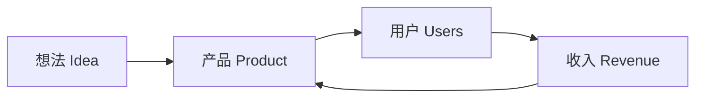
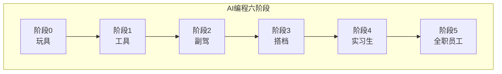
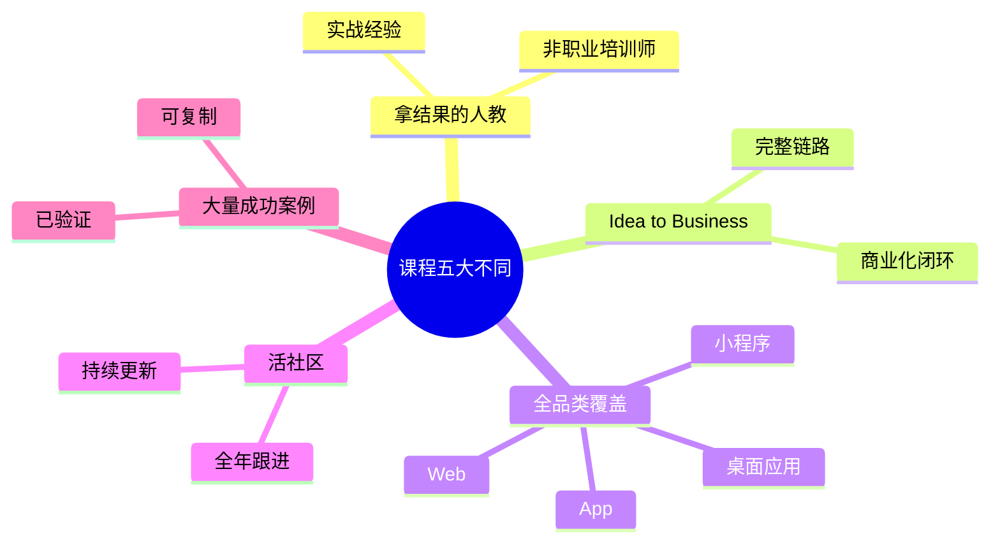

# 第01课：开营仪式与课程概览

> 从 **Idea to Business** — 用 AI 做出能赚钱的软件产品

## 学习目标

- 理解课程的核心理念：Idea to Business
- 掌握 AI 编程的六个阶段演进
- 了解课程形式、学习方法和合作背景
- 认识本课程的五大与众不同之处

---

## 1. 课程理念：Idea to Business

这不是一门"教你写代码"的课程。市面上教编程的课太多了，但绝大多数停留在"教语法、教框架"的层面。

本课程的核心定位是 **Idea to Business** — 从想法到商业化：

你有一个想法，通过 AI 编程把它变成产品，产品吸引用户，用户带来收入，收入驱动产品迭代 — 这就是完整的商业闭环。

> [!TIP] 核心观点
> 编程只是手段，产品才是目的，商业才是终点。AI 时代的最大红利是：**一个人 = 一家公司** 成为可能。

### 覆盖的产品形态

本课程覆盖全品类软件产品：

| 形态 | 典型场景 | 难度 |
|------|---------|------|
| Web 网站 | SaaS 工具、落地页、后台管理 | ★☆☆ |
| 浏览器插件 | 效率工具、数据抓取、增强功能 | ★★☆ |
| 微信小程序 | 国内流量入口、社交裂变 | ★★☆ |
| 微信小游戏 | 轻量化游戏、社交传播 | ★★☆ |
| 手机 App | 原生体验、移动端产品 | ★★★ |
| 桌面应用 | 生产力工具、专业软件 | ★★★ |

---

## 2. AI 编程的六个阶段

AI 编程的能力演进可以分为六个阶段，从"玩具"到"全职员工"，代表了人与 AI 协作的深度递进：

### 阶段 0：玩具 — Lovable / v0

- 用一句话生成小游戏、小网站
- 工具：Lovable, v0, Bolt
- 特点：好玩但不可控，适合快速原型验证
- 局限：无法做出真正可交付的商业产品

### 阶段 1：工具 — Cursor / TRAE

- 能做出完整产品，并且赚到钱
- 工具：Cursor, TRAE, GitHub Copilot
- 特点：AI 嵌入 IDE，边写边补全
- 核心技能：学会写提示词、理解 AI 输出

### 阶段 2：副驾 — VSCode + 插件

- 驾驭大型复杂项目
- 配置：VSCode + AI 插件矩阵
- 特点：AI 处理 80% 的编码工作，人做架构决策
- 核心技能：项目架构、Context 管理

### 阶段 3：搭档 — Claude Code CLI

- IDE 消失，AI 跑一整夜不用管
- 工具：Claude Code（命令行 IDE）
- 特点：没有传统 IDE，全部通过 CLI 交互
- 核心技能：任务分解、异步协作

> [!WARNING] 阶段3的认知转变
> 从"看着 AI 写代码"到"让 AI 自己去写"是关键的心理跨越。你需要学会信任 AI，同时建立检查机制。

### 阶段 4：实习生 — Claude Cowork

- 电脑屏幕消失，用语音/业务语言布置任务
- 工具：Claude Cowork
- 特点：不再需要盯着屏幕，像对实习生一样布置工作
- 核心技能：清晰的任务描述、验收标准定义

### 阶段 5：全职员工 — OpenClaw

- 电脑消失，手机发消息就完成任务
- 特点：AI 自主管理项目、分配任务、执行交付
- 适用场景：成熟的单人公司，AI 作为数字员工
- 核心技能：业务定义、结果验收

| 阶段 | 名称 | 人机协作模式 | 代表工具 |
|------|------|-------------|---------|
| 0 | 玩具 | 人一句话，AI 生成 | Lovable, v0 |
| 1 | 工具 | 人在 IDE 中操控 AI | Cursor, TRAE |
| 2 | 副驾 | AI 嵌入编辑器辅助 | VSCode + 插件 |
| 3 | 搭档 | CLI 交互，AI 自主运行 | Claude Code |
| 4 | 实习生 | 语音/文字布置任务 | Claude Cowork |
| 5 | 全职员工 | 完全自主执行 | OpenClaw |

本课程的目标是：**带你从阶段 0 走到阶段 3，并让你看到阶段 4 和 5 的未来方向。**

---

## 3. 课程形式与学习方法

### 课程结构

- **主课视频**：每周更新，系统讲解核心知识
- **实战作业**：每课配套项目练习
- **航海训练营**：全年持续跟进，解决实际问题
- **社群交流**：生财有术专属社群，同学互助

### 推荐学习方式

> [!TIP] 最佳实践
> 1. 看视频 → 2. 动手做 → 3. 遇到问题 → 4. 问 AI → 5. 分享成果

被动看视频只能获得 10% 的效果，真正的成长来自于动手做和解决实际问题。

### 三个学习原则

1. **用 AI 学 AI**：遇到不懂的概念，直接问 AI。AI 是你最好的老师。
2. **先完成再完美**：不要追求第一次就做出完美产品，先跑通再说。
3. **输出倒逼输入**：把你学到的分享出去，教是最好的学。

---

## 4. 合作背景：生财有术

本课程由 **刘小排** 与 **生财有术** 联合出品。

> 生财有术是国内最大的互联网变现社群，专注于帮助普通人通过互联网实现收入增长。

课程中的大量案例来自真实的商业实践：

| 案例 | 成就 | 关键启示 |
|------|------|---------|
| **Raphael AI** | 单人开发，1周上线，200万月活，每天6万新增用户 | 单人公司的可能性 |
| **Pieter Levels** | 年入 300 万美金的单人创业者 | 用 AI 做海外产品的天花板 |
| **生财有术会员案例** | 大量真实落地案例 | AI 编程正在改变普通人赚钱的方式 |

---

## 5. 课程五大不同

市面上 AI 编程课程很多，这门课为什么值得你花时间？

### 不同一：拿结果的人来教

讲师不是职业培训师，而是 **真正用 AI 做出产品并赚到钱的人**。教的是实战经验，不是纸上谈兵。

### 不同二：Idea to Business 完整链路

不只是教写代码，而是覆盖 **从想法、产品、上线、获客到变现** 的完整商业化链路。

### 不同三：全品类覆盖

不是只教 Web 开发，而是覆盖 **网站、小程序、App、桌面应用、浏览器插件** 等所有主流产品形态。

### 不同四：活社区

课程不是一次性录制完就结束。**全年航海训练营持续跟进**，社群活跃，问题有人答，案例持续更新。

### 不同五：大量成功案例

每一阶段都有 **真实可验证的成功案例** 作为参考。不是"理论上可行"，而是"有人已经做到了"。

---

## 6. 本课小结

| 核心要点 | 一句话记住 |
|---------|-----------|
| 课程定位 | Idea to Business，从想法到商业化 |
| AI 编程六阶段 | 玩具 → 工具 → 副驾 → 搭档 → 实习生 → 全职员工 |
| 课程形式 | 视频 + 实战 + 航海训练营 + 社群 |
| 五大不同 | 拿结果的人教、完整链路、全品类、活社区、成功案例 |

---

## 课后检查清单

- [ ] 理解 Idea to Business 的核心理念
- [ ] 记住 AI 编程六个阶段的名称和特征
- [ ] 明确自己当前处于哪个阶段
- [ ] 设定本课程的个人学习目标（你想做出什么产品？）
- [ ] 加入课程社群，认识同学

---

## 下一步

继续学习 [第02课：认识你的新伙伴](0002-ren-shi-ni-de-xin-huo-ban.md)，你将建立 AI 心智模型，并在 10 分钟内做出你的第一个网站。