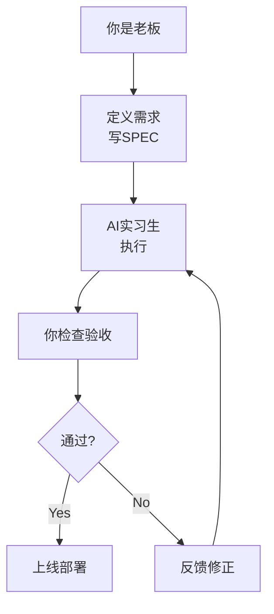
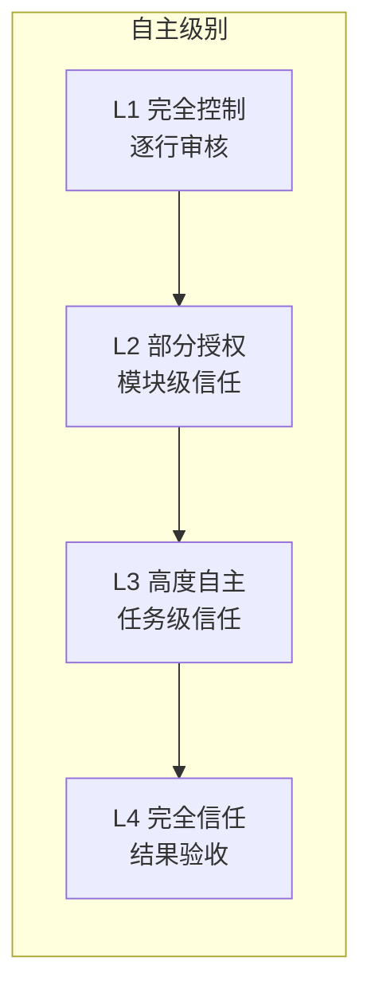
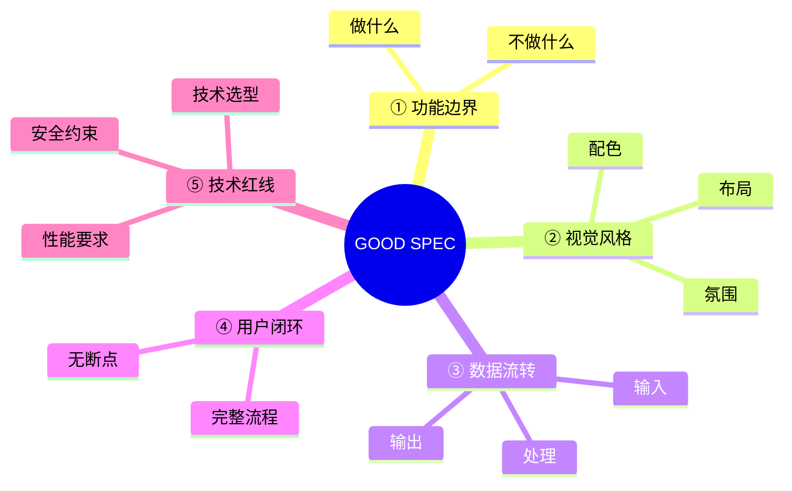

# 第02课：认识你的新伙伴

> **AI = 你的超级实习生** — 学历逆天但没实践经验，干活极快但会犯错

## 学习目标

- 建立正确的 AI 心智模型：超级实习生
- 理解 AI 能做什么、不能做什么
- 在 10 分钟内用扣子编程（Coze）做出第一个网站
- 掌握 SPEC 编写方法
- 学会管理 AI 的"自主级别"

---

## 1. AI 心智模型：超级实习生

要管好 AI，首先要理解 AI 是什么。

### 正确的比喻

> [!TIP] AI = 超级实习生
> - **学历逆天**：看过整个互联网的知识，理论储备无人能及
> - **但没实践经验**：不知道你的真实业务场景，缺乏常识判断
> - **干活极快**：一小时能干你一周的活
> - **但会犯错**：看起来什么都懂，实际上经常犯低级错误
> - **不需要工资**：7x24 小时待命，永远不抱怨

### 这个模型的启示



> [!WARNING] 最重要的原则
> **AI 干活，你背锅。** 实习生出了问题，最终责任在老板。AI 生成的代码出了问题，最终责任在你。这意味着你不能完全放任 AI 不管。

---

## 2. AI 能干什么，不能干什么

### AI 能做的

| 能力 | 说明 | 示例 |
|------|------|------|
| 回答问题 | 基于训练数据的知识问答 | "什么是 RESTful API？" |
| 写文章 | 生成结构化的文字内容 | 产品文档、营销文案 |
| 写代码 | 从零生成项目或功能模块 | "写一个待办事项 App" |
| 翻译 | 多语言互译 | 中译英、英译中 |
| 解释 | 对复杂概念进行通俗讲解 | "用比喻解释数据库索引" |
| 调试 | 分析代码错误并给出修复方案 | "这个报错是什么意思？" |

### AI 不能做的

| 局限 | 说明 | 应对方法 |
|------|------|---------|
| **不能保证正确** | 可能给出看似合理但错误的答案 | 必须验证，不要盲目信任 |
| **不能记住上周的事** | 上下文窗口有限，超出的内容会"遗忘" | 关键信息写在文档中，每次对话重新提供 |
| **不能替你做决定** | 没有你的业务判断力 | 你做决策，AI 执行 |
| **不能理解隐含需求** | 只按字面意思理解 | 需求要写清楚，不要指望 AI 猜 |
| **不能主动发现问题** | 不会说"这个需求有问题" | 你需要做 QA，建立检查机制 |

> [!WARNING] 常见误区
> 把 AI 当"神"来用：什么也不说清楚，指望 AI 自动理解你的全部需求，然后抱怨 AI 不好用。  
> 正确的做法：把 AI 当"人"来用 — 需求说清楚，要求写明白，结果要验收。

---

## 3. 10 分钟做出第一个网站：扣子编程

在你动手之前，先认识一下本节课的神器。

### 什么是扣子编程（Coze）？

> **扣子编程** = 字节跳动推出的 AI 应用开发平台  
> 地址：[code.coze.cn](https://code.coze.cn)  
> 费用：免费使用  
> 特点：零代码/低代码，自然语言驱动

扣子编程的意义在于：**让你在完全不写代码的情况下，做出一个完整的、可用的 Web 应用。**

### 实战项目：末日生存游戏

我们将用扣子编程做一个"末日生存指南"网站：

**SPEC：末日生存指南网站**

| 要素 | 内容 |
|------|------|
| 功能边界 | 展示末日生存知识，支持分类浏览 |
| 视觉风格 | 末日废土风格，深色系，粗犷字体 |
| 数据流转 | 静态展示，无需后端 |
| 用户闭环 | 浏览 → 收藏 → 分享 |
| 技术红线 | 纯前端，无需登录，不收集用户数据 |

### 操作步骤

1. 打开 [code.coze.cn](https://code.coze.cn)
2. 点击"创建应用"
3. 在对话框中输入你的需求描述
4. AI 自动生成网站
5. 预览并调整
6. 部署上线

> [!TIP] 和 AI 协作的关键
> 第一次生成可能不完全符合预期，这很正常。关键在于**迭代沟通**：告诉 AI 哪里需要改，不断优化，直到满意。

---

## 4. 学会管理 AI 的"自主级别"

不同场景下，你需要给 AI 不同的自主权：



| 级别 | 适用场景 | 你的角色 | 风险 |
|------|---------|---------|------|
| L1 完全控制 | 关键代码、安全相关 | 逐行审核 | 低 |
| L2 部分授权 | 常规功能模块 | 抽查验收 | 中 |
| L3 高度自主 | 非核心功能、UI 调整 | 结果验收 | 中高 |
| L4 完全信任 | 工具类脚本、临时需求 | 只用看结果 | 高 |

**建议**：刚开始时使用 L1，随着你越来越了解 AI 的能力边界，逐步放开到 L2、L3。

---

## 5. 从"写代码"到"写需求"的转变

AI 编程时代，你的核心技能从"怎么写代码"变成了"怎么描述需求"。

### Spec is the new source code

> 斯坦福大学 CS146S 课程的核心观点：**Spec（规格说明）就是新的源代码。**

在传统编程中，代码是唯一精确的表达。在 AI 编程中，你的需求描述（SPEC）才是决定性的输入。

### 好的 SPEC 五要素

写 SPEC 就像写产品需求文档，但要更精炼。一个好的 SPEC 包含五个要素：



**五大要素详解：**

| 要素 | 含义 | 好例子 | 坏例子 |
|------|------|--------|--------|
| ① 功能边界 | 明确做什么和不做什么 | "这是一个待办事项 App，支持增删改查，不需要用户登录" | "帮我做一个 App" |
| ② 视觉风格 | 设计方向和视觉感觉 | "赛博朋克风格，暗色背景，霓虹蓝色文字" | "做漂亮点" |
| ③ 数据流转 | 数据从哪里来到哪里去 | "用户输入任务名称和截止日期，存储在本地浏览器，不需要服务器" | "存数据就行" |
| ④ 用户闭环 | 用户操作的完整流程 | "用户打开看到任务列表 → 点击添加 → 输入内容 → 自动保存并回到列表" | "能添加任务就行" |
| ⑤ 技术红线 | 约束和限制条件 | "纯前端实现，不依赖后端，不使用第三方 API" | "用什么技术都行" |

### 歧义是最贵的 Bug

> [!WARNING] 关键认知
> 在传统编程中，Bug 是代码写错了。  
> 在 AI 编程中，**最贵的 Bug 是需求没说清楚**。  
> 
> 一个歧义的需求，AI 会"自由发挥"，结果大概率不是你要的。  
> 修改的时间成本，远超一开始把需求写清楚的时间。

---

## 6. 五条检查清单

在把需求交给 AI 之前，先自查这五条：

- [ ] **边界清晰**：我明确说了要做什么和不做什么吗？
- [ ] **风格明确**：我描述了视觉风格或设计方向吗？
- [ ] **流程完整**：用户从开始到完成的每一步都说清楚了吗？
- [ ] **数据清楚**：数据的来源、存储、流向说清楚了吗？
- [ ] **红线划定**：技术约束和安全要求说清楚了吗？

如果以上五条有一条是"否"，先补充再交给 AI。

---

## 7. 苏格拉底式提问法

当你和 AI 讨论需求时，不要只是下命令。用 **苏格拉底式提问** 让 AI 帮你发现需求的盲点：

```
你可以这样问 AI：

"我这个需求有什么潜在问题？"
"你觉得还有什么我没有考虑到的地方？"
"如果是你来做，你会怎么设计？"
"这个方案有什么风险？"
"有没有更好的实现方式？"
```

> [!TIP] 实践技巧
> 正式写 SPEC 之前，先和 AI 聊十分钟。把你的想法告诉 AI，让它帮你"杠"一遍。你会发现很多自己没考虑到的问题。

---

## 8. 本课小结

| 核心要点 | 一句话记住 |
|---------|-----------|
| AI 心智模型 | AI = 超级实习生，干活快但会犯错，你是老板你背锅 |
| 扣子编程 | 免费零代码平台，10 分钟做出第一个网站 |
| 从写代码到写需求 | Spec is the new source code |
| 好 SPEC 五要素 | 功能边界、视觉风格、数据流转、用户闭环、技术红线 |
| 歧义是最贵的 Bug | 需求说清楚比什么都重要 |

---

## 课后作业

**必做作业：用扣子编程做一个产品并部署上线**

1. 打开 [code.coze.cn](https://code.coze.cn)
2. 选一个你感兴趣的方向（工具、游戏、展示页...）
3. 先写 SPEC（参考五要素）
4. 让 AI 生成
5. 迭代优化至少三轮
6. 部署上线
7. 把链接分享到课程社群

**进阶思考**：
- 你的产品能满足"用户闭环"吗？
- 如果不满意，问题出在 SPEC 的哪个环节？

---

## 课后检查清单

- [ ] 理解"AI = 超级实习生"的心智模型
- [ ] 知道 AI 能做什么、不能做什么
- [ ] 注册并体验扣子编程
- [ ] 完成第一个网站的开发并部署
- [ ] 掌握 SPEC 五要素的写法
- [ ] 学会使用苏格拉底式提问法

---

## 下一步

继续学习 [第03课：你不需要会编程](0003-ni-bu-xu-yao-hui-bian-cheng.md)，你将深入理解 Vibe Coding、用 AI 学 AI 的方法论，以及如何用"积木思维"搭建 AI 产品。