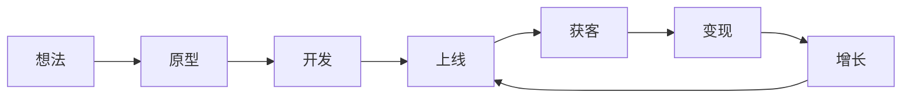
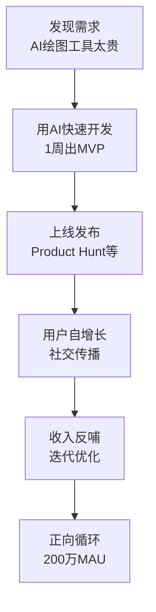
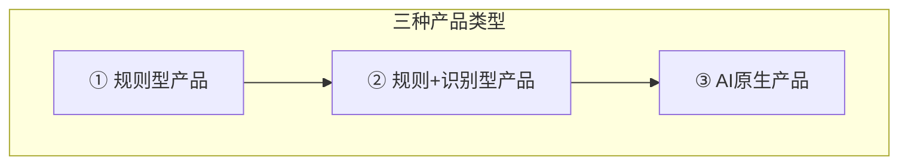
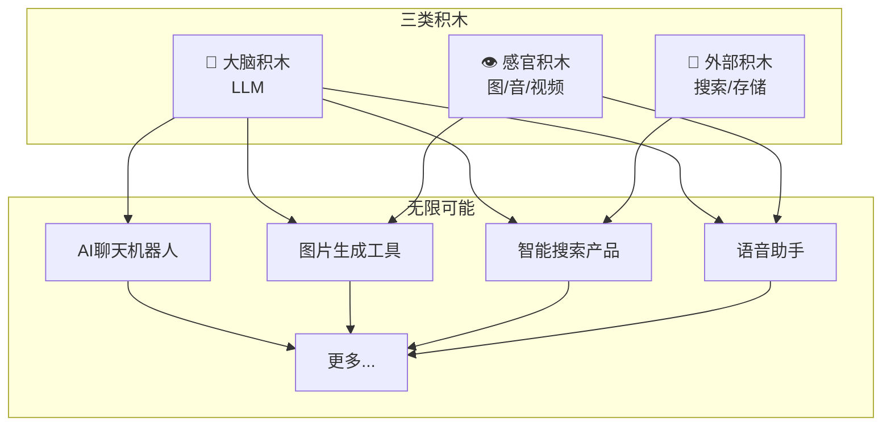

# 第03课：你不需要会编程

> 你不需要成为程序员 — 你需要学会的是用 AI 做产品

## 学习目标

- 深入理解课程五大不同
- 通过 Raphael AI 案例看到单人公司的可能性
- 理解 Vibe Coding 的演变：从褒义词到贬义词
- 掌握"用 AI 学 AI"的方法论
- 理解三种产品类型和积木思维

---

## 1. 课程五大不同（深度解析）

上一课我们提了五大不同，现在深入展开。

### 不同一：拿结果的人来教

> 讲师刘小排本人就是用 AI 编程做出产品并实现商业化的实战者。

这意味着：
- **教的是踩过的坑**，不是教科书上的理论
- **有真实案例**，每个概念都有实际产品作为佐证
- **知道什么有效**，什么只是在浪费时间
- **课程会持续迭代**，因为讲师本人也在第一线

### 不同二：Idea to Business 完整链路

大多数编程课程只教到"代码能跑"，但商业化才是真正的终点。

本课程覆盖的完整链路：



大多数课程只到 C（开发），本课程一直覆盖到 G（增长）。

### 不同三：全品类覆盖

不是"只教 React"或"只教小程序"，而是覆盖所有主流产品形态：

| 形态 | 适合场景 | 目标用户 | 变现方式 |
|------|---------|---------|---------|
| Web 网站 | SaaS 工具、信息展示 | 全球用户 | 订阅、广告 |
| 浏览器插件 | 效率增强、工具类 | 浏览器用户 | 付费插件 |
| 微信小程序 | 国内社交裂变 | 微信用户 | 内购、广告 |
| 手机 App | 深度体验、移动场景 | 移动用户 | 订阅、买断 |
| 桌面应用 | 专业工具、生产力 | 专业用户 | 买断、订阅 |

### 不同四：活社区

- 不是"录完课就跑"
- 全年航海训练营持续跟进
- 学员问题有人解答
- 案例和资源持续更新
- 学员之间可以对接合作

### 不同五：大量成功案例

每个概念都有真实案例支撑。这节课我们重点看一个。

---

## 2. Raphael AI 案例：单人公司的可能性

### 案例数据

| 指标 | 数据 |
|------|------|
| 开发者 | 1 人 |
| 开发周期 | 1 周 |
| 月活用户 (MAU) | 200 万 |
| 日新增用户 | 6 万 |
| 商业模式 | Freemium + 订阅 |

### 这是怎么做到的？



### 关键启示

> [!TIP] Raphael AI 告诉我们什么？
> 1. **速度比完美重要**：1 周做出 MVP，比完美策划 3 个月更重要
> 2. **单人可完成**：AI 编程让一个人具备了全栈开发能力
> 3. **用户增长可以自驱动**：好的产品自己会传播
> 4. **不需要融资**：单人公司可以靠收入养活自己

这不是孤例。Pieter Levels 年入 300 万美金，也是一个人。**单人公司的时代已经来了。**

---

## 3. Vibe Coding 的演变

### Vibe Coding 是什么？

> Vibe Coding 这个词最初由 AI 研究者 Andrej Karpathy 提出，描述的是一种"随性编程"的状态 — 让 AI 主导编码，人类只负责描述需求和验收结果。

### 从褒义词到贬义词

Vibe Coding 这个词的含义经历了有趣的演变：

| 阶段 | 含义 | 评价 |
|------|------|------|
| 早期 | 让 AI 处理繁琐编码，专注创意和设计 | 褒义：效率革命 |
| 中期 | 完全交给 AI，人只看结果 | 中性：可以但不稳健 |
| 现在 | 盲目信任 AI，不验证不思考 | 贬义：代码垃圾场 |

> [!WARNING] Vibe Coding 的陷阱
> 很多人把 Vibe Coding 理解成"让 AI 全权负责，自己什么都不用管"。这是危险的。  
> 
> 正确的理解应该是：**让 AI 做执行，但由你掌控方向和质量。**

### 本课程的立场

Vibe Coding 不是"完全不管"，而是 **"把精力从编码转移到产品思考和验证"**。

你仍然需要：
- 定义清晰的需求
- 审查 AI 的输出
- 建立测试机制
- 理解系统架构（不需要会写，但要会看）

---

## 4. 用 AI 学 AI：最好的学习外挂

### 核心理念

> 遇到不懂的概念，不要先百度或谷歌 — 先问 AI。

AI 是你最好的个性化老师，它的优势：

| 传统学习方式 | 用 AI 学习 |
|-------------|-----------|
| 搜教程，看半天不一定找到合适的 | 直接问，AI 针对你的问题给出回答 |
| 看不懂的地方没人问 | 追问 AI，问到懂为止 |
| 学习路径固定 | AI 根据你的水平动态调整 |
| 一个知识点要查很多资料 | AI 一站式解释 |
| 不能随时问 | 7x24 小时在线 |

### 实战方法

```
当遇到不懂的概念时：

Step 1: 直接问 AI "什么是 X？"
Step 2: 如果看不懂，说 "用简单的比喻解释"
Step 3: 如果想深入，说 "从技术角度深入解释"
Step 4: 如果想实战，说 "给我一个例子"
Step 5: 如果想验证，说 "我理解的是...对吗？"
```

> [!TIP] 用 AI 学 AI 的终极技巧
> 不要只问一次。把 AI 当成可以无限次追问的老师。  
> "用更简单的比喻"  
> "这个我不懂，换个角度解释"  
> "和 Y 有什么区别？"  
> ..."好，现在我理解了，帮我总结一下"

---

## 5. 三种产品类型

AI 时代的产品可以分为三类：



### 类型一：规则型产品

- 逻辑完全由代码规则决定
- 输入 → 规则处理 → 输出
- 示例：计算器、待办事项 App、博客系统
- **AI 的作用**：加速开发，产品本身不需要 AI

### 类型二：规则 + 识别型产品

- 核心逻辑由规则决定，但加入了 AI 识别能力
- 示例：拍照识别植物 App（规则 + 图像识别）、智能客服（规则 + NLP）
- **AI 的作用**：增加感知和理解能力

### 类型三：AI 原生产品

- 产品核心价值由 AI 驱动
- 没有 AI，产品就没有意义
- 示例：ChatGPT、Midjourney、Raphael AI
- **AI 的作用**：产品的核心引擎

| 类型 | 例子 | AI 的角色 | 开发难度 |
|------|------|----------|---------|
| 规则型 | 记账 App | 开发工具 | ★☆☆ |
| 规则+识别型 | 拍照识花 | 功能模块 | ★★☆ |
| AI 原生产品 | AI 绘图工具 | 核心引擎 | ★★★ |

---

## 6. AI 产品 ≠ 用 AI 做的产品

> [!WARNING] 重要区分
> - **AI 产品** = 产品里有 AI 在跑（最终用户感受到 AI）
> - **用 AI 做的产品** = 开发过程中用了 AI 工具（最终用户可能完全不知道）

很多成功的产品，用户根本不知道它是用 AI 开发的。以及，很多 AI 产品的开发过程也用了 AI 工具。

**这两个概念不冲突，但你要清楚你在做的是哪一种。**

| | 用 AI 做的产品 | 不用 AI 做的产品 |
|------|-------------|----------------|
| AI 产品 | Raphael AI、ChatGPT | （少） |
| 非 AI 产品 | 大多数现代 SaaS | 传统软件 |

---

## 7. 预制菜思维 + 积木思维

### 预制菜思维

> 做产品就像做饭。你不必从种菜开始 — 用预制菜（现成的 AI 能力、API、框架）快速组装。

**传统的编程 = 从种菜开始做饭**  
**AI 时代的编程 = 用预制菜做大餐**

### 积木思维

AI 时代的产品开发 = 搭积木。你需要知道有哪些积木可用，以及怎么组合。



### 三类积木详解

| 积木类型 | 包含什么 | 代表服务 | 用来做什么 |
|---------|---------|---------|-----------|
| **大脑积木 (LLM)** | 大语言模型 | OpenAI GPT、Claude、DeepSeek | 理解、生成、推理 |
| **感官积木** | 图像/音频/视频识别生成 | Stable Diffusion、Whisper | 感知物理世界 |
| **外部积木** | 搜索、存储、支付 | Google Search、Supabase、Stripe | 连接外部世界 |

### 积木组合 = 无限可能

单个积木能力有限，但组合起来就是无限：

- **大脑积木 + 外部积木** = 能联网查询的 AI 助手
- **大脑积木 + 感官积木** = 能"看"能"听"的 AI
- **三类积木全部组合** = 完整的 AI 产品

---

## 8. 本课小结

| 核心要点 | 一句话记住 |
|---------|-----------|
| 课程五大不同 | 拿结果的人教、完整链路、全品类、活社区、成功案例 |
| Raphael AI | 1人1周200万MAU，单人公司时代已来 |
| Vibe Coding | 不是完全不管，而是把精力转移动产品思考 |
| 用 AI 学 AI | AI 是你最好的24小时个性化老师 |
| 三种产品类型 | 规则型、规则+识别型、AI原生产品 |
| 预制菜 + 积木思维 | 用现成积木快速组装，不从头造轮子 |

---

## 课后检查清单

- [ ] 理解五大不同并能在 30 秒内说给朋友听
- [ ] 了解 Raphael AI 案例的关键数据
- [ ] 分清"Vibe Coding 的正确用法"和"危险用法"
- [ ] 尝试用 AI 学习一个你不懂的编程概念
- [ ] 理解三种产品类型的区别
- [ ] 掌握积木思维：三类积木分别是什么？
- [ ] 区分"AI 产品"和"用 AI 做的产品"

---

## 实践任务

1. **用 AI 学 AI**：找一个你不懂的编程概念（比如 API、数据库、服务器），打开 ChatGPT 或 Claude，用追问法把它学明白
2. **拆解产品**：找一个你常用的 App，思考它是哪种产品类型？用到了哪些"积木"？
3. **积木组合练习**：列出三类积木各两个具体服务，然后组合出三个可能的产品 idea

---

## 下一步

继续学习 [第04课：离开扣子编程，浅尝深水区](0004-li-kai-ou-zi-qian-chang-shen-shui-qu.md)，你将搭建本地开发环境，进入真正的 AI 编程阶段。