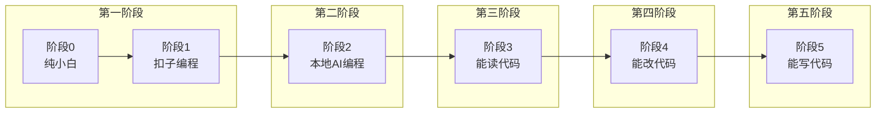
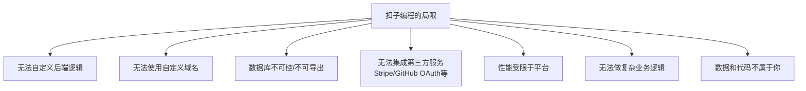
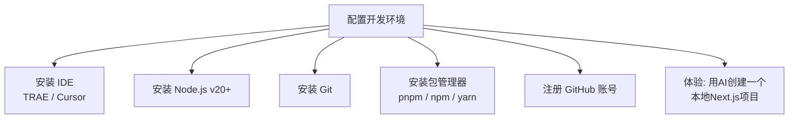

# 离开扣子编程，浅尝深水区

> **扣子编程是温室，但真正的海，在外面。**

前几课我们用扣子编程（Coze）快速做出了第一个网站，体验了"一句话生成应用"的爽感。但如果你想把产品做成真正的生意——有用户、有数据、能变现——就必须走出这个温室。

这一课，我们讲清楚 AI 编程的完整能力光谱，以及为什么、怎么走出扣子编程。

---

## 1. AI 编程六个阶段

刘小排在课程中提出了 **AI 编程六个阶段**模型，从零基础到独立商业开发者的完整演进路径。



| 阶段 | 名称 | 能力描述 | 工具/环境 | 能做啥 |
|------|------|---------|-----------|--------|
| **0** | 纯小白 | 完全不懂技术，没写过一行代码 | 无 | 只能提需求 |
| **1** | 扣子编程 | 用扣子/Coze搭建简单应用，零代码 | 扣子平台 | 简单工具站、表单、原型 |
| **2** | 本地 AI 编程 | 用 Cursor/TRAE 等本地 IDE + AI 辅助开发 | Cursor, TRAE, VSCode | 完整 Web 应用、API 服务 |
| **3** | 能读代码 | 能理解 AI 生成的代码，知道每段在做什么 | 同上 + 基础语言知识 | 验证 AI 输出，发现问题 |
| **4** | 能改代码 | 能手动修改 AI 生成的错误代码 | 同上 + 中等语言知识 | 修复 Bug，微调逻辑 |
| **5** | 能写代码 | 能独立编写复杂业务逻辑 | 全栈能力 | 从零构建商业级产品 |

> [!NOTE] 阶段不是跳跃的
> 你不需要从阶段 2 直接跳到阶段 5。**大多数人停留在阶段 2-3 就能做出成功的商业产品。** 本课程的目标就是带你从阶段 0/1 走到阶段 2-3。

---

## 2. "扣子编程是大温室"

扣子编程（Coze）为什么是温室？因为它替你做了**所有**复杂的事：

### 扣子编程的优势（温室的好处）

- **零环境配置**：打开浏览器就能用
- **一键部署**：托管在扣子服务器上
- **内置数据库**：自动帮你管理数据存储
- **简化的逻辑**：拖拽式工作流
- **快速验证想法**：10 分钟出原型

### 扣子编程的局限（温室的墙）



| 方面 | 扣子编程 | 本地开发 |
|------|---------|---------|
| 代码所有权 | 平台锁定 | 你完全拥有 |
| 自定义能力 | 限于平台提供的模块 | 无限 |
| 数据库 | 内置，不可迁移 | 可选 PostgreSQL/MySQL 等 |
| 部署 | 一键，但不可控 | Vercel/Fly.io，完全可控 |
| 集成 | 限于平台支持的 API | 任何 API/服务 |
| 商业化 | 难以规模化 | 可对接支付、认证等 |
| 学习成本 | 低 | 中等（有 AI 降低门槛） |

### 走出温室的时机

**你应该在什么时候考虑离开扣子编程？**

- 你的原型验证通过，需要正式上线
- 需要用户认证/支付功能
- 需要复杂的数据处理
- 你需要完全控制产品体验
- 想把产品做成真正的生意

---

## 3. 真实案例：2026 春节玩三周，业务还在跑

### Cowork 自动化案例

刘小排分享了一个真实的学员案例：

> 2026 年春节，一位学员三周没开电脑、没碰代码。但他在春节前用本地开发（阶段 2）做了一个 **Cowork 自动化工具**——自动处理业务数据的批处理脚本。
>
> 春节期间，业务数据持续增长，系统自动运行，完全没有出问题。
>
> 为什么？因为**本地开发的代码是"真的"代码**——它有日志、有错误处理、有自动化部署。你不在的时候，它自己跑。

如果用扣子编程做同样的工具：
- 扣子平台的免费额度有限，不可能长期跑自动化脚本
- 没有自定义错误处理和重试机制
- 数据导出麻烦
- 业务要是膨胀了，扣子平台会限流

> [!WARNING]
> **扣子编程适合做 MVP（最小可行产品）验证，不适合做真正的生产系统。** 如果依赖扣子做生产系统，平台上的一次改版或故障就可能让你的业务瘫痪。

---

## 4. 本周学习任务：从扣子编程转移到本地开发

### 任务一：安装本地 IDE 工具

#### 选择 1：TRAE（推荐国内用户）

**TRAE** 是字节跳动出品的 AI 原生 IDE，与扣子同属字节生态，过渡最平滑。

- 官网下载：https://www.trae.ai
- 内置 AI 编程能力（Claude + GPT）
- 界面与 VSCode 相似，学习成本低
- 对中文支持好

#### 选择 2：Cursor（全球最流行）

**Cursor** 是目前全球最受欢迎的 AI 编程 IDE，基于 VSCode 的 AI-first 编辑器。

- 官网下载：https://cursor.sh
- 内置 Claude/GPT/自研模型
- 社区活跃，教程丰富
- 付费版 $20/月，含大量 AI 调用额度

#### 选择 3：VSCode + 插件

如果不想换 IDE，可以在 VSCode 中安装 AI 插件：
- **GitHub Copilot**：微软出品，最成熟的 AI 编程助手
- **Continue**：开源免费，可接入 Claude API

### 任务二：配置本地开发环境



#### 环境配置要点

| 工具 | 用途 | 安装方式 | 验证命令 |
|------|------|---------|---------|
| **Node.js** | JavaScript 运行环境 | `brew install node` (Mac) 或官网下载 | `node -v` |
| **pnpm** | 包管理器（比 npm 快） | `npm install -g pnpm` | `pnpm -v` |
| **Git** | 版本控制 | `brew install git` 或 Xcode CLI | `git --version` |
| **GitHub CLI** | 管理代码仓库 | `brew install gh` | `gh --version` |

> [!TIP] Mac 用户
> 用 `brew` 安装是最省事的方式。没有 Homebrew？先执行：
> ```bash
> /bin/bash -c "$(curl -fsSL https://raw.githubusercontent.com/Homebrew/install/HEAD/install.sh)"
> ```

### 任务三：用 AI 在本地创建第一个项目

安装完成后，在 Cursor/TRAE 中打开终端，让 AI 帮你执行：

```bash
# 让 AI 创建一个 Next.js 项目
npx create-next-app@latest my-first-app --typescript --tailwind --eslint
```

跟着 AI 的指引，一步步完成。如果你卡住了，直接问 AI：

> "我是零基础，请帮我检查我的开发环境是否安装正确，然后一步步引导我创建一个 Next.js 项目。"

---

## 5. 阶段能力对比总结

```mermaid
graph LR
    subgraph ”阶段1: 扣子编程”
        A1[快速出原型<br/>不需要配置环境<br/>受限于平台能力]
    end
    subgraph ”阶段2: 本地AI编程”
        B1[完整产品能力<br/>需要配置环境<br/>自由度极高<br/>需要学习基础概念]
    end
    A1 -->|”跨出这一步”| B1
```

| 能力维度 | 扣子编程（阶段1） | 本地开发（阶段2） |
|---------|-----------------|------------------|
| 上手速度 | 10分钟 | 1-2小时（含环境配置） |
| 产品复杂度 | 简单工具站 | 完整 Web 应用 |
| 数据控制 | 平台锁定 | 完全自主 |
| 集成能力 | 平台生态 | 无限 |
| 商业潜力 | 低 | 高 |
| 学习曲线 | 几乎为零 | 中等（AI 大幅降低） |

---

## 6. 为什么要经历这个过程？

你可能会有疑问：**"我不是来学编程的吗？为什么要折腾环境配置？"**

答案很简单：**因为真正的产品不在浏览器里，不在扣子平台上。它在你的电脑里，在你的代码仓库里，在你自己控制的服务器上。**

扣子编程教会你"产品思维"——想清楚做什么、怎么做。而本地开发赋予你"工程能力"——真正把它做出来、运营好。

**这两者缺一不可。**

---

## 作业与自测

> [!QUESTION] 自测问题
>
> 1. AI 编程六个阶段中，你目前处于哪个阶段？你的目标阶段是哪个？
> 2. 扣子编程适合做哪些场景？不适合做哪些场景？请各举 3 个例子。
> 3. 你已经安装了哪个 IDE？遇到了什么困难？
> 4. 你理解为什么"扣子编程是大温室"这个比喻吗？用你自己的话解释给一个朋友听听。

<details>
<summary>参考答案方向</summary>

1. 大多数人处于阶段 0-1。本课程的目标是帮你走到阶段 2-3，这已经足够做出成功的商业产品。
2. 适合：快速原型验证、内部工具、简单表单收集。不适合：商业级 SaaS、需要支付集成的产品、大数据量处理系统。
3. 安装 IDE 时常见的困难：环境变量配置、Node.js 版本冲突、网络问题。遇到困难直接问 AI。
4. "温室"的比喻：扣子就像温室，给你提供了一切条件，让你快速生长；但真正的市场在温室外面，你需要适应真实的"自然条件"。

</details>

---

## 下一步

学习 [第05课：前后端与Next.js →](0005-qian-hou-duan-yu-next-js.md) 理解 Web 应用的基础架构。