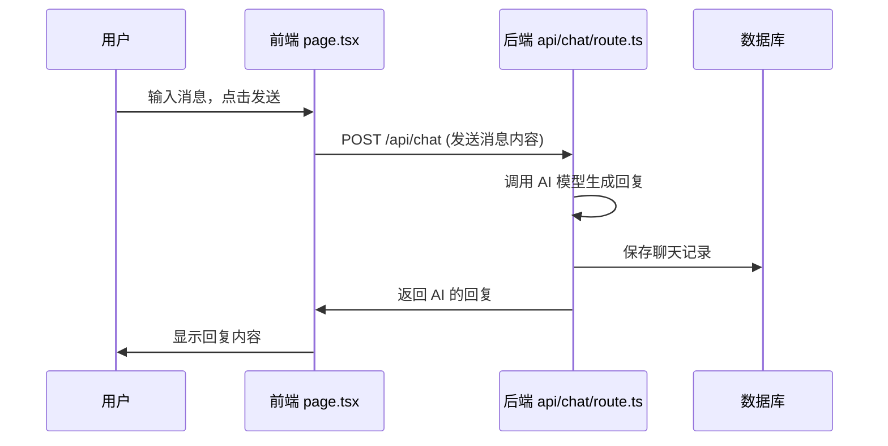
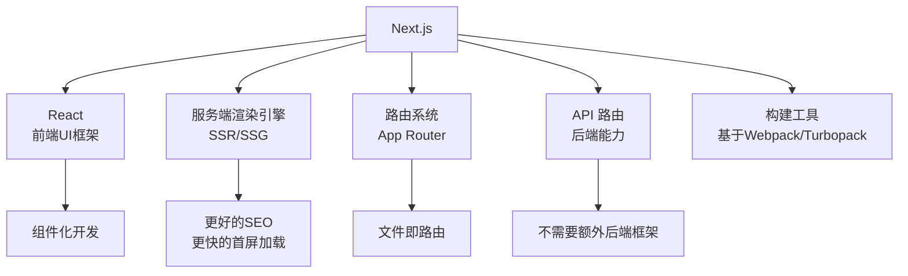

# 前后端与Next.js

> **前端 = 脸面，后端 = 大脑。Web 应用是一个人机对话的系统。**

上一课我们搭建了本地开发环境，安装了 IDE。但这只是第一步——面对一个真实的项目，代码文件夹里那么多文件，它们分别干什么用？

这一课我们从"前后端"这个最基础的概念讲起，然后以 **Next.js** 框架为例，带你拆解一个真实项目的代码结构。

---

## 1. 前端 vs 后端：最直观的理解

```mermaid
graph LR
    subgraph ”用户设备”
        A[浏览器/手机App]
    end
    subgraph ”前端 Frontend”
        B[用户界面<br/>UI + 交互 + 样式]
    end
    subgraph ”服务器”
        C[后端 Backend<br/>API + 数据 + 业务逻辑]
        D[数据库<br/>Data]
    end
    A <--> B
    B <-->|HTTP 请求| C
    C <--> D
```

| | 前端 (Frontend) | 后端 (Backend) |
|------|----------------|---------------|
| **管什么** | 用户看到什么 | 背后发生什么 |
| **核心职责** | UI 布局、交互反馈、样式呈现 | API 接口、数据存取、业务规则 |
| **运行在哪** | 用户的浏览器/设备 | 服务器（云端） |
| **技术栈** | HTML, CSS, JavaScript, React | Node.js, Python, Go, 数据库 |
| **比喻** | 餐厅的菜单和装潢 | 后厨的厨师和食材仓库 |

### 用点菜的比喻理解

1. 你走进餐厅，看到菜单（**前端**渲染）
2. 你点了一份宫保鸡丁（**前端**发送请求）
3. 服务员把订单传到后厨（**前端**请求发送到**后端** API）
4. 厨师从冰箱拿食材、切菜、炒菜（**后端**执行业务逻辑）
5. 菜端到你桌上（**后端**返回结果给**前端**渲染展示）

> [!NOTE]
> 在扣子编程时代，你根本不关心前后端——平台帮你全做了。但到了本地开发，你需要理解"请求-响应"这个最基本的模型。

---

## 2. 真实案例：哄哄模拟器的代码结构

以课程中演示的"哄哄模拟器"为例，这是一个用 Next.js 打造的 Web 应用。它的代码结构是这样的：

```
honghong-simulator/
├── src/                      # 源代码目录
│   ├── app/                  # App Router（后端 + 前端路由）
│   │   ├── page.tsx          # 首页（前端）
│   │   ├── layout.tsx        # 全局布局（前端）
│   │   ├── globals.css       # 全局样式（前端）
│   │   └── api/              # API 路由（后端！）
│   │       ├── chat/route.ts       # 聊天API -> 调用AI模型
│   │       └── analyze/route.ts    # 分析API -> 处理数据
│   ├── components/           # 组件目录（前端！）
│   │   ├── ChatBox.tsx       # 聊天对话框组件
│   │   ├── MessageBubble.tsx # 消息气泡组件
│   │   └── EmotionMeter.tsx  # 情绪计量器组件
│   └── lib/                  # 工具库（前后端共用）
│       ├── ai.ts             # AI 模型调用封装
│       └── utils.ts          # 通用工具函数
├── public/                   # 静态资源（图片、字体等）
├── package.json              # 依赖配置
├── next.config.js            # Next.js 配置
├── tailwind.config.ts        # Tailwind CSS 配置
└── tsconfig.json             # TypeScript 配置
```

### 前后端的分界线一目了然

| 目录 | 角色 | 说明 |
|------|------|------|
| **`src/app/page.tsx`** | **前端** | 用户看到的页面 UI |
| **`src/components/`** | **前端** | 可复用的 UI 组件 |
| **`src/app/api/`** | **后端** | 处理 HTTP 请求的 API 端点 |
| **`src/lib/`** | **共用** | 工具函数，前后端都可能用到 |

### 最简单的请求流程



> [!TIP] 快速判断法
> 在项目里看到 `src/app/api/` 开头的文件，就是**后端**代码。看到 `src/components/` 或 `page.tsx`，就是**前端**代码。

---

## 3. Next.js 是什么？

**Next.js** 是一个基于 React 的全栈 Web 框架，由 Vercel 公司维护。



### 为什么选 Next.js？

| 特性 | 为什么重要 |
|------|-----------|
| **前后端一体** | 一个项目同时包含前端和后端，不需要搭两个项目 |
| **SSR 支持** | 服务端渲染，SEO 友好，首屏加载快 |
| **文件路由** | 在 `app/` 目录下创建文件即创建页面/API |
| **Vercel 生态** | 一键部署，自动 HTTPS，CDN 加速 |
| **React 生态** | 全球最大前端社区，组件库极其丰富 |
| **AI 友好** | AI 最擅长的框架之一，上下文明确 |

---

## 4. 三种渲染模式：SSR vs SSG vs CSR

这不是一个需要你死记硬背的概念，但理解它能帮你写出更好的应用。

```mermaid
flowchart LR
    subgraph ”CSR 客户端渲染”
        A1[浏览器请求] --> B1[服务器返回<br/>空白HTML+JS]
        B1 --> C1[浏览器执行JS<br/>渲染页面]
        C1 --> D1[可见！但: 慢、SEO差]
    end
    subgraph ”SSR 服务端渲染”
        A2[浏览器请求] --> B2[服务器执行JS<br/>生成完整HTML]
        B2 --> C2[返回完整HTML<br/>浏览器直显示]
        C2 --> D2[快！SEO好<br/>但服务器有压力]
    end
    subgraph ”SSG 静态生成”
        A3[构建时] --> B3[服务器预先生成<br/>所有HTML文件]
        B3 --> C3[浏览器请求<br/>直接返回静态文件]
        C3 --> D3[极快！最省服务器<br/>但不适合动态内容]
    end
```

| 模式 | 全称 | 渲染时机 | 适合场景 | SEO | 首屏速度 |
|------|------|---------|---------|-----|---------|
| **CSR** | Client-Side Rendering | 浏览器端 | 后台管理、Dashboard | 差 | 慢 |
| **SSR** | Server-Side Rendering | 每次请求时 | 电商、内容网站、需要 SEO | 好 | 快 |
| **SSG** | Static Site Generation | 构建时 | 博客、文档站、营销页 | 最好 | 最快 |

**在 Next.js 中，这三种模式可以混用：**

```typescript
// SSR - 每次请求都重新生成
export const dynamic = 'force-dynamic';

// SSG - 构建时生成，请求时复用
export const dynamic = 'force-static';

// CSR - 默认有 "use client" 的就是客户端渲染
'use client';
```

> [!NOTE]
> 对于 AI 编程初学者，**你不需要手动配置这些**。AI 会自动选择最合适的渲染模式。你只需要知道它们的存在，在和 AI 对话时能描述你的需求即可。

---

## 5. Next.js App Router 核心文件

Next.js 13+ 引入的 **App Router** 是基于文件系统的路由方案：

```
src/app/
├── page.tsx          # 首页 → 映射到 /
├── layout.tsx        # 全局布局包裹所有页面
├── loading.tsx       # 加载状态（自动显示）
├── error.tsx         # 错误状态（自动显示）
├── not-found.tsx     # 404 页面（自动显示）
├── globals.css       # 全局样式
├── about/
│   └── page.tsx      # /about 页面
└── api/              # 后端 API
    ├── chat/
    │   └── route.ts  # /api/chat 的 GET/POST 处理
    └── users/
        └── route.ts  # /api/users 的 GET/POST/PUT/DELETE
```

### 三个最重要的文件

| 文件 | 作用 | 前端/后端 | 示例内容 |
|------|------|-----------|---------|
| **`page.tsx`** | 定义页面 UI | 前端 | `<h1>欢迎页</h1>`, `<ChatBox />` |
| **`layout.tsx`** | 定义页面布局（导航栏、页脚） | 前端 | `<NavBar />`, `<main>{children}</main>` |
| **`api/.../route.ts`** | 定义 API 接口 | 后端 | `export async function POST(request) { ... }` |

---

## 6. package.json 与依赖管理

任何一个现代项目都有一个 `package.json`，它是项目的"身份证"和"购物清单"。

```json
{
  "name": "honghong-simulator",
  "version": "0.1.0",
  "private": true,
  "scripts": {
    "dev": "next dev",        // 本地开发
    "build": "next build",    // 构建上线
    "start": "next start",    // 启动生产服务
    "lint": "next lint"       // 代码检查
  },
  "dependencies": {
    "next": "^15.0.0",        // 核心框架
    "react": "^19.0.0",       // UI 库
    "react-dom": "^19.0.0",   // React DOM 渲染
    "@ai-sdk/openai": "^1.0.0" // AI SDK
  },
  "devDependencies": {
    "typescript": "^5.0.0",   // TypeScript
    "tailwindcss": "^4.0.0",  // CSS 框架
    "@types/node": "^20.0.0", // Node.js 类型定义
    "@types/react": "^19.0.0" // React 类型定义
  }
}
```

| 字段 | 说明 |
|------|------|
| **`dependencies`** | 生产环境依赖——项目运行时必需的包 |
| **`devDependencies`** | 开发环境依赖——仅在开发/构建时使用 |
| **`scripts`** | 常用命令的快捷方式，`npm run dev` 等 |
| **`pnpm-lock.yaml`** | 锁定依赖版本，确保大家安装的一致 |
| **`node_modules/`** | 依赖实际安装的目录（不要手动修改！） |

### 常用命令

```bash
# 安装所有依赖
pnpm install

# 添加一个依赖
pnpm add @ai-sdk/openai

# 添加一个开发依赖
pnpm add -D prettier

# 启动开发服务器
pnpm dev

# 构建生产版本
pnpm build
```

---

## 7. 离开扣子编程后的代码结构对比

| 概念 | 扣子编程 | 本地 Next.js 项目 |
|------|---------|-------------------|
| **页面** | 扣子"页面"编辑器 | `src/app/page.tsx` |
| **逻辑** | 扣子工作流 | `src/app/api/route.ts` |
| **样式** | 扣子内置主题 | Tailwind CSS / CSS Modules |
| **数据** | 扣子内置数据库 | PostgreSQL / Neon |
| **部署** | 扣子一键发布 | Vercel / 自有服务器 |
| **版本** | 无版本控制 | Git + GitHub |
| **AI** | 扣子内置 AI | AI SDK / OpenAI API |

---

## 8. 你只需要理解这么多

对初学者而言，关于前后端和 Next.js，你只需要记住三句话：

1. **前端负责展示和交互**——用户看到什么、点了发生什么
2. **后端负责数据和业务逻辑**——数据存哪、规则是什么、谁来处理
3. **Next.js 是一个框架，让你用同一个项目同时搞定前后端**

不需要记住所有概念，不需要背 API。当你需要时，问 AI 就可以了。

> [!TIP]
> **最好的学习方式就是动手。** 打开你的 IDE，让 AI 创建一个 Next.js 项目，然后问它："这个文件夹里每个文件是干什么的？"让 AI 对照真实项目给你讲解。

---

## 作业与自测

> [!QUESTION] 动手任务
>
> 1. **练习**：在你的本地项目中，找到 `src/app/` 下的文件，区分哪些是前端、哪些是后端。
> 2. **提问**：在 Cursor/TRAE 中问 AI："请帮我解释我当前项目的代码结构，标出哪些是前端文件，哪些是后端文件。"
> 3. **修改**：让 AI 帮你修改首页的文字，把标题改成你自己的内容，观察 `page.tsx` 的变化。
> 4. **思考**：如果你做一个"每日一话"的诗词网站，它需要 SSR、SSG 还是 CSR？为什么？

<details>
<summary>思考题答案</summary>

"每日一话"诗词网站最适合 **SSG（静态生成）**。因为内容变化频率极低（每天一次），可以在构建时预生成所有页面，加载速度最快，SEO 最好，服务器成本最低。

如果你想做"实时聊天"应用，就需要 **SSR + CSR 混合**——首屏用 SSR 保证速度，聊天区域用 CSR 保证实时交互。

</details>

---

## 下一步

学习 [第06课：数据库进阶 →](0006-shu-ju-ku-jin-jie.md) 理解数据是如何存储和读取的。