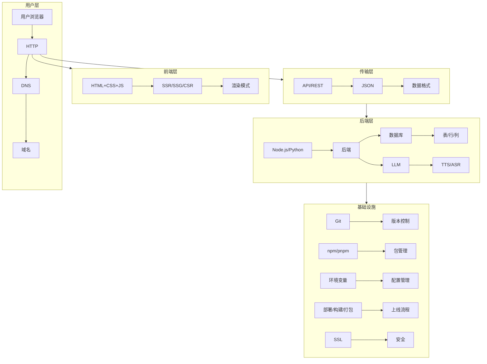

# 第09课：技术术语密集输入

> **核心思想**：你不需要会写代码，但你需要理解技术术语。因为你是技术总监，AI是你的程序员。

## 一、为什么需要理解技术原理？

### 技术总监的思维模型

想象一个场景：

> 你是一个创业者，打算做一个"AI生成头像"的产品。你和程序员说："帮我调通这个功能。"程序员问："你打算用哪个LLM？走REST API还是SDK？后端用Node还是Python？数据库用什么？部署用Vercel还是自建服务器？"

如果你不懂这些术语，你没法做出决定。你会：
- 不知道问的问题意味着什么
- 无法评估方案的优劣
- 被程序员牵着走
- 做不出有效的决策

这就像你是一个总经理，但不懂财务、不懂营销、不懂人力——那就是傀儡。

### 你需要的不是"会写代码"，而是"能做出技术决策"

| 角色 | 职责 | 掌握程度 |
|------|------|----------|
| 技术总监（你） | 做技术决策、评估方案 | 理解概念、知道优缺点 |
| 高级工程师（AI/Cursor） | 写代码、实现功能 | 精通细节 |
| 初级工程师（不存在的） | 修修补补 | 不需要 |

**你不需要背语法，不需要写代码，不需要记住命令。你只需要理解这个概念是什么、为什么存在、什么时候用。**

本课就是帮你建立这个"技术决策框架"。

## 二、核心技术术语一站式指南

以下所有术语，按使用频率排列。你不需要一次背完，**遇到不懂的回头查**。

---

### 1. API（应用程序接口）

**人话解释：**
API就像餐厅的服务员。你（用户）想吃什么（数据/功能），告诉服务员（API调用），服务员去后厨（服务器）做好，再端给你（返回数据）。

API定义了"你能点什么菜"（可用的功能）和"怎么点"（调用方式）。

**为什么你需要知道：**
- 你的产品需要和第三方服务交互时，都需要调API
- 每次你的前端页面要加载数据，背后都在调API
- 平时说"接入了Stripe支付"，就是"调用了Stripe的API"

**最常见的API形式是REST API，后面会讲。**

**你需要能说：** "这个功能走API做，让前端调后端的API拿数据。"

---

### 2. SDK（软件开发工具包）

**人话解释：**
SDK是API的"升级版"。API是给了一个菜单让你点菜，SDK是直接给你一套锅碗瓢盆和菜谱，帮你更方便地做菜。

比如Stripe SDK：你不需要手动构造HTTP请求去调Stripe的API，SDK帮你封装好了一切，你只需要在代码里写 `stripe.charge.create()` 就行了。

**为什么你需要知道：**
- 很多服务都提供SDK，用SDK比直接调API方便10倍
- "有SDK"意味着集成会很快，"没SDK"意味着你得自己写很多代码

**你需要能说：** "这个服务有JS SDK吗？直接用SDK接入。"

---

### 3. LLM（大语言模型）

**人话解释：**
LLM就是ChatGPT、Claude、文心一言这些AI的"大脑"。它不是某个产品，而是底层的模型能力。

- GPT-4o、Claude 3.5 Sonnet、DeepSeek-V3 都是不同的LLM型号
- 每个LLM有不同特点：有的快、有的聪明、有的便宜、有的擅长写诗

**为什么你需要知道：**
- 你的产品如果要用AI能力，就要选择用哪个LLM
- 不同的LLM价格差距巨大（从几乎免费到一次调用几毛钱）
- 你不需要知道LLM怎么训练的，但要知道"哪个LLM适合我的场景"

**你需要能说：** "这个功能用Claude的API画图还是用GPT的？哪个性价比高？"

---

### 4. TTS / ASR（语音合成 / 语音识别）

**人话解释：**
- **TTS**（Text-to-Speech）：文字转语音。让你的产品能"说话"。
- **ASR**（Automatic Speech Recognition）：语音转文字。让你的产品能"听"。

**为什么你需要知道：**
- 如果产品有语音功能，你就要涉及TTS和ASR
- 市面上有成熟的API服务（如Azure语音、OpenAI TTS）
- 因为是API调用，集成很简单——加一个按钮的事

**你需要能说：** "这个功能加个语音输入吧，走ASR把语音转成文字。"

---

### 5. SSR / SSG / CSR（渲染模式）

这是Next.js最核心的概念之一。

**人话解释：**

- **CSR**（客户端渲染）：浏览器下载一个空壳HTML，然后用JS在用户电脑上渲染页面。打开慢，但点起来流畅。
- **SSR**（服务端渲染）：服务器渲染好完整页面再发给浏览器。打开快，但每次点击都需要请求服务器。
- **SSG**（静态生成）：在构建时就生成好HTML文件。打开最快，适合内容不常变的页面。

**为什么你需要知道：**
- Next.js默认混合使用这些模式
- 选错了渲染模式会影响用户体验和SEO
- 你不需要懂技术实现，但要告诉AI：这个页面应该"要SEO"还是"要速度"

**你需要能说：** "这个页面内容不常变，用SSG。用户个人页面用SSR，保证数据是最新的。"

---

### 6. HTTP / REST（网络协议）

**人话解释：**

**HTTP**是浏览器和服务器"交流的语言"。当你打开网页时，浏览器通过HTTP向服务器"请求"数据，服务器通过HTTP"响应"数据。

**REST**是一种流行的API设计风格。它的核心是：

| 操作 | HTTP方法 | 示例 |
|------|----------|------|
| 获取数据 | GET | 获取用户列表 |
| 创建数据 | POST | 注册新用户 |
| 更新数据 | PUT/PATCH | 修改个人信息 |
| 删除数据 | DELETE | 删除账号 |

**为什么你需要知道：**
- 几乎所有Web API都遵循REST风格
- 和AI交流时说"这个接口用GET方法"比说"这个接口获取数据"更精确
- 调试时看懂状态码：

| 状态码 | 含义 | 人话 |
|--------|------|------|
| 200 | OK | 一切正常 |
| 201 | Created | 创建成功 |
| 400 | Bad Request | 你发的东西不对 |
| 401 | Unauthorized | 你没权限 |
| 404 | Not Found | 你要的东西不存在 |
| 500 | Internal Server Error | 服务器炸了 |

**你需要能说：** "这个接口返回500了，查一下服务端哪里出了问题。"

---

### 7. JSON（数据格式）

**人话解释：**
JSON是目前Web应用中最通用的数据交换格式。它长得像这样：

```json
{
  "name": "张三",
  "age": 28,
  "isVip": true,
  "hobbies": ["编程", "摄影"],
  "address": {
    "city": "北京",
    "district": "朝阳"
  }
}
```

**为什么你需要知道：**
- 前端和后端之间通过JSON传递数据
- API返回的数据都是JSON格式
- 你需要能读懂JSON，知道数据是怎么组织的

**你需要能说：** "API返回的JSON里没有`email`字段，检查一下数据库查出来没有。"

---

### 8. Git（版本控制）

**人话解释：**
Git是代码的"时光机"。它记录代码的每一次修改，让你可以：
- 查看历史版本
- 回退到任意一个历史版本
- 多人协作时合并各自的修改

**核心操作：**
```
git add      # 把修改加入暂存区
git commit   # 保存当前版本（打个快照）
git push     # 把本地版本上传到GitHub
git pull     # 从GitHub拉取最新版本
```

**为什么你需要知道：**
- 写AI没有"撤回"按钮，但Git有
- AI改坏了代码？`git checkout .` 回到上一版本
- 这是所有开发者的最低共同语言

**你需要能说：** "先git commit保存当前版本，再让AI改。改坏了就git reset回去。"

---

### 9. npm / pnpm（包管理）

**人话解释：**
npm是JavaScript的"应用商店"。你需要用某个功能（比如日期格式化、图表库），不用自己写，去npm"下载"别人写好的包。

- **npm**：最老的包管理器，慢
- **pnpm**：新一代，更快、省磁盘空间
- **yarn**：另一个选择，介于两者之间

**为什么你需要知道：**
- 每次创建新项目，第一件事就是 `npm install`
- "安装依赖"就是把项目中用到的所有包下载到本地
- 如果报错说`module not found`，往往是忘记`npm install`了

**你需要能说：** "项目clone下来先跑 npm install，再跑 npm run dev。"

---

### 10. 数据库 / 表 / 行 / 列

**人话解释：**
- **数据库**：一个巨大的Excel文件
- **表**：Excel里的一个Sheet
- **行**：Sheet里的一行数据（一条记录）
- **列**：Sheet里的一列（一个字段）

例如一个"用户表"：

```
| id | name  | email              | created_at        |
|----|-------|--------------------|-------------------|
| 1  | 张三  | zhangsan@test.com  | 2026-01-01 12:00  |
| 2  | 李四  | lisi@test.com      | 2026-01-02 15:30  |
```

**为什么你需要知道：**
- 几乎每个产品都需要存数据
- 你需要告诉AI"存什么数据"、"怎么查"
- 你不需要写SQL，但要知道数据库长什么样

**你需要能说：** "用户表里加一个`phone`字段，存手机号。"

---

### 11. 前端 / 后端 / 全栈

**人话解释：**

- **前端**：用户看得到的部分。页面长什么样、按钮怎么点、动画怎么动。
  - 技术栈：HTML + CSS + JavaScript / React / Next.js
  
- **后端**：用户看不到的部分。数据存在哪、登录验证、业务逻辑。
  - 技术栈：Node.js / Python / Go / 数据库

- **全栈**：一个人同时做前端和后端。

**为什么你需要知道：**
- 和AI交流时，你要能说清楚"这个改的是前端还是后端"
- 前端问题：截图给AI（"这个按钮颜色不对"）
- 后端问题：复制错误给AI（"API返回了500错误"）

**你需要能说：** "这个是前端样式问题，截图给你看。"

---

### 12. 部署 / 构建 / 打包

**人话解释：**

- **构建（Build）**：把源代码转换成可以在服务器上运行的优化版本
  - 把代码压缩、合并、优化
  
- **打包（Bundle）**：把多个文件合并成一个或少数几个文件
  - 减少浏览器需要下载的文件数量
  
- **部署（Deploy）**：把构建好的文件上传到服务器，让用户能访问

**为什么你需要知道：**
- 部署失败时，你需要理解是"构建阶段出错"还是"启动阶段出错"
- 构建出错：代码有问题
- 启动出错：环境配置有问题

**你需要能说：** "构建成功了但启动失败，检查环境变量配置。"

---

### 13. 域名 / DNS / SSL

**人话解释：**

- **域名**：网站的地址，如 `google.com`
- **DNS**：电话本，把 `google.com` 翻译成服务器IP地址
- **SSL**：安全锁，确保数据传输加密

**为什么你需要知道：**
- 每个产品都需要域名
- 配置不当，用户访问不了或提示"不安全"
- 见第08课详细讲解

**你需要能说：** "在DNS管理后台加一条CNAME记录指向Vercel。"

---

### 14. 环境变量

**人话解释：**
环境变量是写在代码外面、根据不同环境读取的配置信息。比如：

- 开发环境：数据库连测试库，API用测试密钥
- 生产环境：数据库连正式库，API用正式密钥

**为什么你需要知道：**
- 本地能运行、线上不能运行，90%是环境变量没配置好
- API密钥不能写在代码里——会被GitHub看到、被盗用

**你需要能说：** "在Vercel的环境变量里加一个DATABASE_URL。"

---

## 三、术语之间的关系图



## 四、面对陌生术语的正确态度

技术世界每天都有新术语出现。你不可能全部记住，也不需要全部记住。

### 遇到不懂的术语怎么办？

1. **问AI**："什么是ORM？用人话解释，我是一个产品经理。"
2. **加一句"为什么我需要知道"**：90%的术语你不需要知道细节，只需要知道"这和我的产品有关系吗"
3. **建立映射**：把新术语和你已经理解的东西联系起来

### 哪些术语需要深究，哪些不需要？

**需要深究的**（和你的产品决策直接相关）：
- API、数据库、前端/后端、部署、域名
- 这些会影响你每天的产品决策

**知道存在就行的**（有了AI你不需要了解细节）：
- 具体的框架（React/Vue/Angular的区别）
- 具体的数据库技术（PostgreSQL vs MySQL的区别）
- 具体的部署工具（Docker/Kubernetes）

> 不需要知道螺丝刀怎么制造，但需要知道"拧螺丝用螺丝刀，钉钉子用锤子"。

## 本课小结

技术术语不是门槛，而是**工具**。你不需要背下来逐字逐句的定义，只需要：
1. **知道有这个东西** —— 遇到时能认出来
2. **知道它解决什么问题** —— 什么时候该用它
3. **知道怎么和AI说** —— "这个功能调API，数据存数据库，部署到Vercel"

你是技术总监，AI是你的程序员。把本章当作案头手册，记不住随时回来查。

---

## 课后练习

1. 打开你正在做的项目代码，找出以下内容：API调用、数据库查询、环境变量配置
2. 用你自己的话向朋友解释今天学的10个术语（每个不超过30秒）
3. 遇到代码中不懂的术语，复制给AI问："这是什么？我有必要懂吗？"