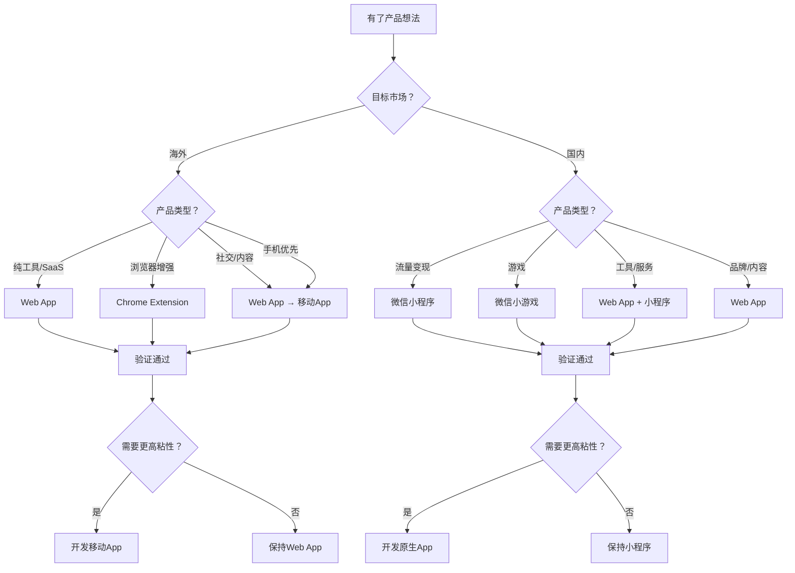
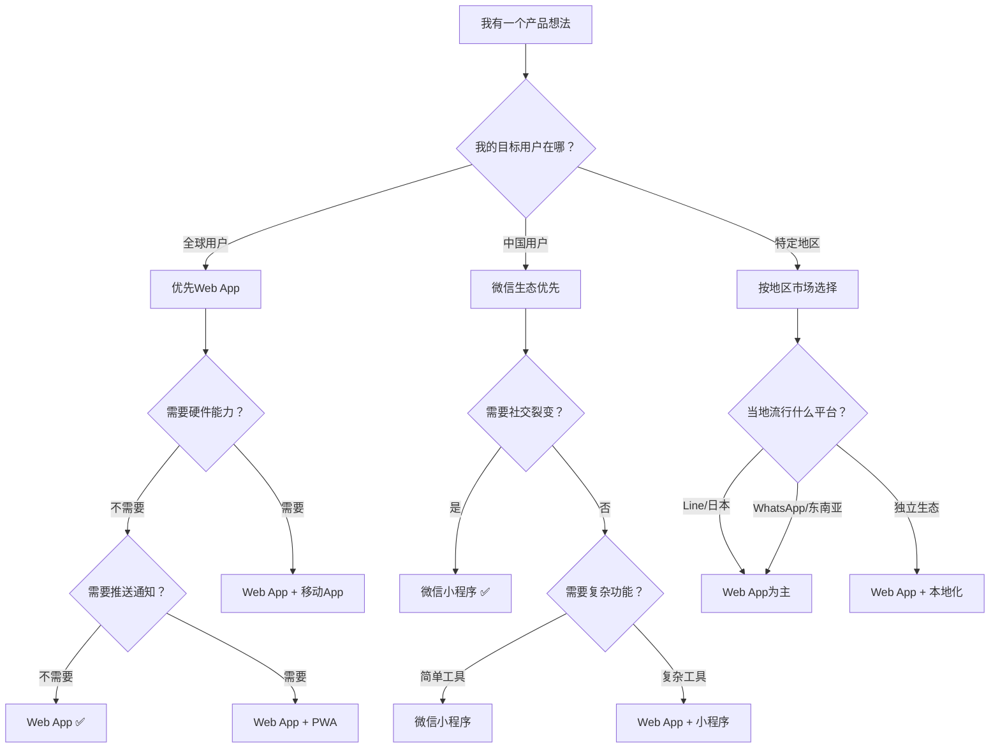

# 第10课：怎么做App和小程序

> **核心思想**：先决定在哪儿卖，再决定卖什么。市场选择决定了你80%的成败。

## 一、市场选择：国内 vs 海外

做产品前，最需要想清楚的问题不是"做什么"，而是"在哪儿做"。

### 付费意愿差异：海外付费意愿高出30倍

这是这堂课最重要的一个数据：

| 维度 | 海外市场 | 国内市场 |
|------|----------|----------|
| 付费意愿 | **高** — 用户愿意为工具付费 | **低** — 用户习惯了免费 |
| 典型付费习惯 | 月费 $10-$50 很正常 | 月费 ¥10 很多人嫌贵 |
| 广告变现效率 | 一般 | **高** — 流量可以变现 |
| 获客成本 | 高（Facebook/Google广告） | 相对低（微信/抖音传播） |
| 竞争环境 | 靠产品质量胜出 | 靠关系/资源/流量胜出 |
| 法律合规 | 相对简单 | 复杂（ICP备案、各种许可证） |
| 适合品类 | 工具、SaaS、开发者产品 | 社交、内容、游戏、电商 |

**为什么海外付费意愿高？**
- 信用卡文化：海外用户从小用信用卡在线购买
- 版权意识：软件是商品，应该付费
- 习惯订阅：Netflix、Spotify、SaaS已经培养了30年

**为什么国内付费意愿低？**
- 免费互联网时代：QQ、百度、淘宝都是"免费"的
- 广告支撑模式：国内互联网靠广告赚钱，不是靠用户付费
- 盗版文化：软件不该花钱的观念根深蒂固

### 经典判断方法

> **如果你的产品靠用户付费赚钱 → 做海外**
> **如果你的产品靠广告/流量赚钱 → 做国内**

这个判断不绝对，但能覆盖90%的场景。

### 市场规模对比

海外市场的优势不仅在于付费意愿：

- **全球用户基数**：你面对的是 50 亿人，不是 14 亿人
- **货币优势**：美元定价，1美元 = 7元人民币
- **支付成熟度**：Stripe集成只需几行代码，自动处理全球支付

**单人出海公司年入百万美元**的案例越来越多，这个赛道正在爆发。

## 二、产品形态选择

确定了市场后，下一步是选择产品形态。



### 各形态对比

| 形态 | 开发成本 | 获客成本 | 用户粘性 | 支付集成 | 推荐指数（海外） | 推荐指数（国内） |
|------|---------|---------|---------|---------|:--------------:|:--------------:|
| **Web App** | 低 | 最低 | 中 | 容易 | ⭐⭐⭐⭐⭐ | ⭐⭐⭐⭐ |
| **Chrome Extension** | 中 | 低 | 高 | 较难 | ⭐⭐⭐⭐ | ⭐⭐⭐ |
| **移动App** | 高 | 高 | 最高 | 容易 | ⭐⭐⭐ | ⭐⭐⭐ |
| **桌面应用** | 高 | 高 | 高 | 容易 | ⭐⭐ | ⭐⭐ |
| **微信小程序** | 中 | 极低 | 中 | 微信支付 | — | ⭐⭐⭐⭐⭐ |
| **微信小游戏** | 中 | 极低 | 极高 | 内购/广告 | — | ⭐⭐⭐⭐⭐ |

---

### 1. Web App（首选）

**为什么Web App是首选？**

1. **跨平台**：手机、平板、电脑都能用
2. **零安装成本**：用户点开链接就能用
3. **获客成本最低**：链接可以分享到任何地方
4. **更新无感**：用户不需要下载更新包
5. **开发速度最快**：一个技术栈搞定全部

**适合场景：**
- SaaS工具（项目管理、AI绘图、数据分析）
- 内容平台（博客、社区、资源站）
- 电商（独立站、数字商品）
- 任何需要"先验证需求"的产品

**经典案例：** PhotoAI、TypingMind、ShipFast 都是Web App起家。

**AI时代的优势：** Web App是AI编程最擅长的领域。你只需要1-2天就能做出原型。

---

### 2. Chrome Extension（浏览器插件）

**优势：**
- 深度集成浏览器，可以操作网页内容
- 用户安装后使用频次高（一直在浏览器里）
- 适合增强现有网站的功能

**适合场景：**
- 网页内容增强（翻译、摘要、标注）
- 效率工具（标签管理、截图、笔记）
- 价格对比、优惠券

**经典案例：** Grammarly、Honey、Pocket、Monica

**获客渠道：** Chrome Web Store自带搜索流量。

---

### 3. 移动App（原生）

**优势：**
- 推送通知（用户粘性最高）
- 访问手机硬件（相机、GPS、蓝牙）
- 用户体验最好（没有浏览器地址栏）

**劣势：**
- 开发成本最高（iOS + Android双端）
- 审核流程长（App Store审核1-3天）
- 获客成本高（需要ASO、广告推广）
- 更新需要审核（不像Web改完立刻生效）

**适合场景：**
- 需要硬件访问（拍照、定位、NFC）
- 需要高粘性（社交、健身、日记）
- 用户的日常高频使用（笔记、任务管理）

**AI时代的替代方案：** PWA（渐进式Web应用）可以做到推送通知+离线访问，但体验不如原生App。

---

### 4. 桌面应用

**优势：**
- 性能最强（适合视频编辑、3D建模）
- 可以深度集成操作系统
- 专业用户愿意为桌面工具付费

**劣势：**
- 开发成本最高
- 分发困难
- 用户群体有限

**适合场景：**
- 专业工具（设计、开发、写作）
- 本地数据处理（无需上传云端）
- AI桌面助手

---

### 5. 微信小程序

**优势：**
- **国内流量的最佳入口**：微信生态自带10亿用户
- 分享裂变：微信群、朋友圈传播速度极快
- 开发成本相对低（比原生App低很多）
- 微信支付集成简单

**劣势：**
- 只能在国内用
- 受微信平台规则限制
- 功能受限（不能做所有事）
- 用户留存不如App

**适合场景：**
- 社交裂变（拼团、助力、打卡）
- 内容消费（短视频、图文）
- 轻量工具（天气、翻译、计算器）
- 电商（微信生态内交易）

**真实案例：** "羊了个羊"DAU上亿，纯微信小程序。

---

## 三、经典案例学习

### 海外案例

#### Pieter Levels — PhotoAI（月收入13万美金）

**产品形态：** Web App

**商业模式：** 用户付费生成AI头像/照片

**成长路径：**
1. 在Twitter上发布想法，收集用户反馈
2. 一周内做出MVP（最小可行产品）
3. 在Product Hunt上线
4. 用户付费 -> 收入再投入广告 -> 增长飞轮

**关键数据：**
- 月收入：$130,000+
- 单人运营
- 无App，只有Web

#### Marc Lou — ShipFast（年收入百万美金级别）

**产品形态：** Web App（Next.js + Tailwind CSS + Stripe）

**商业模式：** 卖Next.js项目模板

**成长路径：**
1. 发现大量开发者需要"快速启动的模板"
2. 做了一个包含支付、认证、数据库的模板
3. 在Twitter/X上分享开发进度
4. 定价 $49-$99

**关键数据：**
- 年收入：$1,000,000+
- 几乎零获客成本（全靠Twitter内容营销）
- 代码就是产品

#### Tony Dinh — TypingMind（月收入$30,000+）

**产品形态：** Web App → 移动App

**商业模式：** ChatGPT的增强界面（更好的UI、提示词管理）

**成长路径：**
1. 发现自己需要更好的ChatGPT界面
2. 做出来，在Reddit分享
3. 用户有同样需求，自然增长
4. 从免费到付费

**关键数据：**
- 月收入：$30,000+
- 单人公司
- 从Web起步，验证成功后扩展到移动端

### 国内案例

#### 羊了个羊

**产品形态：** 微信小游戏

**商业模式：** 广告变现

**关键数据：**
- DAU（日活用户）：上亿级别
- 单日广告收入：超过千万人民币

**成功原因分析：**
1. 极低的启动门槛（点开即玩，无需下载）
2. 极强的人性牵引（"第二关过不去"制造焦虑和社交分享）
3. 完美的微信生态利用（好友排行榜、分享到群）
4. 广告变现模型成熟（用户看广告换道具）

---

## 四、产品形态决策框架



### 决策原则

1. **Web App优先**：成本最低、反馈最快、迭代最灵活
2. **验证需求后再扩展**：先确定有人愿意为你的产品付费，再考虑做App
3. **看市场选形态**：海外Web App，国内微信小程序
4. **不要贪多**：一次只做一个形态，做透了再扩展

> **很多产品死于同时做Web App + iOS App + Android App + 小程序。一个人/小团队根本撑不住。**

---

### 实战决策：五个问题帮你做选择

| 问题 | 回答"是"的方向 | 回答"否"的方向 |
|------|---------------|---------------|
| 我的用户主要在海外？ | 做Web App，收美元 | 考虑国内市场 |
| 我的产品需要用户在手机上频繁使用？ | 考虑移动端 | Web App就够了 |
| 我的产品需要社交裂变传播？ | 微信小程序优先 | 其他形态 |
| 用户是否愿意为我的产品付费？ | 做海外，收美元 | 做国内，靠广告/流量 |
| 我一个人能同时维护多少形态？ | 1个 | 尽量减少 |

---

## 五、从MVP到增长

### 最低可行产品（MVP）策略

不要想着"做完美了再上线"。正确的路径：

```
核心功能（1周）→ 上线测试（当天）→ 收集反馈（1周）→ 迭代优化（持续）
```

MVP不是"简陋的产品"，而是"刚好能解决一个问题的产品"。

### 获客渠道对比

| 渠道 | 海外 | 国内 |
|------|------|------|
| 社交媒体 | Twitter/X、Reddit、Hacker News | 微信、抖音、小红书、B站 |
| 搜索引擎 | Google SEO | 百度、微信搜索 |
| 应用商店 | App Store、Chrome Web Store | 微信小程序、应用商店 |
| 付费广告 | Facebook/Google/Stripe | 抖音/微信广告 |
| 内容营销 | Twitter Thread、博客、YouTube | 公众号、抖音、小红书 |

### 单人出海公司的典型路径

```
Day 1-7:   想好方向，做MVP（Web App）
Day 7-14:  上线，在Twitter/X/Reddit发帖
Day 14-30: 获取前100个用户，手动和他们聊
Day 30-60: 根据反馈迭代，加入付费功能
Day 60+:   收入稳定后，考虑扩展到更多形态
```

## 本课小结

做产品不是"我想做什么就做什么"。

你需要做两个核心决策：

**决策1：海外还是国内？**
- 靠用户付费 → 做海外
- 靠广告流量 → 做国内

**决策2：做什么形态？**
- 不做选择就是Web App
- 验证后再扩展

**只要你把这两个决策做对了，你就已经赢了80%。**

剩下的20%，用AI去搞定。

---

## 课后练习

1. 写下你的产品目标用户所在的地区：海外还是国内？
2. 列出你的产品的变现方式：用户付费还是广告？
3. 根据以上两个回答，选择合适的市场 + 产品形态
4. 找3个和你相似的产品，分析它们选择了什么形态、为什么
5. 验证决策：把你的产品思路发给AI，问"你觉得这个方向应该做Web App还是小程序？"