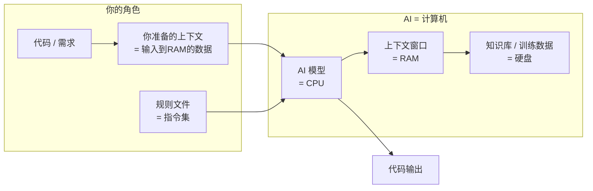
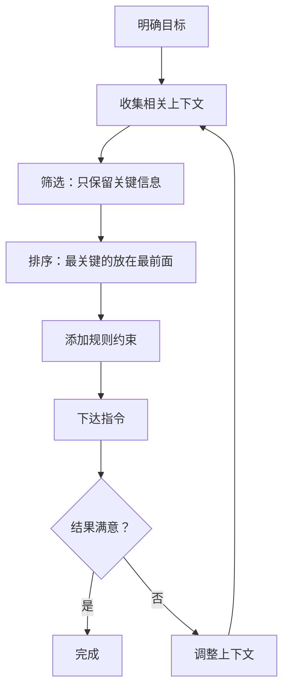
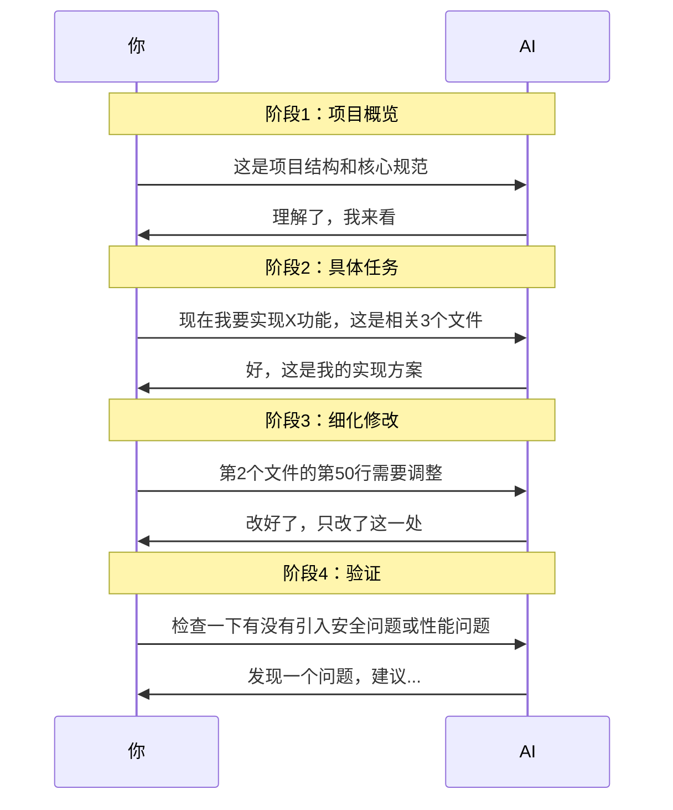

# 第11课：Context工程 — 让AI写出不翻车的代码

> 学霸和学神的区别不在于"会不会问问题"，而在于"桌上摆什么资料"。

## 为什么Prompt工程不够了？

2025-2026年，AI编程领域发生了一个重要的范式转移：

> **Prompt工程已死，Context工程上位。**

这句话不是标题党，而是行业共识。让我们看看几位关键人物的看法：

### Shopify CEO Tobi Lütke 的推文

Tobi 在2025年底发了一条推文，在开发者社区引发轩然大波。大意是：

> "我们花了两年时间教大家怎么写Prompt，但现在发现真正重要的是你给AI提供了什么上下文。Prompt只是问法，Context才是内容。"

### Karpathy 的转发与定义

Andrej Karpathy 转发了这条推文并补充了一个精辟的定义：

> **Prompt Engineering = 你问问题的姿势**
> **Context Engineering = 你桌上摆了什么资料**

Karpathy 指出：未来的AI编程高手，不是那些会写花哨Prompt的人，而是那些懂得**管理上下文**的人。

### Anthropic 官方文档的呼应

Anthropic 在《Effective Context Engineering for AI Agents》官方文档中明确提出：

> 上下文工程（Context Engineering）是构建可靠AI Agent的核心技能。关键在于：**决定告诉AI什么，不告诉AI什么。**

## 心智模型：AI是CPU，上下文窗口是RAM

要理解Context工程，你需要建立正确的心智模型：



### 当前主流模型的"内存"规格

| 模型 | 上下文窗口 | 相当于 |
|------|-----------|--------|
| Claude Opus 4.7 | 1M tokens | ~75万个英文单词 / 3本《三体》 |
| GPT-5.5 | 1M tokens | 同上 |
| Gemini 3.1 Pro | 1M tokens | 同上 |

1M tokens 听起来很大，但**你给AI的东西越多，AI的注意力就越分散**。这就像给一个程序员同时堆100个文件，他反而不知道重点在哪。

> **关键洞察**：AI的大脑不是"越大越好"，而是"越精准越好"。

## "装弹"的姿势

我把Context工程的核心方法总结为四个字：**装弹**。

把你和AI的每一次对话想象成一次"射击"——你需要先装好子弹，再扣动扳机。



### 决定告诉AI什么，不告诉AI什么

这是Context工程最核心的能力。你需要问自己：

1. **这个任务需要AI知道什么？** — 核心依赖、技术栈、接口定义
2. **这个任务不需要AI知道什么？** — 无关代码、旧版本逻辑、私人信息
3. **AI最可能在哪里翻车？** — 在这些地方提供明确的约束规则

## AI的"失忆"问题

有趣的现象：**很多时候，新对话反而比延续对话效果好。**

原因很简单：

- 旧对话积累了大量无关上下文
- AI的注意力被稀释了
- 关键指令被埋没在历史消息中

### 什么时候应该开新对话？

| 场景 | 建议 |
|------|------|
| 开始一个新功能 | ✅ 开新对话，只给相关上下文 |
| 修改现有功能的bug | ⚠️ 可以延续，但清理无关内容 |
| 重构/大改动 | ✅ 开新对话，重新"装弹" |
| 追问同一个问题 | 延续对话（AI记得最近的内容） |

> **经验法则**：如果你发现AI开始"犯低级错误"、忘记之前的约定、或者答非所问，大概率是上下文太脏了。开个新对话，重新装弹。

## 上下文管理五技巧

### 1. 关键文件放在开头

AI对**开头的内容关注度最高**。把你的核心文件、规则说明放在对话的最前面。

```markdown
错误示范：
"帮我改一下这个项目，先看看package.json，再看看layout.tsx，对了还有.env..."

正确示范：
"以下是项目核心文件，请先阅读：
1. 【规则文件】.cursorrules — 项目规范
2. 【核心逻辑】src/app/page.tsx — 主页面
3. 【数据结构】src/lib/types.ts — 类型定义

任务：在页面中添加用户登录功能"
```

### 2. 无关信息一定要清理

这是最常见的坑：把整个项目扔给AI。

```markdown
不要这样做：
- ❌ 把node_modules也拖进去
- ❌ 把十几张无关的截图发给AI
- ❌ 粘贴整个数据库dump
- ❌ 用"这个项目你看一下"代替明确说明

要做：
- ✅ 只粘贴相关文件
- ✅ 用一两句话概括项目背景
- ✅ 明确指出"这些文件不需要关注"
```

### 3. 用规则文件约束AI行为

创建一个项目级的规则文件（如 `.cursorrules`、`CLAUDE.md`），把AI需要遵守的规范写进去。

```markdown
# CLAUDE.md 示例

## 技术栈
- 框架：Next.js 15 (App Router)
- 样式：Tailwind CSS + shadcn/ui
- 数据库：PostgreSQL + Prisma ORM
- 认证：NextAuth.js

## 代码规范
- 使用 TypeScript，严格模式
- 组件使用函数组件 + hooks
- 错误处理：使用 try/catch，返回统一格式
- 命名：组件用 PascalCase，函数用 camelCase

## 项目约定
- 公共组件放在 src/components/ui/
- 页面组件放在 src/app/[route]/
- API路由放在 src/app/api/
- 工具函数放在 src/lib/

## 常见陷阱
- 不要使用 `any` 类型
- 不要忽略 ESLint 警告
- 不要在客户端组件中使用服务端API
```

### 4. 迭代时只给出改动的上下文

当你让AI修改代码时，**只给出相关的改动部分**，而不是整个文件。

```markdown
错误示范：
"这是整个page.tsx（300行），帮我改一下第150行的按钮颜色"

正确示范：
"在以下组件中，请将登录按钮的颜色从蓝色改为绿色。
改动范围：只修改 Button 组件的 className 中的颜色值。

```tsx
<Button className="bg-blue-500 hover:bg-blue-600">
  登录
</Button>
```
"
```

### 5. 分段加载策略

对于大型项目，不要让AI一次性"吃掉"所有东西。采用分阶段加载：



## 让AI写代码的工程化方法

Context工程的最终目标，是把AI纳入你的**工程化流程**。

### SOLID原则在AI协作中的应用

| 原则 | 对AI协作的含义 |
|------|---------------|
| **单一职责** | 一次只让AI做一个事，别让它同时改10个文件 |
| **开闭原则** | 让AI基于已有代码扩展，而不是重写 |
| **里氏替换** | 确保AI的输出可以和现有代码无缝衔接 |
| **接口隔离** | 给AI的上下文要精简，不要塞无关内容 |
| **依赖反转** | 让AI依赖抽象接口，而不是具体实现 |

### 代码规范文件的力量

在项目根目录维护一份代码规范文件，这是你和AI之间的"契约"：

```markdown
# 代码规范检查清单

## 每次AI生成代码后，自动检查：
- [ ] 类型定义完整吗？有没有用了 any？
- [ ] 错误处理覆盖了吗？
- [ ] 有没有硬编码的敏感信息？
- [ ] 和现有代码风格一致吗？
- [ ] 有没有引入不必要的依赖？
```

## 与AI协作的"装弹"方法论

总结一下，每次和AI协作写代码的标准化流程：

### 第一步：装弹（准备上下文）
- [ ] 明确任务目标
- [ ] 收集2-5个关键文件
- [ ] 编写简洁的指令
- [ ] 添加规则约束

### 第二步：瞄准（下达指令）
- [ ] 使用精确的语言
- [ ] 指明输出格式
- [ ] 设定质量要求

### 第三步：射击（获取输出）
- [ ] 检查输出质量
- [ ] 验证是否符合规范
- [ ] 测试关键路径

### 第四步：复盘（反馈循环）
- [ ] 指出AI做得好的地方
- [ ] 指出AI需要改进的地方
- [ ] 更新规则文件
- [ ] 清理上下文

## 课后思考

1. 你之前和AI协作时，遇到过"AI突然变笨"的情况吗？很可能是上下文污染了。
2. 检查一下你最近的项目，有没有一个清晰的规则文件？如果没有，现在就去创建一个。
3. 试着把一个复杂任务拆成3个简单任务，分别开新对话让AI完成，对比效果。

## 下节课预告

[第12课：用户认证与安全](0012-yong-hu-ren-zheng-yu-an-quan.md) — 注册登录、密码安全、OAuth第三方登录、Next.js Auth方案实战。

---

*别忘了：AI是你的超级实习生，而Context Engineering就是你给实习生的"工作手册"。手册写得好，实习生才能干得漂亮。*