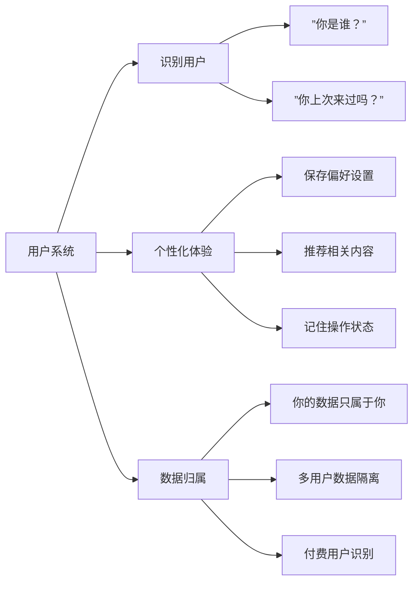
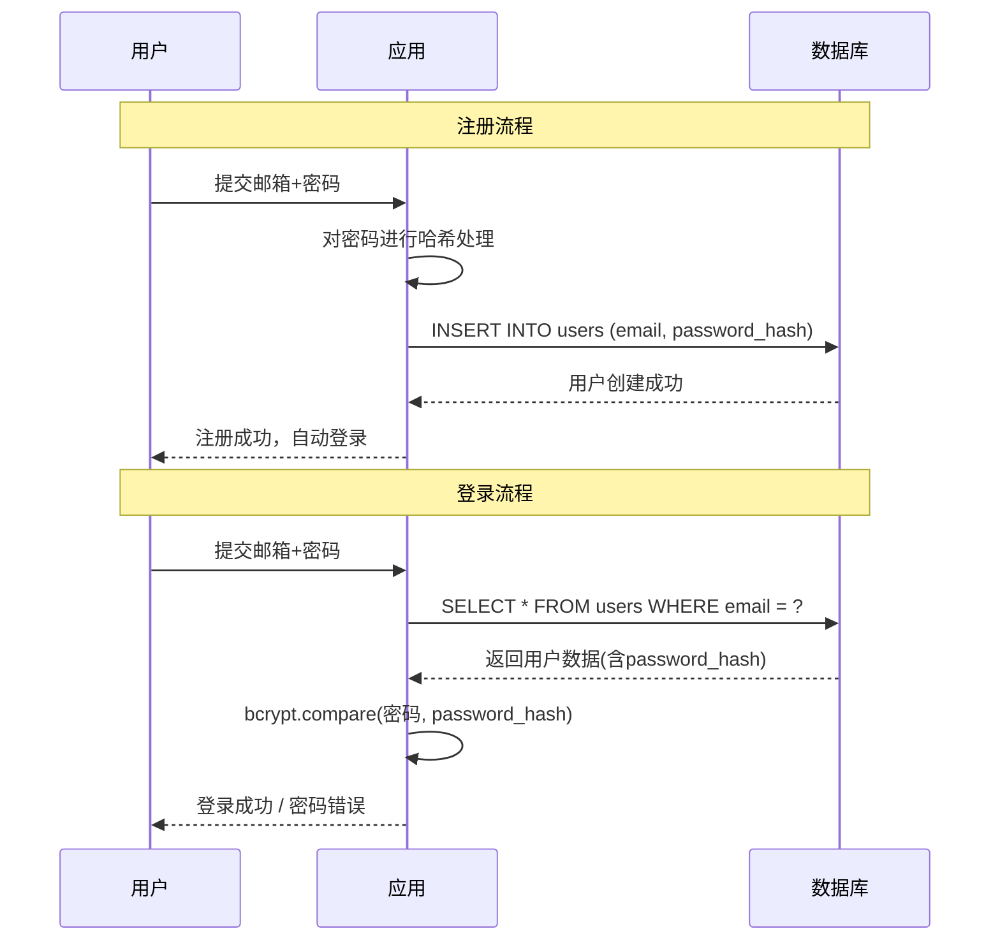
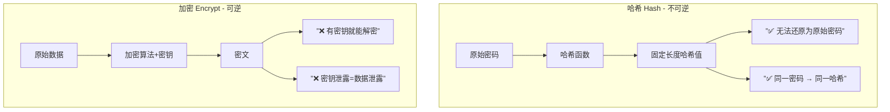
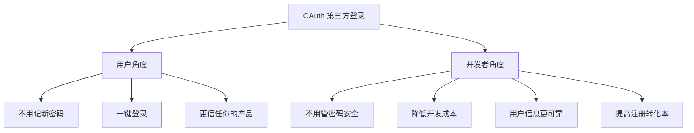
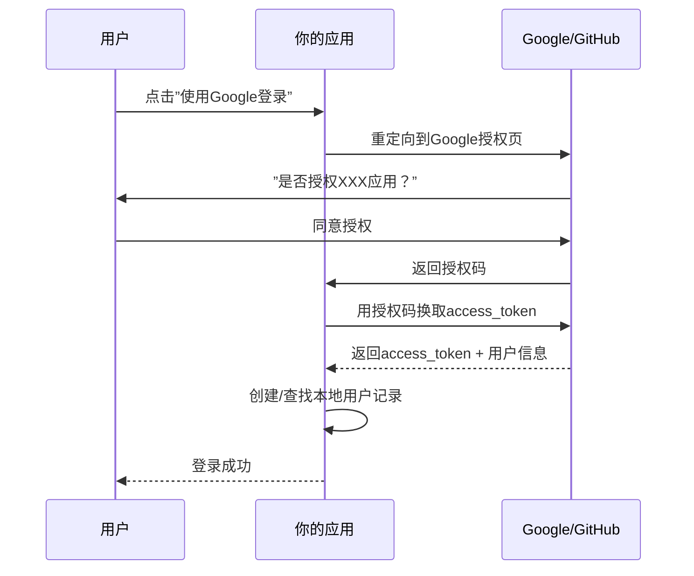
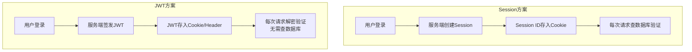

# 第12课：用户认证与安全

> 你的产品需要"认人"，但你不能偷看用户的密码。

## 为什么需要"用户"？

在做海外产品时，用户系统是大多数产品的**第一道关卡**。为什么需要它？

### 三个核心原因



| 原因 | 说明 | 对产品的意义 |
|------|------|-------------|
| **识别用户** | 知道谁在使用你的产品 | 区分游客和注册用户 |
| **个性化体验** | 根据用户身份提供定制内容 | 提高用户粘性和满意度 |
| **数据归属** | 用户的数据只属于该用户 | 多租户、付费墙、数据安全 |

**现实案例**：一个笔记App如果没有用户系统，所有人的笔记都混在一起。有了用户系统，你才能说"这是你的笔记"、"这是你的订阅"。

## 注册和登录 = 数据库操作

很多人觉得认证很复杂，但本质上它只是两个数据库操作：

### 注册 = INSERT

```sql
-- 注册：在 users 表中插入一条新记录
INSERT INTO users (email, password_hash, name, created_at)
VALUES ('user@example.com', 'hashed_password_here', '张三', NOW());
```

### 登录 = SELECT + 验证

```sql
-- 登录：根据邮箱查询用户
SELECT * FROM users WHERE email = 'user@example.com';
-- 然后：验证密码哈希是否匹配
```



> **核心要点**：不要把认证想得太神秘。它就是**验证你是谁**→**给你一个凭证（Token/Session）**→**后续请求带着凭证来**。

## 密码安全：你不能看到用户的密码

这是**最重要的安全原则**：你作为开发者，**永远不应该知道用户的密码是什么**。

### 哈希 vs 加密



| 特性 | 哈希（Hash） | 加密（Encrypt） |
|------|-------------|-----------------|
| 是否可逆 | ❌ 不可逆 | ✅ 可逆（有密钥） |
| 用途 | 密码存储、数据完整性 | 数据传输、存储加密 |
| 安全性 | 即使数据库泄露也看不到密码 | 密钥泄露 = 全部暴露 |
| 典型算法 | bcrypt, argon2, scrypt | AES, RSA |

### 密码哈希的正确做法

1. **使用专门的密码哈希算法**：bcrypt、argon2、scrypt
2. **不要使用普通哈希**：MD5、SHA-256 不适合存密码（太快了，容易被暴力破解）
3. **使用 salt（盐值）**：每个密码附加随机字符串再哈希

```typescript
// Node.js 中使用 bcrypt 的正确姿势
import bcrypt from 'bcrypt';

// 注册时：哈希密码
const saltRounds = 12; // 推荐 10-12，越高越安全但也越慢
const passwordHash = await bcrypt.hash('user_password', saltRounds);
// 存入数据库的是 passwordHash

// 登录时：验证密码
const isValid = await bcrypt.compare('input_password', storedHash);
// 返回 true/false
```

### 绝对不要做的事情

- ❌ **存明文密码** — 这是最严重的违规，数据库泄露 = 所有用户密码暴露
- ❌ **用 MD5/SHA1 存密码** — 现代硬件几秒钟就能破解
- ❌ **自己发明加密算法** — 你不是密码学专家
- ❌ **通过API返回密码** — 永远不要在API响应中包含 password_hash
- ❌ **把密码写进日志** — 日志系统也可能被访问

> **行业铁律**：如果你的数据库被拖库，用户的密码必须仍然是安全的。这正是哈希的意义。

## OAuth 第三方登录

让用户用 Google、GitHub 等账号登录。这是**用户体验最好**的登录方式。

### 为什么推荐OAuth？



### 常见OAuth提供商

| 提供商 | 适用场景 | 特点 |
|--------|---------|------|
| Google | 海外产品首选 | 用户基数最大 |
| GitHub | 开发者工具 | 技术用户信任度高 |
| Apple | iOS/App | 苹果要求必须提供 |
| 微信 | 国内产品 | 中国用户必选 |

### OAuth流程简图



## Next.js Auth 方案

在 Next.js 生态中，**NextAuth.js（现在叫 Auth.js）** 是目前最成熟、最流行的认证方案。

### 为什么选 NextAuth.js？

- ✅ 开箱即用的 OAuth 支持（Google、GitHub、Apple 等几十种）
- ✅ 支持 Credentials（邮箱+密码）登录
- ✅ 支持 Session 和 JWT 两种模式
- ✅ 内置 CSRF 保护
- ✅ 数据库适配器（Prisma、Drizzle、MongoDB 等）

### 快速集成示例

```typescript
// app/api/auth/[...nextauth]/route.ts
import NextAuth from 'next-auth';
import GoogleProvider from 'next-auth/providers/google';
import GitHubProvider from 'next-auth/providers/github';

const handler = NextAuth({
  providers: [
    GoogleProvider({
      clientId: process.env.GOOGLE_CLIENT_ID!,
      clientSecret: process.env.GOOGLE_CLIENT_SECRET!,
    }),
    GitHubProvider({
      clientId: process.env.GITHUB_CLIENT_ID!,
      clientSecret: process.env.GITHUB_CLIENT_SECRET!,
    }),
  ],
  // 使用 JWT 模式（无数据库方案）
  session: { strategy: 'jwt' },
  pages: {
    signIn: '/auth/signin', // 自定义登录页
  },
});

export { handler as GET, handler as POST };
```

```tsx
// 在组件中使用
'use client';
import { useSession, signIn, signOut } from 'next-auth/react';

export default function AuthButton() {
  const { data: session } = useSession();

  if (session) {
    return (
      <div>
        
        <p>你好，{session.user?.name}</p>
        <button onClick={() => signOut()}>退出登录</button>
      </div>
    );
  }
  return (
    <div>
      <button onClick={() => signIn('google')}>使用Google登录</button>
      <button onClick={() => signIn('github')}>使用GitHub登录</button>
    </div>
  );
}
```

## Session vs JWT

这是认证领域的经典选择题。两种方案各有利弊。



| 对比维度 | Session | JWT |
|---------|---------|-----|
| 存储位置 | 服务端（数据库/内存） | 客户端（Cookie/LocalStorage） |
| 查询数据库 | 每次请求都需要 | 不需要（自包含） |
| 注销能力 | ✅ 可以立刻失效 | ❌ 签发后无法撤销（直到过期） |
| 扩展性 | 需要共享Session存储 | ✅ 天然支持分布式 |
| 适合场景 | 传统Web应用 | 微服务、移动端、API服务 |

### 怎么选？

- **大多数Next.js应用用JWT就够了** — NextAuth.js 默认JWT模式
- **需要强制注销/踢人下线的场景用Session** — 比如管理后台
- **移动端App用JWT** — 不需要Cookie支持

## 实战要诀

### 开发阶段的认证

开发初期可以用最简单的方式：

```typescript
// 开发环境：极简认证（不要用于生产！）
const DEV_USER = {
  id: 'dev-user',
  email: 'dev@example.com',
  name: '开发者',
};

export function getDevUser() {
  if (process.env.NODE_ENV === 'development') {
    return DEV_USER;
  }
  // 生产环境走正常认证流程
}
```

### 生产环境检查清单

- [ ] 密码使用 bcrypt/argon2 哈希
- [ ] HTTPS 强制开启（Vercel 默认支持）
- [ ] 敏感信息放在 `.env` 中
- [ ] 使用环境变量管理 OAuth Client ID/Secret
- [ ] API 路由需要认证保护
- [ ] CORS 配置正确
- [ ] 设置合理的 Session/JWT 过期时间
- [ ] 实施限流（Rate Limiting）防止暴力破解

## 课后作业

1. **基础任务**：在你的 Next.js 项目中集成 NextAuth.js，配置 Google 登录
2. **进阶任务**：实现邮箱密码注册+登录，使用 bcrypt 对密码进行哈希
3. **挑战任务**：添加"忘记密码"功能，使用邮件发送重置链接

## 下节课预告

[第13课：商业化与增长](0013-shang-ye-hua-yu-zeng-zhang.md) — Stripe支付集成、用户获取、增长策略，让你的产品开始赚钱。

---

*安全不是功能，而是产品的基石。从第一天开始就把认证做对，比后面再补漏洞容易一百倍。*