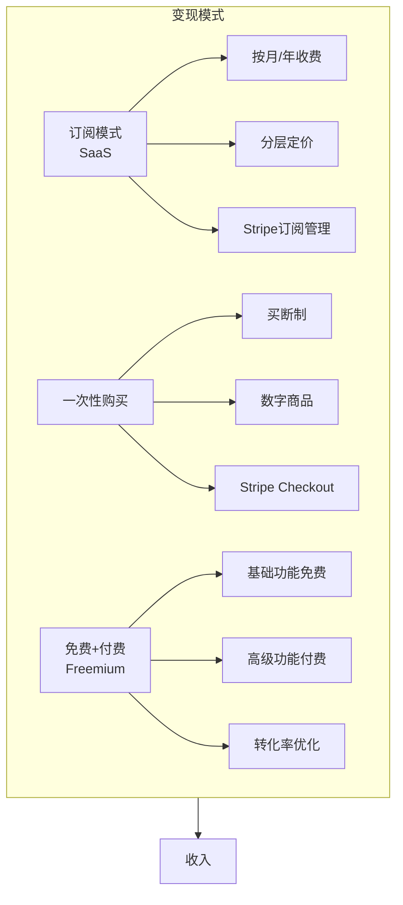
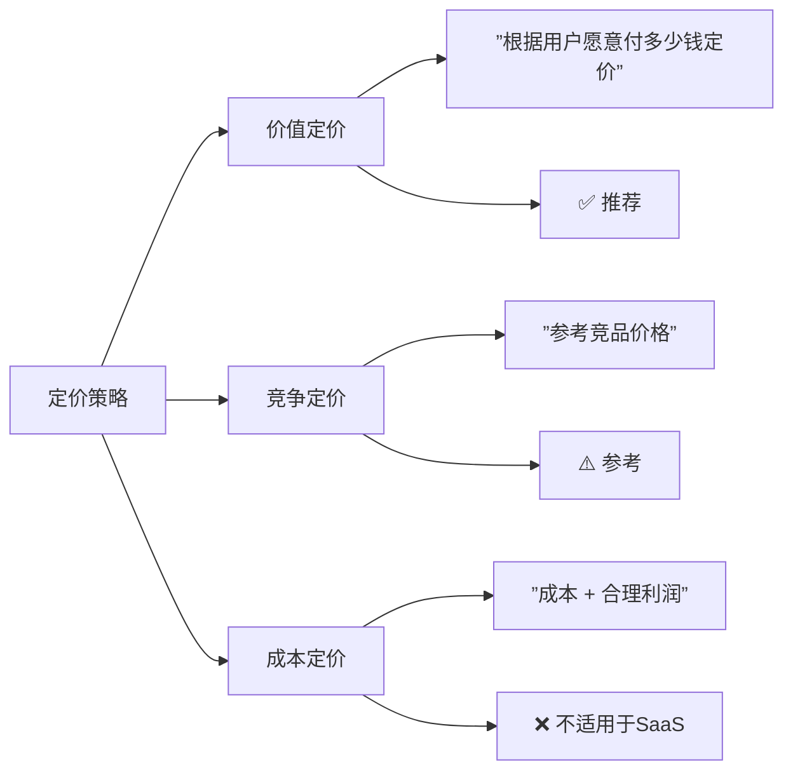
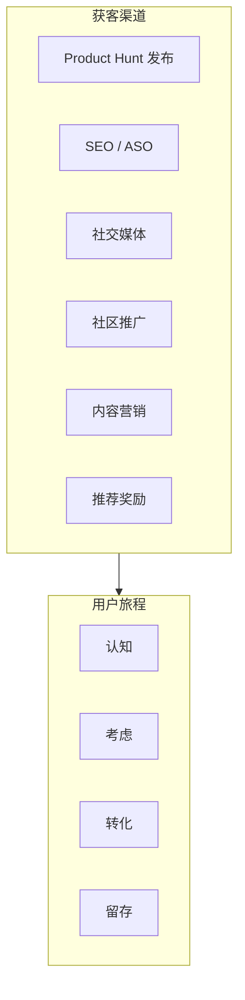

# 第13课：商业化与增长

> 做出产品只是第一步，让产品赚钱才是终极目标。

## 海外变现方式

做海外产品，支付是绕不开的核心能力。而 Stripe 是海外支付的**事实标准**。

### 为什么是 Stripe？

- ✅ 全球覆盖：支持 135+ 种货币，几十个国家
- ✅ 开发者友好：API 设计优雅，文档清晰
- ✅ 无需公司资质：个人即可注册 Stripe 账号收款
- ✅ 完善的订阅管理：SaaS 产品首选

### 三种主流变现模式



| 模式 | 适合什么产品 | 优点 | 缺点 |
|------|-------------|------|------|
| **订阅（SaaS）** | 持续提供服务（笔记、AI工具、项目管理） | 收入可预测，LTV高 | 需要持续维护 |
| **一次性购买** | 模板、电子书、字体、设计资源 | 实现简单 | 收入一次性 |
| **Freemium** | 有网络效应的产品 | 用户增长快 | 免费用户成本高 |

### 定价策略参考



**小李哥的经验**：不要按成本定价，要按**价值定价**。如果你的工具帮用户省了10小时/月，收$29/月很合理。定价太低反而会让用户觉得你的产品不值钱。

## Stripe 集成指南

### 第一步：创建产品和定价

在 Stripe Dashboard 中创建产品：

1. 登录 [Stripe Dashboard](https://dashboard.stripe.com)
2. 进入 **Products** → **Add Product**
3. 填写产品信息：
   - Name: "Pro Plan"
   - Description: "高级功能解锁"
   - Pricing model: 选择 "Standard pricing"
   - Price: $29/month 或 $290/year（年付给2个月折扣）

### 第二步：Stripe Checkout（最简单的方式）

```typescript
// app/api/create-checkout/route.ts
import Stripe from 'stripe';

const stripe = new Stripe(process.env.STRIPE_SECRET_KEY!);

export async function POST(req: Request) {
  const { priceId, userId } = await req.json();

  // 创建 Checkout Session
  const session = await stripe.checkout.sessions.create({
    mode: 'subscription',       // 订阅模式
    line_items: [{ price: priceId, quantity: 1 }],
    success_url: `${process.env.NEXT_PUBLIC_URL}/success?session_id={CHECKOUT_SESSION_ID}`,
    cancel_url: `${process.env.NEXT_PUBLIC_URL}/pricing`,
    client_reference_id: userId, // 关联你的用户ID
    // 自动收集用户邮箱
    customer_email: userEmail,
  });

  return Response.json({ url: session.url });
}
```

```tsx
// 前端调用
'use client';

export function SubscribeButton({ priceId }: { priceId: string }) {
  const handleSubscribe = async () => {
    const res = await fetch('/api/create-checkout', {
      method: 'POST',
      headers: { 'Content-Type': 'application/json' },
      body: JSON.stringify({ priceId, userId: 'xxx' }),
    });
    const { url } = await res.json();
    // 跳转到 Stripe 结账页面
    window.location.href = url;
  };

  return <button onClick={handleSubscribe}>订阅 Pro 计划 — $29/月</button>;
}
```

### 第三步：Webhook（处理支付回调）

Stripe 通过 Webhook 通知你支付结果。这是**最关键**的一步——用户付了钱，你要给他解锁功能。

```typescript
// app/api/webhook/route.ts
import Stripe from 'stripe';
import { headers } from 'next/headers';

const stripe = new Stripe(process.env.STRIPE_SECRET_KEY!);
const webhookSecret = process.env.STRIPE_WEBHOOK_SECRET!;

export async function POST(req: Request) {
  const body = await req.text();
  const signature = headers().get('stripe-signature')!;

  let event: Stripe.Event;
  try {
    event = stripe.webhooks.constructEvent(body, signature, webhookSecret);
  } catch (err) {
    return new Response('Webhook signature verification failed', { status: 400 });
  }

  switch (event.type) {
    case 'checkout.session.completed': {
      const session = event.data.object;
      // 用户支付成功！在这里解锁用户的高级功能
      const userId = session.client_reference_id;
      await upgradeUserToPro(userId);
      break;
    }
    case 'customer.subscription.updated':
    case 'customer.subscription.deleted': {
      // 订阅变更（降级/取消）
      const subscription = event.data.object;
      await syncSubscriptionStatus(subscription);
      break;
    }
  }

  return Response.json({ received: true });
}
```

### 第四步：本地测试 Webhook

```bash
# 安装 Stripe CLI
brew install stripe/stripe-cli/stripe

# 转发 webhook 到本地
stripe listen --forward-to localhost:3000/api/webhook

# 触发测试事件
stripe trigger checkout.session.completed
```

### Stripe 集成检查清单

- [ ] Stripe 账号注册完成（海外个人即可注册）
- [ ] 产品和定价在 Dashboard 中创建
- [ ] Stripe Secret Key 放在 `.env.local` 中
- [ ] Webhook endpoint 配置并测试通过
- [ ] 本地用 Stripe CLI 测试完整支付流程
- [ ] 使用 Stripe 测试卡号 `4242 4242 4242 4242` 测试
- [ ] 生产环境切换到 Live Mode

## 用户获取：前100个用户怎么来

这是所有创业者面临的**第一道坎**。没有人用你的产品，怎么获得第一批用户？

### 渠道矩阵



### Product Hunt 发布

Product Hunt 是海外产品冷启动的**首选渠道**。

| 要点 | 说明 |
|------|------|
| 发布准备 | 提前2-4周准备，优化产品页面 |
| 核心素材 | 精美的产品截图、Demo视频、清晰的描述 |
| 发布时机 | 周二-周四上午（美国时间） |
| 配合推广 | 在 Twitter、LinkedIn、Reddit 同步宣传 |
| 成功标准 | 进入当日 Top 5，获取 500+ upvotes |

### SEO/ASO

虽然慢，但**长期回报最高**。

```markdown
SEO 基础策略（AI时代依然有效）：
1. 找到你的用户会搜索的关键词
2. 围绕这些关键词写高质量内容
3. 让网站结构对搜索引擎友好
4. 获取外部链接（backlinks）

用AI做SEO提示词：
"我开发了一个[产品描述]，目标用户是[用户画像]。
请帮我列出20个长尾关键词，用户可能会在Google搜索这些词来找类似产品。
同时为每个关键词提供一个博客文章标题建议。"
```

### 社交媒体策略

不是所有平台都适合所有产品：

| 平台 | 适合的产品类型 | 内容风格 |
|------|--------------|---------|
| Twitter/X | 开发者工具、AI产品 | 技术分享、产品进度、观点 |
| LinkedIn | B2B SaaS、专业服务 | 行业洞察、案例研究 |
| Reddit | 有特定社区的产品 | 回答问题、提供价值（不要硬推） |
| Tiktok | 面向大众的消费品 | 展示使用场景、前后对比 |

### 社区推广

> **不要一上来就发广告链接。先提供价值，再推荐产品。**

```markdown
错误示范：
"大家好，我做了个XX工具，快来用！"
（被踢出社区）

正确示范：
"我在做项目的时候遇到一个问题[描述问题]，
我是这样解决的[分享方法]，
我顺便做了个工具专门处理这类问题[分享链接]。
希望能帮到有同样困扰的朋友。"
（社区会感谢你）
```

## 增长策略：让用户帮你传播

### 分享机制设计

让用户在使用过程中**自然地**想分享：

- ✅ 生成分享图片/卡片（如：GitHub 仓库的社交卡片）
- ✅ 产品内嵌"分享使用成果"的入口
- ✅ 提供公开的 Profile 页面（用户会自发分享）

### 推荐奖励（Referral Program）

Dropbox 靠推荐奖励从10万用户增长到400万。你也可以用。

```typescript
// 推荐奖励系统核心逻辑
interface ReferralSystem {
  referrer: {
    reward: '1个月Pro免费' | '$10 余额' | '额外50次调用';
    limit: '无限制' | '每月最多10人';
  };
  referee: {
    reward: '首月5折' | '免费试用Pro 14天';
    condition: '完成注册 + 首次使用';
  };
  tracking: {
    method: '邀请链接参数' | '邀请码';
    expire: '30天有效';
  };
}
```

### 内容营销

在 AI 时代，内容营销的ROI依然很高。关键是：

1. **建立权威** — 写你的产品所在领域的深度内容
2. **自然植入** — 在案例中展示你的产品怎么解决问题
3. **持续输出** — 每周至少1-2篇，坚持3个月以上

**用AI做内容营销提示词**：

```markdown
"我开发了一个[产品名称]，它是一个[产品描述]。
请为我规划一个为期4周的内容营销计划：
- 每周2篇博客文章的主题和要点
- 每个主题在Twitter上的推广文案（3条）
- 目标关键词建议
- 内容格式：教程/案例/行业分析/对比评测"
```

## 经典案例：小李哥分享

小李哥是单人海外产品创业的代表人物，他的核心经验：

### 选品原则
1. **做小不做大** — 解决一个具体的痛点，不要做大而全的平台
2. **做收费不做免费** — 一开始就收费，验证用户是否真的愿意付钱
3. **做海外不做国内** — 海外用户的付费意愿和支付能力更强

### 增长心得
- 前100个用户来自 Reddit 社区（回答了200+个相关问题）
- 前1000个用户来自 Product Hunt（做了3次发布，每次都在改进）
- 前10000个用户来自 SEO + 口碑（第一篇SEO文章写了3个月才排名第一）

### 对AI编程者的建议
> "AI大幅降低了开发成本，但**选品和获客能力**没有降低。不要把时间都花在写代码上，要花时间理解你的用户在哪里，他们为什么需要你的产品。"

## 课后作业

1. **基础任务**：注册 Stripe 账号，在 Dashboard 中创建一个产品（免费层+付费层）
2. **进阶任务**：在你的 Next.js 项目中集成 Stripe Checkout，实现订阅支付流程
3. **挑战任务**：实现 Webhook 处理，用户在支付成功后自动解锁高级功能
4. **增长任务**：列出3个你的目标用户所在的社区/平台，规划第一周的推广方案

## 下节课预告

[第14课：全品类实战](0014-quan-lei-xing-shi-zhan.md) — 微信小程序、桌面应用、浏览器插件开发实战，以及课程全链路回顾。

---

*做产品的终极目标不是写出完美的代码，而是做出用户愿意付费的产品。支付集成不是终点，是商业化的起点。*