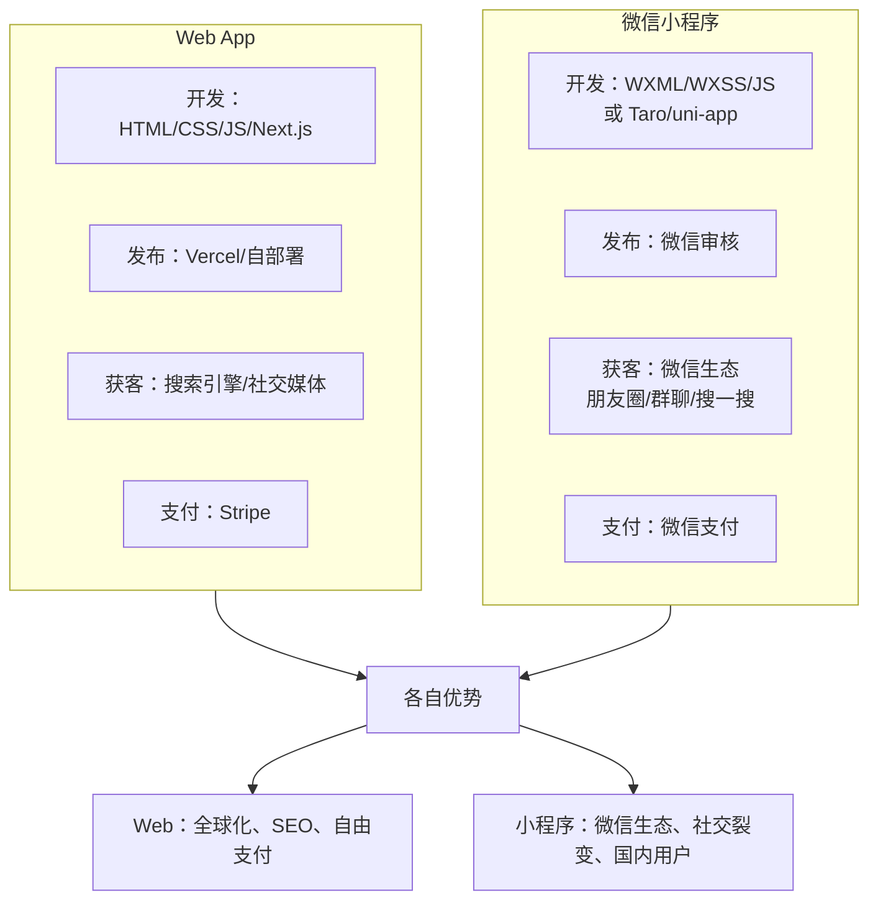
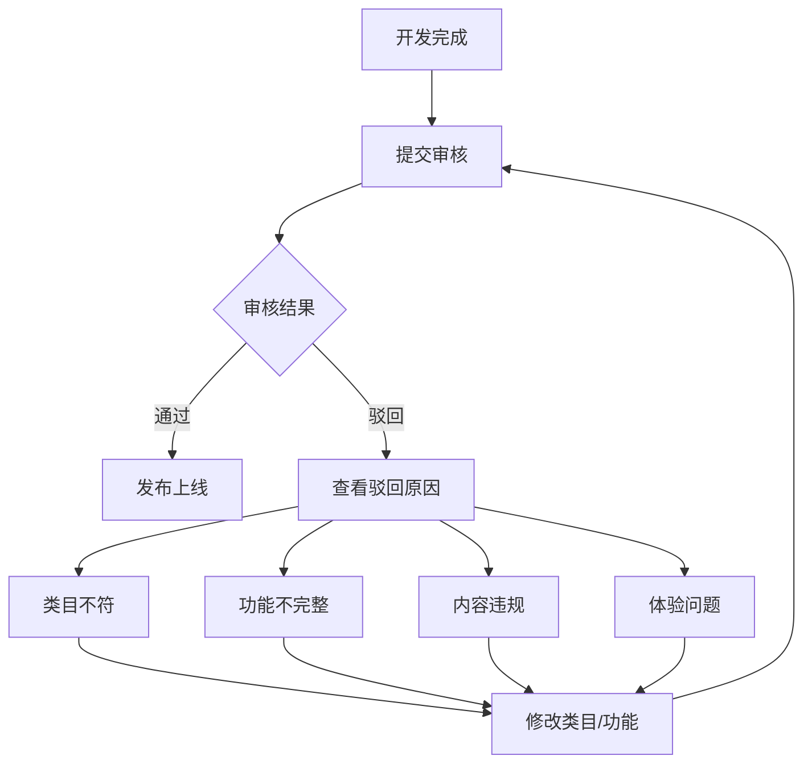
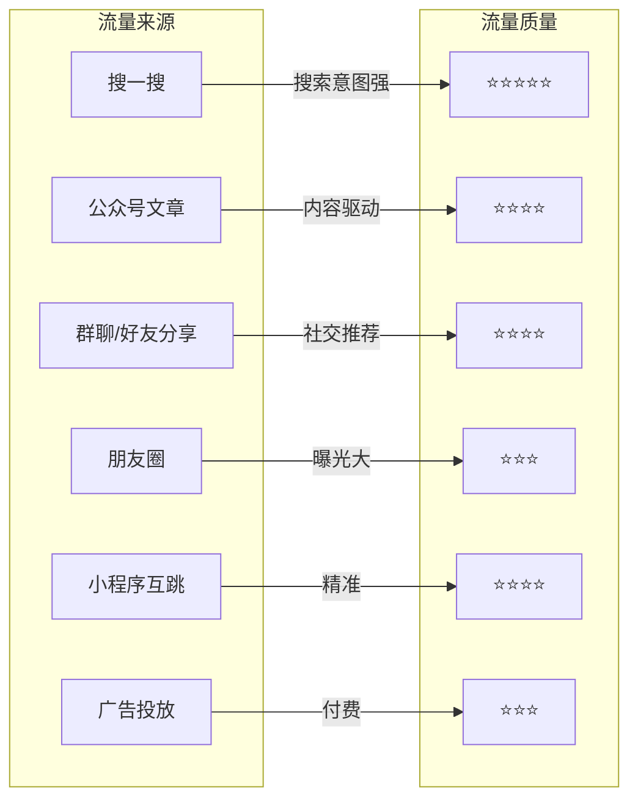
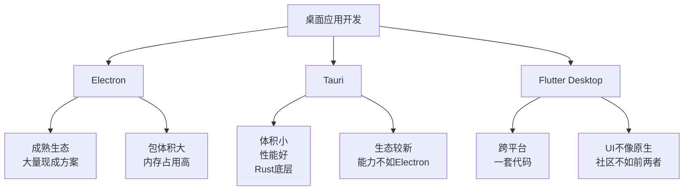
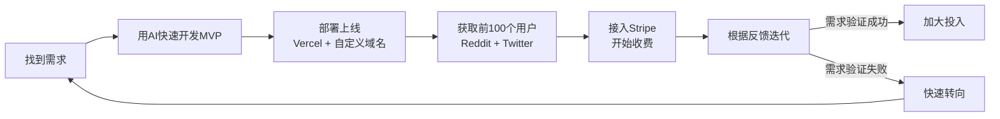
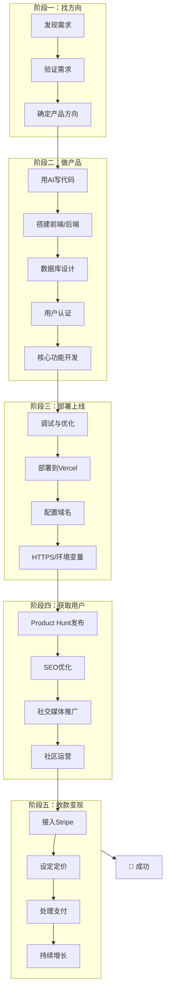

# 第14课：全品类实战

> 网站只是开始。小程序、桌面应用、浏览器插件——AI帮你打通所有平台。

## 微信小程序制作实战

### 小程序 vs Web App 区别

很多同学问：我已经会做网站了，为什么还要做小程序？



| 对比维度 | Web App | 微信小程序 |
|---------|--------|-----------|
| 开发语言 | HTML/CSS/JS/TS | WXML/WXSS/JS 或 Taro/uni-app |
| 发布流程 | 直接部署 | 需提交审核（1-7天） |
| 用户获取 | SEO、社交媒体 | 微信生态内部传播 |
| 支付 | Stripe（海外） | 微信支付（国内） |
| 适合场景 | 海外产品 | 国内产品 / 有微信流量的场景 |

### 小程序开发工具

#### 方案一：原生开发（推荐新手）

```markdown
需要的工具：
1. 微信开发者工具 — 官方IDE，含调试器、模拟器
2. 微信小程序管理后台 — 注册、配置、发布
3. 一个经过认证的微信小程序账号（个人或企业均可）

开发流程：
注册小程序账号 → 下载开发者工具 → 创建项目 → 开发 → 提交审核 → 发布
```

#### 方案二：用AI辅助开发

**提示词模板**：

```markdown
"我用 Taro 框架开发一个微信小程序，功能是一个[产品描述]。
请帮我生成以下文件：
1. src/pages/index/index.tsx — 首页（展示核心功能）
2. src/pages/user/user.tsx — 个人中心页
3. src/app.config.ts — 小程序配置文件

技术要求：
- 使用 Taro + React + TypeScript
- 适配微信小程序平台
- 接入微信登录
- 页面设计简洁美观，参考[参考风格]"
```

### 审核与发布流程

这是做小程序**最容易踩坑**的地方。



**审核避坑指南**：

| 常见驳回原因 | 解决方案 |
|-------------|---------|
| 类目选择错误 | 提前确认你的产品属于哪个类目，需要的资质 |
| 功能不完整 | 确保所有按钮都有响应，没有"建设中"页面 |
| 涉及社交/内容 | 需要额外资质，个人开发者建议避开 |
| UI太简陋 | 用 AI 生成精美 UI 样式 |
| 没有隐私协议 | 必须提供完整的隐私协议和用户协议 |

> **小李哥经验**：第一次审核通常需要3-7天。建议提交前先在微信开发者工具中做完整的功能测试，确保所有页面都正常显示。驳回不可怕，但是每改一次就要重新排队审核。

## 流量经验分享（郭东超）

郭东超是国内小程序领域的实战派，他的流量经验值得每一位开发者学习。

### 小程序的流量来源



### 裂变设计

小程序最大的优势是**社交裂变**。郭东超的裂变方法论：

#### 裂变三要素
1. **利益驱动** — 分享后获得奖励（优惠券、额外功能、解锁内容）
2. **低门槛** — 点击即用，无需下载注册
3. **场景绑定** — 分享内容有价值，不是广告

#### 裂变设计的"坑"

```
❌ 硬性要求分享才能用 ← 用户体验极差
✅ 分享后获得额外价值 ← 用户自愿分享

❌ 分享内容像广告 ← 没人点
✅ 分享内容有价值（排行榜、作品展示、实用报告）← 用户主动点
```

### 用户留存

> **流量贵，留存更贵。**

郭东超的留存策略：

| 策略 | 做法 | 效果 |
|------|------|------|
| 模板消息 | 用户操作后发送服务通知 | 召回率 15-30% |
| 每日签到 | 连续签到奖励递增 | 日活提升 20-50% |
| 内容更新 | 定期更新有价值的内容 | 自然回访 |
| 社群运营 | 引导加入微信群 | 深度连接 |

## 桌面应用开发路径

如果产品需要更强的本地能力（文件处理、离线使用、系统集成），桌面应用是好的选择。

### 技术选型



| 方案 | 语言 | 包体积 | 性能 | 适合场景 |
|------|------|--------|------|---------|
| **Electron** | JS/TS | ~150MB+ | 中等 | 需要快速开发，已有Web代码 |
| **Tauri** | Rust+JS | ~5MB | 优秀 | 注重性能，愿意学Rust |
| **Flutter Desktop** | Dart | ~20MB | 好 | 移动端已有Flutter应用 |

### 用AI辅助桌面应用开发

```markdown
提示词模板（以 Tauri 为例）：
"我使用 Tauri v2 开发一个桌面应用，功能是[产品描述]。
请帮我完成以下任务：
1. 初始化 Tauri 项目（使用 React + TypeScript 前端）
2. 实现[核心功能]
3. 使用 Tauri API 实现[本地文件读写/系统通知/托盘图标]
4. 配置应用图标和窗口设置

请提供完整的代码实现和配置文件。"
```

## 浏览器插件开发路径

浏览器插件是**开发成本最低、获客路径最短**的产品形态。

### 为什么做浏览器插件？

- ✅ **开发快**：一个功能完善的插件1-3天就能做完
- ✅ **分发方便**：Chrome Web Store 审核比App Store快得多
- ✅ **自然获客**：在 Chrome Store 搜索就能找到你的插件
- ✅ **变现灵活**：免费版+付费Pro版

### 插件核心结构

```markdown
my-extension/
├── manifest.json        # 插件配置文件（最重要！）
├── popup/
│   ├── popup.html       # 点击图标弹出的窗口
│   ├── popup.ts         # 弹窗逻辑
│   └── popup.css        # 弹窗样式
├── content/
│   └── content.ts       # 注入到网页的脚本
├── background/
│   └── service-worker.ts # 后台服务（处理事件）
├── icons/
│   ├── icon16.png
│   └── icon128.png
└── _locales/            # 多语言
```

### Manifest V3 示例

```json
{
  "manifest_version": 3,
  "name": "我的AI助手",
  "version": "1.0.0",
  "description": "在浏览任何网页时使用AI助手",
  "permissions": ["storage", "activeTab"],
  "host_permissions": ["<all_urls>"],
  "action": {
    "default_popup": "popup/popup.html",
    "default_icon": "icons/icon128.png"
  },
  "content_scripts": [
    {
      "matches": ["<all_urls>"],
      "js": ["content/content.js"]
    }
  ],
  "background": {
    "service_worker": "background/service-worker.js"
  }
}
```

### 用AI做浏览器插件

```markdown
提示词模板：
"帮我开发一个Chrome浏览器插件（Manifest V3），功能是：
[产品功能描述]

请生成完整的项目文件，包括：
1. manifest.json — 配置
2. popup 页面 — 用户操作界面（使用 Tailwind CSS）
3. content script — 与网页交互
4. service worker — 后台逻辑

UI风格参考：简洁、现代、毛玻璃效果
使用技术：原生JS（不依赖框架），Tailwind CSS通过CDN加载"
```

## 优秀学员案例：droidHZ

droidHZ 是往期学员中的**明星案例**。他的经历展示了从零到商业化的完整路径。

### 背景

- 非科班出身，编程基础几乎为零
- 参加深海圈AI编程课程后，开始利用AI辅助开发
- 在课程期间完成了第一个可用的产品

### 如何找到需求

droidHZ 的方法论：

1. **从自身痛点出发** — "我在工作中遇到了什么麻烦？"
2. **验证需求存在** — 在 Reddit/Twitter 搜索是否有人讨论类似问题
3. **小而精切入** — 只解决一个具体问题，不要做大平台

### 加速网站变现

droidHZ 的核心策略：



### droidHZ 给新学员的建议

> "AI编程最大的价值不是让你成为编程高手，而是**让你能用最低的成本验证你的想法**。以前做一个MVP要3个月，现在3天就够了。关键是：快去验证你的想法，别在脑子里空转。"

## 课程全链路回顾

至此，深海圈AI编程第三期的全部课程内容已经讲完。让我们回顾一下这条从 **Idea to Business** 的完整链路。

### 全链路地图



### 14课核心能力清单

看看你掌握了多少：

| 模块 | 核心能力 | 掌握了吗？ |
|------|---------|-----------|
| **认知** | AI编程六个阶段、Vibe Coding方法论 | [ ] |
| **开发** | 本地开发环境搭建、Next.js全栈开发 | [ ] |
| **数据** | 数据库设计、SQL查询、Prisma ORM | [ ] |
| **设计** | UI/UX设计思维、AI辅助调试 | [ ] |
| **部署** | Vercel部署、自定义域名、环境变量 | [ ] |
| **内功** | Cursor精通、JS/TS、Tailwind、shadcn/ui | [ ] |
| **认证** | 用户系统、OAuth、密码安全 | [ ] |
| **商业化** | Stripe支付、定价策略 | [ ] |
| **增长** | 用户获取、SEO、裂变设计 | [ ] |
| **全品类** | 小程序、桌面应用、浏览器插件 | [ ] |

### 毕业建议

> **"AI编程不是终点，只是起点。真正的旅程从现在开始。"**

1. **别等"准备好了"再开始** — 用 AI 做 MVP 只需要几天，快速上线获取真实反馈
2. **做你能做的最小产品** — 一个功能、一个页面、一个按钮，只要能解决问题就够了
3. **收费要趁早** — 从第一天就考虑变现，不要等用户多了再说
4. **持续学习** — 编程技术在变，但产品思维、用户理解、商业逻辑永远不会过时
5. **加入社区** — 独行快，众行远。和其他学员一起交流、互相学习、合作共赢

## 毕业项目

**最终挑战**：用课程中学到的所有知识，独立完成一个从想法到商业化的完整产品。

### 项目要求

- [ ] 选择一个你感兴趣的需求方向
- [ ] 用 AI 辅助完成产品开发（Web/小程序/插件/桌面应用均可）
- [ ] 部署上线并配置自定义域名
- [ ] 接入 Stripe 支付（或微信支付）
- [ ] 获取至少10个真实用户
- [ ] 完成第一笔收入（即使是 $1 也可以）

### 提交方式

将你的产品链接和过程分享到课程社群，优秀项目将获得：
- 刘小排老师的1对1指导
- 在后续课程中作为案例展示
- 社群流量支持

## 课程资源汇总

| 资源 | 链接 |
|------|------|
| 课程地图 | [课程地图](00-course-map\.md) |
| 术语表 | [术语表](reference/glossary\.md) |
| SQL速查 | [SQL速查表](reference/sql-cheat-sheet\.md) |
| Next.js基础 | [Next.js基础](reference/next-js-ji-chu\.md) |
| AI编程六阶段 | [AI编程六个阶段](reference/ai-bian-cheng-liu-ge-jie-duan\.md) |

---

*感谢你完成了深海圈AI编程第三期的全部课程。从第一行的"Hello World"到现在的全栈产品，你已经走过了很长的路。记住：AI是你最强大的工具，但你才是创造产品的人。去做出让人愿意付费的产品吧。*

*我们课程社群见！*