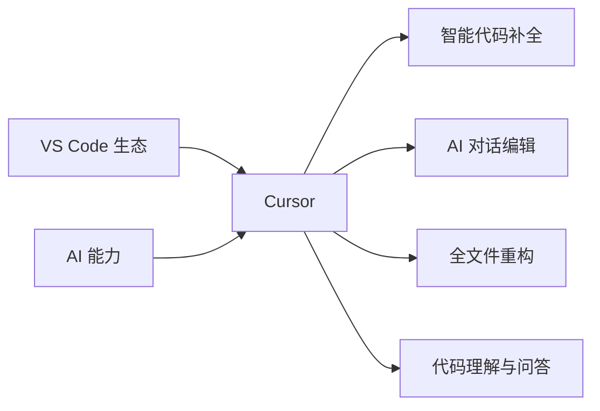
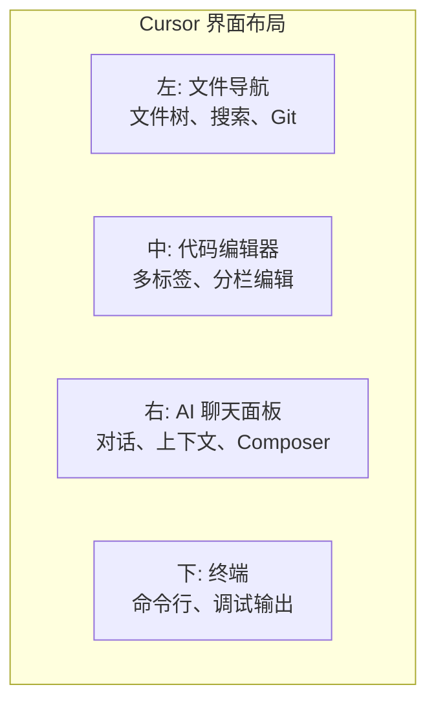

# 补充课01：Cursor精通

> 工欲善其事，必先利其器。Cursor 是 AI 编程时代的首选编辑器。

## 学习目标

- 理解 Cursor 是什么以及为什么选择它
- 掌握 Cursor 的安装、配置和界面布局
- 熟练使用 Cursor 的核心 AI 功能（Cmd+K、Chat、Tab补全）
- 学会配置 Cursor Rules 和 Privacy Mode
- 能够将 Cursor 真正融入日常开发工作流

---

## 1. Cursor 是什么



Cursor 是一款 **AI-first 的代码编辑器**。它基于 VS Code 分支开发，继承了 VS Code 的全部生态（扩展、主题、快捷键），同时在底层深度集成了 AI 能力。

简单来说：**Cursor = VS Code 的所有优点 + AI 的原生深度整合**。

### 与传统 AI 编程助手的区别

| 维度 | GitHub Copilot (VS Code插件) | Cursor |
|------|------------------------------|--------|
| 集成方式 | 插件加载 | 底层原生集成 |
| 上下文理解 | 当前文件 + 有限上下文 | 整个项目 + 多文件理解 |
| 编辑方式 | 行内补全 | Cmd+K 智能编辑、对话编辑 |
| 模型支持 | GPT / Claude 有限版本 | 多模型自由切换 |
| 自定义规则 | 有限 | Cursor Rules 强规则系统 |

> [!NOTE]
> 如果你之前用过 VS Code + Copilot，迁移到 Cursor 的成本几乎为零 — 快捷键、插件、设置全部兼容。

---

## 2. 安装和付费

### 下载安装

1. 访问 [Cursor 官网](https://cursor.com/) 下载对应系统版本
2. 支持 macOS、Windows、Linux
3. 安装后打开，会引导你导入 VS Code 的配置和插件

### 订阅方案

| 方案 | 价格 | 说明 |
|------|------|------|
| Hobby | 免费 | 每月 2000 次 AI 请求，适合体验 |
| Pro | $20/月 | 无限 AI 请求，推荐几乎所有开发者 |
| Business | $40/月/人 | 团队管理、集中计费 |

> [!TIP]
> 作为本课程学员，**Pro 订阅是强烈推荐的**。$20/月的投入带来的是数倍的效率提升。把它看作你开发工具的"生产力杠杆"。

---

## 3. 界面布局

Cursor 的界面可以分为四个主要区域：



| 区域 | 位置 | 用途 |
|------|------|------|
| 文件导航 | 左侧 | 文件树、全局搜索、Git 版本控制 |
| 代码编辑器 | 中央 | 编写代码的主区域，支持多标签页 |
| AI 聊天 | 右侧 | 与 AI 对话、管理上下文、Composer 工作流 |
| 终端 | 底部 | 运行命令、启动服务器、查看日志 |

### 布局调整

- 拖动分隔线调整各区域大小
- `Cmd+B` 切换左侧面板
- `Cmd+J` 切换底部面板

---

## 4. Cursor Rules 配置

Cursor Rules 是 Cursor 最强大的功能之一，它让你可以**为项目定义 AI 行为规则**。

### 规则文件位置

项目根目录下的 `.cursorrules` 文件：

```
my-project/
├── .cursorrules        # 全局规则
├── .cursor/            # 目录级别规则
│   └── rules/
│       └── frontend.mdc
├── src/
└── package.json
```

### 典型规则示例

```markdown
你是一个 Next.js 全栈开发者。请遵循以下规则:
- 使用 TypeScript 严格模式
- 组件使用函数式组件 + hooks
- 样式使用 Tailwind CSS
- API 路由使用 app router
- 错误处理使用 try-catch, 不要忽略错误
- 每次生成代码都要包含错误边界
```

### 规则编写建议

1. **明确身份角色**：告诉 AI 它是什么角色（Next.js 开发者、Python 数据工程师等）
2. **技术栈声明**：列出项目使用的框架、库、版本
3. **编码规范**：命名风格、文件组织、错误处理
4. **排除项**：告诉 AI 不要做什么（"不要使用 any，不要忽略错误"）

> [!TIP]
> 好的 Cursor Rules 就像给 AI 一个"入职手册"。花 10 分钟写好规则，AI 的输出质量会提升一个档次。

---

## 5. 模型选择

Cursor 支持多种 AI 模型，你可以在设置中切换：

| 模型 | 特点 | 适用场景 |
|------|------|----------|
| Claude 3.5 Sonnet | 编码能力强，推理清晰 | **主力推荐** |
| GPT-4o | 全面均衡 | 通用任务 |
| GPT-4o-mini | 快速响应 | 简单问题 |
| Cursor Small | Cursor 专用模型 | 快速补全 |

### 自定义模型

如果你的项目有特殊需求或合规要求，Cursor 支持：

- 使用自己的 API Key
- 连接企业内部的模型端点
- 配置不同的模型用于不同任务(编辑 vs 聊天)

---

## 6. Privacy Mode

代码隐私是很多开发者的担心点。Cursor 提供了 Privacy Mode:

**开启方法**:
设置 → Privacy → Enable Privacy Mode

**Privacy Mode 的效果**:
- 你的代码不会用于模型训练
- 数据传输加密
- 不会记录提示词和代码内容

> [!NOTE]
> 即使不开启 Privacy Mode，Cursor 默认也不会将你的代码用于训练。Privacy Mode 提供了额外的安心保障，特别适合商业项目。

---

## 7. Tab 补全

Tab 补全是 Cursor 最"日常"的 AI 功能 — 它在你打字时自动预测你接下来要写什么。

### 工作原理

```mermaid
flowchart LR
    A[打当前代码] --> B[AI 分析上下文]；    B --> C[预测下一步]
    C --> D[灰显示示预]
    D --> E{是否接受?}
    E -->|按 Tab| F[插入代码]
    E -->|继续打字| G[忽略预]
```

### 使用技巧

1. **不要等写完再改**：看到灰色示就可以按 Tab
2. **多行补全**：Cursor 能一次补全多行甚至整个函数
3. **跨文件补全**：基于项目上下文的补全比单文件更准确

---

## 8. 对比 VS Code

### Cursor 的优势

| 优势 | 说明 |
|------|------|
| AI 原生集 | 不是插件，是底层集成|
| 多文件上下文 | 理解整个项目结构 |
| 智能编辑 | Cmd+K 直接修改选中代码 |
| Composer | 多文件编辑工作流 |
| Cursor Rules | 高度自定义 AI 行为 |
| 模型切换 | 灵活选择最优模型 |

### Cursor 的局限

- **插件兼容性**：极少数 VS Code 插件可能不完全兼容
- **资源占用**：AI 功能需要更多内存
- **付费**：高级功能需要订阅
- **网络依赖**：AI 功能需要网络连接

### 切换建议

| 场景 | 推荐 |
|------|------|
| 日常开发 | Cursor |
| 竞赛/面试 | VS Code（更快、更轻）|
| 远程开发 | VS Code（Remote SSH 更成熟）|

> [!TIP]
> 不是二选一。**两个都装**，日常用 Cursor，需要轻量或远程时用 VS Code。两个编辑器共享配置和插件。

---

## 9. 核心快捷键

掌握这些快捷键，让你的 Cursor 使用效率翻倍：

| 快捷键 | 功能 | 熟练度 |
|--------|------|--------|
| `Cmd+K` | **智能编辑** — 选中代码后让 AI 修改 | 必会 |
| `Cmd+L` | **打开 AI 话** | 必会 |
| `Ctrl+Enter` | **全文件编辑** — 对整个文件进行 AI 编辑 | 高级 |
| `Cmd+I` | **Composer** — 多文件同时编辑工作流 | 高级 |
| `Cmd+Shift+L` | 在对话中引用当前文件 | 常用 |
| `Cmd+Enter` (对话中) | 提交问题 | 必会 |
| `Tab` | 接受 AI 补全 | 必会 |
| `Esc` | 拒绝 AI 补全/建议 | 必会 |

> [!TIP]
> 最值得花时间练习的是 **Cmd+K**。选中一段代码，按 Cmd+K，告诉 AI 你想怎么改 — 这是 Cursor 最核心的工作流。

---

## 10. 实战：配置你的第一个 Cursor 项目

### 步骤 1：安装并导入 VS Code 配置

1. 下载安装 Cursor
2. 首次启动时选择"Import from VS Code"
3. 等待配置导入完成

### 步骤 2：创建 Cursor Rules

在项目根目录创建 `.cursorrules` 文件：

```markdown
你是一个资深全栈开发者。规则如下:
- 代码优先考虑可读性和可维护性
- 遵循项目的现有风格和命名规范
- 添加必要的注释，但不要过度
- 每次修改前先理解现有代码结构
- 提供修改时同时给出解释
```

### 步骤 3：尝试核心功能

1. **Tab 补全**：在 JS/TS 文件中打字，体验 AI 预测
2. **Cmd+K 编辑**：选中一段代码，按 Cmd+K，输入"优化这段代码"
3. **Cmd+L 对话**：按 Cmd+L，问 AI"这个项目是做什么的"

<details>
<summary>练习：Cursor 快捷键速记表</summary>

| 场景 | 快捷键 | 作用 |
|------|--------|------|
| 修改一段代码 | `Cmd+K` | 最常用 |
| 问 AI 问题 | `Cmd+L` | 对话窗口 |
| 重写整个文件 | `Ctrl+Enter` | 全文件编辑 |
| 接受建议 | `Tab` | 不要犹豫 |
| 拒绝建议 | `Esc` | 干净利落 |

**记忆口诀**：K 改 L 问 Tab 接受，Ctrl+Enter 改全文。
</details>

<details>
<summary>练习：为常见项目类型编写 Cursor Rules 模板</summary>

**Next.js 项目**:
```markdown
你是一个 Next.js 全栈开发者。使用 App Router, TypeScript,
Tailwind CSS。组件优先考虑服务端组件，只在需要交互时使用客户端组件。
API 路由使用 Route Handler。数据库使用 Prisma ORM。
```

**Python 数据分析**:
```markdown
你是一个 Python 数据分析师。使用 pandas, numpy, matplotlib。
代码风格遵循 PEP 8。优先使用向量化操作而非循环。
可视化使用 matplotlib 或 seaborn。
```

**React Native 应用**:
```markdown
你是一个 React Native 开发者。使用 TypeScript。
样式使用 StyleSheet.create。导航使用 React Navigation。
状态管理使用 Zustand。确保组件在 iOS 和 Android 上都能正常工作。
```
</details>

---

## 总结

Cursor 是一个 AI-first 的编辑器，它为 AI 编程时代而生。你不需要完全掌握它的所有功能 —— **先从 Cmd+K 和 Cmd+L 开始**，然后逐步探索更高级的 Composer 和 Rules 功能。

关键要点回顾:
- Cursor = VS Code 生态 + 深度 AI 集成
- Cursor Rules 是"AI 行为说明书"，值得花时间配置
- `Cmd+K` 和 `Cmd+L` 是两个最核心的快捷键
- Privacy Mode 保护代码安全

### 下一步

掌握了编辑器，下一节课我们将走进 **Terminal** —— 另一个开发者的必备工具。会用终端的程序员和使用图形界面的程序员，效率差别可能达到 10 倍。