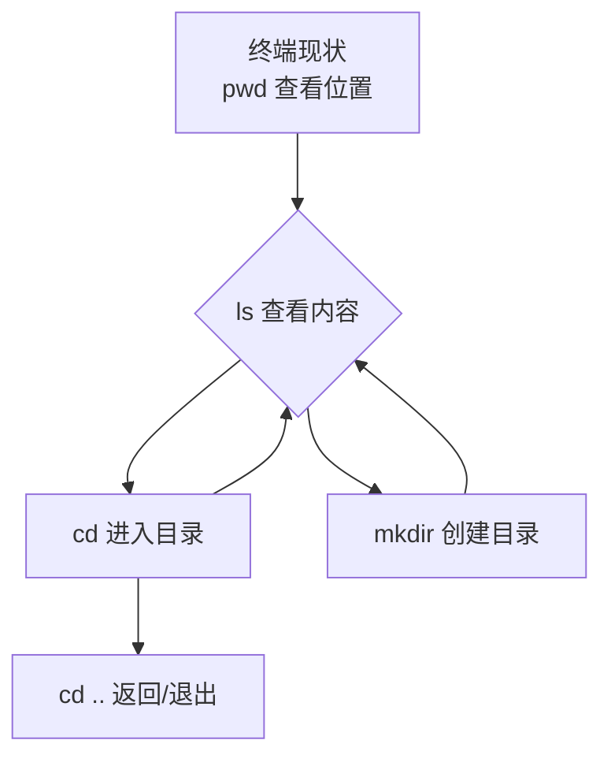
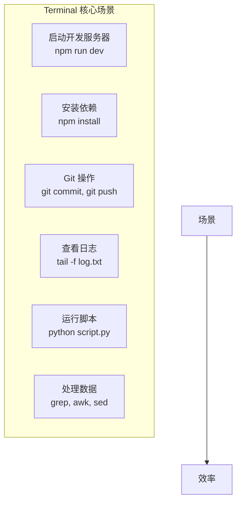

# 补充课02：Terminal基础

> 图形界面让你走得快，命令行让你走得远。

## 学习目标

- 理解 Terminal 是什么以及为什么需要它
- 掌握基本命令结构：`command [options] [arguments]`
- 熟练文件导航和文件操作核心命令
- 学会使用实用工具（grep, find, ps 等）
- 能够在 Cursor 中高效使用 Terminal

---

## 1. Terminal 是什么

Terminal（终费）是一个**用文字命令操作电脑**的界面。


当你点击鼠标操作电脑时，实际上是在让图形界面帮你"翻译"成命令。而 Terminal 让你**直接发送命令**，绕过了中间商。

### 图形界面 vs 命令行

| 操作 | 图形界面 | 命令行 |
|------|----------|----------|
| 创建文件夹 | 右键 → 新建文件夹 | `mkdir` |
| 查看文件 | 双击打开 | `cat 件名` |
| 复制文件 | 拖动 / Cmd+C+V | `cp 源件 目标` |
| 搜索内容 | Cmd+F (单文件) | `grep "内容" 文件` |
| 批量操作 | 手动一个个做 | 一行命令搞定 |

> [!NOTE]
> Terminal 不是 Cursor 或 VS Code 的专属功能。macOS 的"终端"、Linux 的 shell、Windows 的 PowerShell 都是 Terminal。它们是操作系统自带的。

---

## 2. 基本命令结构

所有命令都遵循一个通用结构：

```
command [options] [arguments]
```

| 部分 | 含义 | 示例 |
|------|--------|--------|
| `command` | 要执行的命令 | `ls, cd, mkdir` |
| `[options]` | 修改行为的选项 | `-l` (详情), `-a` (全部) |
| `[arguments]` | 操作对 | `ls /Users` |

### 组合使用示例

```bash
ls -la /Users
# ^^^ ^^^ ^^^^^^^^
# | | |
# 命令 选项 参数
```

> [!TIP]
> 大多数命令都支持 `--help` 查看帮助，或 `man` 查看详细手册。`man ls` 会显示 `ls` 命令的所有用法。

---

## 3. 文件导航

这是日常开发中使用频率最的命令：

### pwd — 我在哪

```bash
pwd
# 输出: /home/user/project
```

### ls — 看有什么

```bash
ls                    # 列出当前日录
ls -l                 # 详细信息（权限、大小、修改时间）
ls -a                 # 包括隐藏文件（以.开头的）
ls -la                # 两个选项组合
```

### cd — 去哪

```bash
cd Documents          # 进入 Documents 文件夹
cd ..                 # 返回上级目录
cd ~                  # 回家目录
cd -                 # 回上一步的目录
cd /project/logs        # 使用绝对路径
```

### mkdir — 创建目录

```bash
mkdir my-project     # 创建单个文件夹
mkdir -p a/b/c        # 递归创建多级目录
```



---

## 4. 文件操作

### touch — 创建文件

```bash
touch index.html      # 创建空文件
touch style.css       # 可以一次创建多个
```

### cat — 看内容

```bash
cat README.md         # 显示文件全部内面
cat file1.txt file2.txt # 合并显示多个文件
```

### cp — 复制

```bash
cp old.txt new.txt    # 复制文件
cp -r folder/ backup/  # 复制整个目录（-递归）
```

### mv — 移动/重命名

```bash
mv old.txt new.txt    # 重命名
mv file.txt ../backup/  # 移动文件
```

### rm — 删除

```bash
rm temp.txt                        # 删除文件
rm -r old-folder/                   # 删除目录（-递归）
rm -rf temp/                       # 强制删除（小心！）
```

> [!WARNING]
> `rm -rf` 是最危险命令之一。**不要** 在不确定时运行。它不会经过回收站，删除即消失。

| 操作 | 命令 | 文件 | 目录 |
|------|------|------|------|
| 创建 | `touch` | 是 | 否（用 `mkdir`） |
| 读取 | `cat` | 是 | 否 |
| 复 | `cp` | `cp a b` | `cp -r a b` |
| 移动/重命名 | `mv` | `mv a b` | `mv a b` |
| 删除 | `rm` | `rm a` | `rm -r a` |

---

## 5. 实用具

### grep — 搜索文件内容

```bash
grep "function" index.js          # 在文件中搜索关键字
grep -r "TODO" ./src/              # 递归搜索整个目录
grep -n "error" log.txt           # 显示行号
```

### find — 找文件

```bash
find . -name "*.js"              # 找所有 JS 文文件
find . -size +1M                   # 找大于 1MB 的文件
find . -mtime -7                  # 找最近7天修改的文件
```

### ps — 看进程

```bash
ps aux                            # 看所有运行中的进程
ps aux | grep node                 # 找 Node.js 进程（管道符 |）
```

### top — 系统监控

```bash
top                               # 实时资源占用
# 按 q 退出
```

### chmod — 改权限

```bash
chmod +x script.sh                # 添加可执行权限
chmod -R 644 ./*.                # 递归设置文件权限
```

> [!TIP]
> `|`（管道符）是 Terminal 最强大的概念之一。它将一个命令的输出传递给另一个命令作为输入：`cat log.txt | grep "rror"` 表示"读出 log.txt，然后过滤出包含 error 的行"。

---

## 6. 快捷键

高效使用 Terminal 的关键是**少敲击键**：

| 快捷键 | 作用 | 适用场景 |
|---------|--------|----------|
| `Tab` | **自动补全** | 最常用！补全文件名、命令 |
| `Ctrl+C` | 中断当前命令 | 程序卡死或运行太久 |
| `Ctrl+D` | 退出当前 shell | 退出终端或输入结束 |
| `Ctrl+A` | 光移到行首 | 快速回到命令开头 |
| `Ctrl+E` | 光移到行尾 | 快速回到命令结尾 |
| `Ctrl+U` | 清除当前行 | 输入错了重来 |
| `上/下箭头` | 浏览命令历史 | 重复执行之前的命令 |
| `Ctrl+R` | 搜索命令历史 | 找之前执行过的命令 |

> [!NOTE]
> 在 Terminal 中，`Ctrl+C` 不复制！复制用 `Cmd+C`。`Ctrl+C` 的中断功能优先级于复制（来自 Unix 传统）。

---

## 7. 实战：创建项目目录结构

### 目标

创建下面这个项目结构：

```
my-ecommerce/
├── src/
│ ├── components/
│ ├── pages/
│ └── utils/
├── public/
│ ├── images/
│ └── fonts/
├── tests/
└── package.json```

### 步骤

```bash
# 1. 创建主目
mkdir -p my-ecommerce

# 2. 进入目
cd my-ecommerce

# 3. 创建子目录（一次搞定）
mkdir -p src/components src/pages src/utils 
mkdir -p public/images public/fonts
mkdir tests

#4. 创建初始文件
touch package.json READEME.md .gitignore
```

<delails>

<summary>练习：常见场景命令组合</smary>

**场景 1：找代码中所有 TODO**

```bash
grep -rn "TODO" ./src/ --include="*,js"
```

**场景 2：找大文件**

```bash
find . -type f -size +10M -exec ls -lh {} \;```

**场场景 3：实时看日志**

```bash
tail -f log/server.log
# Ctrl+C 退出
```

**场景 4：批量重命名**

```bash
for file in *.txt; do
  mv "$file" "${file%.txt}.md"
done
```

**场景 5：统计代码行数**

```bash
find . -name "*.js" -o -name "*,tsx" | xargs wc -l
```
</details>

<details>
<summary>练习：常见错误排查</summary>

| 问题 | 可能原因 | 解决方法 |
|------|----------|----------|
| `command not found` | 命令名打错了 | 检查拼写 |
| `Permission denied` | 没权限 | 用 `chmod` 或 `sudo` |
| `No such file or directory` | 路径错了 | 用 `pwd` 和 `ls` 确认位置 |
| `command not found` 但有该软件 | 没在 PATH 中 | 检查安装和 PATH 设置 |

</details>

---

## 8. 为什么需要 Terminal

很多同学会问：**"我都有 Cursor 了，为什么还要学 Terminal？"**

原因很简单 — Terminal 是开发者的"底层能力"：



### 不学 Terminal 会遇到的问题

| 场景 | 图形界面 | Terminal |
|------|----------|----------|
| 启动项目 | 找按钮点 | `npm run dev` |
| 安装包 | 下载 → 拖入 | `npm install` |
| 看服务器日志 | 打开文件看 | `tail -f log` |
| 批量改文件 | 手动一个个改 | `sed -i 's/old/new/g' *.js` |
| Git提交 | 点按钮 | `git add . && git commit -m "msg"` |

> [!TIP]
> 你不需要成为 Terminal 专家。掌握 10 个左右的命令，就能覆盖 90% 的开发场景。随着使用增多，你会自然而然记住更多。

---

## 9. 在 Cursor 中使用 Terminal

Cursor 内置了Terminal，不需要切换到系统终端：

### 打开方式

- 快捷键：`` Ctrl+` ``（反引号）
- 菜单：View → Terminal

### Cursor 终端的优势

1. **与编辑器同屏**：不用切换窗口
2. **文件路径自动感知**：Terminal 自动在当前项目目录
3. **AI 助**：可以把 Terminal 错误信息直接复制到 AI 聊天
4. **多终端**：可以同时开多个（如一个跑服务器，一个做 Git 操作）

### 开发典型工作流

```bash
# 1. 在 Cursor 中打开 Terminal
# 2. 启动开发服务器
npm run dev

# 3. 在另一个终端做 Git
# 右键 → Split Terminal
git status
```

<details>
<summary>练习：你的一周开发 Terminal 工作流</summary>

**周一早上**：
```bash
cd projects/my-app
git pull
npm install   # 看看有没有新依赖
npm run dev    # 启动开始干活
```

**提交代码**：
```bash
git add .
git commit -m "feat: 添加用户认证功能"
git push
```

**排查问题**：
```bash
# 看服务器日志
tail -f logs/server.log

# 搜索错误
grep "Error" logs/server.log

#看进程
ps aux | greap node
```
</details>

---

## 总结

Terminal 是开发者的基本功。不一定要成为大师，但掌握基本命令能让效率提升一个档次。

关键要点回顾：
- **命令结构**：`command [options] [arguments]`
- **导航三剑客**：`pwd`（在哪）、`ls`（有什么）、`cd`（去哪）
- **文件五法**：`touch`、`cat`、`cp`、`mv`、`rm`
- **实用具**：`grep` 搜索、`find` 找文件、`ps` 看进程
- **快捷键**：`Tab` 自动补全最常用，`Ctrl+C` 中断

### 下一步

有了代码编辑器（Cursor）和命令行（Terminal），下一课我们做用 HTML 写出第一个网页。这是你编程之旅的真正第一步。