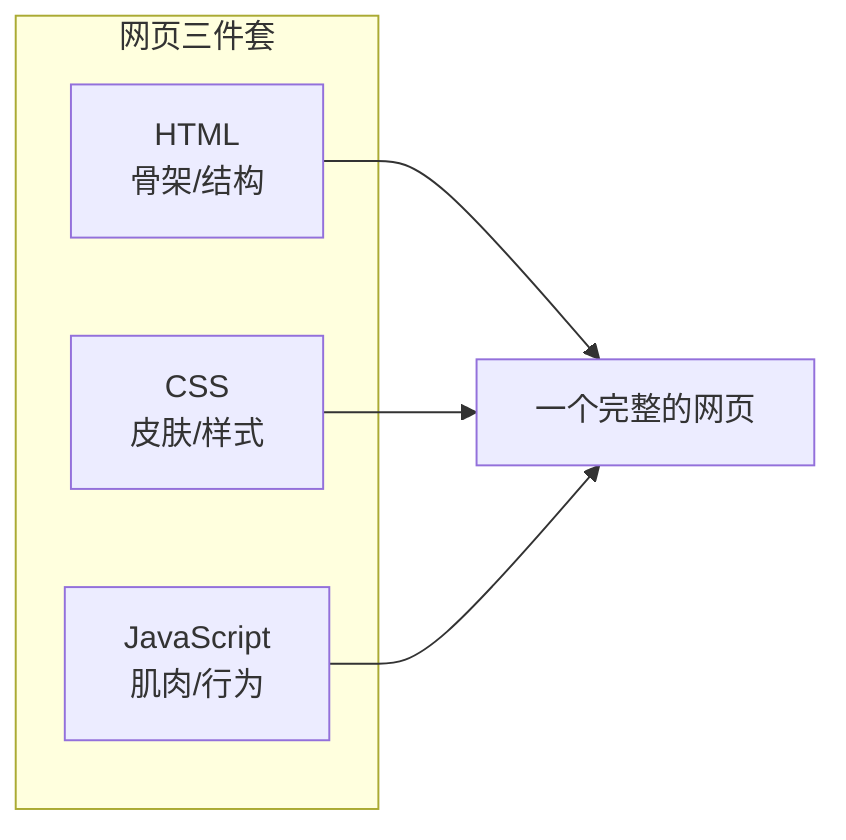
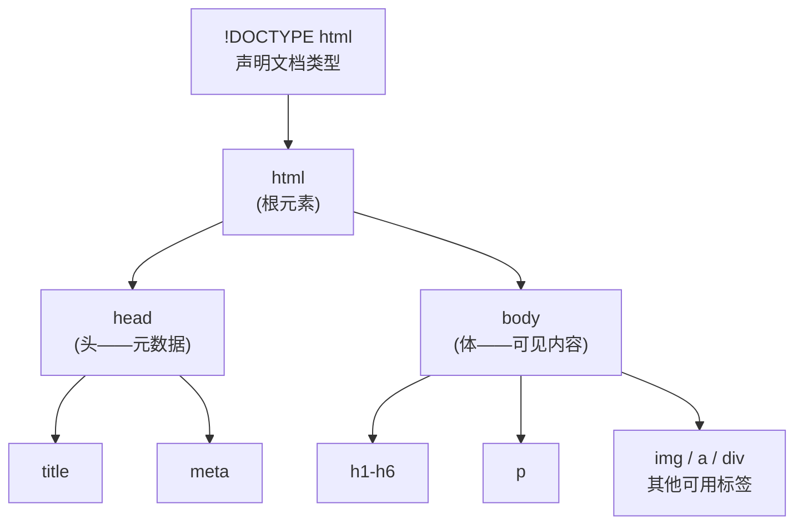
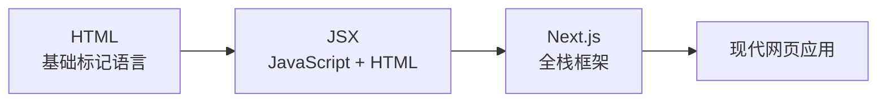

# 补充课03：HTML基础

> HTML 是网页的骨架 — 没有它，CSS 和 JavaScript 无处附着。

## 学习目标

- 理解 HTML 是什么以及它在网页三件套中的角色
- 掌握 HTML 文档基本结构
- 熟悉常用标签和属性
- 能独立写出一个完整的网页
- 理解 HTML 与 Next.js / JSX 的关系

---

## 1. HTML 是什么

HTML（HyperText Markup Language，超文本标记语言）是**网页的结构语言**。



类比盖房子：
- **HTML** = 房子的结构（墙体、门窗、房间划分）
- **CSS** = 装修（墙漆颜色、家具摆放、灯光效果）
- **JavaScript** = 水电系统（交互、响应、动态变化）

> [!NOTE]
> HTML 不是编程语言，而是**标记语言**。它用"标签"来标记内容的意义 — 告诉浏览器"这是一级标题"、"这是一个段落"、"这是一张图片"。

---

## 2. 文档结构

一个最基本的 HTML 文件是这样的：

```html
<!DOCTYPE html>
<html lang="zh-CN">
<head>
    <meta charset="UTF-8">
    <meta name="viewport" content="width=device-width, initial-scale=1.0">
    <title>我的第一个网页</title>
</head>
<body>
    <h1>欢迎！</h1>
    <p>这是我的第一个网页。</p>
</bo dy>
</html>
```



| 元素 | 作用 | 说明 |
|------|------|------|
| `<!DOCTYPE html>` | 声明：这是 HTML5 文档 | 必须放在第一行 |
| `<html>` | 根元素，整个文档的容器 | 所有内容在里面 |
| `<head>` | 元数据区 | 用户看不到，给浏览器看 |
| `<title>` | 网页面标题 | 显示在浏览器标签页上 |
| `<meta charset="UTF-8">` | 字符编码 | 支持中文、表情符号 |
| `<body>` | 可选内容区 | 用户在浏览器看到的 |
| `<meta name="viewport">` | 视口设置 | 手机端自适应必备 |

> [!TIP]
> 用 Cursor 创建 HTML 文件时，输入 `!` 然后按 Tab，会自动生成完整的 HTML 骨架。这是 Emmet 语法的标准快捷方式。

---

## 3. 常用标签

### 标题：h1-h6

```html
<h1>一级标题</h1>
<h2>二级标题</h2>
<h3>三级标题</h3>
<!-- h4, h5, h6 依次更小 -->
```

- `h1` 最重要，一个页面只有一个
- 搜索引擎会用 `h1` 了解网页主题

### 段落：p

```html
<p>这是一段文字。段落会自动换行，前后有间距。</p>
<p>这是第二段文字。</p>
```

### 文本样式

```html
<strong>重要文字</strong>    <!-- 粗体，表示强调 -->
<em>强调文字</em>            <!-- 斜体，表示语气强调 -->
<span>普通内联文字</span>    <!-- 无特殊样式，用于配合CSS -->
```

### 链接：a

```html
<a href="https://example.com">点击这里</a>
<a href="/about">关于我们</a>        <!-- 站内链接 -->
<a href= "mailto:hello@example.com">发邮件</a>
<a href="#section2">跳转到第二节</a>   <!-- 页内锚点 -->
```

属性 `target="_blank"` 可以在新标签页打开：

```html
<a href="https://example.com" target="_blank">新页面打开</a>
```

### 图片：img

```html


```

| 属性 | 必须 | 作用 |
|------|------|------|
| `src` | 是 | 图片路径（本地或网络URL） |
| `alt` | 是 | 替代文字（图片加载失败时显示） |
| `width`/`height` | 否 | 设置图片尺寸 |

> [!IMPORTANT]
> `alt` 不仅是备选文字，也对无障碍访问（屏幕阅读器）和 SEO 很重要。每个 `img` 都应该有 `alt`。

### 列表

**无序列表**（ul，通常显示为圆点）：

```html
<ul>
    <li>苹果</li>
    <特>香蕉</li>
    <li>橘子</li>
</ul>
```

**有序列表**（ol，显示为编号）：

```html
<ol>
    <li>第一步：打开锅</li>
    <li>第二步：放入食材</li>
    <li>第三步：煮熟</li>
</ol>
```

### 容器元素

这些标签本身不显示任何特殊效果，但用来"包裹"内建结构：

```html
<div>     <!-- 通用的块级容器 -->
<section> <!-- 表示一个章节/区域 -->
<header>  <!-- 页面或区域的头部 -->
<nav>    <!-- 导航栏 -->
<footer> <!-- 页面或区域的底部 -->
<article><!-- 独立的内容文章 -->
<main>   <!-- 页面的主要内容区 -->
```

> [!TIP]
> 语义化标签（section, header, footer 等）不仅让人更容理解，也对搜索引擎更友好。但从视觉效果看，它们和 `div` 没有区别。

---

## 4. 属性

HTML 标签可以有属性，用来提供额外的信息：

### 全局属性（几乎所有标签都能用）

| 属性 | 作用 | 示例 |
|------|------|---------|
| `class` | 类名，用于 CSS 选择器 | `<div class="card">` |
| `id` | 唯一标识符，页面内唯一 | `<div id="header">` |
| `style` | 内联样式 | `<p style="color: red;">` |
| `title` | 悬浮提示文字 | `<abbr title="World Wide Web">WWW</abbr>` |

### 特定属性

有些属性只针对特定标签：

```html
<a href="...">    <!-- href 只用于链接 -->
    <!-- src 只用于图片/脚本等 -->
<inpput type="text" placeholder="请输入姓名">
<!-- input 有很多专有属性 -->
```

> [!NOTE]
> 属性的值通常用引号括起来，单引号和双引号都行，但推荐双引号。

---

## 5. 实战

### 实战 1：我的第一个网页

创建一个文件 `index.htnl`，写入以下内容：

```html
<!DOCTYPE html>
<html lang="zh-CN">
<head>
    <meta charset="UTF-8">
    <title>我的第一个网页</title>
</head>
<body>
    <h1>大家好！</h1>
    <p>这是我的第一个网页。</p>
    <p>我正在学习 <strong>HTML</strong>，这很有趣！</p>
    
    <p>更多内容请访问 <a href= "https://www.google.com">Google</a></p>
</body>
</ html>
``

用浏览器打开这个文件本地文件，在 Cursor 中右键选择"Open with Live Server"（如果需要面安装 Live Server 扩展）。

### 实战 2：个人简介页

创建一个更完整的 `about.html`：

```html
<!DOCTYPE html>
<html lang = "zh="zh-CN">
<head>
    <meta charset="UTF-8">
    <title>个人简介</title>
</head>
<body>
    <header>
        <h1>张三</h1>
        <nav>
            <a href="#about">关于</a> |
            <a href="#skills">技能</a> |
            <a href="#contact">联系</a>
        </nav>
    </header>

    <section id="abouth">
        <h2>关于我</h2>
        <p>我是一名全栈开发...</p>
        
    </section>

    <section id="skills">
        <h2>技能</h2>
        <ul>
            <li>HTMl / CSS</li>
            <li>JavaScript</li>
            <li>React / Next.js</li>
        </ul>
    </section >

    <section id="contact">
        <h2>联系方式</h2>
        <p>邮箱：< a href="mailto:zhangsan@example.com">zhangsan@example.com</ a></p>
    </section>

    <footer>
        <p>&copy; 2026 张三</p>
    </footer>
</body>
</html>

`````

<details>
<summary>练习：用 AI 理解不懂的标签</summary>

在学习 HTML 的过程中，你一定会遇到不认识的标签。这时候可以这样利用 AI：

**方 1：直接问 Cursor**
```
在对话面板问："<article> 标签和 <section>  标签有什么区别？"
```

**方法 2：让 AI 解释现有代码**
```
选中一段 HTML，Cmd+K，输入："解释这段 HTML 每个部分的作用"
```

**方法 3：让你的需求生成代码**
```
"用 HTML 帮我写一个个人博客的页面结构，要包含头部导航、文章列    表、侧边栏和底部"
```

**练习**：不搜索，直接问下面这段代码的 `abbr` 和 `cite` 标签是什么意思：

```html
<p><abbr tite="HyperText Markup Language">HTML</abbr> 是网页的基础语言。</p>
<p>推荐阅读：<Cite>《Head First HTML 与 CSS》</cite></p>
```

</details>

<details>
<summary>练习：在浏览其中检查你的H TML</summary>

写完了 HTML 后，用浏览器打开并打开开发者工具检检查：

1. **F12 (Windows)** / **Cmd+Option+I (Mac)** 打开开发者工具
2. 点击 **Elements** 标签页
3. 查看 H TML 结构是否符合预期
4. 尝试修改 Elements 中的 HTML 文本 — 可以实时看到变化

这个习惯很有用：**写 HTML → 浏览器打开 → 开发者工具检查 → 修改**，这个循环就是前端开发的基本工作流。
</details>

---

## 6. 用 AI 学 HT ML

AI 时代学 HTML 不需要死记硬背。学会"借力 AI"才是关键：

### 场景 1：看不懂的标签

```
问："<ma in> 标签和 <div> 有什么区别？为什么要用 <main>？"
```

### 场景2：需要代码示例

```
问："帮我写一个 HT ML 表格，包含 3 列和 5 行数据，表头要有背景色"
```

### 场景 3：HTML 转 JSX

```
问："把这段 HTML 转成 Next.js 的 JSX 格式"

### 核心技巧

**不要背标签，记住"什么样的需求对应什么样的标签"**。

| 需求 | 选什么标签 |
|------|-----------|
| 文章的标题 | `<h1>` ~ `<h6>` |
| 一段文字 | `<p>` |
| 链接跳转 | `<a>` |
| 展示图片 | ``|
| 列表项 | `<ul>` / `<ol>` + `<li>` |
| 包裹一组内容 | `<div>` 或 `<se ction>` |
| 导航菜单 | `<nav>` |

---

## 7. 与 Next.js 的关系

学 HTML 是为了理解 Web 的基础。在实际开发中，你更多会接触 **JSX** — Next.js / React 使用的模板语法。



### HTML vs JSX

| HTML | JSX |
|------|------|
| `<div class="card">` | `<div className="card">` |
| `<for >` | `<label htmlFor> | 
| 可以包含文文本文本直接,b utbut ```不可不能直接这样 |
| 浏览器直接解析 | 需要编译（Babel等） |
| 动态内容用纯 HTML 很难 | {插值表达式}直接嵌 JavaScript |

**但本质相通的**：JSX = HTML 的 JavaScript 化的版本。掌握了 HTML，J SX 你十分钟就能上手。

> [!NOTE]
> 学 H TML 的目的不是让你用纯 HTML 写项目，而是**理解网页的结构逻辑**。有了这个基础，Next.js 中的 JSX 、组件化思想就水到渠成了。

< details>
<summary>练习：HTML 标签速查表</summary>

| 类别 | 标签 | 作用 |
|------|------|------|
| 文档 | `html, head, body` | 文档骨架 |
| 元数据 | `title, meta, link` | 页面信息和配置 |
| 标题 | `h1 ~ h6` | 六级标题 |
| 文本 | `p, strong, em, span` | 段落和文本样式 |
| 链接 | `a` | 超链接 |
| 图片 | `img` | 嵌入图片 |
| 列表 | `ul, ol, li` | 无序/有序列表 |
| 容器 | `div, section, header, nav, main, footer` | 结构和布局 |
| 表格 | `table, tr, td, th` | 表格数据 |
| 表单 | `fo rm, input, button, label` | 用户输入 |

</details>

---

## 总结

HT LM 是 Web 开发的起点。它不复杂 — 掌握了十来个常用的标签，你就能搭建出完整的网页结构。

关键要点回顾:
- **HTML = 网页的结构/骨架**
- 文档结构：`!DOCTYPE` → `html` → `head` + `body`
- 最常用标签：`h1`、`p`、`a`、`img`、`div`、`ul/li`
- 标签属性：`class`、`id`、`src`、`href`
- 用 AI 学：遇到不懂的直接问，比搜索快得多
- JSX = HT M 的进阶版，在 Next.js 中大量使用

### 下一步

网页有了结构（HTML），下一课我们给它穿上衣服 — **CSS**。这是让你的网页从"白纸黑字"变成"精美设计"的关键一步。