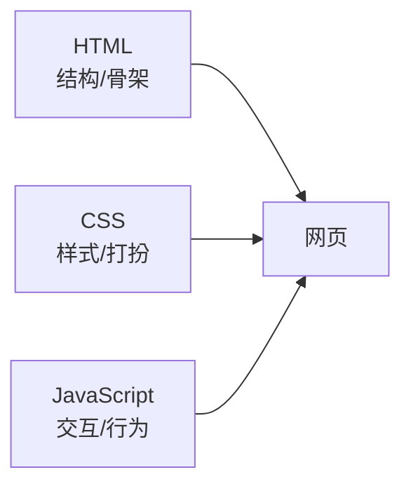
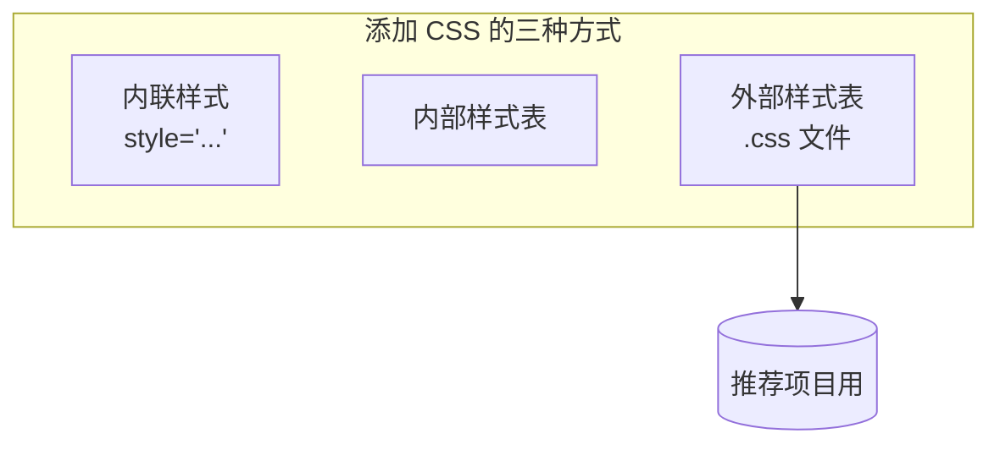
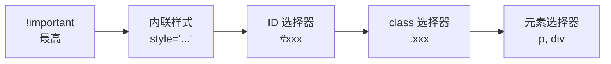
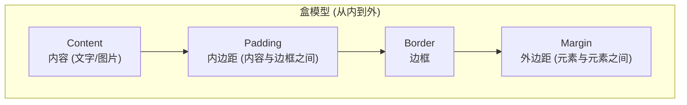
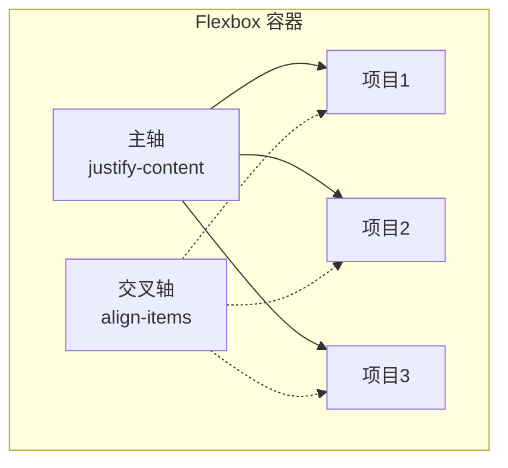
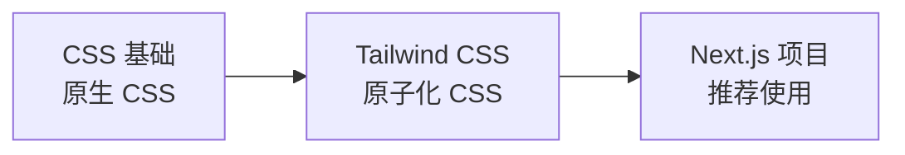

# 补充课04：CSS基础

> HTML 是素颜的你，CSS 是化了妆的你 — 还是你，但好看多了。

## 学习目标

- 理解 CSS 是什么以及它在网页三件套中的角色
- 掌握三种添加 CSS 的方式
- 熟练使用常用选择器
- 理解盒模型（最重要概念之一）
- 掌握 Flexbox 基础布局
- 能够用 AI 辅助学习和修改 CSS

---

## 1. CSS 是什么

CSS（Cascading Style Sheets，层叠样式表）是网页的**样式语言**。



更直观的类比：

| 概念 | 类比 | CSS 对应 |
|------|------|----------|
| HTML | 毛坯房的结构 | 墙体、门窗位置 |
| CSS | 装修设计 | 墙漆颜色、家具样式、灯光 |
| JavaScript | 智能家居系统 | 自动开关灯、响应门铃 |

> [!NOTE]
> CSS 的"层叠"（Cascading）意味着多条样式规则可以叠加生效。后面的规则会覆盖前面的，更具体的选择器会覆盖更通用的。

---

## 2. 三种添加 CSS 的方式

### 方式一：内联样式（Inline）

直接在 HTML 标签的 `style` 属性中写 CSS：

```html
<p style="color: blue; font-size: 18px;">这段文字是蓝色的</p>
```

**特点**：
- 只作用于当前标签
- 优先级最高（会覆盖其他样式）
- 不利于维护，不推荐大量使用

### 方式二：内部样式表（Internal）

在 HTML 的 `<head>` 中用 `<style>` 标签：

```html
<head>
    <style>
        p {
            color: blue;
            font-size: 18px;
        }
    </style>
</head>
```

**特点**：
- 只作用于当前页面
- 适合单页面或临时测试

### 方式三：外部样式表（External）【推荐】

单独的 `.css` 文件，通过 `<link>` 引入：

```html
<head>
    <link rel="stylesheet" href="style.css">
</head>
```

```css
/* style.css */
p {
    color: blue;
    font-size: 18px;
}
```

**特点**：
- 多个页面可共享同一个 CSS 文件
- 便于维护和缓存
- **最推荐的方式**



---

## 3. 选择器

选择器告诉浏览器"哪些元素应用这些样式"。

### 元素选择器

选中所有同类型的元素：

```css
h1 {
    color: navy;
}  /* 所有 h1 标题 */
p {
    line-height: 1.6;
}  /* 所有段落 */
```

### class 选择器（.xxx）

选中所有带有特定 class 的元素，**可重复使用**：

```css
.card {
    border: 1px solid #ddd;
    padding: 16px;
}  /* 所有 class="card" 的元素 */

.highlight {
    background-color: yellow;
}  /* 所有 class="highlight" 的元素 */
```

```html
<div class="card">...</div>
<div class="card highlight">...</div>  <!-- 可以同时有多个 class -->
```

### ID 选择器（#xxx）

选中带有特定 id 的元素，**页面中唯一**：

```css
#header {
    background-color: #333;
    color: white;
}  /* id="header" 的元素（只能有一个） */
```

```html
<header id="header">...</header>
```

### 后代选择器

选中某个元素内部的所有符合条件元素：

```css
.card p {
    color: gray;
}  /* 所有在 .card 内部的 p 元素 */

nav a {
    text-decoration: none;
}  /* nav 内部的所有链接 */
```

### 选择器优先级



| 选择器 | 示例 | 权重 |
|--------|------|------|
| !important | `color: red !important;` | 最高，慎用 |
| 内联样式 | `style="color: red"` | 很高 |
| ID 选择器 | `#header` | 强 |
| class 选择器 | `.card` | 中 |
| 元素选择器 | `p` | 弱 |

> [!TIP]
> 写 CSS 时尽量用 class 选择器。ID 选择器太"精确"不灵活，元素选择器又太"宽泛"容易误伤。class 是最好的平衡。

---

## 4. 盒模型

盒模型是 CSS **最重要的概念**，没有之一。

每个 HTML 元素在浏览器中都是一个"盒子"：



### 直观示例

```css
.box {
    width: 200px;
    padding: 20px;       /* 内容到边框的距离 */
    border: 2px solid black;  /* 边框 */
    margin: 30px;        /* 边框到其他元素的距离 */
}
```

| 属性 | 作用 | 理解 |
|------|------|------|
| `width` / `height` | 内容区宽高 | 装东西的区域 |
| `padding` | 内边距 | 盒子内部的"泡沫填充" |
| `border` | 边框 | 盒子的壁 |
| `margin` | 外边距 | 盒子之间的"距离" |

### 简写规则

```css
/* 四个方向分别设置 */
padding-top: 10px;
padding-right: 20px;
padding-bottom: 10px;
padding-left: 20px;

/* 简写：上 右 下 左（顺时针） */
padding: 10px 20px 10px 20px;

/* 更简写：上下一样 左右一样 */
padding: 10px 20px;

/* 四个方向一样 */
padding: 10px;
```

> [!IMPORTANT]
> `margin` 有一个特殊现象叫**外边距折叠**：上下两个相邻元素的外边距不会叠加，而是取最大值。新手常在这里困惑。

<details>
<summary>练习：修改盒模型看效果</summary>

给下面的 HTML 添加不同的 CSS，观察盒模型变化：

```html
<div style="background: lightblue; width: 200px;">
    这是内容
</div>
<div style="background: lightgreen;">
    相邻元素
</div>
```

**尝试**：
1. 给第一个 div 加 `padding: 30px` — 内容区变大
2. 再加 `border: 5px solid red` — 边框出现
3. 再加 `margin: 40px` — 间距拉开
4. 在浏览器开发者工具的 **Computed** 标签页查看盒模型可视化

**关键理解**：元素的实际宽高 = content + padding + border（标准盒模型）。

如果希望 `width` 包含 padding 和 border：
```css
box-sizing: border-box;  /* 推荐！让宽高包含 padding 和 border */
```
</details>

---

## 5. Flexbox 布局

Flexbox 是 CSS 中最常用的布局方式，可以轻松实现水平和垂直居中、等分排列等常见需求。

### 核心概念

```css
.container {
    display: flex;           /* 开启 flex 布局 */
    justify-content: center; /* 水平方向对齐 */
    align-items: center;     /* 垂直方向对齐 */
}
```



### justify-content（主轴方向对齐）

| 值 | 效果 |
|------|---------|
| `flex-start` | 左对齐（默认） |
| `flex-end` | 右对齐 |
| `center` | 居中 |
| `space-between` | 两端对齐，间隔相等 |
| `space-around` | 每个项目左右间隔相等 |
| `space-evenly` | 所有间隔完全相等 |

### align-items（交叉轴方向对齐）

| 值 | 效果 |
|------|---------|
| `stretch` | 拉伸填满（默认） |
| `flex-start` | 顶部对齐 |
| `flex-end` | 底部对齐 |
| `center` | 垂直居中 |

### 实战示例：导航栏

```html
<nav style="
    display: flex;
    justify-content: space-between;
    align-items: center;
    padding: 16px;
    background: #333;
    color: white;
">
    <div class="logo">我的网站</div>
    <div style="display: flex; gap: 20px;">
        <a href="#">首页</a>
        <a href="#">关于</a>
        <a href="#">联系</a>
    </div>
</nav>
```

> [!TIP]
> Flexbox 最常见的三个场景：
> 1. 水平居中：`display: flex; justify-content: center;`
> 2. 垂直居中：`display: flex; align-items: center;`
> 3. 完全居中：`display: flex; justify-content: center; align-items: center;`

---

## 6. 颜色和字体

### 颜色

```css
/* 颜色名称 */
color: red;
background-color: lightblue;

/* 十六进制 (最常用) */
color: #ff0000;    /* 红 */
color: #333;       /* 深灰（简写） */
color: #00aaff;

/* RGB */
color: rgb(255, 0, 0);       /* 红 */
color: rgba(255, 0, 0, 0.5); /* 半透明红 */

/* HSL (更直观的调色) */
color: hsl(0, 100%, 50%);    /* 红 */
```

### 字体

```css
font-size: 16px;           /* 字体大小 */
font-family: Arial, sans-serif;  /* 字体（备选多个） */
font-weight: bold;         /* 粗细 */
font-style: italic;        /* 斜体 */
text-align: center;        /* 文本对齐 */
line-height: 1.6;          /* 行高 */
color: #333;               /* 文字颜色 */
```

---

## 7. 实战：名片卡片制作

把 HTML 和 CSS 结合起来，制作一个"个人名片"：

```html
<!DOCTYPE html>
<html lang="zh-CN">
<head>
    <meta charset="UTF-8">
    <title>名片卡片</title>
    <style>
        /* 全局重置 */
        * {
            margin: 0;
            padding: 0;
            box-sizing: border-box;
        }

        body {
            font-family: 'Helvetica', Arial, sans-serif;
            background: #f0f2f5;
            display: flex;
            justify-content: center;
            align-items: center;
            min-height: 100vh;
        }

        .card {
            width: 340px;
            background: white;
            border-radius: 16px;
            padding: 32px;
            text-align: center;
            box-shadow: 0 4px 20px rgba(0,0,0,0.1);
        }

        .avatar {
            width: 100px;
            height: 100px;
            border-radius: 50%;
            margin-bottom: 16px;
        }

        .name {
            font-size: 24px;
            font-weight: bold;
            color: #333;
            margin-bottom: 4px;
        }

        .title {
            font-size: 16px;
            color: #666;
            margin-bottom: 16px;
        }

        .desc {
            font-size: 14px;
            color: #888;
            line-height: 1.6;
            margin-bottom: 24px;
        }

        .btn {
            display: inline-block;
            padding: 10px 24px;
            background: #0070f3;
            color: white;
            border-radius: 8px;
            text-decoration: none;
            font-size: 14px;
        }

        .btn:hover {
            background: #0050b3;
        }
    </style>
</head>
<body>
    <div class="card">
        
        <div class="name">张三</div>
        <div class="title">全栈开发者</div>
        <div class="desc">
            热爱编程和设计，专注于 Web 开发。<br>
            擅长 React、Next.js 和 Node.js。
        </div>
        <a class="btn" href="#">联系我</a>
    </div>
</body>
</html>
```

<details>
<summary>练习：修改卡片样式</summary>

基于上面的名片卡片代码，尝试以下修改：

1. 把卡片背景改成渐变色：`background: linear-gradient(135deg, #667eea, #764ba2);`
2. 把按钮改为圆角更大：`border-radius: 20px;`
3. 添加卡片悬浮效果：
   ```css
   .card:hover {
       transform: translateY(-4px);
       box-shadow: 0 8px 30px rgba(0,0,0,0.15);
   }
   ```
4. 把头像改成圆形边框：`border: 4px solid #0070f3;`

**提示**：在浏览器开发者工具中修改 CSS 是学习的好方法 — 修改实时生效，不满意就改回来。
</details>

---

## 8. 用 AI 学 CSS

CSS 属性多、组合变化多，AI 可以大幅加速学习：

### 场景 1：截图让 AI 分析样式

```
截图 → Cmd+L → 问："分析这个页面的 CSS，包括颜色、字体、布局方式"
```

### 场景 2：描述需求让 AI 写 CSS

```
"我想要一个卡片，阴影柔和，圆角 12px，分成左右两栏，左边是图片右边是文字"
```

### 场景 3：修改需求让 AI 改 CSS

```
"把这个按钮改成渐变背景，悬浮时颜色加深"
```

### 场景 4：调试布局问题

```
"为什么我的三个子元素没有在一行显示？父元素已经设置了 display: flex"
```

> [!TIP]
> 在 Cursor 中写 CSS 时，可以直接在 CSS 文件中打字，AI 的 Tab 补全会根据上下文给出建议。这是学习 CSS 最快的方式 — 不需要记所有属性，让 AI 辅助，你负责判断效果好不好。

---

## 9. 与 Tailwind CSS 的关系

现在的 Web 开发中，**Tailwind CSS** 已经成为了主流选择。



### 原生 CSS vs Tailwind CSS

| 原生 CSS | Tailwind CSS |
|----------|--------------|
| 需要写类名 → 写样式 | 直接用预定义的 class |
| `.card { padding: 16px; ... }` | `class="p-4 rounded-lg shadow"` |
| 需要切换文件 | 在 HTML 直接写 |
| 自由但容易失控 | 有约束但一致性高 |
| 手动起名字 | 不需要起名字 |

### Tailwind 示例

```html
<!-- 原生 CSS -->
<div class="card">内容</div>
<!-- 需要去 .card { padding: 16px; border-radius: 8px; ... } -->

<!-- Tailwind CSS -->
<div class="p-4 rounded-lg shadow-md bg-white">内容</div>
<!-- 不需要额外写 CSS！ -->
```

> [!NOTE]
> 为什么要先学原生 CSS？因为 Tailwind 本质上是"缩写版 CSS"。`p-4` 对应 `padding: 16px`，`rounded-lg` 对应 `border-radius: 8px`。懂原生 CSS 才能真灵活运用 Tailwind。下一课会专门讲 Tailwind CSS。

<details>
<summary>练习：CSS 速查表</summary>

| 类别 | 属性 | 常用值举例 |
|------|------|-----------|
| 文本颜色 | `color` | `red`, `#333`, `rgb(0,0,0)` |
| 背景 | `background` | `white`, `#f0f0f0`, `linear-gradient(...)` |
| 字体大小 | `font-size` | `16px`, `1.2rem` |
| 字体粗细 | `font-weight` | `normal`, `bold`, `600` |
| 内边距 | `padding` | `16px`, `10px 20px` |
| 外边距 | `margin` | `0 auto`（水平居中） |
| 边框 | `border` | `1px solid #ddd` |
| 圆角 | `border-radius` | `8px`, `50%` |
| 阴影 | `box-shadow` | `0 2px 8px rgba(0,0,0,0.1)` |
| 弹性布局 | `display: flex` | + `justify-content` + `align-items` |
| 宽度 | `width` | `100%`, `200px`, `auto` |
| 高度 | `height` | `100vh`（全屏高） |

</details>

---

## 总结

CSS 让网页从"毛坯"变成"精装"。你不需要记住所有 CSS 属性 — **理解核心概念，让 AI 辅助写具体代码**。

关键要点回顾：
- CSS = 网页的样式/打扮，放在 `.css` 文件中
- 推荐**外部样式表**，通过 `<link>` 引入
- **class 选择器**（`.xxx`）是最常用、最灵活的选择器
- **盒模型**是 CSS 的核心：content → padding → border → margin
- **Flexbox** 处理布局，`justify-content` + `align-items` 解决大多数需求
- 用 AI 辅助：截图分析、描述需求、修改调试
- 先学 CSS 基础，再学 Tailwind CSS

### 下一步

CSS 基础学完，你已经掌握了网页的结构（HTML）和样式（CSS）。下一课我们将进入 **Tailwind CSS** — 现代 Web 开发的首选样式方案，也是本课程项目中使用的方式。