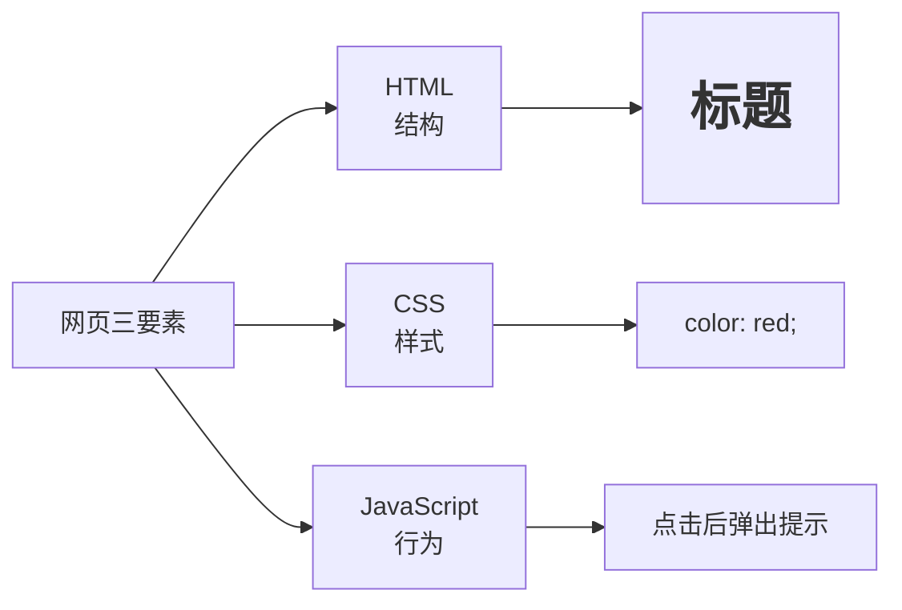
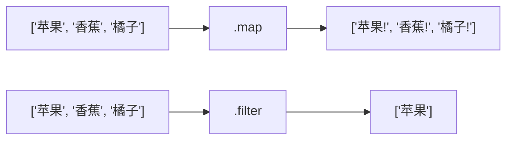
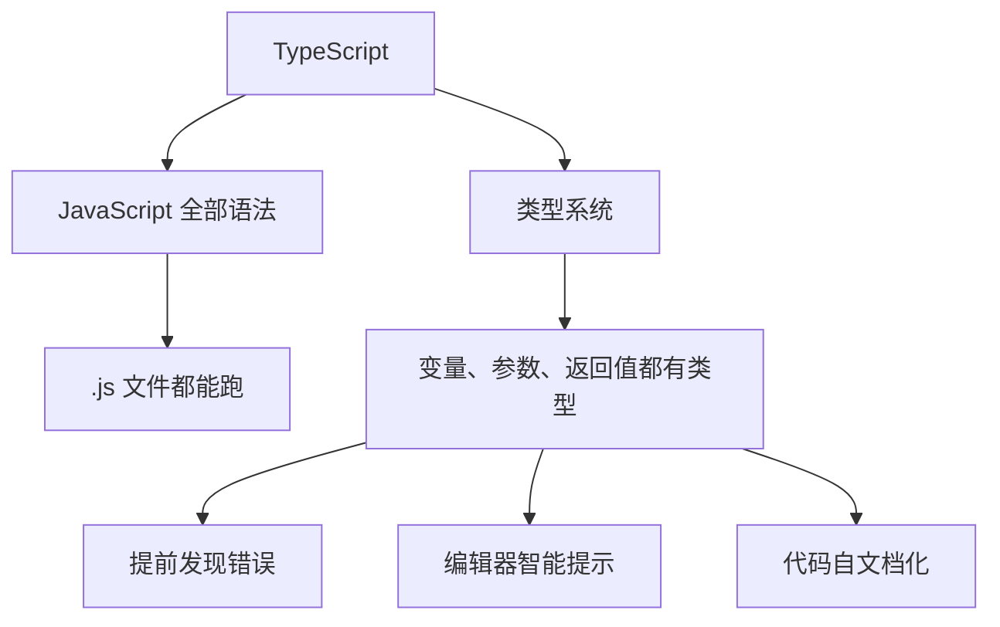

# 补充课05：JavaScript和TypeScript

> **JavaScript 让网页"动起来"，TypeScript 让 JavaScript"更可靠"。**

在之前的课程中，你看到 Next.js 项目里全是 `.tsx` 和 `.ts` 文件。它们是什么？和 JavaScript 有什么关系？这一课，我们一次性讲清楚。

---

## 1. JavaScript 是什么？

**JavaScript（简称 JS）** 是网页的"行为"语言。HTML 负责结构，CSS 负责样式，JavaScript 负责交互。



| 语言 | 角色 | 比喻 |
|------|------|------|
| **HTML** | 结构 | 房子的骨架和墙壁 |
| **CSS** | 样式 | 房子的装修和配色 |
| **JavaScript** | 行为 | 房子的灯光、门锁、智能设备 |

没有 JavaScript 的网页是"死的"——点击按钮没反应，数据不会刷新，动画不会动。

---

## 2. 变量：let 和 const

在 JavaScript 中，变量用来存储数据。

```javascript
// const —— 常量，一旦赋值不能改（推荐优先使用）
const name = "小明";
// name = "小红"; // 报错！const 不能重新赋值

// let —— 变量，可以重新赋值
let age = 18;
age = 19; // OK

// var —— 旧式变量声明（不要用）
var oldWay = "过时了"; // 不要用 var！
```

### 用 const 还是 let？

| 情况 | 用哪个 | 举例 |
|------|--------|------|
| 值不会变 | **const** ✅ | 用户ID、API地址、配置 |
| 值会变 | **let** ✅ | 计数器、循环变量、累加器 |
| 任何情况 | **var** ❌ | 不要用 |

> [!TIP]
> **最佳实践：默认用 const，只有当确定需要重新赋值时才用 let。** 99% 的场景用 const 就够了。

---

## 3. 数据类型

JavaScript 的数据类型其实很简单，记住常用的几种就行：

```javascript
// 字符串（String）—— 文本
const name = "小明";
const greeting = `你好，${name}！`; // 模板字符串（推荐）

// 数字（Number）—— 整数和小数
const count = 42;
const price = 19.99;

// 布尔值（Boolean）—— 是/否
const isActive = true;
const isAdmin = false;

// 数组（Array）—— 列表
const fruits = ["苹果", "香蕉", "橘子"];
const numbers = [1, 2, 3, 4, 5];

// 对象（Object）—— 键值对集合
const user = {
  name: "小明",
  age: 18,
  isActive: true
};
```

### template string 模板字符串

用反引号 `` ` `` 包裹，可以用 `${}` 嵌入变量：

```javascript
// 旧方式（字符串拼接）
const msg1 = "你好，" + name + "，你今年" + age + "岁了";

// 新方式（模板字符串）—— 推荐！
const msg2 = `你好，${name}，你今年${age}岁了`;
```

---

## 4. 函数

函数是"可重复使用的代码块"。

### 传统函数

```javascript
function greet(name) {
  return `你好，${name}！`;
}

const result = greet("小明");
console.log(result); // "你好，小明！"
```

### 箭头函数（推荐）

```javascript
// 箭头函数 —— 更简洁
const greet = (name) => {
  return `你好，${name}！`;
};

// 如果只有一行，可以省略 return 和花括号
const greet = (name) => `你好，${name}！`;

// 如果只有一个参数，可以省略括号
const double = n => n * 2;
```

### 函数参数默认值

```javascript
const greet = (name = "朋友") => `你好，${name}！`;

greet();      // "你好，朋友！"
greet("小红"); // "你好，小红！"
```

### 对比

| 特性 | 传统 function | 箭头函数 |
|------|-------------|---------|
| 语法 | 冗长 | 简洁 |
| `this` 指向 | 动态 | 继承外层 |
| 适用场景 | 构造函数、方法 | 回调、表达式 |
| **现代项目使用频率** | 较少 | **极多** |

> [!TIP]
> 在 AI 编程中，你几乎不需要手写函数——让 AI 帮你写。但你需要能看懂。

---

## 5. 条件判断

### if / else

```javascript
const age = 18;

if (age >= 18) {
  console.log("已成年");
} else {
  console.log("未成年");
}

// 多条件
const score = 85;
if (score >= 90) {
  console.log("优秀");
} else if (score >= 60) {
  console.log("及格");
} else {
  console.log("不及格");
}
```

### 三元运算符（简写 if/else）

```javascript
const status = age >= 18 ? "成年" : "未成年";
// 相当于：
// let status;
// if (age >= 18) { status = "成年"; } else { status = "未成年"; }
```

### switch

```javascript
const day = "周一";

switch (day) {
  case "周一":
    console.log("开工！");
    break;
  case "周五":
    console.log("快周末了！");
    break;
  case "周六":
  case "周日":
    console.log("放假！");
    break;
  default:
    console.log("普通工作日");
}
```

---

## 6. 循环

### for 循环

```javascript
const fruits = ["苹果", "香蕉", "橘子"];

// 传统 for
for (let i = 0; i < fruits.length; i++) {
  console.log(fruits[i]);
}

// for...of（推荐）
for (const fruit of fruits) {
  console.log(fruit);
}
```

### forEach（数组专用）

```javascript
fruits.forEach((fruit, index) => {
  console.log(`${index}: ${fruit}`);
});
```

### map（最常用！在 React 中）

```javascript
const upperFruits = fruits.map(fruit => fruit + "!");
// ["苹果!", "香蕉!", "橘子!"]
```



> [!TIP]
> 在 React/Next.js 中，**`map` 是使用频率最高的数组方法**，用于把数组渲染成 UI 列表。

---

## 7. DOM 操作

JavaScript 可以"操控"网页上的元素。

> DOM = Document Object Model（文档对象模型），就是浏览器将 HTML 转换成的"对象树"。

### 选中元素

```javascript
// 通过 ID 选中
const title = document.getElementById("my-title");

// 通过 CSS 选择器选中（最常用）
const button = document.querySelector(".submit-btn");
const allButtons = document.querySelectorAll("button");
```

### 修改内容

```javascript
const title = document.querySelector("h1");
title.textContent = "新标题";         // 改文字
title.innerHTML = "<em>新标题</em>";  // 改 HTML
title.style.color = "red";            // 改样式
title.classList.add("active");        // 添加 class
```

### 添加事件

```javascript
const button = document.querySelector("button");

button.addEventListener("click", () => {
  alert("你点击了按钮！");
});
```

### 完整示例

```html
<button id="myBtn">点我</button>
<p id="message">原始消息</p>

<script>
  const btn = document.querySelector("#myBtn");
  const msg = document.querySelector("#message");

  btn.addEventListener("click", () => {
    msg.textContent = "消息已被更新！";
    msg.style.color = "blue";
  });
</script>
```

> [!NOTE]
> 在 Next.js/React 中，你**很少直接操作 DOM**（不用 `document.querySelector`）。React 用声明式的方式管理 UI。但理解 DOM 操作有助于理解"前端在做什么"。

---

## 8. TypeScript 是什么？

**TypeScript（简称 TS）** 是"带类型的 JavaScript"——它是 JavaScript 的超集。



### 类型注解

```typescript
// 变量类型
const name: string = "小明";
const age: number = 18;
const isActive: boolean = true;

// 数组类型
const fruits: string[] = ["苹果", "香蕉"];

// 函数参数和返回值
function greet(name: string): string {
  return `你好，${name}`;
}

// 箭头函数
const add = (a: number, b: number): number => a + b;
```

### interface（接口）

```typescript
// 定义"用户"这个对象的形状
interface User {
  id: number;
  name: string;
  email: string;
  age?: number;    // ? 表示可选
  isActive: boolean;
}

// 使用接口
const user: User = {
  id: 1,
  name: "小明",
  email: "xiaoming@example.com",
  isActive: true
};

// 函数参数使用接口
function formatUser(user: User): string {
  return `${user.name} (${user.email})`;
}
```

### 常见类型

| 类型 | 示例 | 说明 |
|------|------|------|
| `string` | `"你好"` | 字符串 |
| `number` | `42`, `3.14` | 数字 |
| `boolean` | `true`, `false` | 布尔值 |
| `string[]` | `["a", "b"]` | 字符串数组 |
| `number[]` | `[1, 2, 3]` | 数字数组 |
| `T \| null` | `string \| null` | 联合类型（或） |
| `T \| undefined` | `number \| undefined` | 可能不存在 |
| `void` | — | 函数无返回值 |
| `any` | 任何值 | **尽量避免使用** |

---

## 9. 为什么用 TypeScript？

### 提前发现错误

```typescript
// JavaScript —— 运行时才知道错了
function greet(name) {
  return `你好，${name}`;
}
greet(42); // 不会报错，但结果不是你要的

// TypeScript —— 写代码时就告诉你错了
function greet(name: string): string {
  return `你好，${name}`;
}
greet(42); // ❌ 编辑器直接报红：number 不能赋值给 string
```

### AI 写 TS 代码质量更高

| 场景 | JavaScript | TypeScript |
|------|-----------|------------|
| AI 生成函数 | 可能猜错参数类型 | 类型明确，一次生成就能用 |
| 代码重构 | 改一个漏一串 | 类型检查帮你发现所有受影响处 |
| 代码提示（IntelliSense） | 不准确 | **极其精准** |
| 协作开发 | 靠注释沟通 | 类型即文档 |

> [!TIP]
> **在 AI 编程时代，TypeScript 比 JavaScript 更有优势。** 因为明确的类型约束让 AI 生成的代码更准确、更少出错。

---

## 10. 在 Next.js 中使用 TypeScript

Next.js 项目默认使用 TypeScript。您会看到三种文件后缀：

| 后缀 | 含义 |
|------|------|
| `.ts` | TypeScript 纯逻辑文件 |
| `.tsx` | TypeScript + JSX（含 UI 组件） |
| `.js` / `.jsx` | 纯 JavaScript（旧项目） |

```typescript
// src/app/page.tsx —— Next.js 的首页
import { Metadata } from "next";

// 定义元数据类型
export const metadata: Metadata = {
  title: "我的应用",
  description: "这是我的 Next.js 应用"
};

// 定义组件属性
interface HomeProps {
  name?: string;
}

// 默认导出的组件
export default function Home({ name = "朋友" }: HomeProps) {
  return (
    <div>
      <h1>你好，{name}！</h1>
    </div>
  );
}
```

```typescript
// src/app/api/hello/route.ts —— Next.js API 路由
import { NextRequest, NextResponse } from "next/server";

export async function GET(request: NextRequest) {
  return NextResponse.json({
    message: "Hello World"
  });
}
```

> [!NOTE]
> 不用记住所有语法。当你在 Cursor/TRAE 中写代码时，AI 会自动帮你写好类型注解。你只需要**能看懂它们的含义**。

---

## 动手练习

> [!QUESTION] 练习任务
>
> 1. **变量练习**：在浏览器的开发者工具（F12 → Console）中，输入以下代码试试：
>    ```javascript
>    const myName = "你的名字";
>    console.log(`你好，${myName}！`);
>    ```
>
> 2. **函数练习**：在 Console 中定义一个箭头函数，计算两数之和。
>
> 3. **类型练习**：在项目中打开任意 `.ts` 或 `.tsx` 文件，找一找哪里用到了 `interface` 或类型注解。
>
> 4. **AI 辅助**：在 Cursor/TRAE 中提问：
>    > "请帮我解释当前项目文件中所有的 TypeScript 类型定义，告诉我每个类型代表什么意思。"

<details>
<summary>函数练习参考答案</summary>

```javascript
const add = (a: number, b: number): number => a + b;
// 或纯 JS 版
const add = (a, b) => a + b;

console.log(add(3, 5)); // 8
```

</details>

---

## 下一步

学完 JavaScript 和 TypeScript 基础后，接下来学习如何让页面变得更好看：

[补充课06：Tailwind CSS →](s06-tailwind-css.md)

或者复习核心课程：

[第05课：前后端与Next.js →](../0005-qian-hou-duan-yu-next-js.md)