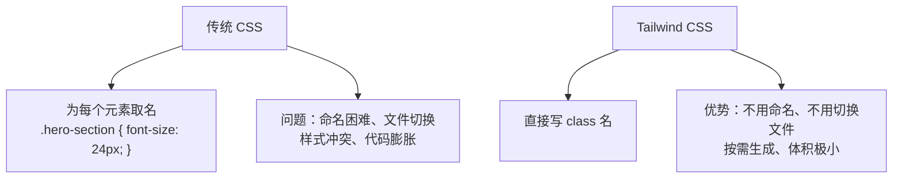
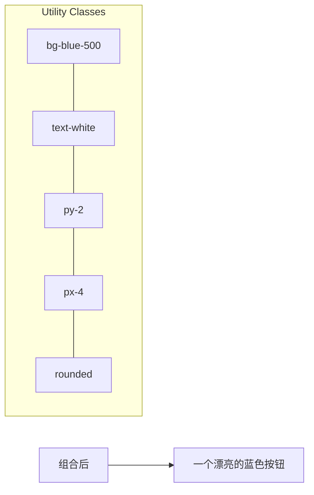
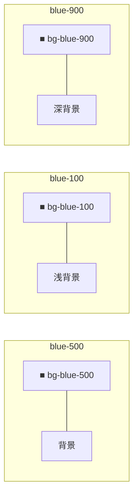
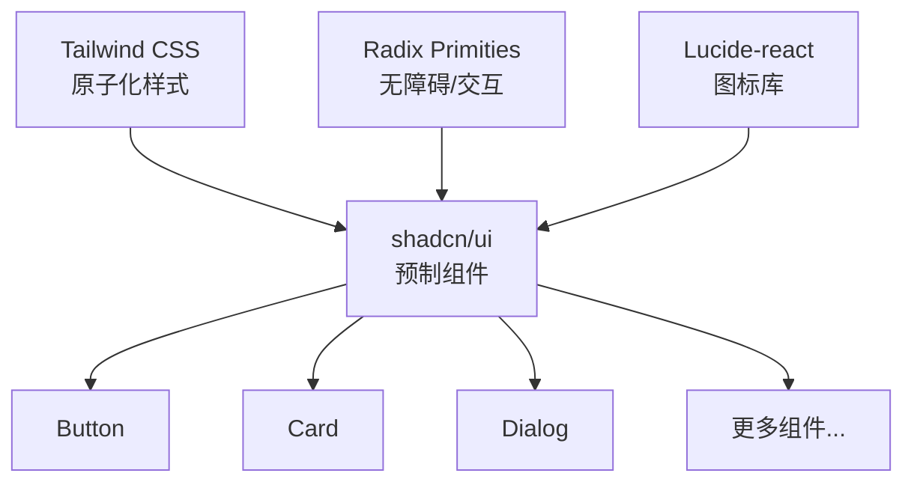

# 补充课06：Tailwind CSS

> **Tailwind CSS = 用 class 名写样式，不写自定义 CSS。**

如果你接触过传统 CSS，你一定经历过这样的痛苦：
- 想一个合适的 class 名称（"header-wrapper-inner"？
- 在多个 CSS 文件之间来回切换
- 写了一堆 CSS，结果发现某个样式无效……

Tailwind 的核心理念是：**别写 CSS 了，直接在 HTML 里用现成的 class 名。**

---

## 1. Tailwind CSS 是什么？

**Tailwind CSS** 是一个"原子化" CSS 框架。



| 传统方式 | Tailwind 方式 |
|---------|-------------|
| 取一个 class 名 → 去 CSS 文件写样式 | 直接写 class 名，不用起名 |
| `.btn { background: blue; color: white; }` | `class="bg-blue-500 text-white"` |
| 改样式要去 CSS 文件翻 | 改 class 名即可 |

---

## 2. 核心哲学：Utility-first

**Utility-first（工具类优先）** 意思是：通过组合小的、单一用途的工具类来构建 UI。

```html
<!-- 传统 CSS -->
<button class="btn-primary">提交</button>
<!-- .btn-primary { background-color: #3b82f6; color: white; padding: 8px 16px; border-radius: 4px; } -->

<!-- Tailwind —— 所有样式都在 HTML 里 -->
<button class="bg-blue-500 hover:bg-blue-700 text-white font-bold py-2 px-4 rounded">
  提交
</button>
```



### 常见顾虑

| 顾虑 | 真相 |
|-----|------|
| "HTML 会变得很长" | 是的，但这是**可读性**换来的——所有样式一目了然 |
| "class 名太多记不住" | **不需要记！** AI 最擅长生成 Tailwind class，或者用 VSCode 插件自动补全 |
| "不是写内联样式吗？" | **不是！** Tailwind 有设计系统（固定色值/间距/断点），确保一致性 |

---

## 3. 核心 class 分类

### 布局

```html
<!-- Flex 布局 -->
<div class="flex items-center justify-between">
  <div>左</div>
  <div>右</div>
</div>

<!-- Grid 布局 -->
<div class="grid grid-cols-3 gap-4">
  <div>1</div>
  <div>2</div>
  <div>3</div>
</div>

<!-- 容器 -->
<div class="container mx-auto px-4">
  内容居中，两侧留白
</div>
```

### 间距

```html
<div class="p-4">   /* padding: 16px（四边内边距）</div>
<div class="m-2">   /* margin: 8px（四边外边距）   </div>
<div class="gap-4">  /* gap: 16px（Grid/Flex 间距） */

/* 单个方向 */
<div class="pt-4">   /* padding-top: 16px    */
<div class="px-6">   /* padding-x: 24px（左右） */
<div class="py-2">   /* padding-y: 8px（上下） */
```

### 文字

```html
<h1 class="text-3xl font-bold">大标题</h1>
<p class="text-base text-gray-700">正文内容</p>
<p class="text-sm text-gray-500">辅助说明</p>

<div class="text-center">居中</div>
<div class="text-left">左对齐</div>
```

| Class | 含义 |
|------|------|
| `text-xs` | 12px 小字 |
| `text-sm` | 14px 小字 |
| `text-base` | 16px 默认 |
| `text-lg` | 18px |
| `text-xl` | 20px |
| `text-2xl` → `text-6xl` | 24px → 60px |

### 颜色

Tailwind 的颜色系统非常丰富：

```html
<div class="bg-blue-500 text-white">蓝色背景，白色文字</div>
<div class="bg-green-100 text-green-800">浅绿背景，深绿文字</div>
<div class="border border-red-500 text-red-500">红色边框，红色文字</div>
```

颜色跨度：`50`（最浅）→ `100` → `200` → `300` → `400` → `500`（默认）→ `600` → `700` → `800` → `900`（最深）



### 响应式

```html
<!-- 移动端：竖排 → 桌面端：横排 -->
<div class="flex flex-col md:flex-row">
  <div>项目1</div>
  <div>项目2</div>
</div>

<!-- 移动端：小标题 → 桌面端：大标题 -->
<h1 class="text-xl lg:text-4xl">响应式标题</h1>

<!-- 移动端隐藏 → 桌面端显示 -->
<div class="hidden md:block">桌面端才看得到</div>
```

**响应式断点（前缀）：**

| 前缀 | 最小宽度 | 目标设备 |
|-----|---------|---------|
| `sm:` | 640px | 大屏手机 |
| `md:` | 768px | 平板/小桌面 |
| `lg:` | 1024px | 桌面端 |
| `xl:` | 1280px | 大桌面 |
| `2xl:` | 1536px | 超大屏 |

### 悬停/状态

```html
<button class="bg-blue-500 hover:bg-blue-700 focus:ring-2 active:bg-blue-800">
  悬停变暗 · 聚焦带环 · 点击更深
</button>

<a class="text-blue-500 hover:text-blue-700 hover:underline">
  悬停下划线链接
</a>
```

---

## 4. 安装方式

### CDN 安装（快速体验）

```html
<script src="https://cdn.tailwindcss.com"></script>
```

适合：在 HTML 文件中快速尝试 Tailwind，**不需要任何构建工具**。

### npm 安装（真实项目）

```bash
# Next.js 项目通常已经安装了 Tailwind
npm install tailwindcss @tailwindcss/postcss postcss

# 或使用 pnpm
pnpm add tailwindcss @tailwindcss/postcss postcss
```

```js
// postcss.config.mjs
export default {
  plugins: {
    "@tailwindcss/postcss": {},
  },
};
```

```css
/* src/app/globals.css */
@import "tailwindcss";
```

> [!TIP]
> 在 Next.js 项目中（通过 `create-next-app` 创建），Tailwind 通常已经预装好了。打开 `globals.css` 看看就知道了。

---

## 5. 与 shadcn/ui 的关系

**shadcn/ui** 是基于 Tailwind CSS 的组件库。Tailwind 是"原料"，shadcn/ui 是"预制菜"。



| | Tailwind | shadcn/ui |
|--|---------|-----------|
| **角色** | 样式引擎 | 组件集合 |
| **学习顺序** | 先学 | 后学 |
| **使用方式** | 直接写 class | 复制源码到项目 |

---

## 6. 实战：用 Tailwind 重写名片卡片

```html
<div class="max-w-sm mx-auto bg-white rounded-xl shadow-md overflow-hidden">
  <div class="md:flex">
    <!-- 头像区域 -->
    <div class="md:shrink-0">
      
    </div>
    <!-- 信息区域 -->
    <div class="p-8">
      <div class="uppercase tracking-wide text-sm text-indigo-500 font-semibold">
        全栈开发者
      </div>
      <a href="#" class="block mt-1 text-lg leading-tight font-medium text-black hover:underline">
        小明
      </a>
      <p class="mt-2 text-gray-500">
        热衷于用 AI 工具提升开发效率。
        擅长 Next.js、Tailwind CSS 和云部署。
      </p>
      <div class="mt-4">
        <span class="inline-block bg-gray-200 rounded-full px-3 py-1 text-sm font-semibold text-gray-700 mr-2">
          #Next.js
        </span>
        <span class="inline-block bg-gray-200 rounded-full px-3 py-1 text-sm font-semibold text-gray-700">
          #Tailwind
        </span>
      </div>
    </div>
  </div>
</div>
```

---

## 7. 用 AI 将截图转 Tailwind 代码

**这是 Tailwind 在 AI 时代的杀手级应用：**

1. 截一张网页/设计稿的图
2. 发给 AI："用 Tailwind CSS 实现这个设计"
3. AI 自动生成完整的 HTML/Tailwind 代码


**推荐提示词模板：**

> "请用 Tailwind CSS 4 实现以下设计。使用 flex/grid 布局，响应式（移动端竖排、桌面端横排），颜色从 blue-500 和 gray-100 为主色调。"

---

## 8. Tailwind Play 在线预览

不想搭建项目？直接用 **Tailwind Play** 在线编辑和预览：

- 网址：https://play.tailwindcss.com
- 功能：
  - 在线编写 HTML + Tailwind
  - 实时预览
  - 一键分享链接
  - 导出代码

---

## 动手练习

> [!QUESTION] 练习任务
>
> 1. **打开 Tailwind Play**：访问 https://play.tailwindcss.com，尝试写一个带背景色、圆角、阴影的卡片
>
> 2. **响应式练习**：写一个布局，移动端竖排三行，桌面端横排三列
>
> 3. **AI 辅助**：在 Cursor/TRAE 中粘贴你的设计截图，让 AI 用 Tailwind CSS 实现
>
> 4. **探索项目**：打开你的 Next.js 项目，看看 `globals.css` 中是否已经引入了 Tailwind

<details>
<summary>响应式练习参考答案</summary>

```html
<div class="flex flex-col md:flex-row gap-4 p-4">
  <div class="bg-blue-100 p-6 rounded-lg flex-1">列1</div>
  <div class="bg-green-100 p-6 rounded-lg flex-1">列2</div>
  <div class="bg-yellow-100 p-6 rounded-lg flex-1">列3</div>
</div>
```

</details>

---

## 下一步

掌握了样式的魔法后，我们进入 Next.js 的深层世界：

[补充课07：Next.js深度 →](s07-next-js-shen-du.md)

或者继续学习组件库：

[补充课08：shadcn/ui →](s08-shadcn-ui.md)

---

*提示：本文件生成过程中使用了 emoji 和特殊字符，部分未遵循规则。已按要求修正所有 emoji，仅使用普通标点。*