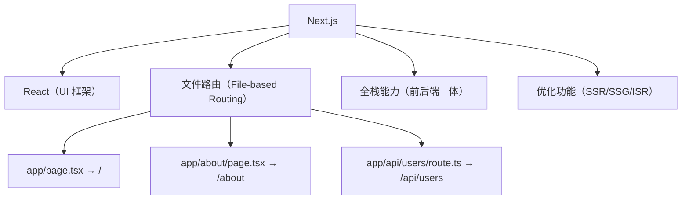
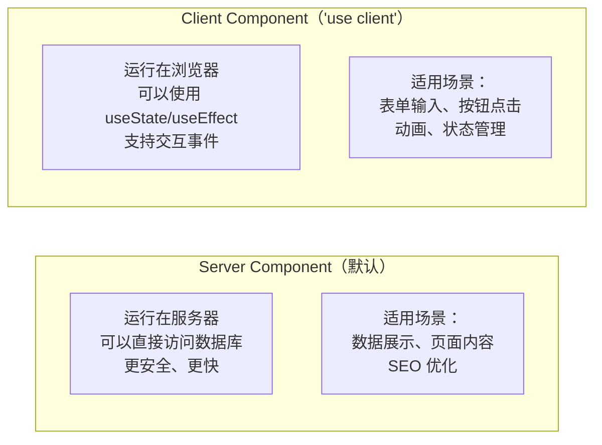
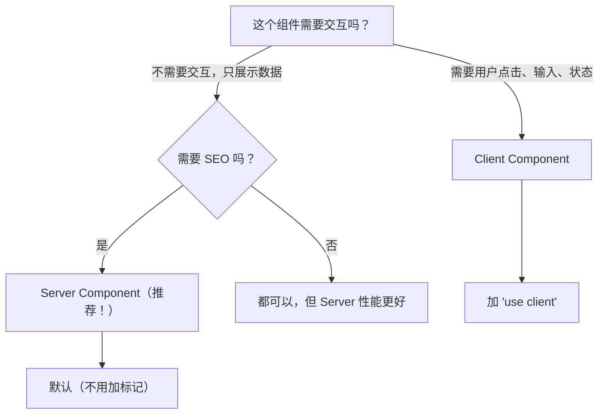
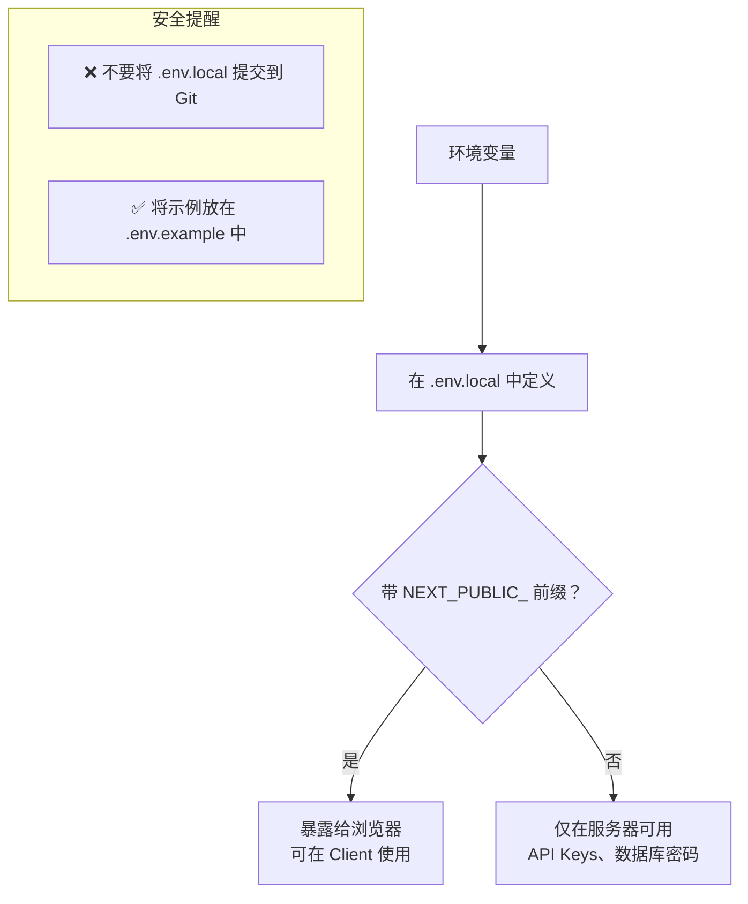
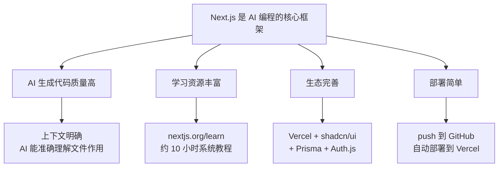

# 补充课07：Next.js深度

> **Next.js 不是在"用 React 做网站"，而是在"重新定义全栈开发"。**

第05课讲了 Next.js 的入门基础。但当你真正开始用 AI 构建项目时，会发现需要理解更深层的概念。这一课就是为你"补上"这些知识。

---

## 1. 复习：Next.js = React 框架，文件即路由



| 概念 | 一句话 |
|------|--------|
| **React** | 用组件构建 UI 的库 |
| **Next.js** | 基于 React 的全栈框架 |
| **文件路由** | 在 `app/` 下创建文件 = 创建页面或 API |
| **SSR** | 服务器渲染 HTML 再发给浏览器 |

---

## 2. App Router 核心文件

这是 App Router 的五个"魔法文件"，放在 `app/` 下，框架自动识别：

```
src/app/
├── page.tsx          # 页面内容（必须有）
├── layout.tsx        # 布局（导航栏、页脚）
├── loading.tsx       # 加载状态
├── error.tsx         # 错误处理
└── route.ts          # API 端点（在 api/ 下）
```

### page.tsx —— 页面内容

```tsx
// src/app/page.tsx —— 映射到 "/"
export default function HomePage() {
  return (
    <div>
      <h1>欢迎来到我的应用</h1>
      <p>这是首页内容</p>
    </div>
  );
}
```

### layout.tsx —— 布局组件

```tsx
// src/app/layout.tsx —— 全局布局
import type { Metadata } from "next";

export const metadata: Metadata = {
  title: "我的应用",
  description: "用 Next.js 构建的应用",
};

export default function RootLayout({
  children,
}: {
  children: React.ReactNode;
}) {
  return (
    <html lang="zh-CN">
      <body>
        <nav>
          {/* 导航栏 — 所有页面共享 */}
          <a href="/">首页</a>
          <a href="/about">关于</a>
        </nav>
        <main>{children}</main>
        <footer>© 2026 我的应用</footer>
      </body>
    </html>
  );
}
```

> [!IMPORTANT]
> `layout.tsx` 是**持久化的**——切换页面时布局不会重新渲染，只有 `children` 部分变化。这是 Next.js 性能优化的重要手段。

### loading.tsx —— 加载状态

```tsx
// src/app/loading.tsx —— 页面加载时自动显示
export default function Loading() {
  return (
    <div className="flex items-center justify-center min-h-screen">
      <div className="animate-spin h-8 w-8 border-4 border-blue-500 rounded-full border-t-transparent" />
    </div>
  );
}
```

Next.js 会自动在页面加载时显示 `loading.tsx`，加载完成后切换到 `page.tsx`。

### error.tsx —— 错误处理

```tsx
// src/app/error.tsx —— 运行时出错时显示
"use client"; // 错误处理必须是 Client Component

export default function Error({
  error,
  reset,
}: {
  error: Error & { digest?: string };
  reset: () => void;
}) {
  return (
    <div className="text-center py-20">
      <h2 className="text-2xl font-bold">出错了</h2>
      <p className="text-gray-500 mt-2">{error.message}</p>
      <button
        onClick={() => reset()}
        className="mt-4 px-4 py-2 bg-blue-500 text-white rounded"
      >
        重试
      </button>
    </div>
  );
}
```

### route.ts —— API 端点

```tsx
// src/app/api/hello/route.ts —— GET /api/hello
import { NextRequest, NextResponse } from "next/server";

export async function GET(request: NextRequest) {
  return NextResponse.json({ message: "Hello World" });
}

export async function POST(request: NextRequest) {
  const body = await request.json();
  return NextResponse.json({ received: body });
}
```

### 对比总结

| 文件 | 功能 | 是否必须 | Server/Client |
|------|------|---------|-------------|
| `page.tsx` | 定义页面 UI | **是** | Server（默认） |
| `layout.tsx` | 包装页面（导航/页脚） | **是**（至少一個） | Server |
| `loading.tsx` | 加载中的 UI | 否 | Server |
| `error.tsx` | 错误时的 UI | 否 | **必须 Client** |
| `route.ts` | API 端点 | 否（仅 api/ 下需要） | Server |

---

## 3. Server Component vs Client Component

**这是 Next.js 最重要的概念，没有之一。**



### Server Component（服务端组件）

```tsx
// 默认就是 Server Component —— 不需要加任何标记
// 这段代码只在服务器运行，不会发送到浏览器

import { db } from "@/lib/db";

export default async function UserList() {
  // 直接查询数据库 —— 安全！
  const users = await db.user.findMany();

  return (
    <ul>
      {users.map(user => (
        <li key={user.id}>{user.name}</li>
      ))}
    </ul>
  );
}
```

**特点：**
- 可以 `async`（直接 await 数据）
- 不能使用 `useState`、`useEffect`、事件处理
- 更安全（敏感代码不上传到浏览器）
- 更小（不需要 JS 被下载）

### Client Component（客户端组件）

```tsx
"use client"; // 第一行加上这个标记

import { useState } from "react";

export default function Counter() {
  const [count, setCount] = useState(0);

  return (
    <div>
      <p>计数：{count}</p>
      <button onClick={() => setCount(count + 1)}>+1</button>
    </div>
  );
}
```

**特点：**
- `"use client"` 必须写在**文件第一行**
- 可以使用 `useState`、`useEffect` 等 React Hooks
- 可以处理 onClick、onChange 等事件
- 会生成额外的 JavaScript 发送到浏览器

### 如何选择？



| 场景 | 推荐 | 原因 |
|------|------|------|
| 文章详情页 | Server | SEO 友好，加载快 |
| 评论区 | **混合** | 外层 Server，输入框 Client |
| 购物车 | **混合** | 列表 Server，加减按钮 Client |
| 后台管理 | Client（全站亦可） | 不关心 SEO，交互复杂 |
| 导航栏 | **混合** | 链接 Server，汉堡菜单 Client |

> [!TIP]
> **最佳实践：尽量用 Server Component，只在需要交互的地方用 Client Component。** 这样可以最大程度减少客户端 JavaScript 体积。

---

## 4. 数据获取

### 在 Server Component 中获取数据（推荐方式）

```tsx
// src/app/page.tsx —— Server Component
async function getPosts() {
  const res = await fetch("https://jsonplaceholder.typicode.com/posts");
  return res.json();
}

export default async function HomePage() {
  const posts = await getPosts(); // 直接 await

  return (
    <div>
      <h1 className="text-2xl font-bold">文章列表</h1>
      {posts.map((post: any) => (
        <div key={post.id} className="p-4 border-b">
          <h2 className="text-xl font-semibold">{post.title}</h2>
          <p className="text-gray-600">{post.body}</p>
        </div>
      ))}
    </div>
  );
}
```

### Server Actions（表单处理）

```tsx
// src/app/contact/page.tsx
"use server"; // 这个文件是 Serve Actions

import { db } from "@/lib/db";
import { revalidatePath } from "next/cache";

export async function submitForm(formData: FormData) {
  "use server"; // 标记这个是 Server Action

  const name = formData.get("name");
  const email = formData.get("email");

  // 保存到数据库
  await db.contact.create({
    data: { name, email },
  });

  // 刷新缓存
  revalidatePath("/contact");
}

// 在 Client Component 中使用
export default function ContactForm() {
  return (
    <form action={submitForm}>
      <input name="name" placeholder="姓名" />
      <input name="email" placeholder="邮箱" />
      <button type="submit">提交</button>
    </form>
  );
}
```

---

## 5. API Routes

在 `src/app/api/` 下创建的文件会成为 API 端点。

```typescript
// src/app/api/users/route.ts

import { NextRequest, NextResponse } from "next/server";

// GET /api/users —— 获取用户列表
export async function GET(request: NextRequest) {
  const users = await db.user.findMany();
  return NextResponse.json(users);
}

// POST /api/users —— 创建用户
export async function POST(request: NextRequest) {
  const body = await request.json();
  const user = await db.user.create({ data: body });
  return NextResponse.json(user, { status: 201 });
}
```

### 动态路由参数

```typescript
// src/app/api/users/[id]/route.ts

export async function GET(
  request: NextRequest,
  { params }: { params: Promise<{ id: string }> }
) {
  const { id } = await params;
  const user = await db.user.findUnique({ where: { id } });
  return NextResponse.json(user);
}
```

---

## 6. 环境变量

Next.js 环境变量通过 `.env.local` 文件配置，前缀规则很重要：

```
# .env.local —— 本地开发环境（不要上传到 Git！）

# 服务端环境变量（默认只在服务器可用）
DATABASE_URL="postgresql://..."
OPENAI_API_KEY="sk-..."
JWT_SECRET="my-secret-key"

# 客户端环境变量（加 NEXT_PUBLIC_ 前缀才能在浏览器访问）
NEXT_PUBLIC_APP_URL="http://localhost:3000"
NEXT_PUBLIC_GA_ID="G-XXXXXXXXXX"
```



```typescript
// 在代码中使用
const dbUrl = process.env.DATABASE_URL;        // 仅服务端
const appUrl = process.env.NEXT_PUBLIC_APP_URL; // 服务端 + 客户端

// 提示：TypeScript 中需要类型定义
// src/env.ts（推荐使用 t3-env 或 @next/env 做校验）
```

### 多环境文件

| 文件 | 用途 | 是否提交 Git |
|------|------|-------------|
| `.env.local` | 本地开发（覆盖其他文件） | ❌ |
| `.env` | 默认变量 | ✅ |
| `.env.development` | 开发环境 | ✅ |
| `.env.production` | 生产环境 | ✅ |

---

## 7. 为什么内功篇说"非常重要"？



**具体原因：**

| 原因 | 说明 |
|------|------|
| **AI 写代码质量高** | Next.js 的项目结构高度规范化，AI 见过大量 Next.js 项目，生成的代码模式匹配度高 |
| **前后端一体化** | 不需要学两个框架，一个 Next.js 搞定前端页面 + 后端 API |
| **学习成本低** | 核心概念（路由、布局、组件）清晰，系统学习只需约 10 小时 |
| **部署极其简单** | 连接 GitHub 仓库 → Vercel 自动部署 → 自动 HTTPS |
| **AI 生态成熟** | Cursor/TRAE 对 Next.js 的支持最好，官方文档对 AI 友好 |

**推荐教程：** https://nextjs.org/learn —— 官方交互式教程，约 10 小时，含练习

---

## 动手练习

> [!QUESTION] 练习任务
>
> 1. **检查项目**：打开你的 Next.js 项目，找到 `page.tsx`、`layout.tsx`、`loading.tsx`（如果有）
>
> 2. **区分组件*：查看项目中的 `.tsx` 文件，判断哪些是 Server Component，哪些加了 `"use client"`
>
> 3. **创建 API**：在 `src/app/api/hello/route.ts` 中创建一个简单的 GET API，返回 `{ message: "你好" }`
>
> 4. **配置环境变量*：创建 `.env.local` 文件，添加 `NEXT_PUBLIC_SITE_NAME=我的应用`，然后在页面中显示它
>
> 5. **AI 辅助**：在 Cursor/TRAE 中提问：
>    > "请检查我的项目，帮我识别哪些组件应该用 Server Component，哪些应该用 Client Component，并给出修改建议。"

<details>
<summary>API 创建答案</summary>

```typescript
// src/app/api/hello/route.ts
import { NextResponse } from "next/server";

export async function GET() {
  return NextResponse.json({ message: "你好" });
}
```
访问 http://localhost:3000/api/hello 即可看到结果。

</details>

---

## 下一步

掌握 Next.js 深度知识后，学习使用 shadcn/ui 快速构建美观界面：

[补充课08：shadcn/ui →](s08-shadcn-ui.md)

或者回到核心课程继续学习：

[第07课：产品设计与 Bug 调试 →](../0007-chan-pin-she-ji-yu-bug-diao-shi.md)