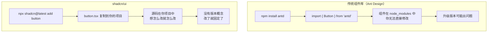
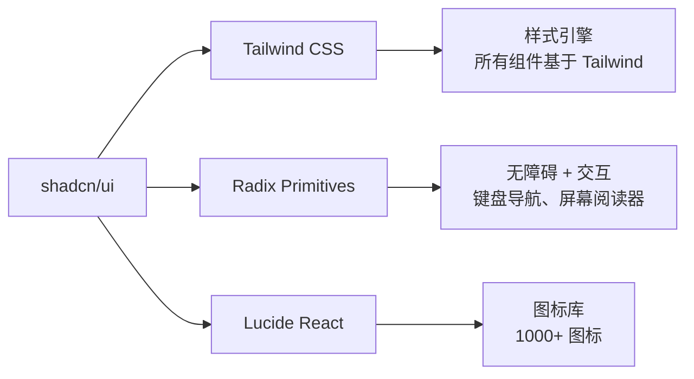
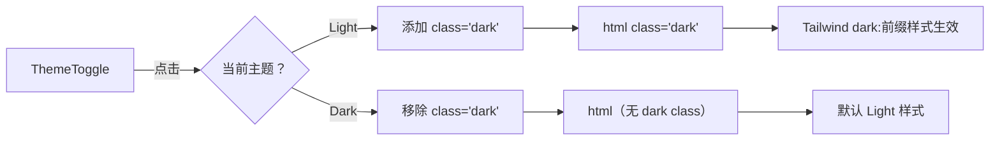

# 补充课08：shadcn/ui

> **shadcn/ui 不是 npm 包，是"Open Code"——把源码复制到你的项目里，让你完全掌控。**

如果你用过 Ant Design、Element UI 等传统组件库，一定经历过这些痛苦：
- 组件样式和设计稿不一样，需要花大量时间覆盖
- 升级版本时出现破坏性变更
- 想改组件内部逻辑却改不了

shadcn/ui 用完全不同的方式解决了这些问题。

---

## 1. shadcn/ui 是什么？

**shadcn/ui** 是一个组件集合，但**不是 npm 包**。



| 特性 | 传统组件库（Ant Design） | shadcn/ui |
|------|------------------------|-----------|
| **安装方式** | `npm install antd` | `npx shadcn@latest add button` |
| **代码位置** | `node_modules/`（只读） | 你的 `src/components/ui/`（可修改） |
| **修改样式** | 覆盖 CSS / 用 ConfigProvider | **直接改源码** |
| **版本升级** | 可能破坏性变更 | 没有版本，手动更新 |
| **包体积** | 全量引入或 tree-shaking | **只添加你需要的** |
| **定制性** | 受限于 API | **完全自由** |

### 核心哲学：Copy-paste

> "The best component library is one you own." —— shadcn/ui 作者

你不是在使用别人的组件库——你是在**把模板代码复制到自己的项目中**，然后完全拥有它。

---

## 2. 技术依赖

shadcn/ui 依赖三个核心技术：



| 依赖 | 角色 | 说明 |
|------|------|------|
| **Tailwind CSS** | 样式 | shadcn/ui 组件的样式全部用 Tailwind class 实现 |
| **Radix Primitives** | 交互 + 无障碍 | 提供弹窗、下拉菜单、选择器等复杂交互的无障碍支持 |
| **Lucide React** | 图标 | 高质量开源图标集，用于按钮图标、导航图标等 |

这三个依赖会在 `npx shadcn@latest init` 时自动安装。

---

## 3. 安装与配置

### 前提条件

你已经有一个基于 Tailwind CSS 的 Next.js 项目。如果还没有：

```bash
npx create-next-app@latest my-app --typescript --tailwind
```

### 初始化 shadcn/ui

```bash
# 在项目根目录运行
npx shadcn@latest init
```

这个命令会问几个问题：
- 使用哪个 CSS 框架？→ Tailwind CSS
- 全局样式文件路径？→ `src/app/globals.css`
- 组件目录？→ `src/components/ui`
- 是否使用 TypeScript？→ 是

完成后，shadcn/ui 会：
1. 创建 `components.json` 配置文件
2. 创建 `src/components/ui/` 目录
3. 更新 `globals.css` 添加必要的样式
4. 安装 Tailwind CSS + Radix + Lucide 依赖

### components.json

```json
{
  "$schema": "https://ui.shadcn.com/schema.json",
  "style": "new-york",       // 风格（new-york / default）
  "rsc": true,                // 是否支持 React Server Component
  "tsx": true,                // TypeScript
  "tailwind": {
    "config": "",
    "css": "src/app/globals.css",
    "baseColor": "zinc",      // 基础色调
    "cssVariables": true      // 使用 CSS 变量
  },
  "aliases": {
    "components": "@/components",
    "ui": "@/components/ui",
    "utils": "@/lib/utils"
  }
}
```

---

## 4. 添加组件

shadcn/ui 不是一次性安装所有组件，而是按需添加：

```bash
# 添加 Button
npx shadcn@latest add button

# 添加 Card
npx shadcn@latest add card

# 添加 Dialog（弹窗）
npx shadcn@latest add dialog

# 添加多个组件
npx shadcn@latest add button card dialog input select table tabs
```

执行后，组件代码会复制到 `src/components/ui/`：

```
src/components/ui/
├── button.tsx
├── card.tsx
├── dialog.tsx
├── input.tsx
├── select.tsx
├── table.tsx
└── tabs.tsx
```

---

## 5. 常用组件

### Button（按钮）

```tsx
import { Button } from "@/components/ui/button";

export default function Page() {
  return (
    <div className="flex gap-4">
      <Button>默认</Button>
      <Button variant="secondary">次要</Button>
      <Button variant="destructive">危险</Button>
      <Button variant="outline">边框</Button>
      <Button variant="ghost">幽灵</Button>
      <Button variant="link">链接</Button>
      <Button size="sm">小</Button>
      <Button size="lg">大</Button>
      <Button disabled>禁用</Button>
    </div>
  );
}
```

### Card（卡片）

```tsx
import {
  Card,
  CardContent,
  CardDescription,
  CardFooter,
  CardHeader,
  CardTitle,
} from "@/components/ui/card";

export default function ProductCard() {
  return (
    <Card className="w-[350px]">
      <CardHeader>
        <CardTitle>商品名称</CardTitle>
        <CardDescription>这是商品的简要描述</CardDescription>
      </CardHeader>
      <CardContent>
        <p>商品详情内容区域，可以放任意内容。</p>
      </CardContent>
      <CardFooter className="flex justify-between">
        <Button variant="outline">取消</Button>
        <Button>加入购物车</Button>
      </CardFooter>
    </Card>
  );
}
```

### Dialog（弹窗）

```tsx
import {
  Dialog,
  DialogContent,
  DialogDescription,
  DialogFooter,
  DialogHeader,
  DialogTitle,
  DialogTrigger,
} from "@/components/ui/dialog";

export default function ConfirmDialog() {
  return (
    <Dialog>
      <DialogTrigger asChild>
        <Button>打开弹窗</Button>
      </DialogTrigger>
      <DialogContent>
        <DialogHeader>
          <DialogTitle>确定要删除吗？</DialogTitle>
          <DialogDescription>
            此操作不可撤销，删除后数据将永久丢失。
          </DialogDescription>
        </DialogHeader>
        <DialogFooter>
          <Button variant="outline">取消</Button>
          <Button variant="destructive">确认删除</Button>
        </DialogFooter>
      </DialogContent>
    </Dialog>
  );
}
```

### 更多组件

| 组件 | 说明 | 常用场景 |
|------|------|---------|
| `Input` | 文本输入框 | 表单 |
| `Select` | 下拉选择 | 表单选项 |
| `Textarea` | 多行文本 | 备注/评论 |
| `Checkbox` | 复选框 | 多选 |
| `Switch` | 开关 | 启用/禁用 |
| `Table` | 数据表格 | 列表展示 |
| `Tabs` | 标签页 | 内容分类 |
| `DropdownMenu` | 下拉菜单 | 更多操作 |
| `Avatar` | 头像 | 用户资料 |
| `Badge` | 徽章 | 状态标记 |
| `Toast` | 提示通知 | 操作反馈 |
| `Sheet` | 侧边面板 | 移动端菜单 |
| `Separator` | 分割线 | 内容分隔 |

---

## 6. 自定义组件

**这是 shadcn/ui 的核心优势**：组件源码就在你的项目中，直接修改。

```tsx
// src/components/ui/button.tsx —— 直接编辑！
// 比如把默认圆角从 6px 改成 8px

const buttonVariants = cva(
  "inline-flex items-center justify-center whitespace-nowrap rounded-lg ...", // 改成 rounded-lg
  // ...
);

// 或者修改默认颜色
// "bg-primary text-primary-foreground hover:bg-primary/90"
// 改成
// "bg-blue-600 text-white hover:bg-blue-700"
```

> [!IMPORTANT]
> 这是 shadcn/ui 的核心理念——**你拥有这些代码**。如果需要修改，直接编辑 `src/components/ui/` 下的文件即可，不需要用 CSS 覆盖 CSS 之类的方式。

---

## 7. 暗黑模式

shadcn/ui 原生支持暗黑模式，通过 `next-themes` 库实现。

### 安装

```bash
npm install next-themes
```

### 配置 ThemeProvider

```tsx
// src/app/providers.tsx
"use client";

import { ThemeProvider } from "next-themes";

export function Providers({ children }: { children: React.ReactNode }) {
  return (
    <ThemeProvider
      attribute="class"       // 使用 class 策略
      defaultTheme="system"   // 跟随系统
      enableSystem            // 自动检测系统主题
      disableTransitionOnChange
    >
      {children}
    </ThemeProvider>
  );
}
```

### 在 layout 中使用

```tsx
// src/app/layout.tsx
import { Providers } from "./providers";

export default function RootLayout({
  children,
}: {
  children: React.ReactNode;
}) {
  return (
    <html lang="zh-CN" suppressHydrationWarning>
      <body>
        <Providers>{children}</Providers>
      </body>
    </html>
  );
}
```

### 主题切换按钮

```tsx
// src/components/theme-toggle.tsx
"use client";

import { Moon, Sun } from "lucide-react";
import { useTheme } from "next-themes";
import { Button } from "@/components/ui/button";

export function ThemeToggle() {
  const { theme, setTheme } = useTheme();

  return (
    <Button
      variant="outline"
      size="icon"
      onClick={() => setTheme(theme === "light" ? "dark" : "light")}
    >
      <Sun className="h-5 w-5 rotate-0 scale-100 transition-all dark:-rotate-90 dark:scale-0" />
      <Moon className="absolute h-5 w-5 rotate-90 scale-0 transition-all dark:rotate-0 dark:scale-100" />
      <span className="sr-only">切换主题</span>
    </Button>
  );
}
```

### 暗黑模式效果



```html
<!-- Tailwind 支持暗黑模式的写法 -->
<div class="bg-white dark:bg-gray-900 text-black dark:text-white">
  在暗黑模式下自动切换背景和文字颜色
</div>
```

---

## 8. 在 Cursor 中使用 shadcn/ui

在 AI 编程环境中，shadcn/ui 能发挥最大效率。

### 让 AI 添加并使用组件

```
提示词：
"请帮我添加一个 shadcn/ui 的 Dialog 组件，
点击按钮弹出确认框，询问用户是否删除。
如果确认，调用删除 API。"

AI 会：
1. 运行 npx shadcn@latest add dialog button
2. 在页面中导入并使用组件
3. 添加事件处理逻辑
```

### 让 AI 定制组件

```
提示词：
"请修改 Button 组件的默认样式，
把 primary 颜色从蓝色改成绿色，
圆角从默认改成 rounded-full（胶囊按钮）。"
```

AI 会直接编辑 `src/components/ui/button.tsx` 中的源码。

---

## 动手练习

> [!QUESTION] 练习任务
>
> 1. **初始化**：在你的 Next.js 项目中运行 `npx shadcn@latest init` 完成初始化
>
> 2. **添加组件**：添加 Button、Card、Input 三个组件
>
> 3. **构建页面**：用 Card + Button + Input 组合一个登录表单页面
>
> 4. **暗黑模式**：安装 next-themes，配置 ThemeProvider，添加主题切换按钮
>
> 5. **AI 辅助**：在 Cursor/TRAE 中提问：
>    > "请帮我给当前项目添加 shadcn/ui 组件库，并创建一个包含表单的页面，使用 Card、Input、Button 组件"

<details>
<summary>登录表单示例</summary>

```tsx
import { Button } from "@/components/ui/button";
import {
  Card,
  CardContent,
  CardDescription,
  CardFooter,
  CardHeader,
  CardTitle,
} from "@/components/ui/card";
import { Input } from "@/components/ui/input";

export default function LoginForm() {
  return (
    <div className="flex items-center justify-center min-h-screen bg-gray-100">
      <Card className="w-[400px]">
        <CardHeader>
          <CardTitle>登录</CardTitle>
          <CardDescription>请输入账号密码登录系统</CardDescription>
        </CardHeader>
        <CardContent className="space-y-4">
          <div className="space-y-2">
            <label htmlFor="email">邮箱</label>
            <Input id="email" type="email" placeholder="your@email.com" />
          </div>
          <div className="space-y-2">
            <label htmlFor="password">密码</label>
            <Input id="password" type="password" placeholder="********" />
          </div>
        </CardContent>
        <CardFooter>
          <Button className="w-full">登录</Button>
        </CardFooter>
      </Card>
    </div>
  );
}
```

</details>

---

## 下一步

恭喜你完成了所有补充课的学习！现在你掌握了：

| 补充课 | 内容 | 价值 |
|-------|------|------|
| 05 | JavaScript & TypeScript | 看懂代码、类型安全 |
| 06 | Tailwind CSS | 快速写样式 |
| 07 | Next.js 深度 | 理解全栈框架 |
| 08 | shadcn/ui | 高效构建 UI |

回到核心课程，继续你的 AI 编程之旅：

[第09课：技术术语密集输入 →](../0009-ji-shu-shu-yu-mi-ji-shu-ru.md)