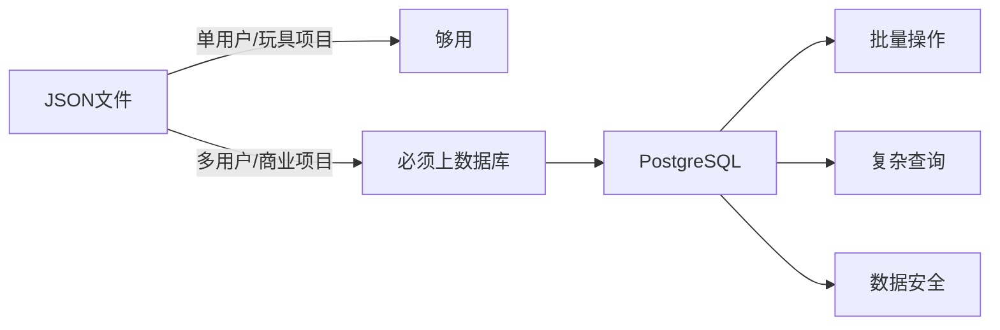
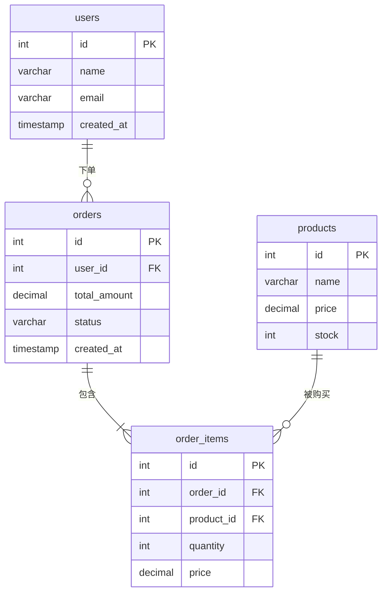
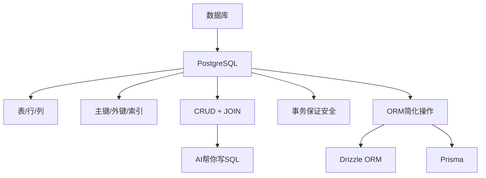

# 补充课09：数据库

> **数据库是应用的骨架。没有数据库，应用就是一座没有记忆的沙堡。**

第06课我们初步接触了数据库。这一节补充课，我们把数据库的知识点串联成一个完整体系——从为什么需要数据库，到实际设计一个电商数据库，再到用AI帮你写SQL。

---

## 1. 数据库回顾：为什么需要数据库？

从第06课我们知道，用JSON文件存数据有四大问题：

| 问题 | 表现 | 数据库如何解决 |
|------|------|---------------|
| **并发冲突** | 两个用户同时写入，文件互相覆盖 | 事务 + 锁机制 |
| **查询效率** | 100万条数据遍历卡死 | 索引 + B树，毫秒级 |
| **数据一致性** | 写入一半程序崩溃，数据损坏 | WAL日志 + ACID事务 |
| **关联查询** | 手动关联多个JSON，麻烦易错 | JOIN语句，一行搞定 |

但当你的应用只有一个用户、数据量不到一万条时，JSON文件确实是"够用"的。数据库的意义在于——**当你的产品增长时，它不会成为瓶颈**。



---

## 2. PostgreSQL 核心概念

PostgreSQL 是**关系型数据库**中的佼佼者。理解以下核心概念，你就掌握了90%的数据库知识：

### 表、行、列

| 概念 | 类比 Excel | 说明 |
|------|-----------|------|
| **表 (Table)** | 一个工作表 | 存储同一类数据的容器，如 `users` 表 |
| **行 (Row)** | 一行数据 | 一条完整记录，如一个用户 |
| **列 (Column)** | 一列数据 | 一个字段，如 `name`, `email` |

### 主键 (Primary Key)

每张表的**唯一标识**。就像身份证号——每个用户一个，不会重复。

```sql
-- id 就是主键，SERIAL 表示自动递增
id SERIAL PRIMARY KEY
```

### 外键 (Foreign Key)

表与表之间的**关联线**。一个表的字段指向另一个表的主键。

```sql
-- user_id 指向 users 表的 id
user_id INTEGER NOT NULL REFERENCES users(id)
```

### 索引 (Index)

书的**目录**。没有索引就要翻遍整本书——全表扫描。加了索引就能直接翻到目标页。

```sql
-- 在经常查询的字段上建索引
CREATE INDEX idx_users_email ON users(email);
```

> [!WARNING]
> 索引不是越多越好。每个索引都会拖慢写入速度（因为每次写入要同时更新索引）。**索引是空间换时间**——只对频繁查询的字段建索引。

---

## 3. 关系类型：用电商示例理解

数据库的核心是"关系"。三种关系类型：

### 1:1 (一对一)

一个用户对应一个身份证信息。

```
users ──── user_profiles
```

```sql
-- 用户表
CREATE TABLE users (
    id SERIAL PRIMARY KEY,
    name VARCHAR(100) NOT NULL
);

-- 用户档案表（一对一）
CREATE TABLE user_profiles (
    id SERIAL PRIMARY KEY,
    user_id INTEGER UNIQUE NOT NULL REFERENCES users(id),
    avatar_url TEXT,
    bio TEXT
);
```

### 1:n (一对多)

一个用户可以有多个订单。这是最常见的类型。

```
users ──── orders
```

```sql
CREATE TABLE orders (
    id SERIAL PRIMARY KEY,
    user_id INTEGER NOT NULL REFERENCES users(id),
    total_amount DECIMAL(10,2) NOT NULL,
    status VARCHAR(20) DEFAULT 'pending',
    created_at TIMESTAMP DEFAULT NOW()
);
```

### m:n (多对多)

一个订单可以包含多个商品，一个商品也可以出现在多个订单。需要一张**中间表**。

```
orders ──── order_items ──── products
```

```sql
CREATE TABLE products (
    id SERIAL PRIMARY KEY,
    name VARCHAR(200) NOT NULL,
    price DECIMAL(10,2) NOT NULL,
    stock INTEGER DEFAULT 0
);

-- 中间表：订单和商品的多对多关系
CREATE TABLE order_items (
    id SERIAL PRIMARY KEY,
    order_id INTEGER NOT NULL REFERENCES orders(id),
    product_id INTEGER NOT NULL REFERENCES products(id),
    quantity INTEGER NOT NULL DEFAULT 1,
    price DECIMAL(10,2) NOT NULL  -- 下单时的价格（防止商品调价后历史订单价格变化）
);
```

### ER图：完整的电商数据模型



---

## 4. CRUD 操作复习

CRUD 是数据库的四大基本操作：**Create, Read, Update, Delete**。

### INSERT — 插入数据

```sql
INSERT INTO users (name, email) VALUES ('张三', 'zhangsan@example.com');
-- 插入后返回整条记录
INSERT INTO users (name, email) VALUES ('李四', 'lisi@example.com') RETURNING *;
```

### SELECT — 查询数据

```sql
-- 查询所有
SELECT * FROM users;

-- 条件查询
SELECT name, email FROM users WHERE id = 1;

-- 模糊查询
SELECT * FROM users WHERE name LIKE '%张%';
```

### UPDATE — 更新数据

```sql
UPDATE users SET name = '张老三' WHERE id = 1 RETURNING *;
```

### DELETE — 删除数据

```sql
DELETE FROM users WHERE id = 1 RETURNING *;
```

> [!TIP]
> 在关键操作后加上 `RETURNING *`，可以立即看到操作结果，避免"到底删没删"的困惑。

---

## 5. 更高级的查询

### JOIN — 关联多张表

```sql
-- 查用户及其订单
SELECT users.name, orders.id AS order_id, orders.total_amount, orders.status
FROM users
JOIN orders ON users.id = orders.user_id
WHERE users.id = 1;
```

| `JOIN` 类型 | 结果 |
|-------------|------|
| **INNER JOIN** | 只返回匹配的记录（默认JOIN） |
| **LEFT JOIN** | 返回左表全部记录，右表无匹配则NULL |

```sql
-- LEFT JOIN：查所有用户及其订单（包括没有下过单的用户）
SELECT users.name, orders.id AS order_id
FROM users
LEFT JOIN orders ON users.id = orders.user_id;
```

### GROUP BY — 分组聚合

```sql
-- 统计每个用户的订单总金额
SELECT user_id, COUNT(*) AS order_count, SUM(total_amount) AS total_spent
FROM orders
GROUP BY user_id
ORDER BY total_spent DESC;
```

### ORDER BY — 排序

```sql
SELECT * FROM products ORDER BY price DESC;   -- 从高到低
SELECT * FROM products ORDER BY price ASC;    -- 从低到高
```

### LIMIT — 限制条数

```sql
-- 最贵的5个商品
SELECT * FROM products ORDER BY price DESC LIMIT 5;
```

### 组合使用

```sql
-- 查询消费最多的前3名用户
SELECT user_id, SUM(total_amount) AS total_spent
FROM orders
WHERE status = 'paid'
GROUP BY user_id
ORDER BY total_spent DESC
LIMIT 3;
```

---

## 6. SQL 安全

SQL 注入是最常见的数据库攻击方式。看这个例子：

```sql
-- 危险！直接拼接用户输入
-- 如果用户输入："'; DROP TABLE users; --"
-- 这条SQL就变成了：
SELECT * FROM users WHERE name = ''; DROP TABLE users; --'
-- 你的用户表就被删了！
```

### 参数化查询（安全做法）

```sql
-- 安全：用 $1 占位符，数据库会自动转义
SELECT * FROM users WHERE name = $1 AND email = $2;
-- 传入参数：['张三', 'zhangsan@example.com']
```

### ORM 中的安全操作（推荐）

使用 ORM 时，框架自动使用参数化查询。你不必手动处理：

```typescript
// Drizzle ORM（自动安全）
await db.insert(users).values({ name: userInput, email: userEmail });

// Prisma（自动安全）
await prisma.user.create({ data: { name: userInput, email: userEmail } });
```

> [!WARNING]
> **绝对不要在SQL中拼接用户输入！** 无论是名字、邮箱还是评论——任何来自用户的数据都不能直接拼到SQL字符串里。这个错误足以毁掉你的产品。

---

## 7. 事务：BEGIN, COMMIT, ROLLBACK

事务保证一组操作**要么全部成功，要么全部失败**。

### 转账场景

```sql
BEGIN;  -- 开始事务

-- 从A账户扣款
UPDATE accounts SET balance = balance - 100 WHERE id = 1;
-- 程序崩溃了怎么办？下面这行没执行到！

-- 向B账户加款
UPDATE accounts SET balance = balance + 100 WHERE id = 2;

-- 一切正常 → 提交
COMMIT;

-- 如果中途出错 → 回滚（撤销所有操作）
ROLLBACK;
```

### 在代码中使用事务

```typescript
// Drizzle ORM
await db.transaction(async (tx) => {
    await tx.insert(orders).values({ userId: 1, totalAmount: 299 });
    await tx.insert(orderItems).values({ orderId: newOrderId, productId: 1, quantity: 1 });
    // 自动 COMMIT；如果抛出异常则自动 ROLLBACK
});
```

| 事务命令 | 作用 |
|---------|------|
| `BEGIN` | 开始事务 |
| `COMMIT` | 提交事务，所有更改生效 |
| `ROLLBACK` | 回滚事务，撤销所有更改 |
| `SAVEPOINT` | 设置保存点，可回滚到指定位置 |

---

## 8. ORM 概念

**ORM (Object-Relational Mapping)** 让你用编程语言（TypeScript）操作数据库，不用手写SQL。

### 为什么用 ORM？

| 手写 SQL | 用 ORM |
|----------|--------|
| `SELECT * FROM users WHERE id = 1` | `db.select().from(users).where(eq(users.id, 1))` |
| 字符串拼接容易出错 | 类型安全，编译期检查 |
| 迁移到新数据库要重写SQL | 换驱动即可 |
| 没有代码提示 | 全量 TypeScript 类型提示 |

### Drizzle ORM

```typescript
// 定义表结构
import { pgTable, serial, varchar, timestamp } from 'drizzle-orm/pg-core';

export const users = pgTable('users', {
    id: serial('id').primaryKey(),
    name: varchar('name', { length: 100 }).notNull(),
    email: varchar('email', { length: 255 }).notNull().unique(),
    createdAt: timestamp('created_at').defaultNow(),
});

// CRUD 操作
const allUsers = await db.select().from(users);
const user = await db.insert(users).values({ name: '张三', email: 'z@e.com' }).returning();
```

### Prisma

```prisma
// schema.prisma
model User {
    id        Int      @id @default(autoincrement())
    name      String
    email     String   @unique
    orders    Order[]
    createdAt DateTime @default(now())
}

model Order {
    id         Int      @id @default(autoincrement())
    userId     Int
    user       User     @relation(fields: [userId], references: [id])
    totalAmount Float
    items      OrderItem[]
}
```

```typescript
// Prisma CRUD
const users = await prisma.user.findMany({
    include: { orders: true }
});
```

| ORM | 优点 | 缺点 |
|-----|------|------|
| **Drizzle ORM** | 轻量、TypeScript原生、AI友好 | 生态较新 |
| **Prisma** | 最流行、文档丰富、可视化 | 较重、生成代码多 |

> [!TIP]
> 对于 AI 编程来说，**Drizzle ORM 更友好**——因为它的 API 直接对应 SQL，AI 更容易理解和生成正确的代码。Prisma 的抽象层更厚，AI 有时会生成不准确的代码。

---

## 9. 实际练习：设计一个简单的电商数据库

### 需求描述

做一个简单的电商系统，需要支持：

1. 用户注册登录（users）
2. 商品上架管理（products）
3. 用户下单购买（orders + order_items）
4. 商品分类（categories）

### 完整建表 SQL

```sql
-- 分类表
CREATE TABLE categories (
    id SERIAL PRIMARY KEY,
    name VARCHAR(100) NOT NULL,
    description TEXT
);

-- 商品表
CREATE TABLE products (
    id SERIAL PRIMARY KEY,
    category_id INTEGER REFERENCES categories(id),
    name VARCHAR(200) NOT NULL,
    description TEXT,
    price DECIMAL(10,2) NOT NULL,
    stock INTEGER NOT NULL DEFAULT 0,
    image_url TEXT,
    created_at TIMESTAMP DEFAULT NOW()
);

-- 用户表
CREATE TABLE users (
    id SERIAL PRIMARY KEY,
    name VARCHAR(100) NOT NULL,
    email VARCHAR(255) UNIQUE NOT NULL,
    password_hash TEXT NOT NULL,
    created_at TIMESTAMP DEFAULT NOW()
);

-- 订单表
CREATE TABLE orders (
    id SERIAL PRIMARY KEY,
    user_id INTEGER NOT NULL REFERENCES users(id),
    total_amount DECIMAL(10,2) NOT NULL,
    status VARCHAR(20) DEFAULT 'pending',
    created_at TIMESTAMP DEFAULT NOW()
);

-- 订单商品明细表
CREATE TABLE order_items (
    id SERIAL PRIMARY KEY,
    order_id INTEGER NOT NULL REFERENCES orders(id),
    product_id INTEGER NOT NULL REFERENCES products(id),
    quantity INTEGER NOT NULL DEFAULT 1,
    price DECIMAL(10,2) NOT NULL
);

-- 索引
CREATE INDEX idx_products_category ON products(category_id);
CREATE INDEX idx_orders_user ON orders(user_id);
CREATE INDEX idx_order_items_order ON order_items(order_id);
```

### 实用查询

```sql
-- 某个用户的所有订单（含商品详情）
SELECT 
    o.id AS order_id,
    o.total_amount,
    o.status,
    o.created_at,
    p.name AS product_name,
    oi.quantity,
    oi.price
FROM orders o
JOIN order_items oi ON o.id = oi.order_id
JOIN products p ON oi.product_id = p.id
WHERE o.user_id = 1
ORDER BY o.created_at DESC;

-- 销量排行榜
SELECT 
    p.name,
    SUM(oi.quantity) AS total_sold,
    SUM(oi.quantity * oi.price) AS revenue
FROM order_items oi
JOIN products p ON oi.product_id = p.id
GROUP BY p.id, p.name
ORDER BY total_sold DESC
LIMIT 10;
```

---

## 10. 用 AI 写 SQL

这是 AI 编程时代最重要的技能之一：**用自然语言描述需求，让 AI 生成 SQL**。

### 实际演示

**你的输入**：
> "我有一个电商数据库，包含 users, orders, order_items, products 四张表。帮我查一下过去7天每个品类的销售额排行。"

**AI 生成的 SQL**：

```sql
SELECT 
    c.name AS category_name,
    COUNT(DISTINCT o.id) AS order_count,
    SUM(oi.quantity * oi.price) AS total_revenue
FROM categories c
JOIN products p ON c.id = p.category_id
JOIN order_items oi ON p.id = oi.product_id
JOIN orders o ON oi.order_id = o.id
WHERE o.created_at >= NOW() - INTERVAL '7 days'
  AND o.status = 'paid'
GROUP BY c.id, c.name
ORDER BY total_revenue DESC;
```

### 让 AI 帮你做更多

| 需求 | 对 AI 说的话 |
|------|-------------|
| **建表** | "帮我创建一个用户表，包含 id, name, email, 注册时间" |
| **加字段** | "给 products 表加一个 discount_price 字段" |
| **查数据** | "查最近10个订单，显示用户名和商品名称" |
| **优化性能** | "这个查询很慢，帮我加合适的索引" |
| **迁移** | "把 users 表改成用 UUID 做主键" |
| **数据分析** | "统计每个用户的消费频率和平均客单价" |

> [!TIP]
> 向 AI 描述数据库需求时，**提供表结构信息**能让 AI 生成更准确的SQL。你可以在 Cursor 中打开数据库 Schema 文件，或者先把建表语句发给AI。

---

## 一句话总结



> **数据库不是一个工具，而是一种思维。理解了关系和数据一致性，你就理解了应用的后半部分。**

---

## 作业与自测

> [!QUESTION] 动手任务
>
> 1. **建库**：在 Neon 中创建一个新数据库，执行上面的电商建表 SQL。
> 2. **插入数据**：插入至少3个分类、5个商品、2个用户和若干订单。
> 3. **查询练习**：
>    - 查询"某个用户的所有订单"
>    - 查询"销量最高的商品"
>    - 查询"从未下单的用户"
> 4. **用AI写SQL**：用自然语言向AI描述一个查询需求，让AI生成SQL并执行验证。
> 5. **思考题**：如果用户下单后需要扣减商品库存，如何保证库存不变成负数？

<details>
<summary>思考题答案</summary>

使用事务 + 条件更新：

```sql
BEGIN;
-- 扣减库存（确保库存充足）
UPDATE products 
SET stock = stock - 1 
WHERE id = 1 AND stock > 0;
-- 检查是否成功（如果 stock < 0，则回滚）
-- ... 创建订单 ...
COMMIT;
```

或者在应用层先查询库存，再更新。更专业的做法是使用 `SELECT ... FOR UPDATE` 行级锁。

</details>

---

## 下一步

学习 [补充课10：Supabase →](s10-supabase.md) 了解如何3分钟拥有一个生产数据库。