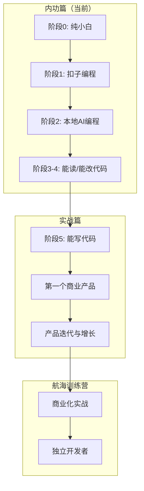
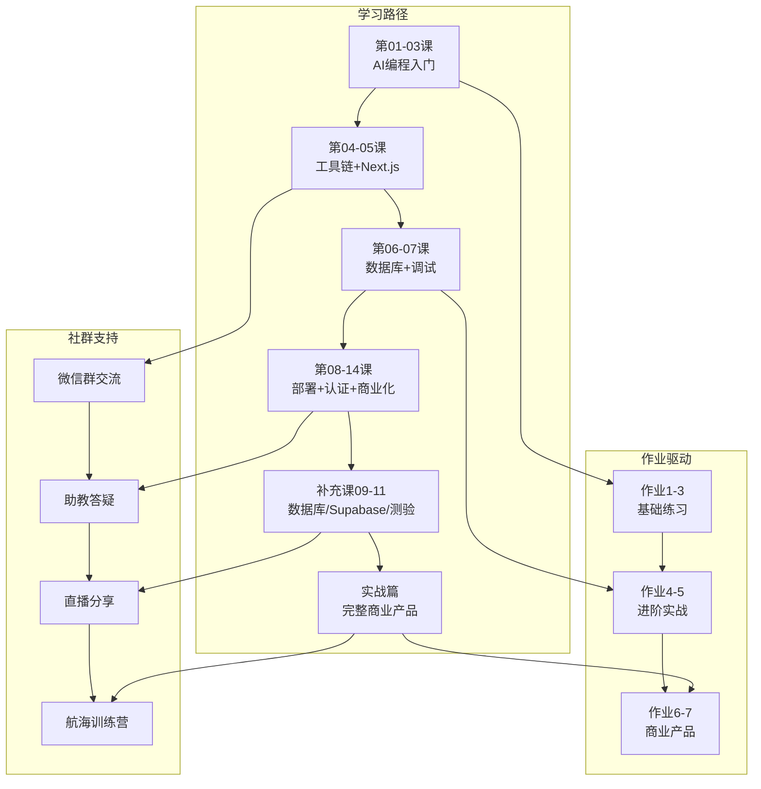

# 补充课12：社群直播与作业航海图

> **一个人走得快，一群人走得远。社群就是你编程路上的同行者。**

这门课不仅有录播内容，还有**社群内部的直播分享**和**完整的作业体系**。这一页为你梳理所有社群资源，让你知道在什么地方、用什么方式、获得什么帮助。

---

## 1. 开营仪式精华

开营仪式是课程的第一场直播，刘小排亲自分享了这门课的设计理念和学习方法。

### 核心观点

| 观点 | 说明 |
|------|------|
| **AI 时代的学习方式变了** | 不是"先学完再动手"，而是"边动手边学" |
| **目标不是成为程序员** | 目标是**能用自己的想法创造产品** |
| **不追求完美** | 完成比完美重要。第一个版本一定是粗糙的 |
| **社群是加速器** | 一个人学容易放弃，一群人学相互激励 |

### 开营仪式金句

> "你不是在学编程，你是在学编程的省略号写法。"

> "AI 编程的核心能力不是写代码，而是**提需求、看代码、改代码**。"

> "不要和科班程序员比知识量——你的武器是**AI**，你的优势是**想法**。"

### 学习建议

开营仪式上重点强调了三个学习原则：

1. **先做再说** —— 不要等"准备好"，直接从第一个项目开始
2. **遇到问题先问AI** —— 80%的问题AI能解决，剩下20%问社群
3. **完成作业** —— 作业是检验"是否真的会了"的唯一标准

---

## 2. 0代码0英语新手第一个AI Demo（李荣禄分享）

这是社群内部的一场重磅直播分享，由 **李荣禄** 主讲——他是一位**真正的零基础学员**。

### 分享者背景

- 没有编程经验（0代码）
- 英语水平有限（0英语）
- 但用课程教的方法，**在两天内做出了自己的第一个AI产品**

### 分享精华

**他是怎么做到的：**

1. **用中文写需求** —— 直接用中文描述产品想法，AI完全理解
2. **让AI一步步带** —— 不要求一次完成所有功能，每次只加一个功能点
3. **遇到错误就截图问AI** —— 不需要读懂错误信息，把报错截图发给AI
4. **不怕重来** —— 改了10遍不满意就第11遍，AI不会嫌你烦

### 他的第一个产品

李荣禄在直播中展示了他做的AI工具应用，现场演示了从**需求描述 → AI生成代码 → 部署上线**的全流程，整个过程不到30分钟。

> [!TIP]
> 李荣禄的分享证明了一件事：**编程的门槛已经被AI夷平了。** 如果你觉得自己"不行"，看看他的经历——他不是特例，而是一个可以复制的路径。

---

## 3. 作业体系说明

课程包含了 **7个作业**，从简单到复杂，逐步进阶。

### 作业总览

| 作业 | 主题 | 难度 | 建议完成时间 |
|------|------|------|-------------|
| **作业1** | 用扣子编程做一个AI网站 | ⭐ | 第01课后 |
| **作业2** | 搭建本地开发环境 | ⭐ | 第04课后 |
| **作业3** | 部署你的第一个Next.js应用 | ⭐⭐ | 第05课后 |
| **作业4** | 接入数据库存储数据 | ⭐⭐ | 第06课后 |
| **作业5** | 设计产品界面并调试 | ⭐⭐⭐ | 第07课后 |
| **作业6** | 添加用户认证和支付 | ⭐⭐⭐ | 第12课后 |
| **作业7** | 完整商业产品开发 | ⭐⭐⭐⭐ | 全部课程后 |

### 作业提交与反馈

- **提交方式**：在社群指定链接提交你的项目链接或截图
- **反馈机制**：助教会查看你的作业并给出建议
- **优秀作业**：会在社群中展示，互相学习

### 为什么要做作业？

| 不做作业 | 做作业 |
|----------|--------|
| "我懂了"的错觉 | 真正动手验证 |
| 看完就忘 | 做完就记住 |
| 遇到问题不会解决 | 遇到问题知道怎么查 |
| 不知道自己哪里不会 | 明确知道薄弱环节 |

> [!WARNING]
> **作业不是可选项，而是课程的核心环节。** 看视频只能获得10%的效果，做作业才能获得90%。如果你时间有限，宁可少看一节课，也要完成上一次课的作业。

---

## 4. 航海图解读：从新手到商业化的路线图

"航海图"是刘小排为这门课设计的**完整学习路径**，从纯新手到能独立开发商业产品的路线图。

### 航海图全景



### 三个阶段详解

#### 第一阶段：内功篇（1-14课 + 补充课）

| 目标 | 关键成果 |
|------|---------|
| 建立对AI编程的完整认知 | 理解AI编程六阶段模型 |
| 掌握基本工具链 | 会用IDE、Git、包管理器 |
| 理解Web应用架构 | 前后端、数据库、部署 |
| 能独立使用AI辅助开发 | 能用自然语言让AI生成完整功能 |

**标志性成就**：完成补充课11的小测验，得分14/20以上。

#### 第二阶段：实战篇（15课之后）

| 目标 | 关键成果 |
|------|---------|
| 完整开发一个真实产品 | 从零到一上线可用产品 |
| 掌握商业化必备技能 | 认证、支付、部署 |
| 学会产品迭代 | 基于用户反馈改进产品 |
| 建立个人项目库 | 多个可展示的实战项目 |

**标志性成就**：上线一个真实用户能用的产品，获得第一个非亲友用户。

#### 第三阶段：航海训练营

| 目标 | 关键成果 |
|------|---------|
| 从做产品到做商业 | MVP → 增长 → 变现 |
| 建立开发者品牌 | 个人网站、开源项目 |
| 参与社群共创 | 辅导新人、分享经验 |
| 探索商业机会 | 自由职业、SaaS、知识付费 |

**标志性成就**：通过AI编程技能获得第一笔收入。

---

## 5. 如何利用社群资源

社群不仅是一个"问问题的地方"，而是一个**完整的支持体系**。

### 社群资源一览

| 资源 | 用途 | 使用建议 |
|------|------|---------|
| **微信群** | 日常交流、问题求助 | 先搜再问，问题描述清楚 |
| **助教团队** | 作业批改、技术答疑 | 遇到卡住超过30分钟的问题及时求助 |
| **航海训练营** | 商业化实战指导 | 完成所有作业后再报名 |
| **直播分享** | 优秀学员经验、嘉宾分享 | 尽量看直播，互动提问 |
| **作业系统** | 检验学习成果 | 每节课后第一时间完成 |

### 提问的正确姿势

在社群中提问时，建议遵循这个模板：

```
【问题描述】：我在做XX作业时，遇到了XX问题
【我已尝试】：搜索了AI、看了第X课的笔记
【报错信息】：[截图/错误日志]
【期望结果】：我想实现XX效果
```

这样助教和群友可以**第一时间**定位问题，不用来回追问基本信息。

> [!TIP]
> 提问是一门学问。好的提问不仅让你更快得到答案，也尊重了回答者的时间。**"我试过了，但没搞定"比"这个怎么做"要好100倍。**

### 社群公约

1. **尊重他人时间** —— 问题问清楚，答案说简洁
2. **分享是美德** —— 你遇到的问题，可能别人也会遇到，分享出来一起成长
3. **不伸手** —— 先问AI，再问社群（AI解决80%，社群解决剩下的20%）
4. **不比较** —— 每个人的基础不同，专注自己的节奏

---

## 6. 直播回放与笔记

社群内部直播通常会有回放和笔记，方便错过直播的同学补课。

| 直播主题 | 主讲人 | 核心内容 |
|----------|--------|---------|
| 开营仪式 | 刘小排 | 课程体系介绍、学习方法论 |
| 0代码0英语新手Demo | 李荣禄 | 零基础做出第一个AI产品的完整过程 |
| 数据库实战答疑 | 助教团 | 数据库作业常见问题解答 |
| Supabase深度使用 | 助教团 | RLS策略、认证集成实战 |
| (更多直播持续更新...) | | |

> [!NOTE]
> 直播回放链接通常在**社群公告**或**群文件**中发布。如果找不到，可以在群里问助教。

---

## 7. 总体学习路线图

把所有的知识点和学习资源整合成一张完整的路线图：



---

## 一句话总结

> **课程内容教你"怎么做"，社群资源帮你"做得成"，作业体系逼你"真的会"。三位一体，缺一不可。**

---

## 接下来的行动

| 序号 | 行动 | 说明 |
|------|------|------|
| 1 | **完成内功篇测验** | 做补充课11的小测验，确认内功篇知识点掌握情况 |
| 2 | **补全所有作业** | 如果还有未完成的作业，优先补上 |
| 3 | **回顾错题** | 对照测验结果，复习薄弱知识点 |
| 4 | **加入社群** | 如果还没有加入微信群，找助教拉你进群 |
| 5 | **准备进入实战篇** | 内功篇通关后，和助教沟通进入实战篇的学习 |

> **欢迎来到AI编程的深海。这片海里，你不是一个人。**

---

## 下一步

内功篇至此全部结束。你已经具备了进入 **实战篇** 的所有基础知识。在实战篇中，你将：

- 从零开始完整开发一个商业产品
- 学习用户认证、支付集成、数据分析
- 掌握产品迭代和增长方法
- 在航海训练营中把产品变成收入

**准备好了吗？让我们开始真正的大海航行。**