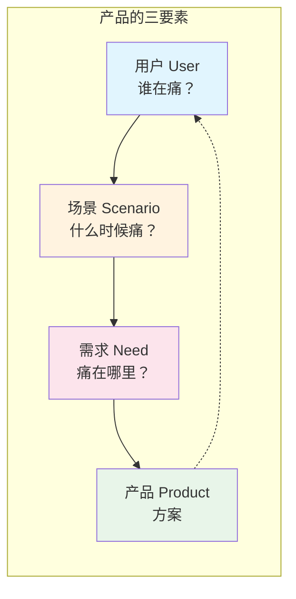
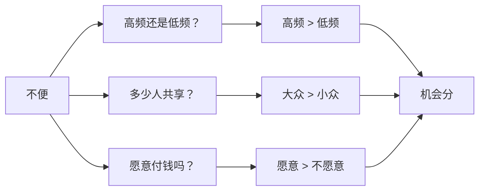
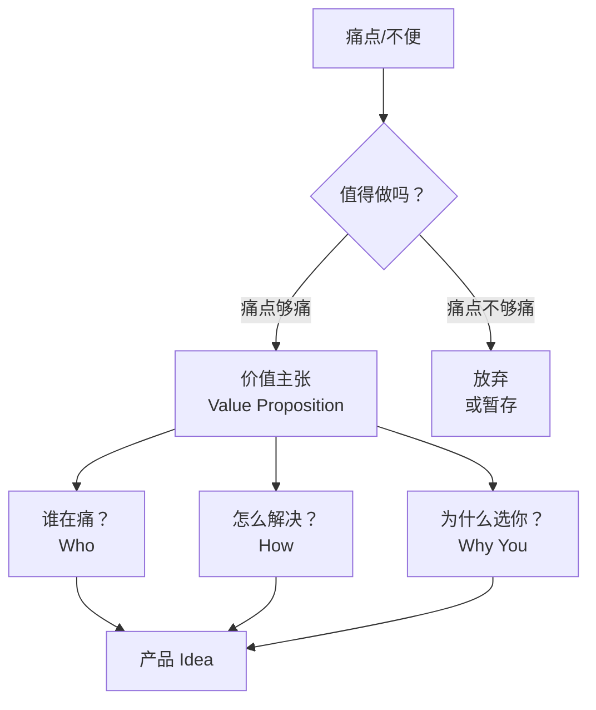

# 补充课13：什么是产品？

> 产品不是功能的集合，产品是**问题的解决方案**。在你写一行代码之前，先搞清楚你在解决谁的什么问题。

## 一、产品的定义：解决特定问题的方案

大多数人误解了"产品"这个词。他们认为产品是一个App、一个网站、一个软件——不，那些只是**载体**。产品是**解决特定用户在特定场景下的特定问题的方案**。

### 产品的三要素



**三要素缺一不可：**

| 要素 | 定义 | 错误示例 | 正确示例 |
|------|------|---------|---------|
| **用户** | 谁有这个痛点？ | "所有人"（太宽泛） | "独立开发者，需要快速原型验证" |
| **场景** | 在什么情境下发生？ | "任何时候"（不具体） | "在咖啡馆临时想改代码，没带电脑" |
| **需求** | 痛点是什么？ | "需要一个好工具"（太模糊） | "手机上看服务器日志，紧急修复Bug" |

> [!WARNING] 常见误区
> 很多人说"我有一个产品 idea"时，实际只有半个要素——通常是"我要做一个XX功能的App"。但功能 ≠ 产品。没有明确的用户、场景、需求，功能就是空中楼阁。

### 好产品 vs 差产品的根本区别

| 维度 | 差产品 | 好产品 |
|------|-------|-------|
| 痛点 | 解决"伪痛点"（用户不痛的） | 解决"真痛点"（用户每天在忍受的） |
| 用户 | "我觉得用户需要这个" | 用户亲口说"我太需要这个了" |
| 场景 | 假设的场景 | 真实发生的场景 |
| 解决方案 | 堆砌功能 | 最小化解决核心痛点 |
| 验证 | 做完了才问用户 | 做之前先问用户 |

> [!TIP] 好产品的自检标准
> 如果你的产品消失了，会有用户**真的感到难过**吗？如果答案是"不会"，那你的产品还不够好。好产品不是"用起来还不错"，而是"没有了会痛"。

## 二、练习：发现日常生活中的机会

产品能力的核心不是写代码，而是**发现痛点**。这个能力可以通过刻意练习获得。

### 练习一：列出你日常生活中的10个不便

拿出一张纸（或打开备忘录），回想过去24小时内你遇到的**所有不便**：

**示例：**
1. 早上找钥匙花了5分钟
2. 早餐店排队太长
3. 地铁上看文章，晃动的屏幕让眼睛很累
4. 开会时找不到之前共享的文档
5. 外卖送到时已经凉了
6. 想查某个概念，搜索结果全是广告
7. 收到验证码短信被垃圾短信淹没
8. 给照片加水印要打开PS太麻烦
9. 多个平台密码记不住
10. 晚上躺在床上想起白天有一封邮件忘了回

**现在，每个不便后面加两行：**
- 这影响了什么？（浪费时间？损失金钱？影响情绪？）
- 谁会和我有同样的问题？

### 练习二：评估市场规模

对于每个不便，问自己三个问题：



| 问题 | 权重 | 说明 |
|------|------|------|
| 这个不便多久发生一次？ | 高 | 每天发生 vs 每年一次，商业价值差300倍 |
| 有多少人有这个不便？ | 高 | 1万人 vs 100万人，市场天花板不同 |
| 他们愿意为此付钱吗？ | 最高 | 愿意付费才是真需求 |

> [!TIP] 规模的判断
> 不要追求"所有人都需要"的产品。**1万个愿意付费的用户 > 100万个免费用户**。小而美的产品往往比大而全的产品更容易成功。

## 三、从不便到产品 Idea

发现痛点只是第一步，把痛点转化为产品 idea 是第二步。

### 转化框架



### 示例：从不便到产品

| 不便 | 产品想法 | 目标用户 | 付费意愿 |
|------|---------|---------|---------|
| 给图片去背景要打开PS太麻烦 | 一键在线去背景工具 | 电商卖家、自媒体 | 高（省时间=省钱） |
| 写了文章排版太丑 | Markdown美化工具 | 博客作者 | 中 |
| 找不到合适的英文邮件模板 | 英文邮件AI助手 | 外贸从业者 | 高 |

### 你的练习

选一个你在"练习一"中发现的不便，填写这个模板：

```markdown
**我的产品 Idea：**

1. 痛点描述：________________
2. 目标用户：________________
3. 使用场景：________________
4. 当前解决方案（没有你的产品时用户怎么做的）：________________
5. 你的解决方案的不同之处：________________
6. 市场规模预估：大概有 ____ 人需要这个
7. 付费意愿：他们愿意付 ____ 元/月吗？
```

## 四、本课小结

| 核心要点 | 一句话记住 |
|---------|-----------|
| 产品定义 | 产品 = 解决特定用户在特定场景下的特定问题 |
| 三要素 | 用户 + 场景 + 需求，缺一不可 |
| 好产品标准 | 用户会因为失去它而难过 |
| 发现痛点 | 回顾日常不便，每个不便都是机会 |
| 市场规模 | 高频 + 有人群 + 愿付费 = 好机会 |

## 课后检查清单

- [ ] 理解产品的三要素（用户、场景、需求）
- [ ] 列出你今天遇到的5个不便
- [ ] 选1个不便，填写产品Idea模板
- [ ] 估算你的产品Idea的市场规模
- [ ] 确认你的Idea解决的是"真痛点"还是"伪痛点"

---

*产品能力不是天赋，是练出来的。从今天开始，把自己变成一个"痛点探测器"——你会发现，周围到处都是机会。*