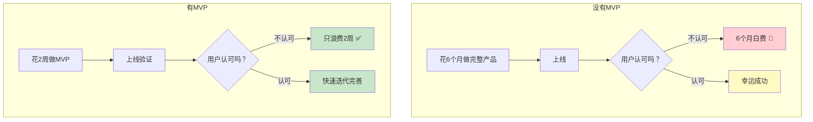
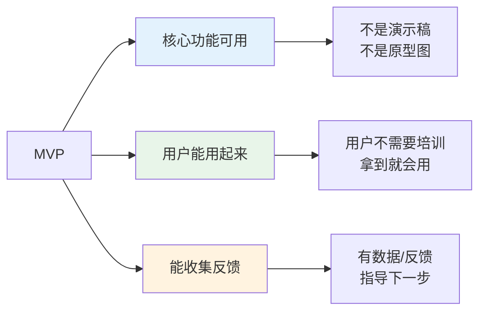
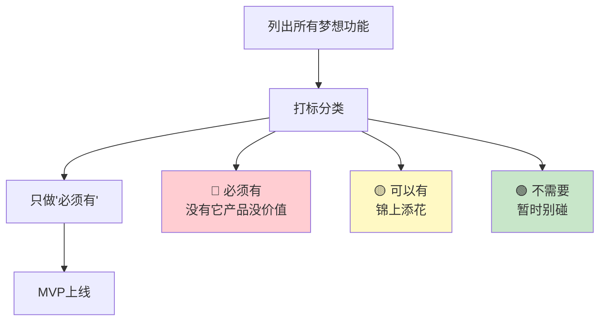
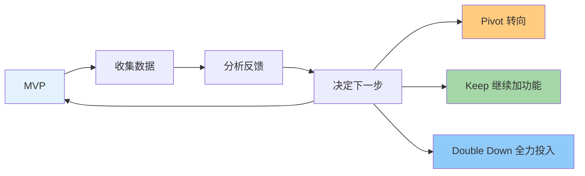

# 补充课14：什么是MVP？

> **MVP不是偷工减料的借口，而是精益创业的核心武器。** 做最少的功能，验证最核心的假设。

## 一、MVP 的定义：最小可行产品

**MVP** = Minimum Viable Product（最小可行产品）。

它是一个**刚好能验证核心价值假设**的产品版本。不是最终产品，不是完美产品——而是能用最少的投入回答"用户真的需要这个吗？"的最小版本。

### 为什么需要 MVP？



**没有MVP的风险：**
- 花了6个月做出一款没人要的产品
- 把最宝贵的资源浪费在错误的假设上
- 等你发现方向错了，已经没钱没时间了

**有了MVP的好处：**
- 2周验证核心假设
- 方向对了再投入，方向错了快速掉头
- 用户反馈从第一天就开始收集

> [!TIP] MVP 的核心思维
> MVP 不是为了省钱，而是为了**加速学习**。你最快的学习方式不是闭门造车，而是让真实用户使用你的产品。

## 二、MVP 的三个特征

不是所有"不完整的东西"都叫 MVP。真正的 MVP 必须同时满足三个条件：



### 特征一：核心功能可用

用户能**真正完成核心任务**。不是点击演示，不是静态页面。

| ✅ 是 MVP | ❌ 不是 MVP |
|----------|-----------|
| 用户能上传图片并下载去背景结果 | 只有上传按钮，点了没反应 |
| 用户能输入文字并生成AI回复 | 只有输入框，生成的是假数据 |
| 用户能注册、付费、使用产品 | 付费按钮是装饰 |

### 特征二：用户能用起来

MVP 应该是**开箱即用**的。用户不应该需要学习手册、教程视频或客服解释。

**自检：**
- 一个新用户打开产品，3秒内知道"这是什么"吗？
- 10秒内能完成核心操作吗？
- 需要写 README 或用户手册来教用户用吗？（需要说明太复杂了）

### 特征三：能收集反馈

MVP 必须内置**反馈机制**。没有反馈的 MVP 只是半成品。

**收集反馈的方式：**
- 用户行为数据（点击、停留、流失）
- 简易反馈按钮（"好用吗？👍👎"）
- 联系我们的方式
- 付费转化率（最真实的反馈）

> [!WARNING] 不是MVP的陷阱
> - ❌ 只有登录页没有实际功能 → **这是落地页，不是MVP**
> - ❌ 功能太多但不稳定 → **这是臃肿的半成品**
> - ❌ 只有一个功能但没有核心价值 → **这是玩具，不是MVP**
> - ❌ 有Bug导致用户无法完成任务 → **这是不可用的东西**

## 三、确定 MVP 的步骤

### 四步法



### 案例：做一款AI写作助手

**第一步：列出所有梦想功能**
- AI生成文章
- AI改写润色
- 多语言翻译
- 导出为PDF/Word
- 团队协作
- 写作模板库
- 语法检查
- 历史记录
- 字数统计
- 多账号切换
- 集成到Notion
- 手机App

**第二步：打标分类**

| 功能 | 分类 | 理由 |
|------|------|------|
| AI生成文章 | 🔴 必须有 | 核心价值：帮用户写东西 |
| AI改写润色 | 🟡 可以有 | 增值功能，但MVP可以没有 |
| 导出 | 🟢 不需要 | 用户可先复制粘贴 |
| 团队协作 | 🟢 不需要 | 只有1个用户时不需要协作 |
| 模板库 | 🟡 可以有 | 有更好，但MVP可以不着急 |
| 手机App | 🟢 不需要 | Web版本先验证 |

**第三步：只做"必须有"**

只有**一个功能**：输入主题 → AI生成文章 → 复制结果。

这就是 MVP。

**第四步：MVP上线**

> [!TIP] 关键原则
> 如果你在 MVP 阶段觉得"这个功能不加不行"（但实际上没有它用户也能用），你是在给自己找借口。**砍功能比加功能难，但砍功能才是 MVP 的精髓。**

## 四、案例：Raphael AI 的 MVP

Raphael AI（课程主讲人小李哥的产品）是一个经典的 MVP 案例。

### 最初版本

Raphael AI 的 MVP 只有**一个页面、一个功能**：

```
[一个输入框]
输入描述...

[生成按钮]
生成图片

[展示区域]
生成的图片
```

没有任何多余的：
- ❌ 没有用户注册/登录
- ❌ 没有历史记录
- ❌ 没有分享功能
- ❌ 没有图片编辑
- ❌ 没有付费（初期完全免费）
- ❌ 没有教程
- ❌ 没有帮助中心

### 为什么这个 MVP 成功了？

| 因素 | 说明 |
|------|------|
| **核心价值清晰** | 用户来了就知道：输入文字→生成图片 |
| **使用门槛极低** | 不需要注册，打开就能用 |
| **反馈直接** | 看用户每天生成多少次、是否重复使用 |
| **方向验证** | 在没有付费的情况下，每天6万新增用户 → 说明需求真实存在 |

### MVP 之后的迭代

用户验证了需求 → 逐步增加功能：

```
MVP → 加注册（留存用户） → 加历史记录 → 加付费 → 加高级功能
```

每一步迭代都基于真实数据和用户反馈，不是拍脑袋。

> [!TIP] 关键启示
> Raphael AI 的 MVP 完美体现了"做最少功能"的哲学。它在 MVP 阶段甚至没有用户系统——因为你不需要用户系统来验证"人们需不需要AI生成图片"这个核心假设。

## 五、MVP 之后：基于反馈迭代

MVP 不是终点，是**起点**。验证了核心假设之后，进入迭代循环。

### 迭代循环



### 三种可能的方向

| 方向 | 含义 | 什么时候选择 |
|------|------|------------|
| **Keep** | 继续加功能 | 用户活跃、反馈正面、验证了需求 |
| **Pivot** | 转向 | 用户用了但不是特别满意、活跃度低 |
| **Double Down** | 全力投入 | 活跃度高、有付费意愿、增长快 |

### MVP 检查表

每次上线 MVP，检查这些：

```markdown
核心验证：
[] 用户完成了核心任务吗？
[] 用户愿意回来再用吗？
[] 用户愿意推荐给朋友吗？
[] 用户愿意付费吗？（如果有定价）
[] 我们从MVP中学到了什么？
```

**如果所有答案都是"否"，你该 Pivot。**

### 常见错误

1. **MVP 做得太大** —— 功能太多，花了好几个月才上线
2. **MVP 做得太小** —— 小到完全没有核心价值
3. **MVP 后没有跟进** —— 上线了就不管了
4. **不接受负面反馈** —— 用户说不需要，你说"他们不懂"

## 六、本课小结

| 核心要点 | 一句话记住 |
|---------|-----------|
| MVP 定义 | 最小可行产品 = 刚好能验证核心假设的最小版本 |
| 三个特征 | 核心功能可用 + 用户能用起来 + 能收集反馈 |
| 确定步骤 | 列功能 → 打标 → 只做"必须有" |
| 案例 | Raphael AI 的 MVP 只有一个输入框和一个生成按钮 |
| 迭代 | MVP 是起点，不是终点 |

## 课后检查清单

- [ ] 理解 MVP 的三大特征
- [ ] 列出你当前产品的所有功能（或你想做的产品的功能）
- [ ] 用用🔴🟡🟢 给功能打标
- [ ] 删除所有"可以有"和"不需要"——只保留"必须有"
- [ ] 计划用2周内做完这个 MVP

---

*MVP 不是懒人的借口，是聪明人的策略。记住：你做的每行代码要么在验证假设，要么在浪费生命。*