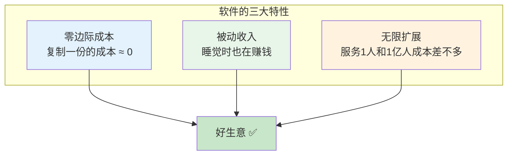
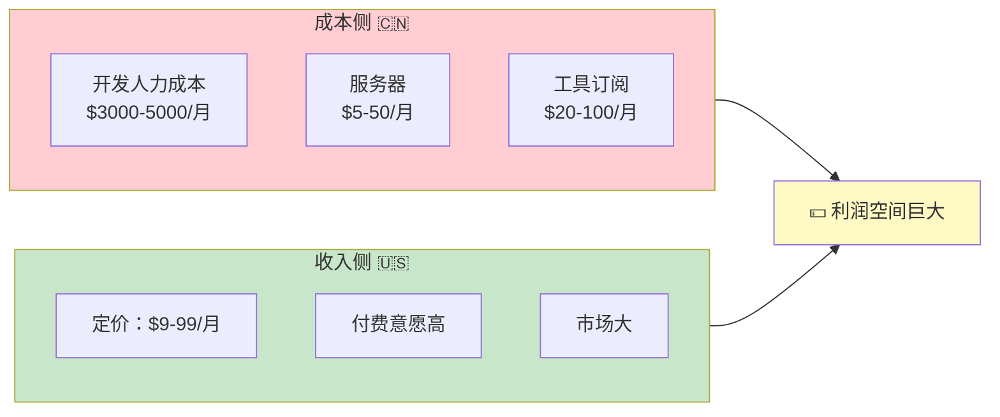
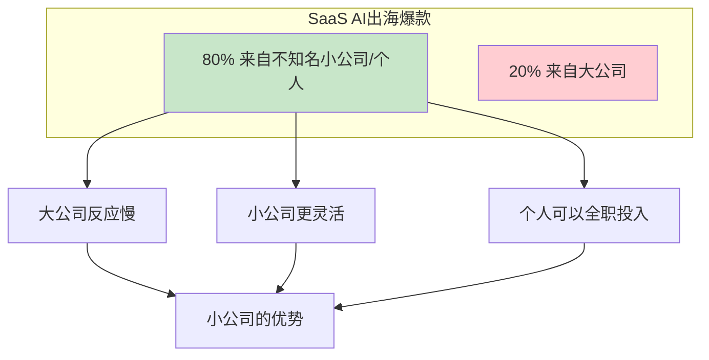
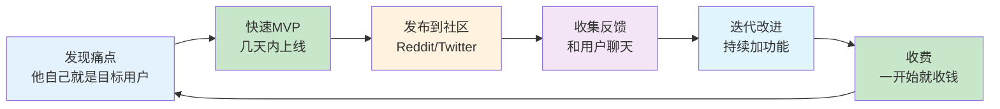
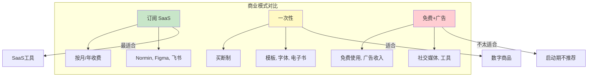

# 补充课15：海外软件产品是一门怎样的生意？

> **软件是最好的商业模式。** 没有之一。没有库存、没有物流、没有边际成本，全球70亿人都是你的潜在客户。

## 一、为什么软件是"最好的商业模式"？

### 软件的三个魔法特性



**比较不同生意的特性：**

| 生意类型 | 边际成本 | 可扩展性 | 被动收入 |
|---------|---------|---------|---------|
| 餐饮店 | 高（每份食材都要钱） | 低（一个店只能服务那么多人） | 否（关门就没收入） |
| 电商卖货 | 中（进货+物流+仓储） | 中 | 部分（需要持续运营） |
| **软件/SaaS** | **≈ 0** | **无限** | **是** |
| 咨询/服务 | 高（时间换钱） | 低 | 否 |
| 内容创作 | 低 | 高 | 是 |

> [!TIP] 零边际成本的意义
> 当你开发了一个软件，第1个用户服务成本是100元，第10000个用户的服务成本可能只增加了50元（服务器费用）。这就是"睡后收入"的基础。

### 软件生意的两种类型

| 类型 | 代表 | 特点 |
|------|------|------|
| **SaaS（订阅制）** | Notion, Figma, Slack | 按月/年收费，收入可预测 |
| **一次性销售** | 模板、电子书、字体 | 简单直接，但收入不持续 |

最好的策略：**先做一次性销售验证需求，再做SaaS收订阅费。**

## 二、中国成本 + 发达国家收入 = 巨大利润优势

这是做海外软件生意最核心的**套利逻辑**。



### 数据对比

| 维度 | 中国 | 海外（美国为主） |
|------|------|----------------|
| 月消费能力 | $10-50/月 | $100-500/月 |
| 为软件付费意愿 | 低（习惯了免费） | 高（习惯为价值付费） |
| 单人开发月成本 | $3000-5000 | $8000-15000 |
| 月收入天花板 | ¥10万-50万 | $10万-100万+ |

> [!TIP] 付费意愿差距
> 同样一个AI写作工具，面向中国市场定价¥19.9/月会被说"太贵了"，面向美国市场定价$19/月用户觉得"很合理"。**同样的产品，海外收入是国内的10-30倍。**

### 套利公式

```
利润 = (海外收入) - (中国成本)
     = ($19/月 × 用户量) - ($3000/月)
```

假设你做到1000个付费用户，月收入$19000，减去你的生活成本$3000 — **月纯利$16000（约¥11.5万）**。

**这个目标一个人 + AI + 3个月就能实现。** 这不是鸡汤，是正在发生的现实。

## 三、关键数据：80%的AIGC出海爆款来自小公司

### 市场格局已变

你可能以为AI产品市场被大公司垄断了。事实恰恰相反：



**为什么小公司反而更占优势？**

| 因素 | 大公司 | 小公司/个人 |
|------|-------|------------|
| 决策速度 | 需要层层审批 | 今天想，明天做 |
| 试错成本 | 高（资源投入大） | 低（MVP快速验证） |
| 创新意愿 | 保守，怕影响现有业务 | 激进而灵活 |
| AI使用深度 | 有顾虑（数据安全等） | 最大化使用 |
| 对用户的理解 | 通过报告间接了解 | 直接和用户聊天 |

> [!TIP] 这是你的时代
> AI编程的出现进一步降低了"小"的门槛。以前一个人做产品需要会前端、后端、设计、运维——现在AI帮你搞定了大部分。一个人 + AI = 一家可以服务全球的软件公司。

## 四、单人公司案例：Pieter Levels

Pieter Levels 是单人公司最具代表性的案例之一。

### 他的成绩

| 指标 | 数据 |
|------|------|
| 年收入 | **$300万+** |
| 团队规模 | 1人（就是他自己） |
| 产品数量 | 多个（Nomad List, Remote OK等） |
| 技术栈 | PHP + jQuery（非常朴素！） |
| 用户 | 全球数百万数字游民 |

### 他的方法



**Pieter Levels 的核心原则：**
1. **为自己做产品** — 他做的产品他自己就是用户，天然理解需求
2. **快速上线** — 一个MVP不超过1周
3. **在用户所在的地方推广** — 而不是建宣传渠道
4. **一开始就收费** — 验证付费意愿
5. **持续迭代** — 产品上线只是开始

> [!WARNING] 关键启示
> Pieter Levels 用的技术是PHP + jQuery，这在今天看来"过时"了。但他年入$300万。**技术选型不重要，解决对的问题才重要。** 有了AI，你更没有借口了。

## 五、海外软件生态

做海外产品，最幸福的是基础设施极其完善。

### 核心工具链

| 类别 | 推荐 | 月费 | 为什么选它 |
|------|------|------|-----------|
| **支付** | Stripe | 2.9%+$0.30/笔 | 事实标准，API一流 |
| **部署** | Vercel | 免费起步 | 和Next.js无缝集成 |
| **数据库** | Supabase | 免费起步 | 开源、功能强大 |
| **CDN/安全** | Cloudflare | 免费起步 | 全球加速、DDoS防护 |
| **域名** | Cloudflare/Porkbun | $8-15/年 | 平价不溢价 |
| **邮件** | Resend/SendGrid | 免费起步 | API友好 |
| **设计** | Tailwind + shadcn/ui | 免费 | 开箱即用的组件库 |

### 为什么这些很重要

**你不需要自己搭建任何东西。** 10年前，一个开发者要自己管服务器、配置数据库、处理支付——每件事都耗时耗力。现在：

```
Stripe → 5分钟集成支付
Vercel → 1分钟部署上线
Supabase → 5分钟建好数据库
Cloudflare → 1分钟配置域名和CDN
```

**加起来不到15分钟，你就拥有了世界上最好的基础设施。**

> [!TIP] 生态的力量
> 海外软件生态的成熟，让你可以专注于"做什么"，而不是"怎么部署"。"以前需要运维团队做的事，现在一个人 + 几个API就能搞定。"

## 六、商业模式对比：哪种适合你？

### 三种主流模式



### 详细对比

| 维度 | SaaS 订阅 | 一次性销售 | 免费+广告 |
|------|----------|-----------|---------|
| **收入可预测性** | 高（每月稳定） | 低（波动大） | 低 |
| **客户生命周期价值** | 高（长期付费） | 低（一次交易） | 中 |
| **开发复杂度** | 高（需要支付+账号系统） | 中（支付即可） | 高（需要大量用户） |
| **适合什么** | 持续使用的工具 | 模板/电子书/资源 | 大众级应用 |
| **推荐度** | ⭐⭐⭐⭐⭐ | ⭐⭐⭐ | ⭐⭐ |

> [!TIP] 给新手的建议
> 从**一次性销售**开始（验证需求），然后转型**SaaS订阅**（持续收入）。广告模式需要海量用户，不适合起步阶段。

## 七、本课小结

| 核心要点 | 一句话记住 |
|---------|-----------|
| 软件是最好的生意 | 零边际成本 + 全球分发 + 被动收入 |
| 套利优势 | 中国成本 + 海外收入 = 巨大利润 |
| 市场格局 | 80% AI出海爆款来自小公司/个人 |
| Pieter Levels | 一个人年入$300万，技术不重要，需求重要 |
| 基础设施 | Stripe/Vercel/Supabase/Cloudflare — 全部免费起步 |

## 课后检查清单

- [ ] 理解"零边际成本"对商业的意义
- [ ] 算一笔账：你的产品定价$19/月，能做到多少付费用户才能达到月入$10k？
- [ ] 注册 Stripe 账号（不需要立即使用）
- [ ] 注册 Vercel 账号（不需要立即使用）
- [ ] 思考：你身边有没有"可以用软件解决"的痛点？
- [ ] 列出3个你觉得可以用 AI 做的海外产品方向

---

*软件是世界上最好的生意——你写一次代码，卖一万次。在AI时代，一个人就能做出服务全球的产品。这不是未来，是现在。*