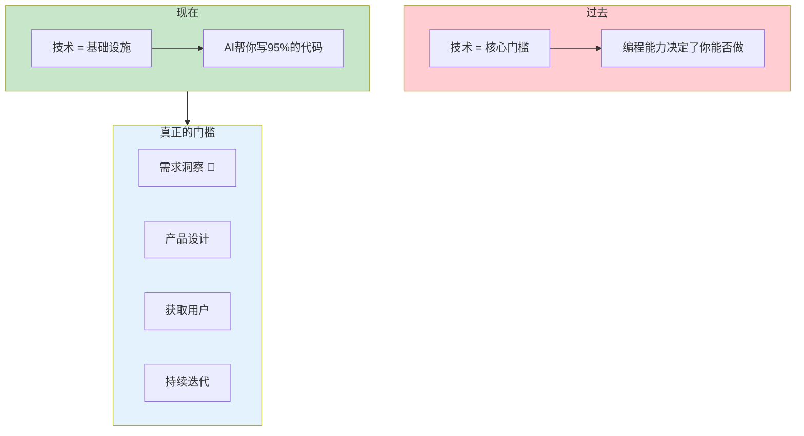
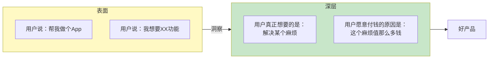
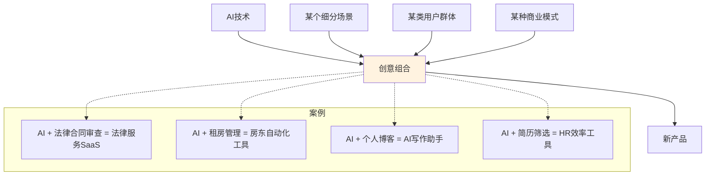
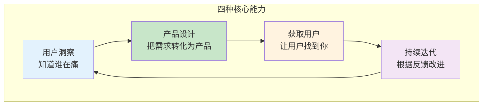
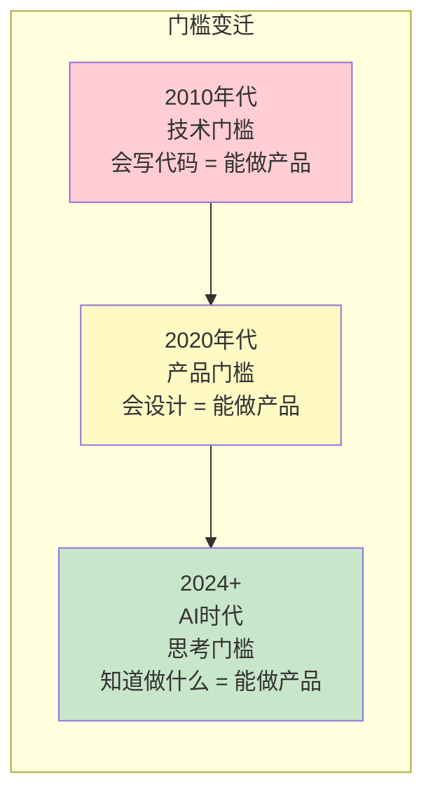
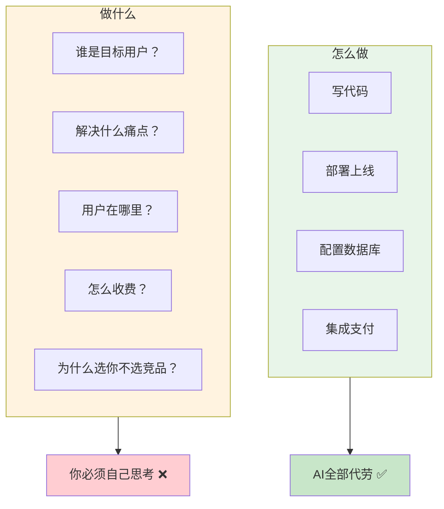

# 补充课16：软件生意真正的门槛是什么？

> **"我不会写代码"从来不是问题——"我不知道该做什么"才是。** AI时代，技术门槛正在归零，但思考门槛从未降低。

## 一、常见误解：技术是门槛

如果你问100个人"为什么不做软件生意？"，90个人会回答："因为我不会写代码。"

这个认知在AI时代已经彻底过时了。

### 技术的真实地位



**过去：** 技术是门槛。你不会写代码，产品就做不出来。
**现在：** AI帮你写代码，你只需要告诉它做什么。

但是——大多数人卡在了"做什么"这一步。

> [!WARNING] 技术焦虑的真相
> 如果你还在担心"我技术不够好做不了软件"，你可能还没意识到：**有技术的人也在用AI，他们比你更焦虑的是"做什么产品"。** 技术能力的差距被AI抹平了，思考能力的差距被AI放大了。

### 自测：技术真的是问题吗？

问自己这个问题：

**"如果明天我掌握了世界级的编程能力，我知道要做什么产品吗？"**

如果你的答案是"不知道"或"不确定"——那么技术从来就不是你的问题。

## 二、真正的门槛：需求洞察能力 + 创意组合

### 需求洞察：看见别人看不见的痛



**需求洞察不是"用户要什么就给什么"，而是理解用户真正在痛什么。**

| 级别 | 理解深度 | 例子 |
|------|---------|------|
| 初级 | 用户说了什么 | "我想要一个能记笔记的App" |
| 中级 | 用户想要什么 | "我需要整理我的知识" |
| **高级** | **用户为什么想要** | **"我每天看到好文章想收藏，但散落在各处，找不回来，产生焦虑"** |

> [!TIP] 洞察力的训练
> 需求洞察能力是可以训练的。核心方法是：**连续问5个"为什么"**。
> - 用户："我想要一个记账App。"
> - 为什么？"因为我不知道钱花哪了。"
> - 为什么？"因为我每次月底都超支。"
> - 为什么？"因为我买东西时没有预算意识。"
> - 为什么？"因为付款太容易了，花的时候没感觉。"
> - 为什么？"因为没有一个实时的'花销痛感'反馈。"
>
> 看，真正的问题不是"记账"，而是"需要花钱的痛感反馈"。这才是产品机会。

### 创意组合

创新不是从零创造，而是**已有元素的重新组合**。



**创意组合的公式：**
```
新产品 = AI能力 × 细分场景 × 特定用户 × 商业模式
```

**案例拆解：**

| 产品 | 组合了什么 | 为什么赚钱 |
|------|-----------|-----------|
| AI翻译器A | AI翻译 + 法律文件翻译 + 律师 | 律师文档翻译价格高、格式要求严格 |
| AI翻译器B | AI翻译 + 跨境电商 + 小商家 | 小商家每天要翻译产品描述，成本敏感 |
| AI翻译器C | AI翻译 + 实时字幕 + 会议 | 跨国会议需要实时翻译 |

同样是"AI翻译器"，为什么赚钱程度不同？**因为切入的场景和用户不同。**

> [!TIP] 关键问题
> 不要问"我该做什么产品"，要问"**什么场景下，谁在用AI解决什么问题，并且愿意付多少钱**"。

## 三、技术之外的重要能力

### 四种核心能力



| 能力 | 定义 | 和AI的关系 | 可以AI代劳吗？ |
|------|------|-----------|--------------|
| **用户洞察** | 发现并理解真实痛点 | AI可以帮你分析数据，但洞察来自你对人的理解 | ❌ 不能 |
| **产品设计** | 把需求转化为可用的产品 | AI可以帮你画原型、写代码 | ⚠️ 部分可代劳 |
| **获取用户** | 让目标用户找到并使用你的产品 | AI可以帮你写文案、做SEO | ⚠️ 部分可代劳 |
| **持续迭代** | 基于反馈不断改进产品 | AI可以帮你分析用户行为数据 | ❌ 不能 |

> [!WARNING] 核心认知
> 四种能力中，**最不能外包给AI的是"用户洞察"和"持续迭代"**。因为它们都依赖于"你和真实用户的直接互动"。AI可以是你和用户之间的放大器，但不能替代你理解你的用户。

### 能力自测表

| 能力 | 你现在什么水平？ | 怎么提升？ |
|------|-----------------|-----------|
| 用户洞察 | 1-10分 | 多和潜在用户聊天，每天做"痛点日记" |
| 产品设计 | 1-10分 | 多拆解成功产品，问"为什么这么做" |
| 获取用户 | 1-10分 | 在目标用户所在的社区活跃，提供价值 |
| 持续迭代 | 1-10分 | 先上线再优化，不要追求完美 |

**你的短板在哪里？在那里投入最多的时间。**

## 四、AI时代的门槛迁移

### 门槛的演变



### "怎么做" vs "做什么"



**"怎么做"正在被AI快速自动化：**
- 写代码 → AI生成
- 设计UI → AI生成
- 部署运维 → 平台自动化
- 测试 → AI生成测试用例
- 文案 → AI生成

**"做什么"的价值在急速上升：**
- 选择什么方向 → 必须自己判断
- 解决什么痛点 → 必须自己发现
- 服务什么用户 → 必须自己定位
- 怎么收费 → 必须自己测试
- 怎么获客 → 必须自己执行

> [!TIP] 最重要的认知转变
> 不要再花时间学"怎么写代码"了。AI比你写得好、写得快。**把时间花在"理解用户"、"洞察需求"、"设计体验"上**——这些是AI暂时替代不了你，而且未来3-5年内也很难替代的。

## 五、心态：技术能力从来不是壁垒

### 事实核查

| 成功产品 | 创始人的技术背景 | 启示 |
|---------|----------------|------|
| Pieter Levels 的 Nomad List | 自学PHP | 不需要科班出身 |
| Raphael AI | 非技术背景，用Lovable做原型 | 不需要写代码 |
| Notion | 创始人Ivan Zhao是设计师 | 设计思维 > 技术能力 |
| 微信小程序生态 | 大量非技术背景创业者 | 业务理解 > 技术能力 |

**结论：技术能力从来不是壁垒。过去不是，现在更不是。**

### 你应该建立的信心

```markdown
我的优势可能在于：
- ✅ 我对某个行业有深入理解（医疗/法律/教育/房产...）
- ✅ 我知道某群人的真实痛点（因为我就是他们的一员）
- ✅ 我有现成的用户渠道（社群/公众号/行业圈子）
- ✅ 我能快速学习迭代（学得比AI更快）

我最大的劣势是：
- ❌ 我觉得"我不会写代码所以做不了"
  → 这是幻觉，AI可以帮你写95%
```

> [!TIP] 你的超级武器
> 你对某个领域的**深度理解** + **AI的编程能力** = 不可替代的竞争力。技术公司出身的人懂技术但不懂行业，你懂行业+AI=无敌。

### 最后的心态转变

```mermaid
flowchart TD
    OldM[旧心态<br/>"等我学会编程再开始"] --> DeadEnd[永远学不会<br/>永远不开始]
    NewM[新心态<br/>"我用AI先做个最简单的版本"] --> Action[行动起来<br/>边做边学]
    Action --> Result[拿产品去验证<br/>用户反馈告诉你答案]

    style OldM fill:#ffcdd2
    style NewM fill:#c8e6c9
    style Result fill:#e3f2fd
```

## 六、本课小结

| 核心要点 | 一句话记住 |
|---------|-----------|
| 技术不是门槛 | AI已经把技术门槛拉到接近零 |
| 真正的门槛 | 需求洞察 + 创意组合 + 产品思维 |
| 四种能力 | 用户洞察、产品设计、获取用户、持续迭代 |
| 门槛迁移 | 从"怎么做"到"做什么" |
| 心态 | 你的行业理解才是真正的壁垒 |

## 课后检查清单

- [ ] 承认并接受：技术不是你的问题，不知道该做什么才是
- [ ] 选一个你熟悉的行业/场景，列出3个"可以用AI解决的痛点"
- [ ] 对每个痛点连续问5个"为什么"，找到真正的深层需求
- [ ] 用"创意组合"公式，尝试组合出3个产品idea
- [ ] 自测你的四种能力（1-10分），制定1个提升计划

---

*技术从不是壁垒，思考才是。在AI把"怎么做"变成免费的今天，"做什么"的价值比任何时候都高。别再问"我能不能做"，开始问"我该做什么"。*