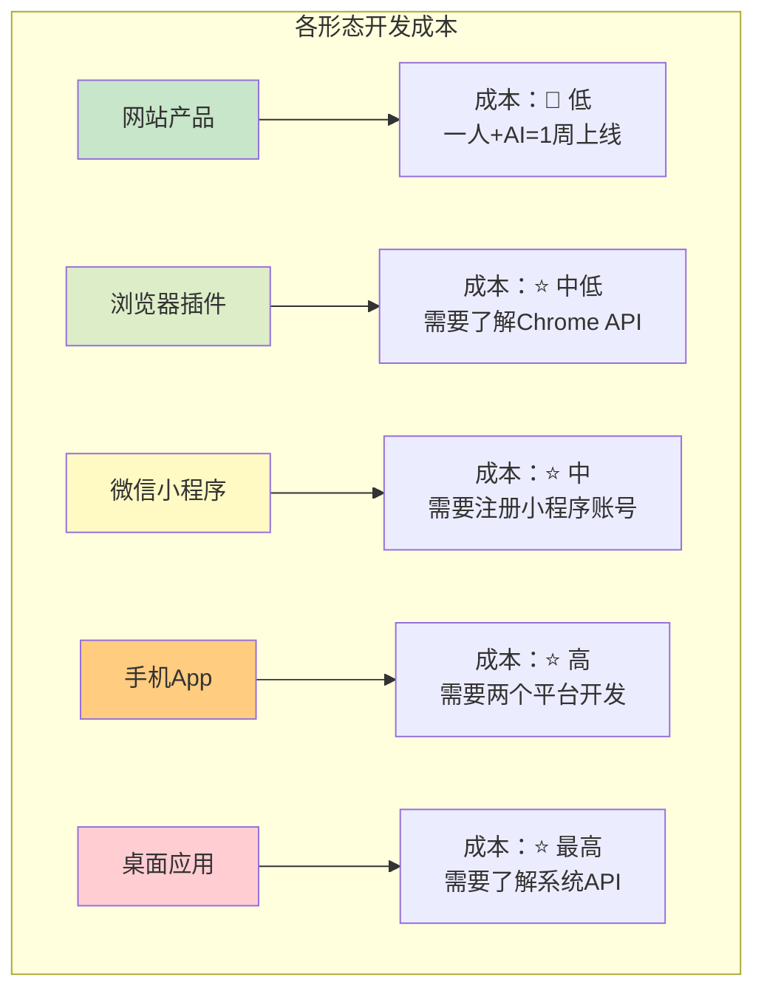
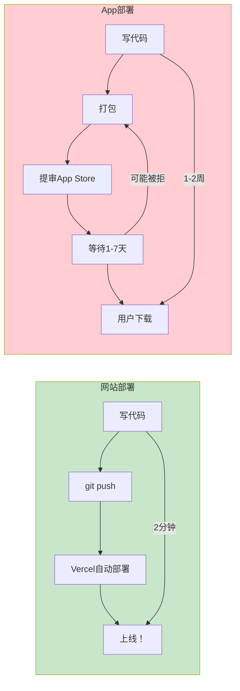
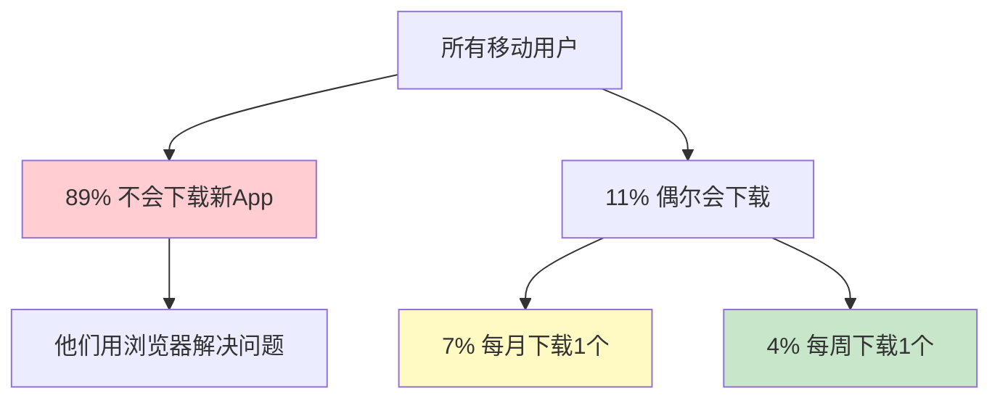
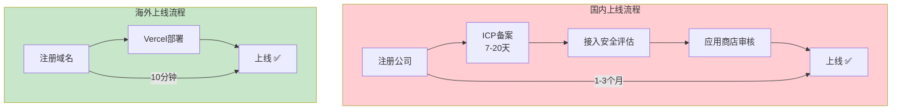
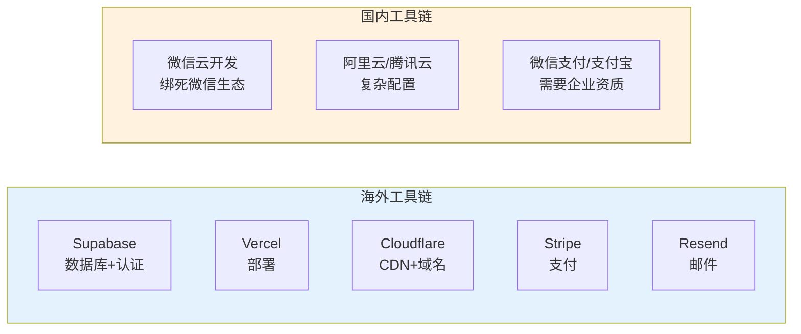
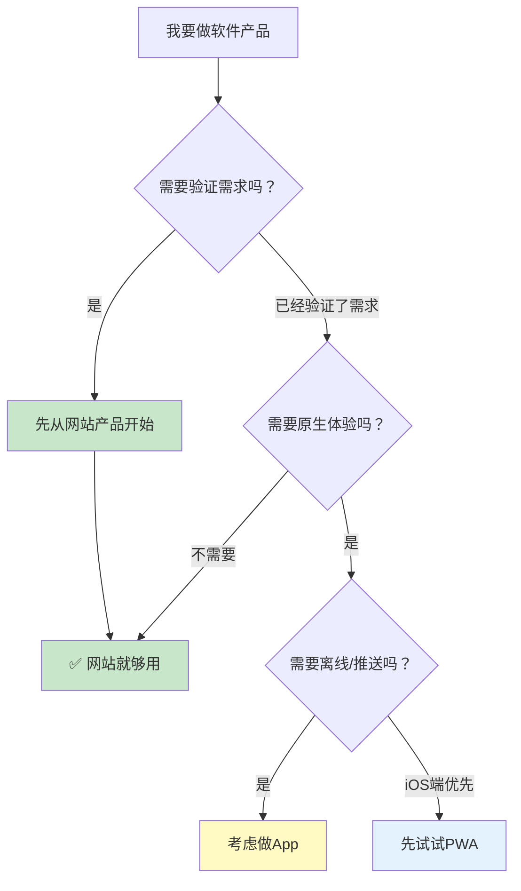

# 补充课17：为什么要从海外网站产品开始？

> **Web是软件产品的"新手友好模式"。** 不需要审核、不需要备案、不需要下载——写好代码就是上线。

## 一、Web成本最低

### 开发成本对比



| 形态 | 上线周期 | 开发成本 | 迭代速度 | 适合新手？ |
|------|---------|---------|---------|-----------|
| **Web** | 1-7天 | $0-50/月 | 每日可多次部署 | ⭐⭐⭐⭐⭐ |
| 浏览器插件 | 3-14天 | $0-50/月 | 需审核更新 | ⭐⭐⭐ |
| 微信小程序 | 7-30天 | ~$300认证费/年 | 需审核1-3天 | ⭐⭐⭐ |
| 手机App | 30-90天 | ~$100/年+设备 | 需审核1-7天 | ⭐⭐ |
| 桌面应用 | 30-90天 | 中 | 需打包分发 | ⭐⭐ |

> [!TIP] 为什么Web最快？
> Web开发的本质是：**写代码 → 部署 → 用户访问。** 没有中间环节。而App需要：写代码 → 打包 → 提交审核 → 等待通过 → 用户下载 → 用户打开。这中间差了"等待审核"这个不可控因素。

### Web的部署效率



**Web：** 改一行代码 → git push → 自动部署完成（全程不到2分钟）
**App：** 改一行代码 → 重新打包 → 提交审核 → 等1-7天 → 用户下载更新

> [!WARNING] 迭代速度决定生存
> 在MVP阶段，你每天都需要根据用户反馈改产品。Web可以一天改10次。App一天改1次都费劲。**迭代速度直接决定你能否在早期快速找到PMF。**

## 二、89%的用户不会下载App

### 移动端真相

这组数据可能会颠覆你的认知：



**数据来源：** Comscore 移动应用行为研究报告

**这意味着什么？**

| 你的产品形态 | 潜在用户触达 |
|------------|------------|
| 网站 | 100%的移动用户 + 100%的桌面用户 |
| App | 11%愿意下载新App的用户 |

> [!TIP] 不是App不好，是获客成本太高
> App本身不是问题——很多成功的产品都是App。问题是：**在验证需求阶段，让用户下载App的成本远高于让用户打开一个网页。** 等你验证了需求、有了用户基础，再考虑做App也不迟。

### 用户使用场景差异

| 场景 | 用户会怎么选 |
|------|------------|
| 朋友推荐一个工具 | 先打开链接看看 → 好用再决定 |
| 搜索结果找到一个工具 | 直接点开网页试用 |
| 看到广告推广 | 点进去看看是什么 |
| 需要用某个功能 | Google搜索 → 找到网页 → 使用 |

**在所有"第一次接触"的场景中，网页都是用户的首选入口。**

## 三、不需要ICP备案，不需要软件著作权

### 监管对比

| 维度 | 国内产品 | 海外产品（面向海外用户） |
|------|---------|---------------------|
| **ICP备案** | 必须 | 不需要 |
| **软件著作权** | 应用商店需要 | 不需要 |
| **内容审查** | 严格 | 宽松 |
| **个人资质** | 个人做限制多 | 个人可以做 |
| **支付牌照** | 需要有资质的第三方 | Stripe个人即可 |



**国内做产品的隐性门槛：**
1. 需要ICP备案（个人备案限制域名数量）
2. 需要公司资质才能上架某些平台
3. 需要软件著作权才能上架应用商店
4. 个人开发者收款受限

**海外做产品的自由：**
1. 不需要任何备案
2. 不需要公司资质
3. 不需要软件著作权
4. 个人即可用Stripe收款

> [!TIP] 不是不能做国内，而是不要从国内开始
> 如果你最终想服务国内用户，可以先在海外验证产品->有用户->有收入->再回国内合规化运营。**"先活下来，再合规"是务实的策略。**

## 四、海外基础设施更好

### 工具生态对比



| 需求 | 海外最佳选择 | 国内对应选择 | 差距 |
|------|------------|------------|------|
| 数据库 | Supabase（免费起步） | 微信云开发 / 阿里云 | Supabase DX更好 |
| 部署 | Vercel（免费起步，git push即部署） | 阿里云Serverless | Vercel体验遥遥领先 |
| 支付 | Stripe（个人可注册，API世界级） | 微信支付/支付宝（需要企业资质） | Stripe完胜 |
| 域名DNS | Cloudflare（免费，配置简单） | 阿里云DNS / DNSPod | Cloudflare更好 |
| 身份认证 | Supabase Auth / Clerk | 微信登录 | 海外体验更统一 |
| 邮件 | Resend / SendGrid | 阿里邮件推送 | 海外更成熟 |

> [!TIP] 基础设施的红利
> 海外工具生态的核心优势不是"功能更强"，而是**"为开发者设计"**。每一个工具的API都经过精心设计，文档清晰，集成简单。你用Vercel部署网站，git push就自动上线——这种体验在国内还没有对标产品。

## 五、利用汇率优势：中国成本 / 海外收入

### 经济模型

```
你的成本（人民币计价）:
  - 服务器: ¥36/月（$5）
  - ️ 工具订阅: ¥70/月（$10）
  - 生活成本: ¥15,000/月
  合计: ≈ $2,200/月

你的收入（美元计价）:
  - 100个付费用户 × $19/月 = $1,900/月
  - 盈亏平衡点只需 ≈ 120个付费用户

汇率套利:
  - 用¥15,000/月的生活成本，赚$1,900/月的收入
  - 实际购买力 = $1,900 × 7.2 = ¥13,680
  - 在海外，$1,900/月仅够基本生活
  - 在中国，$1,900/月 = 高收入水平
```

**这就是"中国成本 + 海外收入"的核心套利逻辑。**

## 六、网站产品 vs App 对比

### 详细对比表

| 维度 | 网站产品 | App |
|------|---------|-----|
| **开发成本** | $0-50/月 | $100-200/年 + 设备 |
| **上线速度** | 1天 | 1-4周 |
| **迭代速度** | 每天多次 | 每次审核1-7天 |
| **分发** | 链接即可 | 需要商店审核 |
| **获客** | SEO/社交分享/链接 | ASO/应用商店 |
| **用户体验** | 受限（浏览器内） | 原生体验更好 |
| **离线支持** | 有限 | 完善 |
| **推送通知** | 需要用户授权 | 原生支持 |
| **支付集成** | Stripe（简单） | 内购（苹果抽成30%） |
| **用户获取成本** | 低 | 高 |
| **适合阶段** | MVP-验证期 | 成熟期 |

### 决策指南



## 七、什么时候应该考虑App？

虽然我们强烈推荐从Web开始，但以下情况可以考虑App：

| 情况 | 说明 | 时机 |
|------|------|------|
| 核心功能需要离线使用 | 笔记App、地图工具等 | Web验证后 |
| 需要硬件访问（相机/蓝牙/传感器） | 扫码、AR、健康监测 | Web验证后 |
| 用户需要推送通知 | 社交、提醒类产品 | Web验证后 |
| 需要更好的性能 | 游戏、图形处理 | Web验证后 |
| 用户已经付费证明需求 | 有稳定收入 | Web验证后 |
| 需要上架应用商店获取信任 | 金融、医疗类 | Web验证后 |

> [!TIP] 经验法则
> **永远从Web开始，直到Web成为瓶颈。** 99%的产品在MVP阶段不会有"Web不够用"的问题。等你真的遇到Web瓶颈时，你已经有用户、有收入、有数据——做App的投入就变得合理了。

## 八、本课小结

| 核心要点 | 一句话记住 |
|---------|-----------|
| Web成本最低 | 1天上线，每天迭代多次 |
| 89%不下载App | 用户更愿意打开网页而不是下载 |
| 无监管门槛 | 不需要ICP备案、软著、企业资质 |
| 基础设施好 | Supabase/Vercel/Stripe/Cloudflare免费起步 |
| 汇率红利 | 中国成本 + 海外收入 = 巨大利润 |
| 从Web开始 | 直到Web成为瓶颈再考虑App |

## 课后检查清单

- [ ] 理解为什么Web是最快验证产品的形态
- [ ] 注册Vercel账号并部署一个Hello World页面
- [ ] 注册Cloudflare账号并绑定一个域名
- [ ] 注册Supabase账号并创建一个项目
- [ ] 对比：你的产品idea做Web还是做App？
- [ ] 想一个"你本来觉得必须App才能做，但实际上Web就够"的场景

---

*Web不是终点，是起点。先把产品做出来、验证需求、赚到钱——到那时候，你自然知道下一步该做什么。别在不该花钱的地方花钱，别在不该花时间的地方花时间。*