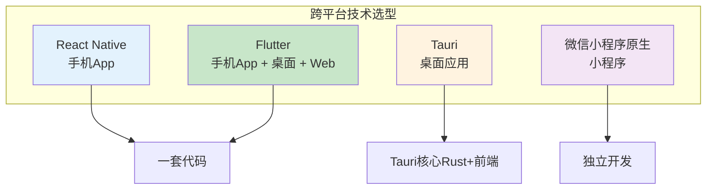
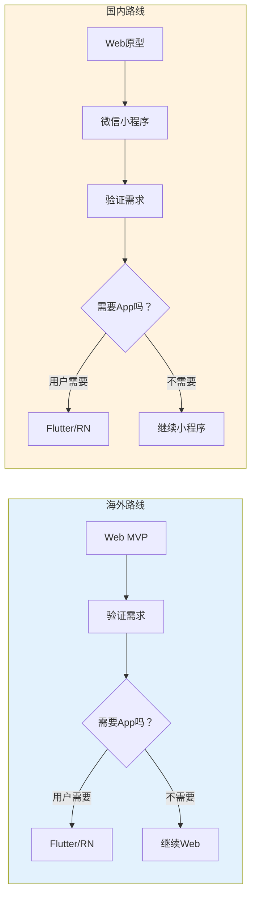
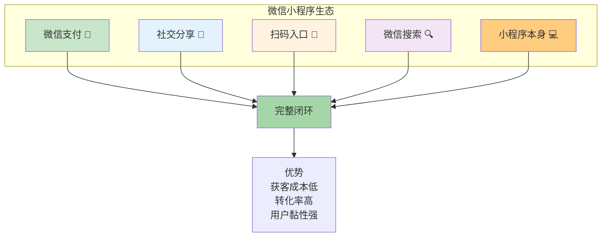
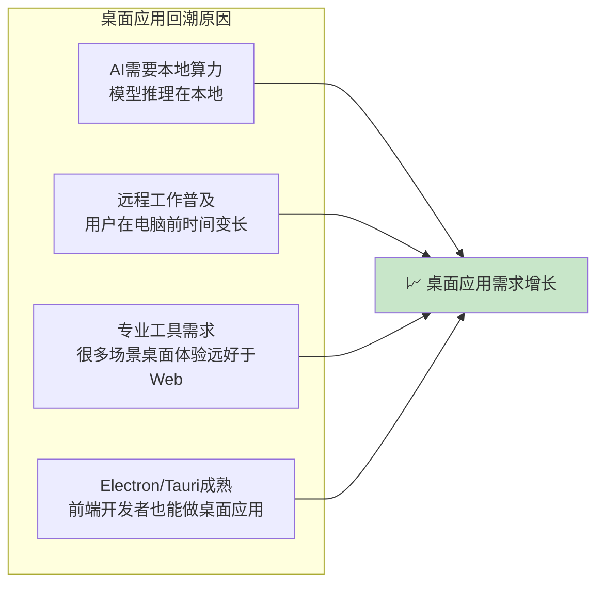
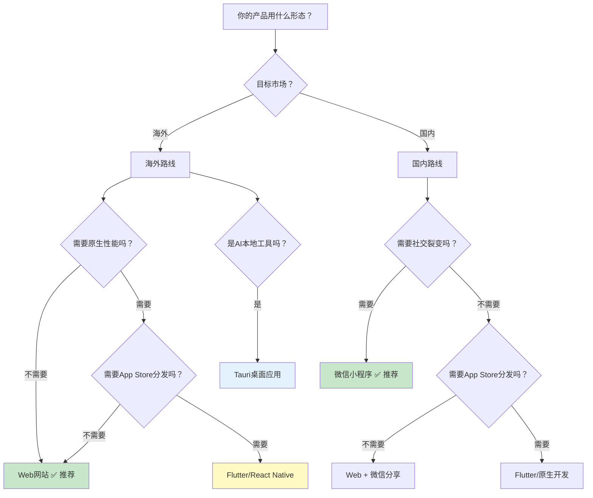
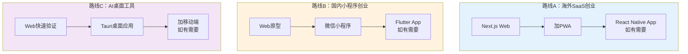

# 补充课18：手机应用/小程序/桌面应用可以吗？

> **技术上都可以做，但"可以"不等于"应该"。** 正确的选择取决于你的目标市场、产品类型和当前阶段。

## 一、结论先行：技术上都可以

首先回答最直接的问题：**手机App（iOS/Android）、小程序（微信/支付宝）、桌面应用（Mac/Windows）——技术上都能做。**

而且随着跨平台技术的发展，一个人用AI开发全部形态已经成为现实。

### 跨平台技术对比

| 技术 | 目标平台 | 语言 | 学习曲线 | 推荐度 |
|------|---------|------|---------|-------|
| **React Native** | iOS + Android | JavaScript/TypeScript | 中 | ⭐⭐⭐⭐ |
| **Flutter** | iOS + Android + Web + 桌面 | Dart | 中高 | ⭐⭐⭐⭐⭐ |
| **Tauri** | 桌面（Mac/Windows/Linux） | Rust + 前端 | 高（Rust） | ⭐⭐⭐ |
| **Electron** | 桌面（Mac/Windows/Linux） | JavaScript | 中 | ⭐⭐⭐ |
| **微信小程序** | 微信内 | JavaScript | 低 | ⭐⭐⭐⭐（国内） |
| **PWA** | 浏览器可安装 | JavaScript | 低 | ⭐⭐⭐⭐（Web增强） |

> [!TIP] 推荐路线
> - **海外市场**：Web（Next.js）→ 如有需要 → Flutter/React Native
> - **国内市场**：Web原型验证 → 微信小程序
> - **桌面应用**：Tauri（2026年趋势）→ 有用户基础后考虑
>
> **不要一开始就决定最终形态。先用Web验证，再根据需求扩展。**

## 二、推荐路线：海外→Web，国内→小程序

### 为什么是这条路线？

### 海外的逻辑

| 原因 | 说明 |
|------|------|
| 用户习惯 | 海外用户习惯在浏览器中找工具 |
| 分发简单 | 链接就是入口 |
| 支付集成 | Stripe完美支持Web |
| 审核 | 不需要 |
| SEO | Google索引网站 > App Store发现 |

### 国内做小程序的逻辑

| 原因 | 说明 |
|------|------|
| 微信生态 | 10亿+月活，获客成本极低 |
| 社交裂变 | 小程序分享到群/朋友圈，天然传播 |
| 支付集成 | 微信支付无缝集成 |
| 无需安装 | 扫码即用，类似Web体验 |
| 开发简单 | 微信开发者工具 + AI辅助 |

> [!WARNING] 国内的个人App困境
> 在国内做iOS/Android App，个人开发者面临：应用商店审核严格、需要软著、需要企业资质才能上架某些分类、个人开发者收款受限。**而微信小程序对个人开发者友好得多。**

## 三、微信小程序生态优势

微信小程序不仅仅是"一个App的替代品"，它本身就是一个完整的生态。

### 小程序 vs 独立App（国内市场）

| 维度 | 微信小程序 | 独立App |
|------|-----------|---------|
| **获客成本** | 极低（扫码/搜索/分享） | 高（应用商店推广） |
| **开发成本** | 低 | 高（iOS+Android） |
| **审核周期** | 1-3天 | 1-7天 |
| **个人开发者** | 友好（个人可注册） | 限制多 |
| **支付** | 微信支付（个人可申请） | 需要企业资质 |
| **用户留存** | 中（微信内使用） | 高（桌面上可见） |
| **分享传播** | 天然支持（群/朋友圈） | 需要自己实现 |
| **适合** | 工具类、内容类、电商 | 高粘性、高频使用 |

> [!TIP] 微信小程序的隐藏红利
> 微信搜索流量正在快速增长。很多用户直接在微信里搜索"XX工具"，小程序有机会获得免费的自然流量。这在App Store和安卓商店是难以想象的。

## 四、桌面应用新趋势：2026年桌面应用回潮

### 为什么桌面应用在回归？

你可能觉得"现在都是移动端，桌面应用过时了"——但数据表明，**桌面应用正在经历一波回潮**。

### 桌面应用 vs Web vs App

| 维度 | 桌面应用 | Web | 手机App |
|------|---------|-----|--------|
| **性能** | 最高 | 中 | 中 |
| **离线能力** | 天生支持 | 有限 | 好 |
| **本地文件访问** | 完全 | 受限 | 受限 |
| **AI本地算力** | 可以利用GPU | 受限于浏览器 | 受限于手机 |
| **分发** | 需下载安装 | 链接 | 应用商店 |
| **开发难度** | 中（Tauri/Electron） | 低 | 中高 |
| **适合场景** | 专业工具、AI桌面应用 | 大多数SaaS | 移动场景 |

### 桌面应用开发技术选择（2026）

| 技术 | 性能 | 包体积 | 学习曲线 | 推荐场景 |
|------|------|--------|---------|---------|
| **Tauri** | ⭐⭐⭐⭐⭐ | 小（~5MB） | 中（需Rust基础） | AI桌面工具、性能敏感型 |
| **Electron** | ⭐⭐⭐ | 大（~150MB） | 低（前端即可） | 快速验证桌面需求 |
| **Flutter桌面** | ⭐⭐⭐⭐ | 中 | 中 | 跨平台统一UI |
| **PWA（安装到桌面）** | ⭐⭐⭐ | 极小 | 低 | 轻量工具 |

> [!TIP] 2026年桌面应用的黄金窗口
> AI模型的本地化部署趋势让桌面应用重新变得重要。如果你做的产品涉及：
> - 本地AI推理（图像生成、语音识别）
> - 大量文件处理（视频编辑、文档处理）
> - 高性能计算（数据分析、3D渲染）
> **桌面应用可能是比Web更好的选择。**

## 五、各形态完整对比

### 全方位对比表

| 维度 | Web网站 | 微信小程序 | iOS/Android App | 桌面应用 |
|------|---------|-----------|----------------|---------|
| **开发成本** | $0-50/月 | ~¥300/年认证费 | $100/年+设备 | $0（开源工具） |
| **开发周期** | 1-7天 | 3-14天 | 30-90天 | 14-60天 |
| **上线速度** | 即时 | 审核1-3天 | 审核1-7天 | 即时（自己分发） |
| **迭代速度** | 每日多次 | 审核1-3天 | 审核1-7天 | 即时 |
| **分发渠道** | 搜索引擎/链接 | 微信生态 | App Store/安卓商店 | 官网下载/GitHub |
| **获客难度** | 低（SEO+社交） | 低（社交裂变） | 高（ASO+推广） | 中（SEO+社区） |
| **用户触达** | 100% | 微信10亿用户 | 需下载 | 需下载安装 |
| **付费率** | 中（Stripe方便） | 高（微信支付无缝） | 高（但苹果抽成30%） | 中（自己收钱） |
| **离线支持** | 有限（PWA可改善） | 有限 | 好 | 最好 |
| **硬件访问** | 有限 | 有限 | 好 | 最好 |
| **AI集成熟度** | 高（API调用） | 有限（需服务器） | 高（API+本地） | 最高（本地+API） |
| **适合阶段** | MVP-成长期 | 国内增长期 | 成熟期 | 成熟期 |

### 决策树

## 六、路线图建议

### 推荐的学习路线

根据你的目标，选择不同的路线：

**核心原则：**
1. **先验证，再投入** — 用最快的形态验证需求
2. **先做一种，再扩展** — 不要一开始就想做全平台
3. **跟随用户** — 用户在哪里，你的产品就去哪里
4. **保持灵活** — 技术选型可以切换，核心是产品本身

> [!TIP] 最终建议
> - 如果你是**新手**：从Web开始（Next.js + Vercel + Supabase），这是最快的
> - 如果你做**国内市场**：Web原型 → 微信小程序，这是获客成本最低的
> - 如果你做**AI本地工具**：Web验证 → Tauri桌面应用，这是性能最好的
> - 不要纠结技术选型，**用你最熟悉的、最快速的方式把产品做出来**

## 七、本课小结

| 核心要点 | 一句话记住 |
|---------|-----------|
| 技术上都可以 | 跨平台技术成熟，AI辅助可降低开发成本 |
| 海外首选Web | 成本最低、迭代最快、不需要审核 |
| 国内首选小程序 | 获客成本低、社交裂变强、微信支付无缝 |
| 桌面应用回潮 | AI本地算力需求驱动，Tauri是2026年趋势 |
| 决策原则 | 先验证 → 再做全平台，不要一开始就想大而全 |

## 课后检查清单

- [ ] 明确你的目标市场：海外还是国内？
- [ ] 根据市场选择初始产品形态
- [ ] 列出你的产品需要用到哪些"非Web"功能（离线/硬件/推送）
- [ ] 判断这些功能是否真的在MVP阶段必须
- [ ] 尝试用最快的形态（Web或小程序）做一个原型
- [ ] 了解Tauri的基本概念，思考你的产品是否需要桌面端

---

*技术选型不是决定成败的因素，产品本身才是。先用最快的路径验证你的想法，用户和市场会告诉你下一步该怎么走。不要在选择工具上浪费时间——用户不在乎你用什么技术，他们只在乎产品好不好用。*