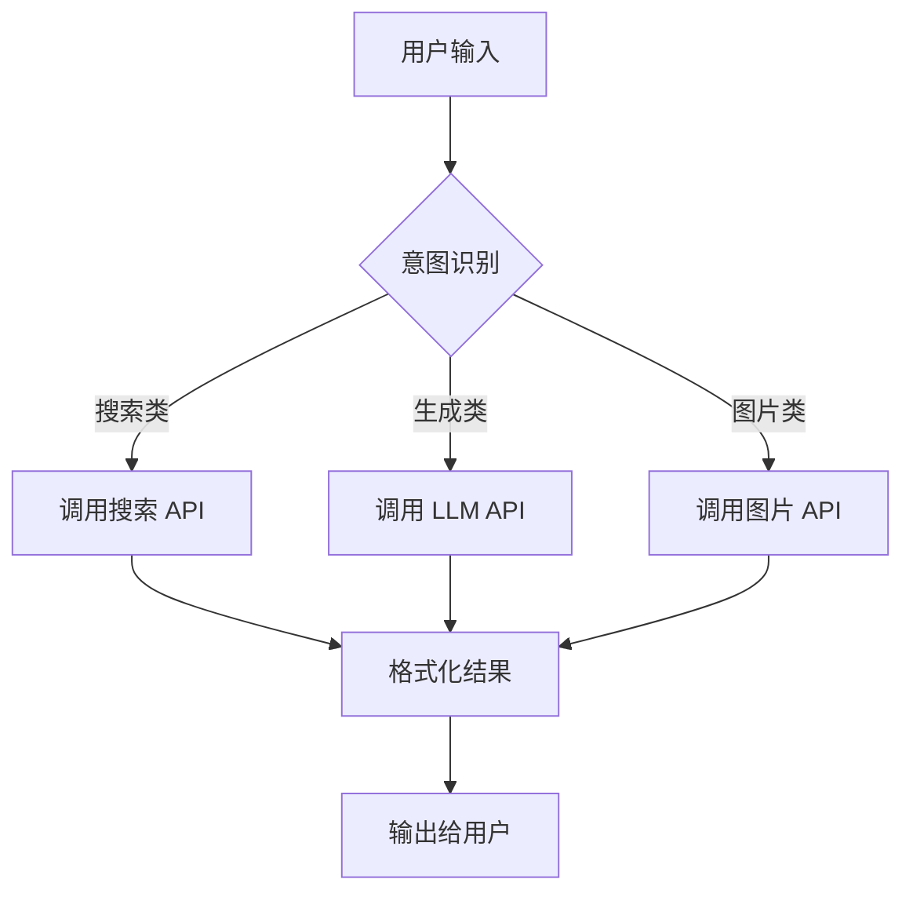

# 补充课20：更酷的API从哪来？

> API 组合 = 无限可能 — 2 种 API 组合 = 10000 种可能

## 学习目标

- 学会用扣子（Coze）发现和组合 API
- 掌握 Coze 工作流模板的复制与修改
- 了解主流 API 平台及其特点
- 学会用 AI 帮你发现 API

---

## 1. 用扣子（Coze）发现和组合 API

[扣子（Coze）](https://www.coze.com) 是字节跳动推出的 AI Bot 开发平台，也是发现和组合 API 的最佳起点之一。

### 为什么选择 Coze？

| 特性 | 说明 |
|------|------|
| 零代码 | 不需要写代码就能组合 API |
| 丰富插件 | 内置大量第三方 API 插件 |
| 工作流 | 可视化编排 API 调用顺序 |
| 一键发布 | 组合好的 Bot 可直接发布为 API |

### Coze 的核心功能

1. **Bot 商店** — 浏览别人做好的 Bot，看它用了什么 API
2. **插件市场** — 发现各种功能的 API 插件
3. **工作流编辑器** — 拖拽式编排 API 调用逻辑
4. **知识库** — 给 Bot 注入私有数据

> [!TIP] 发现 API 的技巧
> 在 Coze Bot 商店搜索你感兴趣的功能，看热门 Bot 都用了哪些插件。这就是一个活的 API 发现引擎。

---

## 2. Coze 工作流模板

工作流是 Coze 最强大的功能之一。它让你以可视化的方式编排多个 API 的调用顺序。

### 常见工作流模板



### 模板示例：AI 内容创作助手

```
步骤 1: 接收用户主题
步骤 2: 调用搜索 API 获取相关资料
步骤 3: 调用 LLM API 生成文章初稿
步骤 4: 调用图片 API 生成配图
步骤 5: 组合输出完整内容
```

### 学习方法

1. **复制** — 找到热门模板，直接复制到自己的工作区
2. **修改** — 调整参数，替换 API，改成自己的版本
3. **发布** — 测试通过后，发布为 API 接口

> [!WARNING] 关键提醒
> 不要从零开始造轮子。Coze 工作流模板库里已经有大量现成的模板，站在别人的肩膀上是最快的方式。

---

## 3. 发布为 API

在 Coze 中完成工作流编排后，可以一键发布为 API：

1. 创建工作流并测试
2. 点击"发布"
3. 选择"API"作为发布渠道
4. 获取 API Endpoint 和 Token
5. 集成到你的产品中

**这样，你不需要自己写任何后端代码，就有了一个完整的、可商用的 API。**

---

## 4. API 平台汇总

### 主流 API 平台

| 平台 | 地址 | 主打方向 | 特点 |
|------|------|---------|------|
| **OpenRouter** | [openrouter.ai](https://openrouter.ai) | 多种 LLM | 统一接口访问所有大模型 |
| **Together.ai** | [together.ai](https://together.ai) | 开源模型 | 最快的开源模型推理 |
| **fal.ai** | [fal.ai](https://fal.ai) | 图像/视频 | 低延迟的媒体生成 |
| **Replicate** | [replicate.com](https://replicate.com) | 各类模型 | 模型种类最丰富 |
| **SiliconFlow** | [siliconflow.cn](https://siliconflow.cn) | 国产模型 | 国内可用，无需翻墙 |

### 各平台详细说明

#### OpenRouter

- 覆盖 OpenAI、Anthropic、Google、Meta 等全部主流模型
- 提供统一的 API 格式，切换模型只需改一个参数
- 按量计费，支持信用卡/PayPal
- 适用场景：需要灵活切换不同 LLM 的产品

#### Together.ai

- 专注开源模型推理优化
- 速度比自部署快 5-10 倍
- 支持 Llama、Mistral、DeepSeek 等
- 适用场景：需要低成本开源模型的生产环境

#### fal.ai

- 图像和视频生成的行业标杆
- 延迟极低（通常 < 1 秒）
- 支持 Stable Diffusion、Runway 等
- 适用场景：实时图像/视频生成产品

#### Replicate

- 模型沙盒，类似"模型版的 GitHub"
- 社区贡献的海量模型变体
- 每个模型都有在线体验和完整文档
- 适用场景：快速原型验证

#### SiliconFlow

- 国产平台，国内网络直接访问
- 支持主流开源模型
- 支付宝/微信支付
- 适用场景：面向国内用户的产品

---

## 5. API 组合的无限可能

> 2 种 API 组合 = 10000 种可能

这不是夸张。假设你有：

- 5 种文本模型（GPT-4、Claude、Llama...）
- 3 种图片模型（SD、DALL-E、Midjourney...）
- 2 种语音模型（Whisper、ElevenLabs...）
- 2 种搜索 API（Google、Bing...）

排列组合：5 x 3 x 2 x 2 + 各种流程变体 = 10000+ 种不同的产品形态。

### 组合示例

| API 组合 | 能做什么产品 |
|---------|------------|
| LLM + 搜索 | AI 搜索引擎、写作助手 |
| LLM + 图片 | AI 配图工具、海报生成器 |
| LLM + 语音 | AI 语音助手、会议纪要 |
| 图片 + 视频 | AI 视频生成、动效制作 |
| 搜索 + 数据分析 | 市场调研工具、舆情监控 |

---

## 6. 用 AI 帮你发现 API

当你想做一个产品但不知道用什么 API 时，直接问 AI：

### 提示词模板

```
我想做一个 [产品描述]，请帮我推荐：
1. 需要哪些 API？
2. 每个 API 有哪些选择？
3. 推荐的平台是？
4. 大概的成本预估？

举例：
我想做一个 AI 头像生成器：
1. 上传头像 → 人脸检测 API
2. 选择风格 → 图片生成 API
3. 生成结果 → 图片处理 API
4. 支什付费 → 支付 API
```

> [!TIP] 效率技巧
> 用 AI 发现 API 时，问得越具体，得到的答案越有用。加上"给我 3 个备选方案"可以让你有比较空间。

---

## 7. 本课小结

| 核心要点 | 一句话记住 |
|---------|-----------|
| Coze 平台 | 零代码发现和组合 API |
| 工作流模板 | 复制 → 修改 → 发布 |
| 主流平台 | OpenRouter、Together.ai、fal.ai、Replicate、SiliconFlow |
| API 组合 | 2 种 API = 10000+ 种可能 |
| AI 辅助 | 用 AI 帮你推荐 API |

---

## 课后检查清单

- [ ] 注册 Coze 账号并浏览 Bot 商店
- [ ] 复制一个工作流模板并修改
- [ ] 在 Replicate 上测试 1 个模型的 API
- [ ] 列出一个产品想法的 API 组合方案
- [ ] 用 AI 帮你推荐一个产品的 API 方案

---

## 下一步

继续学习 [补充课21：海外网站产品的变现方式](s21-bian-xian-fang-shi.md)，了解如何把你用 API 组合做出来的产品变成收入。