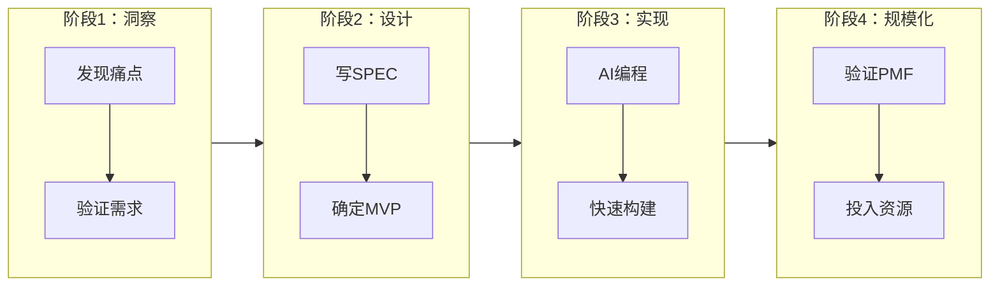
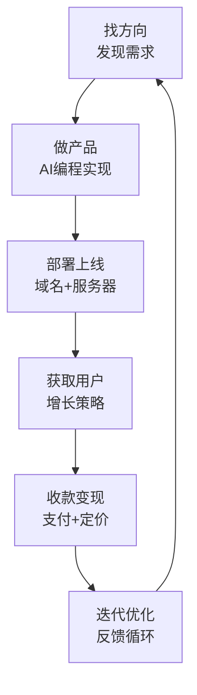

# 补充课23：用AI做软件生意的完整流程

> 做出来，发出来，根据反馈迭代 — 用 AI 做出能赚钱的软件产品

## 学习目标

- 掌握用 AI 做软件生意的 4 阶段完整流程
- 回顾课程全链路
- 了解毕业项目要求
- 获取持续学习资源

---

## 1. 4 阶段完整流程

用 AI 做软件生意，可以分为四个阶段：



### 阶段 1：洞察/需求发现

**目标：找到真实痛点**

不是"我想做个什么产品"，而是"用户需要什么"。

| 方法 | 具体操作 |
|------|---------|
| 观察抱怨 | 社评论区、朋友闲聊、自己的不便 |
| 分析竞品 | 看同行在做什么，用户的差评是什么 |
| 趋势洞察 | Toolify.ai、Product Hunt、Hacker News |
| 直接访谈 | 找 5 个目标用户聊天 |

**输出物：** 一份需求清单，每个需求包含"谁 + 什么场景 + 什么痛点"

**验证标准：** 至少有 10 个人说"如果有这个产品我会用/会付费"

> [!TIP] 需求验证的捷径
> 先做一个落地页，描述你的产品，看看有没有人注册。在写一行代码之前，你就能验证需求。工具：Carmd.co、Launchrock.

### 阶段 2：需求转产品设计

**目标：写 SPEC，确定 MVP**

把你验证过的需求转成可执行的产品设计方案。

**SPEC（产品规格书）包含：**

```
1. 产品一句话描述
2. 目标用户画像（谁会用？）
3. 核心功能列表（必须有哪些？）
4. MVP 范围（第一版做哪些？）
5. 用户流程（用户怎么用？）
6. 技术方案（用什么 API/技术栈？）
7. 定价方案（怎么收费？）
```

**MVP 原则：**

- 最少功能 + 完整闭环 = MVP
- 能用就行，不用好看
- 手动操作也行（不需要一上来就全自动）

**输出物：** 一份 1-2 页的 SPEC 文档

### 阶段 3：AI 编程实现

**目标：用 AI 快速构建**

这个阶段是最快的，也是本课程的核心：

| 步骤 | 工具 | 时间 |
|------|------|------|
| 代码框架生成 | Cursor / Claude | 1-3 小时 |
| 核心功能开发 | AI 编程 | 1-3 天 |
| UI 界面 | Tailwind + AI | 半天 |
| 部署上线 | Vercel / Railway | 1 小时 |

**AI 编程加速技巧：**

1. **写好 Prompt** — 给 AI 清晰的上下文和要求
2. **分步迭代** — 一次只做一个功能，测试通过再做下一个
3. **复用代码** — 之前项目的代码可以直接给 AI 参考
4. **让 AI 解释** — 看不懂的代码直接让 AI 解释

**输出物：** 一个能用的、已上线的产品

### 阶段 4：规模化

**目标：验证后投入更多资源**

在规模化之前，先确认产品市场匹配（PMF）：

| PMF 信号 | 判断标准 |
|---------|---------|
| 自然增长 | 用户自发推荐，不靠广告 |
| 低流失率 | 月流失 < 5% |
| 付费意愿 | 用户愿意付钱 |
| 使用粘性 | 用户每天都在用 |

**如果 PMF 验证通过：**

- 投入更多时间做功能完善
- 加大获客投入（广告、SEO、内容营销）
- 招聘/外包扩充产能
- 探索更多变现渠道

**如果 PMF 未通过：**

- 分析原因（需求假的？体验问题？定价问题？）
- 调整方向或放弃
- 启动下一个产品

> [!WARNING] 不要过早规模化
> 在没验证 PMF 之前就砸钱做推广，是最大的浪费资源的方式。先让 100 个人爱上你的产品，再想着让 10000 个人知道它。

---

## 2. 学习路径总结

本课程的学习路径分为四个篇章：

```
基础篇（第 01-05 课）
  ↓ 掌握 AI 编程基础工具
认知篇（第 06-14 课 + 补充课）
  ↓ 理解商业思维和产品思维
内功篇（即将开启）
  ↓ 深入技术内功
进阶篇（即将开启）
  ↓ 高阶实战
```

### 基础篇回顾

| 课号 | 内容 | 核心收获 |
|------|------|---------|
| 01 | 开营仪式 | 课程定位与六阶段 |
| 02 | AI 心智模型 | 理解 AI 的能力边界 |
| 03 | 编程思维 | 不需要会编程，但需要懂思维 |
| 04 | 离开舒适区 | 拥抱 AI 编程新范式 |
| 05 | 前后端与 Next.js | 全栈开发基础 |

### 认知篇回顾

| 课号 | 内容 | 核心收获 |
|------|------|---------|
| 06 | 数据库进阶 | 数据存储设计 |
| 07 | 产品设计与调试 | 用户体验和 Bug 调试 |
| 08 | 部署上线 | Vercel 部署和域名 |
| 09 | 技术术语输入 | 用 AI 学技术 |
| 10 | App 和小程序 | 多端开发 |
| 11 | Context 工程 | AI 开发效率 |
| 12 | 认证与安全 | 用户系统和安全 |
| 13 | 商业化与增长 | 变现和用户增长 |
| 14 | 全类型实战 | 综合实战项目 |
| 补19 | 发现 API | 拆解产品技术栈 |
| 补20 | API 平台 | 用 Coze 组合 API |
| 补21 | 变现方式 | 广告、订阅、Freemium |
| 补22 | 成功率 | 心态与持久性 |
| 补23 | 完整流程 | 4 阶段方法论 |

---

## 3. 课程全链路回顾

从想法到赚钱，你走过的是一条完整的链路：



### 每步对应课程

| 链路环节 | 对应内容 |
|---------|---------|
| **找方向** | 补充课19（拆解产品）、补充课20（API 发现） |
| **做产品** | 基础篇（编程）、认知篇（设计） |
| **部署上线** | 第08课（部署与域名） |
| **获取用户** | 第13课（商业化与增长、SEO） |
| **收款变现** | 补充课21（变现方式） |
| **迭代优化** | 补充课22（心态）、补充课23（流程） |

---

## 4. 毕业项目要求

### 项目目标

用 AI 独立完成一个完整的商业软件产品：

### 交付物清单

```
1. 产品说明页（一句话描述 + 目标用户 + 解决的问题）
2. 线上可访问的产品（已部署、可用）
3. 至少 1 个付费用户（或可靠的付费意向证据）
4. 产品复盘文档（做了什么、怎么做的、学到了什么）
```

### 项目建议方向

| 类型 | 难度 | 建议 |
|------|------|------|
| AI 写作工具 | ★★☆ | 垂类场景（简历、邮件、脚本） |
| AI 图片工具 | ★★☆ | 头像、海报、商品图 |
| 浏览器插件 | ★★☆ | 效率增强、信息提取 |
| 小工具 | ★☆☆ | 计算器、转换器、生成器 |

### 评分标准

| 维度 | 权重 | 说明 |
|------|------|------|
| 产品完成度 | 30% | 功能完整，能正常使用 |
| 商业化思考 | 25% | 有定价、有获客方式 |
| 技术实现 | 20% | 代码质量、架构设计 |
| 用户反馈 | 15% | 有真实用户使用 |
| 复盘总结 | 10% | 有条理的复盘 |

---

## 5. 持续学习资源

### 社区

- **生财有术** — 课程社群，持续交流
- **Indie Hackers** — 海外独立开发者社区
- **Product Hunt** — 产品发布平台，也是学习案例的地方

### 信息源

- **Hacker News** — 技术创业者的信息中心
- **TechCrunch** — 科技创投动态
- **Stripe Press** — 商业思维书籍

### 工具持续更新

- AI 编程工具一直在进化，保持关注新工具的出现
- 关注课程群里的工具推荐和案例分享
- 自己动手试，是最好的学习方式

---

## 6. 最后的鼓励

### 三个最重要的行动

> **"做出来，发出来，根据反馈迭代。"**

这九个字包含了整个课程最核心的智慧：

| 行动 | 含义 | 常见障碍 |
|------|------|---------|
| **做出来** | 不要只学不练，动手做 | 完美主义、拖延 |
| **发出来** | 不要怕丢人，发出去 | 害怕批评 |
| **根据反馈迭代** | 用户是最好的老师 | 自我中心 |

### 送给你三句话

```
1. AI 时代，一个人就是一家公司。
   你有想法，AI 帮你实现。
   
2. 你不需要成为最好的程序员，
   你只需要成为最会利用 AI 的人。
   
3. 从今天开始，从一个小产品开始。
   不要等"准备好了"再开始，
   因为永远不会有"准备好了"的那一天。
```

### 毕业不是结束

完成本课程不是终点，而是你和 AI 一起做产品的起点。

记住：
- **你的第一个产品可能很烂** — 没关系，每个人都是这样
- **你可能失败很多次** — 没关系，5% 的成功率意味着你只需要一直做
- **你会变得越来越好** — 每个产品都比上一个更好，这就是成长

**现在就开始做你的第一个产品吧。**

---

## 7. 本课小结

| 核心要点 | 一句话记住 |
|---------|-----------|
| 4 阶段流程 | 洞察 → 设计 → 实现 → 规模化 |
|完整链路 |	找方向 → 做产品 → 部署 → 获客 → 变现 → 迭代 |
| 毕业项目 |	做一个完整的商业软件产品 |
| 核心行动 |	做出来，发出来，根据反馈迭代 |

---

## 课后检查清单

- [ ] 理解 4 阶段完整流程
- [ ] 回顾课程全链路，确认每个环节都已掌握
- [ ] 确定毕业项目方向
- [ ] 制定毕业项目计划（时间表 + 里程碑）
- [ ] 开始动手做第一个产品

---

## 下一步

恭喜你完成了认知篇的学习！接下来请进入 **内功篇** 的学习，深入技术内功，让你的产品能力再上一个台阶。

这是本课程认知篇的最后一课。感谢你的学习，期待看到你做出的产品。