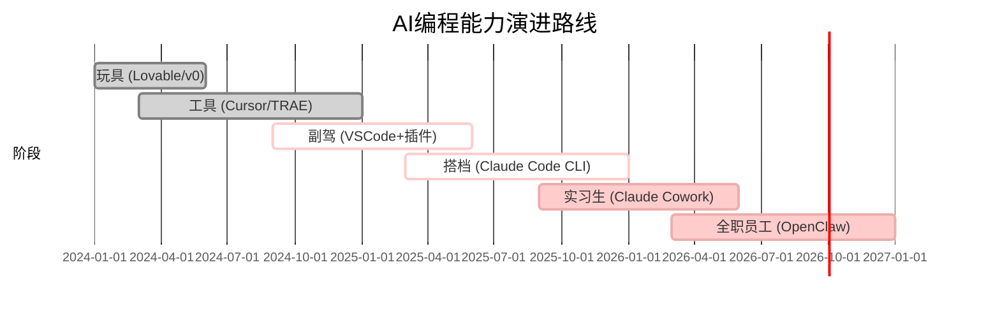

# AI编程六个阶段

> 从"一句话生成小游戏"到"手机发消息自动完成开发"，AI编程工具的能力在快速演进。理解这六个阶段，能帮你找到自己当前所处的位置，以及下一步要突破的方向。

## 六阶段总览

| 阶段 | 名称 | 工具/平台 | 能力 | 局限 |
|:----:|:----:|:---------:|:----|:----|
| 0 | 玩具 | Lovable / v0 | 一句话生成小游戏、小网站 | 做不出有人付钱的产品 |
| 1 | 工具 | Cursor / TRAE | 做出完整产品，能赚到钱 | 项目大了丢上下文 |
| 2 | 副驾 | VSCode + 插件 | 驾驭大型复杂项目 | 全程盯屏，手停口停 |
| 3 | 搭档 | Claude Code CLI | AI 跑一整夜不用管 | 手动启动，AI 不主动 |
| 4 | 实习生 | Claude Cowork | 用业务语言布置任务 | 需要实时确认 |
| 5 | 全职员工 | OpenClaw | 手机发消息就走 | 创意决策还需人类 |

## 演进路线图

```mermaid
graph LR
    subgraph ”AI编程六个阶段”
        direction LR
        T0[阶段0: 玩具] --> T1[阶段1: 工具]
        T1 --> T2[阶段2: 副驾]
        T2 --> T3[阶段3: 搭档]
        T3 --> T4[阶段4: 实习生]
        T4 --> T5[阶段5: 全职员工]
    end

    style T0 fill:#f9f,stroke:#333,stroke-width:1px
    style T1 fill:#bbf,stroke:#333,stroke-width:1px
    style T2 fill:#8cf,stroke:#333,stroke-width:1px
    style T3 fill:#4c4,stroke:#333,stroke-width:1px
    style T4 fill:#fc3,stroke:#333,stroke-width:1px
    style T5 fill:#f44,stroke:#333,stroke-width:2px
```



## 各阶段详解

### 阶段 0：玩具

- **工具**：Lovable、v0
- **能力**：输入一句话就能生成小游戏、落地页、原型
- **局限**：生成的代码难以维护，无法支撑真实商业产品
- **适用场景**：验证想法、快速原型、做个好玩的东西
- **突破关键**：理解为什么"做不出有人付钱的产品"，开始学习代码组织

### 阶段 1：工具

- **工具**：Cursor、TRAE
- **能力**：可以做出完整的 Web 应用，有人愿意付费使用
- **局限**：项目规模增大后 AI 会丢失上下文，需要频繁手动补充信息
- **适用场景**：独立开发 SaaS、落地页、中小型 Web 应用
- **突破关键**：学会管理上下文，理解项目结构

### 阶段 2：副驾

- **工具**：VSCode + 各类 AI 插件
- **能力**：能够驾驭大型复杂项目，AI 实时辅助编码
- **局限**：全程需要盯着屏幕，手停口停，无法并行
- **适用场景**：企业级项目开发、多人协作
- **突破关键**：从"自己写"到"指挥 AI 写"的思维转变

### 阶段 3：搭档

- **工具**：Claude Code CLI
- **能力**：给 AI 布置任务后它可以跑一整夜，第二天看结果
- **局限**：需要手动启动任务，AI 不会主动发起行动
- **适用场景**：批处理任务、批量重构、大规模代码迁移
- **突破关键**：学会用任务描述替代逐行指令

### 阶段 4：实习生

- **工具**：Claude Cowork
- **能力**：用业务语言（而非技术语言）布置任务
- **局限**：关键节点需要实时确认，不能完全放手
- **适用场景**：日常开发、功能迭代、Bug 修复
- **突破关键**：建立信任——知道哪些任务可以完全交给 AI

### 阶段 5：全职员工

- **工具**：OpenClaw
- **能力**：手机发一条消息，AI 自动完成从需求分析到上线的全流程
- **局限**：创意决策和战略方向仍需人类把关
- **适用场景**：完整的商业产品开发、7x24 自动化开发
- **突破关键**：从开发者转型为产品经理/创业者

## 如何判断自己处在哪个阶段？

1. 你能独立做出什么规模的产品？
2. AI 工具的参与程度是多高？
3. 你需要盯屏的时间占比是多少？
4. 你的工作流中是否有"异步任务"？

## 常见问题

**Q：一定要按顺序进阶吗？**
A：不一定。你可以跳过阶段 0 直接进入阶段 1，或者在某些场景用阶段 0 工具快速验证，在其他场景用阶段 3 工具深度开发。

**Q：高阶工具能完全替代低阶工具吗？**
A：不能。每个阶段解决不同的问题。阶段 0 适合快速原型，阶段 3 适合大规模重构——它们是互补关系。

**Q：阶段 5 之后呢？**
A：AI 编程的终极形态可能是"AI 开发 AI"，即 AI 自主设计和实现新的 AI 系统。这已经超出了"编程"的范畴。

---

> **相关课程**：[第04课：离开扣子编程，浅尝深水区](lessons/0004-li-kai-ou-zi-qian-chang-shen-shui-qu.md) — 详细讲解六个阶段并带你搭建本地开发环境