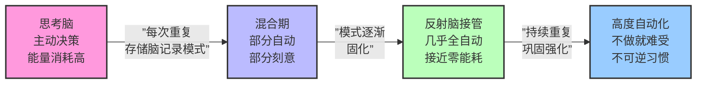

# 第01课：100天行动起源与习惯科学

## 从一道"死命令"到千万人实践

2010年前后，一位名叫**战隼**（本名赵昂）的互联网从业者在博客上持续发表关于时间管理、个人成长的文章。他的博客"战隼的学习探索"逐渐积累了一批忠实读者。但真正改变无数人生活轨迹的，是他在某一天给自己下的一道 **"死命令"**：

> 随便选一个习惯，坚持100天，无论发生什么都不能中断。

这条看似简单的规则，源于他对自己"做什么都坚持不下来"的厌倦。战隼发现，市面上的习惯养成理论大多停留在21天或30天的层面，**但真正让行为内化为本能的，远远不止21天**。经过三四年的亲身实践、反复试验和读者反馈，他逐渐将这套方法打磨成了一套完整的体系——**100天行动**。

100天行动的核心理念并不是"你只需要坚持100天就万事大吉"，而是一个更加深刻的洞察：

> **100天是你与习惯之间签订的第一份合同。** 在这100天里，你通过重复、记录、调整，让一个陌生行为变成日常生活的一部分。

截至今日，已有超过**数百万人**参与过100天行动，涵盖运动、阅读、写作、早起、冥想、英语学习等几乎所有可以想象的习惯领域。战隈本人也通过这套方法完成了超过100个习惯的养成，并出版了多本相关著作。

---

## 为什么100天？——不同时间节点的对比实验

很多新人会问：**"为什么是100天？21天不行吗？30天呢？60天呢？90天呢？"**

这是一个非常好的问题。让我们逐一分析每个时间节点的利弊。

### 21天——流传最广的"神话"

> [!WARNING] 21天误区
> "21天养成一个习惯"的说法来自1960年代整形外科医生Maxwell Maltz的观察：截肢患者平均需要21天适应失去肢体的感觉。**这不是科学结论，只是一个临床观察，而且针对的是心理适应，并非习惯养成。**
>
> 这个说法被《心理控制论》一书推广后，演变成了"21天养成任何习惯"的流行认知，但后续研究从未支持这一结论。**事实上，21天只够让一个极简单的行为（如每天喝一杯水）开始变得不那么抗拒，远未达到"自动化"的程度。**

### 30天——最低可行周期

30天是很多习惯挑战的标准时长。它的优势在于门槛低，容易开始。但问题也很明显：**30天后放弃率极高**。因为30天仅仅覆盖了行为从"刻意"到"不那么刻意"的过渡期，一旦外部监督消失，行为很容易回弹。

### 60天——半程加速

60天时，大多数简单习惯已经开始进入"半自动化"状态。但对于复杂习惯（如每天运动1小时、冥想20分钟），60天仍然不够。研究表明，60天左右的坚持者面临一个 **"厌倦高峰"** ——新鲜感消退，但习惯尚未完全内化。

### 90天——接近临界点

90天是很多企业培训、康复计划的周期。对于中等复杂度的习惯，90天往往刚好达到"不做就难受"的临界点。但问题在于，90天是一个模糊的时间点——它不像100天那样有 **"整数里程碑"** 的心理锚定效应。

### 100天——心理锚定 + 科学验证的最佳节点

| 时间节点 | 心理效应 | 习惯自动化程度 | 放弃率 | 适合场景 |
|---------|---------|--------------|-------|---------|
| 21天 | 被严重夸大，容易产生"到期就停"心态 | 极低 | >90% | 仅作为入门体验 |
| 30天 | 门槛低，适合启动 | 低~中 | ~80% | 极简单习惯（如每天喝8杯水） |
| 60天 | 新鲜感消退，厌倦高峰 | 中 | ~65% | 中等习惯（如每天阅读15分钟） |
| 90天 | 接近内化，但缺乏里程碑感 | 中~高 | ~50% | 较复杂习惯（如每天写作30分钟） |
| **100天** | **整数里程碑，成就感和仪式感强** | **高~自动化** | **~35%** | **大多数习惯的"最佳周期"** |
| 180天+ | 高度自动化，但也可能产生倦怠 | 高度自动化 | ~25% | 深度习惯（如每天运动1小时） |

100天之所以成为"最佳节点"，有三个核心原因：

1. **心理锚定效应：** 100是一个整数，人类大脑对整数有天然的完成欲。"完成100天"本身就构成了一个强有力的目标。
2. **覆盖习惯形成的完整周期：** 基于后续的研究数据，大多数行为在100天左右已经完成了从"刻意"到"自动化"的关键转变。
3. **足够的容错空间：** 100天提供了充分的试错和调整周期，即使中间方法不当，也有足够的时间进行修正。

---

## 伦敦大学学院2009年研究：习惯需要多久？

如果说21天神话是坊间传说，那么UCL（University College London）2009年的研究则是习惯科学领域的 **"黄金标准"** 。

### 研究设计

Phillippa Lally博士带领团队进行了一项长达**84天**的实验。参与者被要求每天选择一个时间执行一个简单的健康行为（如饭后散步、午饭吃水果、喝一瓶水），然后每天报告这个行为是"自动化"的还是"需要刻意努力"的。

### 核心发现

> [!NOTE] 关键数据
> - **平均66天**形成一个习惯
> - 个体差异**极大**：18天到254天不等
> - 简单习惯更快，复杂习惯更慢
> - **中断一两天并不破坏习惯形成**（这是100天行动允许"漏一天"的理论基础）

### 不同习惯所需时间的差异

Lally的研究揭示了不同复杂度的习惯所需时间的巨大差异：

| 习惯类型 | 具体例子 | 平均自动化所需天数 | 关键因素 |
|---------|---------|------------------|---------|
| 极简单 | 每天喝一杯热水 | ~20天 | 几乎不需要意志力，执行成本极低 |
| 简单 | 午饭时吃一个水果 | ~40天 | 需要改变已有行为模式 |
| 中等 | 每天步行10分钟 | ~50天 | 需要安排时间，受天气等外部因素影响 |
| 较复杂 | 每天做20个仰卧起坐 | ~60-80天 | 需要一定的体力付出和场景准备 |
| 复杂 | 每天运动30分钟 | ~100-150天 | 需要多环节配合：换衣、准备、执行、恢复 |
| 很复杂 | 每天早睡早起（调整作息） | ~150-200天 | 涉及整个生物钟系统的调整 |

### 这个研究对100天行动意味着什么？

$$
\text{习惯自动化程度} = f(\text{重复次数}, \text{行为复杂度}, \text{情境稳定性}, \text{动机水平})
$$

从Lally的研究可以看到：

1. **简单习惯**（如每天喝热水）可能30天就自动化了，提前完成100天让你**巩固**这个习惯至"不可逆"状态。
2. **中等习惯**（如每天阅读15分钟）在50-60天时正处在"半自动化"阶段，100天刚好帮助它完成最后的过渡。
3. **复杂习惯**（如每天运动30分钟）100天结束时可能刚好达到"自动化"状态——这正是战隼老师强调"100天只是第一份合同"的原因。

**关键启示：** 不要因为某个习惯在20天或40天时还没"自动"就放弃——Lally的数据表明这**完全正常**。对复杂习惯来说，100天不是终点，而是**起点**。

---

## 巴拉巴西博士：93%可预测的人生

物理学家**艾伯特-拉斯洛·巴拉巴西**（Albert-László Barabási）是复杂网络科学的先驱。他在《爆发》一书中提出了一个令人震撼的结论：

> **人的行为93%是可预测的。**

这个结论来自对大量手机通话记录、移动轨迹、邮件通信等数据的分析。巴拉巴西发现，人类的日常行为遵循着极其规律的统计模式——不论个体之间差异多大，在数学层面上，我们的行为**80%以上是由习惯驱动的**。

这意味着什么？

- 你每天起床的时间、刷牙的顺序、通勤的路线、午餐的选择——这些行为的**绝大部分**都不是经过深思熟虑的，而是**习惯的自动运行**。
- 一个人真正"主动决策"的时间，在一天中可能只有**几分钟**。其余时间都被习惯接管。
- **如果你想改变人生，最有效的方式不是靠意志力每天做决策，而是改变那80%的习惯。**

巴拉巴西的研究为100天行动提供了数学层面的支撑：**既然人是由习惯构成的生物，那么改变习惯就是改变人生最底层的方式。**

---

## 三个脑系统：思考脑、反射脑与存储脑

要理解习惯是如何形成的，我们需要先理解大脑的三个核心系统。这个模型来自时间管理专家兼神经科学家**Theo Compernolle**的研究。

```mermaid
graph TD
    subgraph ”三个脑系统”
        TB[思考脑<br/>Thinking Brain]
        RB[反射脑<br/>Reflex Brain]
        SB[存储脑<br/>Storage Brain]
    end

    TB -->|”重复→自动化”| RB
    RB -->|”执行→记录”| SB
    SB -->|”提取模式→加速”| RB

    subgraph ”特性对比”
        T1[”成熟晚<br/>前额叶皮层<br/>25岁才完全发育”]
        T2[”处理速度慢<br/>一次只能处理一件事”]
        T3[”耗能高<br/>大脑20%的能耗<br/>思考脑占大头”]

        R1[”原始古老<br/>与爬行动物共享<br/>的脑结构”]
        R2[”处理极快<br/>毫秒级响应<br/>无需意识参与”]
        R3[”零能耗<br/>习惯运行时<br/>几乎不消耗能量”]

        S1[”持续工作<br/>即使在睡眠时<br/>也在整理信息”]
        S2[”分类存储<br/>关联新旧信息<br/>构建模式”]
    end

    TB -.-> T1
    TB -.-> T2
    TB -.-> T3
    RB -.-> R1
    RB -.-> R2
    RB -.-> R3
    SB -.-> S1
    SB -.-> S2
```

### 思考脑（Thinking Brain）

思考脑位于前额叶皮层，是人类大脑最晚进化的部分，也是**25岁左右**才完全发育成熟的部分。它是你的 **"CEO"** ，负责：

- 逻辑推理、复杂决策
- 目标设定与长远规划
- 抑制冲动、自我控制
- 学习新技能时有意识地执行每一步

但思考脑有**两个致命弱點**：

1. **速度慢：** 处理一个决策需要几百毫秒到几秒，这在进化尺度上是一种奢侈品。
2. **一次一事：** 思考脑无法同时处理两件需要意识参与的事情——这就是为什么开车时打电话会让事故率暴增4倍。

> 思考脑的容量就像你的**手机电池**：每天有限，用一点少一点。习惯的价值就在于**把任务从思考脑卸载到反射脑**，释放宝贵的认知资源。

### 反射脑（Reflex Brain）

反射脑是大脑最原始的部分，与爬行动物的大脑结构高度相似。它是你的 **"自动驾驶系统"** ，负责：

- 习惯行为的自动执行
- 情绪反应的快速触发
- 熟悉场景的模式识别
- "不假思索"地完成日常任务

反射脑的**核心优势**：

- **极快：** 毫秒级响应，完全不需要意识介入
- **零能耗：** 执行习惯时几乎不消耗葡萄糖或氧气
- **多任务：** 可以同时运行多个自动化行为

当你第一次学习开车时，每一步都需要思考脑的参与（踩离合、挂档、看后视镜、打转向灯……），**大脑累得不行**。但一年后，你可以一边开车一边听播客——因为驾驶已经被"移交"给了反射脑。

**习惯的本质，就是把一个任务从思考脑的"待办清单"转移到反射脑的"自动程序库"。**

### 存储脑（Storage Brain）

存储脑负责在后台对所有信息进行**分类、关联和存储**。它在你睡眠时尤其活跃——这就是为什么"睡一觉再决定"往往真的有效。

存储脑在习惯形成中的关键作用是：**在每一次重复后，存储脑会把这次执行的经验与之前的经验进行对比，强化"模式"、弱化"噪音"。**

举例来说：你连续21天都在早上7点跑步。存储脑会把"起床→换鞋→出门→跑步"这一序列标记为**高频率模式**。到第22天，反射脑提取这个模式的速度就会明显加快——你觉得"好像没有那么难了"。

---

## 习惯形成：从思考脑到反射脑的转移

习惯形成的过程，本质上是一个 **"思考脑训练反射脑"** 的过程。这个过程可以分解为四个阶段：



### 阶段一：刻意期（第1~30天）

- 思考脑全程主导
- 每一步都需要consciously执行
- **最脆弱期：** 任何一个干扰因素（加班、生病、情绪波动）都可能中断
- **关键策略：** 降低执行门槛，利用"20秒规则"（将在后续课程详述）

### 阶段二：过渡期（第31~60天）

- 开始出现"自动化倾向"——某些步骤不再需要刻意思考
- 新鲜感消退，出现"厌倦高峰"
- **关键策略：** 变化执行方式保持新鲜感（如在不同的时间/地点执行）

### 阶段三：内化期（第61~90天）

- 大部分流程已经自动化
- 不做反而会有"不舒服"的感觉
- **关键策略：** 开始增加难度或复杂度，进行"升级"

### 阶段四：巩固期（第91~100+天）

- 行为已经融入日常生活
- 反思脑已经完整记录了执行模式
- **关键策略：** 建立长期维持机制，防止因生活巨变而中断

### 一个形象的比喻

> **初次尝试一个习惯，就像在丛林中开出一条路。** 第一天你需要用砍刀开路（思考脑全程介入），每一步都很艰难。第二天你再去走这条路，虽然还是很难，但已经比第一天容易一些。第30天时，这条路上已经有了一条明显的"土路"（部分自动化）。第100天时，这条路已经变成了一条平整的公路（高度自动化），你甚至可以一边走一边看风景（释放认知资源）。

---

## 100天行动的整体结构

100天行动不是简单的"坚持100天"，而是一套**系统的行为改变方法论**。它的整体结构可以分为两大支柱：

### 第一支柱：心理学方法

心理学方法解决的是 **"为什么你无法坚持"** 的深层次问题：

| 方法 | 核心原理 | 对应课程 |
|------|---------|---------|
| 一次只做一件事 | 意志力有限，分散即失败 | 第03课 |
| 记录和可视化 | 反馈驱动行为 | 第04课 |
| 理解意志力消耗 | 自我损耗理论 | 第05课 |
| 20秒规则 | 降低启动阻力 | 第06课 |
| 回顾与ABC分析 | 正负强化的精确识别 | 第07课 |
| 自我慈悲 | 接纳失败，而非自责 | 第08课 |

### 第二支柱：具体习惯方法论

具体习惯方法论解决的是 **"具体怎么做"** 的问题：

| 方法 | 对应场景 | 对应课程 |
|------|---------|---------|
| 环境设计 | 让好习惯更容易被触发 | 第10课 |
| 坏习惯替换 | 用新习惯替代旧习惯 | 第11课 |
| 情绪管理 | 处理负面情绪的干扰 | 第12课 |
| 核心习惯 | 找到最有杠杆效应的习惯 | 第13课 |
| 运动习惯 | 从零开始的运动方案 | 第14课 |
| 饮食健康 | 与食物建立健康关系 | 第16课 |

这两种支柱共同构成了100天行动的完整体系：**心理学方法让你"能坚持"，习惯方法论让你"会坚持"。**

**正向反馈**是习惯能够持续的关键：每一次完成习惯后获得的满足感和成就感，就是大脑给你的正向反馈，它告诉大脑"这件事值得再做一次"，从而强化习惯回路。

---

> [!TIP] 每周总结建议
> **每周结束时，花15分钟回答这三个问题：**
> 1. 这周有哪几天执行得比较顺利？当时的环境和状态是怎样的？
> 2. 这周有哪天没执行或执行得很勉强？当时发生了什么？
> 3. 根据前两个问题的答案，下周可以做哪一个微小的调整？
>
> 将答案写在你的习惯日志中。**这是100天行动参与者坚持率最高的人群的共同特征。**

---

## 课后思考题

1. 如果你现在要选择一个习惯开始100天行动，你会选什么？这个习惯在你的生活中属于"简单"、"中等"还是"比较复杂"？
2. 根据Lally的研究，你觉得这个习惯大概需要多少天才能真正自动化？
3. 回顾你过去尝试养成某个习惯而失败的经历——那是发生在"刻意期"、"过渡期"还是"内化期"？如果按100天行动的方法重来一次，你会做哪些调整？

> [!QUESTION] 自测题
> 以下关于习惯形成的说法，哪一项是正确的？
>
> A. 21天可以养成任何习惯 —— 这是经过科学验证的结论
> B. 习惯形成是把任务从反射脑转移到思考脑的过程
> C. UCL 2009年研究发现，平均66天养成一个习惯，不同习惯所需时间差异很大
> D. 习惯形成过程中，中断一天就会前功尽弃
>
> <details>
> <summary>查看答案</summary>
>
> **正确答案：C**
>
> A错误——21天是流传最广的误区，并非科学结论。
> B错误——恰恰相反，习惯形成是把任务从思考脑转移到反射脑。
> D错误——UCL研究明确表明，中断一两天不会破坏习惯形成。
> </details>

---

**下一课预告：** 有了100天行动的科学基础，接下来我们需要回答一个更根本的问题——**如何设定一个"对"的目标？** 第02课将介绍SMART目标原则和WOOP方法，它们将帮助你为目标画好路线图。