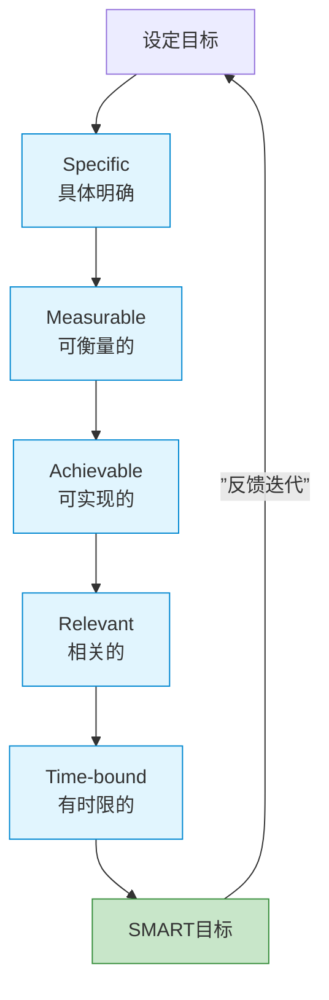
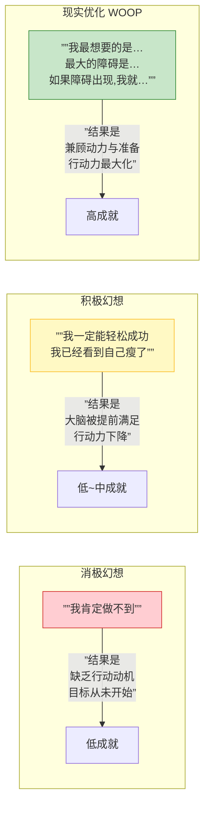
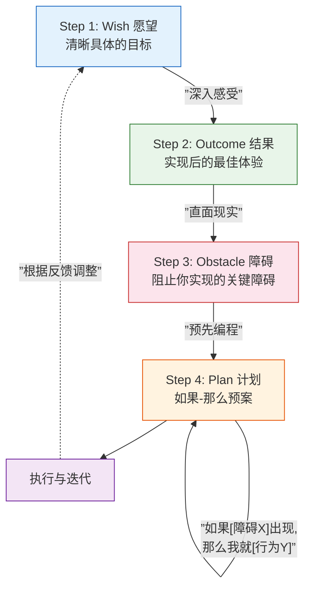

# 第02课：SMART目标与WOOP方法

## "先制定一个小目标"

2016年，万达集团创始人**王健林**在接受鲁豫采访时说了一句话，迅速引爆全网：

> "很多年轻人，有自己目标，比如想做首富是对的，奋斗的方向。但是最好**先制定一个小目标**，比方说我先**挣它一个亿**。"

这句话之所以引发巨大争议，是因为对普通人来说"一个亿"根本不"小"。但如果我们剥去调侃的外衣，王健林在访谈中表达了一个**极其深刻的目标管理原则**：

> **任何宏大的愿景，都必须分解为可执行、可衡量的小目标。**

王健林自己从一个小房地产商到亚洲首富，每一步都是通过一个个"一亿目标"的达成积累而来的。他不懂SMART这个缩写词，但他的做法完全吻合SMART原则的精髓。

---

## SMART原则：让目标从"口号"变成"路标"

SMART原则是目前应用最广泛的目标设定框架，起源于1954年Peter Drucker的**目标管理**理论，后由George T. Doran在1981年正式提出。



### S —— Specific（具体）

模糊的目标导致模糊的执行。**"我要变得更健康"** 不是一个目标，它是一个愿望。**"我要每天步行8000步"** 才是一个具体的目标。

**具体化的方法**是回答"5W1H"：

- **What：** 要做什么？（每天步行8000步）
- **Why：** 为什么要做？（改善心血管健康）
- **When：** 什么时间做？（午饭后）
- **Where：** 在哪里做？（公司附近的公园）
- **Who：** 涉及谁？（我自己，偶尔加入同事）
- **How：** 怎么做？（用手机步数记录）

### M —— Measurable（可衡量）

如果你无法衡量一个目标，你就无法管理它。可衡量的目标让你能**清晰地知道"是否完成了"**。

**常见误区：** 用模糊的副词（"更多"、"更好"、"更快"）来代替数据指标。

| 模糊的表述 | 可衡量的表述 |
|-----------|-------------|
| "我要多读书" | "每天阅读15分钟，记录阅读页数" |
| "我要多运动" | "每周跑步3次，每次至少3公里" |
| "我要提高英语" | "每天背20个单词，完成1篇英语阅读" |
| "我要节约开支" | "每天记帐，每月储蓄不低于收入的20%" |

### A —— Achievable（可实现）

这是SMART中最**容易被误解**的原则。**可实现不是"降低标准"，而是"承认现实"**。

一个目标是"可实现"的，意味着你目前的资源、能力、时间、精力和外部环境能够支撑它的完成。

> 对于一个每天加班到晚上10点的人来说，"每天运动1小时"不是可实现的目标——不是因为你没有动力，而是因为**物理学不允许**。而"每天通勤时步行2站地铁"就是可实现的。

**判断标准：** 当你设定目标后，内心感到的是"这个有点挑战但我可以做到"（健康的拉伸感），还是"这怎么可能完成"（压垮性的焦虑）？

### R —— Relevant（相关的）

目标必须与你的人生大方向**一致**。这里的"相关"有两个层面：

1. **与你的价值观相关：** 这个目标对你真的重要吗？还是因为别人在这样做？
2. **目标之间相互一致：** 一个目标不应与另一个目标冲突。

**一个常见冲突的例子：** 有人同时设定"每天运动2小时"和"每天学习4小时准备考试"。除非你处于全职状态，否则这两个目标在时间上直接竞争——**它们是不相关的**。更好的做法是：先完成考试，再将运动设为下一个100天目标。

### T —— Time-bound（有时限的）

"有一天我会……" 等于 "永远不会"。

目标必须有明确的**截止日期**。没有时间限制的目标，大脑会将其归类为"愿望"而非"任务"。

100天行动天然提供了这个"时间限制"——100天。但如果你在100天内设定的阶段性目标（如"第30天前完成……"），也需要标注具体日期。

### SMART目标综合对比

| 维度 | 非SMART目标 | SMART目标 |
|------|------------|----------|
| 具体性 | "我要学好英语" | "每天用App背20个单词，完成一篇英文短文阅读" |
| 可衡量 | "我要变瘦" | "100天后体重减轻5公斤，腰围减少5cm" |
| 可实现 | "每天跑10公里"（当前0基础） | "每周跑步3次，从1公里逐步增加到5公里" |
| 相关性 | "我要学编程"（实际想升职做管理） | "学习项目管理课程，获得PMP认证" |
| 时限性 | "我要写一本书" | "100天内完成初稿，每天写500字" |

---

## 过度乐观的陷阱：Gabriele Oettingen的20年研究

有了明确的目标之后，接下来要做什么？

大多数成功学告诉你要：**"正向思考"、"视觉化成功"、"相信你已经实现了目标"**。

但纽约大学心理学教授 **Gabriele Oettingen** 用20年的研究，狠狠地打了这些说法一巴掌。

### 四组实验：幻想越多，成就越少

Oettingen在她的研究中做了这样一个实验：

将减重志愿者分为四组：

| 组别 | 干预方式 | 结果（平均减重） |
|------|---------|----------------|
| 第一组 | 幻想成功：想象自己瘦下来的样子 | **最少** |
| 第二组 | 幻想障碍：想象可能遇到的困难 | 中等 |
| 第三组 | 同时幻想成功和障碍 | 较多 |
| 第四组 | **WOOP组**：幻想成功 + 障碍 + 制定计划 | **最多** |

Oettingen的结论是颠覆性的：

> **对成功的积极幻想，实际上会愚弄大脑，让它误以为自己已经完成了目标，从而减少实际行动的动力。**

这被称为**"积极幻想的麻痹效应"**。

### 三种思维方式的力量对比



Oettingen提出了一个核心概念：**心理对比**（Mental Contrasting）。它是指在想象最佳结果的同时，也面对现实中的障碍。这种"既要看到山顶，也要看到山腰的碎石"的思维方式，是WOOP方法的理论基石。

---

## WOOP方法：四步走向现实

**WOOP** = **W**ish（愿望）+ **O**utcome（结果）+ **O**bstacle（障碍）+ **P**lan（计划）

这套方法由Oettingen及其丈夫Peter Gollwitzer（"如果-那么"计划理论的提出者）共同开发，是目前行为科学领域**验证最充分**的目标达成工具之一。

### WOOP的完整流程



### Step 1: Wish（愿望）

设定一个你的内心真正想要的、在接下来100天内可以完成的目标。

**WOOP的愿望不是"随便想想"的东西**，而是需要满足三个条件：

1. **有挑战性**：不是轻松能完成的事（否则不需要WOOP）
2. **可实现**：在100天内、在你当前的条件下确实有可能完成
3. **你真正在乎**：这是你**内心**想要的，不是别人期望你做的

> 练习：写下你的愿望。用一句话描述，越具体越好。

### Step 2: Outcome（结果）

闭上眼睛，想象你的愿望实现后的**最佳结果**。不要简单地说"那就好啦"，而是**深入感受**那个画面：

- 当你的愿望实现时，你的身体是什么感觉？
- 你在哪里？穿着什么？表情是什么样的？
- 身边有没有人？他们对你说什么？
- 你内心最深处的满足感来自于哪个细节？

**这一步骤的科学原理：** 充分感受积极结果会给大脑提供**动机燃料**。但注意——不要沉醉太久，否则就会落入"积极幻想的麻痹效应"。

> 练习：花3-5分钟，在纸面上写下实现愿望后最美好的画面，越生动越好。

### Step 3: Obstacle（障碍）

这是WOOP中最关键也最容易**被跳过**的一步。

诚实地问自己：**现在阻止我实现这个愿望的最大障碍是什么？**

障碍可以来自多个层面：

| 障碍类型 | 例子 |
|---------|------|
| 内部障碍 | "早上起不来"、"下班后太累不想动"、"容易分心" |
| 情绪障碍 | "害怕失败"、"觉得丢脸"、"完美主义导致的拖延" |
| 外部障碍 | "加班太多"、"家人不支持"、"没有合适的环境" |
| 技能障碍 | "不知道怎么开始"、"缺乏必要的工具或知识" |

**识别真正的障碍：** 很多人会把"没时间"当作障碍，但"没时间"往往是一个**借口**而非真正的障碍。往下深挖一层：为什么你总觉得没时间？是因为刷手机？是因为不会拒绝？是因为没有优先级？

> 练习：列出至少3个具体障碍，并按重要性排序。最重要的那个就是你最需要应对的。

### Step 4: Plan（计划）

这是WOOP的 **"魔法时刻"** ——利用 **"如果-那么"计划**（Implementation Intentions），将障碍与应对行为绑定。

**公式：**

> **如果 [障碍X] 出现，那么我就 [执行行为Y]**

这个看似简单的句式，实际上在大脑中创建了一个**自动触发器**。当障碍真的出现时，你不需要再动用思考脑来"做决策"——反射脑会自动调用预案中的行为。

### "如果-那么"计划的科学原理

Peter Gollwitzer的研究表明，"如果-那么"计划之所以有效，是因为它利用了大脑的**四个特性**：

1. **情境触发（Context Triggering）：** "如果"部分在大脑中创造了一个高度警觉的状态，随时准备识别障碍信号。
2. **决策自动化：** 当障碍出现时，你已经提前做好了"决策"，不需要再消耗意志力去决定"现在怎么办"。
3. **认知资源释放：** 因为计划已经预先设定，大脑不再需要在那个时刻进行"冲突处理"（做还是不做）。
4. **增强目标承诺：** 写下"如果-那么"计划的人，对目标的承诺度显著高于仅设定目标的人。

**具体效果的量化数据：**

> Meta分析表明，"如果-那么"计划可以使目标执行的成功率**提升2-3倍**（Gollwitzer & Sheeran, 2006）。

### 好的"如果-那么"计划示例

| 愿望 | 障碍 | 好的"如果-那么"计划 |
|------|------|-------------------|
| 每天跑步3公里 | "下班太累了" | "如果下班后觉得太累不想跑，那么我就换上跑鞋先出门走5分钟" |
| 每天阅读30分钟 | "忍不住刷手机" | "如果我想刷手机，那么我就把手机放到另一个房间再去拿书" |
| 每天背20个单词 | "早上起不来" | "如果闹钟响了但我还想继续睡，那么我就先坐起来打开背词App" |
| 每天健康饮食 | "下午想吃零食" | "如果下午3点想吃零食，那么我就先喝一杯水再吃一个苹果" |

注意这些计划中的**模式**：它们不是靠意志力去"抵抗"诱惑，而是**绕开**诱惑，用一个更简单的行为来替代。

---

## 如何用WOOP重新梳理目标

现在，让我们把SMART和WOOP结合起来，形成一个完整的"目标梳理工作流"：

### 第一步：用SMART写出一个目标

你的100天行动目标是什么？用SMART原则把它写下来：

```
S（具体）：
M（可衡量）：
A（可实现）：
R（相关）：
T（有时限）：
```

### 第二步：用WOOP扫描这个目标

```
W（愿望）：我真正想要的是……
O（最佳结果）：当它实现时，最好的感觉是……
O（关键障碍）：最大的内部/外部障碍是……
P（如果-那么计划）：
  如果[障碍]，那么我就[行为]。
  如果[第二个障碍]，那么我就[行为]。
```

### 第三步：评估并调整

完成WOOP后，问自己三个问题：

1. **我的"愿望"和"障碍"之间是否有明显的不匹配？**（比如愿望是"每天跑10公里"，但障碍是"膝盖有伤"——这说明目标本身需要调整）
2. **"如果-那么"计划是否足够具体？**（"如果不想跑就不跑"不是计划）
3. **我对自己完成这个目标的信心有多少？**（< 60%说明目标太难，> 95%说明目标太简单）

**目标期望强度**是衡量你有多想达成这个目标的量表，从0%到100%。期望强度低于100%的目标在遇到困难时很容易放弃。

---

> [!NOTE] WOOP练习模板
> 复制以下内容到你的笔记中，完成WOOP练习：
>
> ---
> **我的愿望（Wish）：**
> *在100天内，我想……*
>
> **最佳结果（Outcome）：**
> *当它实现时，我会感到……*
>
> **关键障碍（Obstacle）：**
> 1. *……*
> 2. *……*
> 3. *……*
>
> **如果-那么计划（Plan）：**
> - 如果 *[障碍1]* ，那么我就 *[行为1]*。
> - 如果 *[障碍2]* ，那么我就 *[行为2]*。
> - 如果 *[障碍3]* ，那么我就 *[行为3]*。
> ---

---

> [!WARNING] 使用WOOP的常见错误
> - **把"障碍"写成"没时间"这种表面障碍：** 再深挖一层，为什么没时间？真实原因是什么？
> - **写下"如果-那么"计划后就不再调整：** 执行过程中遇到的障碍可能与预想的不同，需要动态调整。
> - **跳过"最佳结果"步骤：** 很多人直接进入障碍和计划，忽略了动机来源。没有"渴望"作为动力，"如果-那么"计划就会变成空壳。
> - **同时WOOP多个目标：** 一次只WOOP一个最重要的目标。

---

## 课后作业：为你的100天行动做WOOP

1. 选择一个你希望在100天行动中实现的目标
2. 按照SMART原则，把这个目标写清楚
3. 完成WOOP四步练习（建议手写，研究表明**手写**对记忆和承诺度的影响比打字更大）
4. 把你的"如果-那么"计划贴在每天能看到的地方（冰箱、镜子、手机壁纸）
5. 在100天行动的第7天、第30天、第60天各回顾一次WOOP，根据实际情况调整计划

**提示：** 将**节假日作为习惯观察点**，利用假期开始时检视自己的习惯进展，比如十一假期是一个重要的习惯观察节点。

> [!QUESTION] 自测题
> 以下关于WOOP方法的描述，哪一项**不正确**？
>
> A. WOOP包含四个步骤：Wish、Outcome、Obstacle、Plan
> B. "如果-那么"计划可以绕过思考脑，在遇到障碍时自动触发应对行为
> C. WOOP提倡充分幻想成功的画面，幻想时间越长越好
> D. WOOP中的"障碍"可以来自内部（情绪、习惯）或外部（环境、他人）
>
> <details>
> <summary>查看答案</summary>
>
> **正确答案：C**
>
> Oettingen的研究明确表明，过度幻想成功（积极幻想）会产生麻痹效应，减少实际行动。WOOP中的"Outcome"步骤要求**适度**感受最佳结果提供动力，但不能沉浸其中。正确的做法是在感受到动力后立即转向"Obstacle"步骤——**看见山顶，然后直面碎石**。
> </details>

---

**下一课预告：** 目标清晰了，WOOP也做完了，但还有一个关键问题——**为什么同时开始多个习惯几乎必然导致失败？** 第03课将深入探讨"一次只养成一个习惯"背后的心理学原理，以及如何保护你有限的意志力资源，让它只服务于最重要的一个目标。