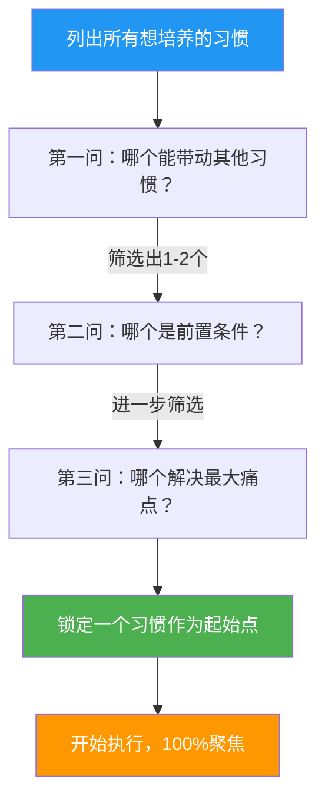

# 第03课：一次一个习惯

## Learning Objectives

- 理解为什么同时培养多个习惯几乎注定失败
- 掌握多米诺骨牌效应在习惯养成中的应用
- 学会从多个目标中识别并选择最重要的那一个
- 认识关键习惯的力量及其连锁反应

---

## 一、贪心的陷阱：为什么"多即是少"

每年1月1日，数以千万计的人立下新年决心。调查显示，**平均每个人会同时立下3-5个新年目标**：减肥、读书、学英语、早睡早起、戒烟……然后呢？

到了2月，超过80%的人已经放弃了全部目标。

这不是你意志力薄弱——这是人性的正常反应。**同时培养多个习惯，相当于让大脑同时处理多项高难度任务**，而人类的前额叶皮层根本不具备这种多线程能力。

> [!DANGER] 贪心的代价
> 研究表明，同时培养**3个以上新习惯**的人，在6个月后仍在坚持的比例**趋近于零**。这不是努力不够的问题，而是策略性错误。一次追求太多，最终什么都得不到。

### 为什么我们会贪心？

1. **乐观偏差**：我们系统性地高估自己未来的意志力和时间资源
2. **补偿心态**："我欠了太多债，必须一次性还清"
3. **社会比较**：看到别人"自律"，觉得自己也应该全面改变
4. **即时满足幻觉**：设定目标本身带来虚假的成就感，让人误以为已经成功了一半

> [!TIP] 核心原则
> **"一次一个习惯"不是消极保守，而是战略聚焦。** 将军不会在所有前线同时进攻——他会集中兵力突破一个点，然后利用那个突破口瓦解整条防线。习惯养成也是同样的道理。

---

## 二、多米诺骨牌效应：从2英寸到月球

多米诺骨牌最迷人的地方不在于一张牌倒下，而在于**连锁反应**。一张小小的多米诺骨牌，可以推倒比它大50%的下一张牌。理论上，**第29张牌就可以推倒帝国大厦，第57张牌就能够脱离地球引力**。

习惯养成也是如此。


### 多米诺效应的三个关键

1. **第一步要足够小**：第一张骨牌必须小到几乎不费力。想培养阅读习惯？从"每天读一页"开始。想运动？从"穿上运动鞋"开始。

2. **骨牌必须排成一条线**：所有的小习惯必须指向同一个方向。如果你的六个目标指向六个不同方向，骨牌链在第一张就断了。

3. **等待动量积累**：多米诺效应不是瞬间发生的——每张骨牌的倒下需要时间。习惯的连锁反应也需要时间酝酿。

> [!NOTE] 真实案例
> 作家Stephen Guise在《最小习惯》中分享：他的第一个习惯是"每天做一个俯卧撑"。听起来可笑，但这个微小习惯引发了连锁反应——他开始做第二个、第三个，然后开始做其他运动，接着改善了饮食，最终减重20公斤，彻底改变了自己的生活方式。

---

## 三、欲望之碗的故事

这是一个古老的日本寓言，也存在于许多文化的民间传说中。

> 一个疲惫的旅人路过一座寺庙，老和尚请他喝水。旅人拿起木碗，发现碗底有一个破洞，水不断地漏出去。他抱怨道："师父，这个碗是破的，永远装不满。"
>
> 老和尚微笑着说："**孩子，你的人生就像这个碗。如果不先堵住破洞，往里倒再多水也是枉然。**"

**你的"欲望之碗"上有多少个洞？**

- 想减肥（但管不住嘴）
- 想学英语（但背不下单词）
- 想升职加薪（但不愿加班学习）
- 想健身（但起不了早床）
- 想读书（但放不下手机）

当你同时追求所有这些目标，每一个目标都像一个"破洞"。你的意志力、时间和精力从这些洞里不断流失，最终一个目标也无法实现。

**欲望的碗**寓言：国王和乞丐的故事说明了为什么拥有的越多反而越不满足。同样，在习惯养成中，想要的太多反而什么都得不到。

> [!WARNING] 认清现实
> 欲望本身不是问题——问题是**你以为自己可以同时满足所有欲望**。成熟的策略不是消灭欲望，而是**一次只堵一个洞**。当这个洞堵住了，再去堵下一个。

---

## 四、卡耐基的"所有鸡蛋放一个篮子"建议

戴尔·卡耐基在《人性的弱点》中讲过一个关键观点——但这个观点往往被读者忽略：

> **"把所有的鸡蛋放在一个篮子里，然后看好那个篮子。"**

这不是理财建议，这是**关于专注的哲学**。

卡耐基观察到，那些在各个领域都取得卓越成就的人，并不是因为天赋异禀，而是因为他们在**特定时期极度专注**。

### 为什么"一个篮子"策略有效？

| 策略 | 资源分配 | 成功概率 | 心理负担 | 长期效果 |
|------|---------|---------|---------|---------|
| 一个篮子 | 100%资源投入一个目标 | 高（持续可见进展） | 低 | 养成后自动维持 |
| 两个篮子 | 各分配50% | 中（进展缓慢） | 中 | 容易顾此失彼 |
| 三个篮子 | 各分配33% | 低（几乎无进展） | 高 | 三个全部放弃 |
| 三个以上 | 各分配<25% | 趋近于零 | 极高 | 100%放弃 |

> [!IMPORTANT] 关键区别
> "所有鸡蛋放一个篮子"不等于"这辈子只做一件事"。它意味着**在这个特定的100天周期内，你只聚焦一个习惯**。当这个习惯巩固后，再进入下一个周期，聚焦下一个习惯。

---

## 五、自我损耗理论：为什么一次只能做一个

Roy Baumeister的自我损耗理论（Ego Depletion Theory）从科学上解释了为什么同时培养多个习惯注定失败。

**核心发现**：意志力像肌肉一样，使用后会暂时疲劳。每一次自我控制——无论控制的是什么——都从**同一个意志力账户**中消耗能量。

```mermaid
graph TD
    subgraph ”意志力总账户”
        A[意志力储备<br/>有限资源]
    end
    
    A --> B[抵制诱惑<br/>如不吃零食]
    A --> C[控制情绪<br/>如不生气]
    A --> D[坚持任务<br/>如背单词]
    A --> E[做出决定<br/>如选择吃什么]
    
    B --> F{同时进行多个习惯}
    C --> F
    D --> F
    F --> G[意志力迅速耗尽]
    G --> H[全部习惯崩塌]
    
    style A fill:#E91E63,color:#fff
    style F fill:#FF9800,color:#fff
    style H fill:#f44336,color:#fff
```

### 实验证据

Baumeister经典的"萝卜与巧克力"实验（详见第05课）已经证明：

- 抵制巧克力诱惑的参与者（吃了萝卜），在后续的拼图任务中坚持时间**短了一半**
- 原因：他们在抵制巧克力时已经消耗了大量意志力

应用到习惯养成上：
- 如果你同时要求自己"每天运动30分钟 + 不吃甜食 + 学英语1小时"
- **每一个习惯都在消耗你的意志力**
- 三个习惯的消耗是乘数级的，而不是加法级的
- 到第二天，你的意志力账户已经透支

> [!TIP] 能量守恒原则
> **做一件事需要意志力，拒绝另一件事也需要意志力。** 当你同时培养三个习惯时，你不仅需要坚持三个"做"，还需要拒绝至少三个"不做"——实际上是6倍的消耗。

---

## 六、数据说话：1个 vs 2个 vs 3+ 个习惯

以下是基于多项习惯研究的综合数据：

| 指标 | 1个习惯 | 2个习惯 | 3个及以上 |
|------|---------|---------|----------|
| 30天坚持率 | **85%** | 40% | 8% |
| 60天坚持率 | **72%** | 22% | 2% |
| 100天坚持率 | **58%** | 12% | <1% |
| 形成自动化的概率 | **65%** | 15% | 0.5% |
| 对生活的实际影响力 | 高（深度改变） | 中（表层改变） | 极低（全部放弃） |
| 心理压力指数 | 低 | 中 | 极高 |

数据来源：BJ Fogg行为模型实验室、Phillippa Lally习惯形成研究、以及美国心理学会的意志力调查。

### 关键解读

- **1个习惯的成功率并不是100%**——但58%的100天坚持率已经是所有策略中最高的
- **2个习惯的成功率断崖式下降**——不是因为意志力减半，而是因为管理成本倍增
- **3个及以上的成功率实际上为零**——这已不是坚持问题，而是策略性失败

> [!INFO] 一个有趣的数据
> 如果你每年只培养1个习惯，10年后你将有10个牢固的终身习惯。如果你每年尝试10个习惯，10年后你很可能**一个都没有**。慢就是快。

---

## 七、如何从多个目标中选择最重要的一个

面对多个想培养的习惯，你该如何选择"这一个"？以下是筛选方法：

### 三问筛选法

对着你的目标清单，问自己三个问题：

**第一问：如果这个习惯养成了，它是否会让其他习惯更容易实现？**

举例：选"每天规律作息"，它会让你在精力好的时候更容易去运动、学习、健康饮食。选"每天写日记"则对其他习惯帮助有限。

**第二问：如果我不做这个习惯，其他习惯是否还会存在？**

有些习惯是关键节点的前置条件。没有稳定的作息，清晨运动就无从谈起。没有运动习惯，健康饮食的动力也会下降。

**第三问：这个习惯是否触及我生活中最痛苦的点？**

最让你痛苦的地方，往往是最需要改变的地方，也是动力最充足的方向。



> [!TIP] 如何选择你的"一个习惯"
> 1. **写下你所有想养成的习惯**（不要限制自己）
> 2. **对每个习惯打分**：动力1-10分 × 难度1-10分（反过来算），总分最高的优先
> 3. **问自己**：如果未来100天我只能做这一件事，我会选哪个？
> 4. **做出选择后**：把它写在便签上贴到墙上。在未来100天内，其他所有目标都被"暂停"——不是放弃，是暂缓。

---

## 八、关键习惯的力量——启动多米诺效应

Charles Duhigg在《习惯的力量》中提出了"关键习惯"（Keystone Habit）的概念：

> **关键习惯**是指那些一旦养成，就会引发一系列连锁反应，使其他好习惯自然跟随的习惯。

### 常见的关键习惯

| 关键习惯 | 引发的连锁反应 |
|---------|--------------|
| 规律作息 | 精力充足 → 更愿意运动 → 饮食更健康 → 工作效率提升 |
| 每日运动 | 睡眠改善 → 自信提升 → 饮食更自律 → 抗压能力增强 |
| 早起 | 拥有专属时间 → 可以阅读/规划 → 减少一天焦虑 |
| 记账 | 消费意识觉醒 → 减少不必要开支 → 财务压力降低 |

### 识别你自己的关键习惯

不是所有人的关键习惯都一样。找到你的那个关键习惯，是100天行动成功的第一步。

> [!NOTE] 方法：反推法
> 1. 想象一个理想的自己——他是什么样子的？
> 2. 问自己：是什么**最小改变**让现在的你向那个方向迈出最大一步？
> 3. 答案很可能就是你的关键习惯。

---

## 总结

- **贪心是习惯养成最大的敌人**——一次追求多个目标几乎是自杀式策略
- **多米诺骨牌效应**说明微小改变可以引发连锁反应，但骨牌必须排成一条线
- **欲望之碗的故事**提醒你：先堵住一个洞，不要让精力从多个方向流失
- **卡耐基的"一个篮子"策略**是历史上被反复验证的专注哲学
- **自我损耗理论**从科学角度解释了为什么意志力不能同时支撑多个习惯
- **数据清晰显示**：一次培养1个习惯的成功率是2个的5倍，是3个以上的50倍
- **关键习惯**是你应该优先培养的那个——它会自动带动其他习惯
- **贪多求快是失败的首要原因**。战隼遇到一位学员列出了30项想同时培养的习惯清单——这注定会失败。一次只选一个，把这个做好了再考虑下一个。

## Practice

> [!QUESTION] 自我检测
> 1. 请列出你想养成的3-5个习惯，然后用"三问筛选法"找出其中最关键的一个。
> 2. 回想过去你尝试同时培养多个习惯的失败经历——如果用"一次一个"的策略重新来一次，你会怎么做不同？
> 3. 多米诺骨牌效应在你的生活中有没有真实发生过的例子？（一个好习惯无意中带来了其他正面变化）

<details>
<summary>参考答案思路</summary>

1. **三问筛选示例**：如果你的列表包含"每天运动""早睡早起""减少刷手机"，那么"早睡早起"可能是关键习惯——它带来好精力去运动，也减少了熬夜刷手机的时间。
2. **重新设计策略**：将原本的5个目标排序，只保留排名第一的。给它100天。把其他目标写在一张纸条上锁进抽屉，100天内不看。
3. **真实案例**：很多人发现开始跑步后，不知不觉地开始注意饮食、不熬夜、少喝酒——没有人强迫他们，这是多米诺效应自然驱动的。
</details>

## Next Step

这一课你学会了为什么要"一次一个习惯"以及如何选择那一个。下一课我们学习如何通过**记录与可视化**让这个习惯的养成过程变得可见、可追踪、可激励。

继续学习：[[0004-recording-and-visualization|第04课：记录与可视化]]