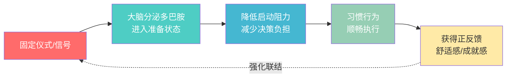

# 第06课：20秒法则与仪式感

## Learning Objectives
- 理解20秒法则的心理学原理及其在习惯养成中的作用
- 掌握识别和消除"启动阻力"的具体方法
- 学会利用仪式感建立条件反射式的好习惯触发机制

---

## 一、20秒法则的起源

> [!QUOTE]
> "与其说我们是在有意识地为自己的生活做出决定，不如说是环境中的微小因素在引导我们。"
> — Shawn Achor,《The Happiness Advantage》

20秒法则由哈佛大学积极心理学家 Shawn Achor 在《The Happiness Advantage》中提出。这个法则的诞生来自一个非常具体的生活观察：

### 吉他练习者的启示

Achor 发现，许多人买了吉他后，练习频率远低于预期。原因并非懒惰或缺乏动力——而是吉他被放在**衣柜顶上**或**床底下**。每次想练习，都需要：搬椅子 → 踩上去 → 翻出吉他包 → 拉开拉链 → 取出吉他 → 再去找调音器……

这个流程从念头到手指触碰琴弦，大约需要 **20 秒**。

正是这 **20 秒**，成了习惯养成的"不可逾越之墙"。

> [!THEOREM] 20秒法则
> **将好习惯的启动时间减少到 20 秒以内，将坏习惯的启动时间增加到 20 秒以上。**
>
> 这 20 秒不是绝对数值，而是一种**感知阈值**——当一件事的启动阻力足够小，小到几乎不需要意志力时，你就会自然而然地去做。

---

## 二、减少启动阻力的原理：自我损耗视角

结合第05课学习的**自我损耗（Ego Depletion）**理论，20秒法则的底层逻辑就非常清晰了：

### 决策负担与启动成本

每一个"做还是不做"的决策，都需要消耗意志力。启动阻力越大，决策成本越高。

```
决定练吉他
    │
    ├─ 需要搬椅子？           → 意志力 -2
    ├─ 需要翻柜子？           → 意志力 -3
    ├─ 需要调音？             → 意志力 -5
    ├─ 需要找谱子？           → 意志力 -3
    │
    └─ 总启动成本 = 13 单位意志力
                          ↓
                放弃，刷手机去了
```

而当吉他挂在墙上、调好音、谱子翻开摆在旁边时：

```
决定练吉他
    │
    └─ 拿起来就能弹            → 意志力 -0
                          ↓
                弹了 20 分钟
```

### 两个关键推论

1. **好习惯要"减阻"**：把好习惯的入口做得像滑梯一样顺畅。
2. **坏习惯要"增阻"**：把坏习惯的入口做得像爬墙一样费力。

> [!TIP] Key Insight
> 环境设计的本质不是改变"人"，而是改变"路径"。
>
> 当你不再需要和自己较劲，习惯自然就发生了。

---

## 三、12个20秒法则应用案例

> [!NOTE] 选择标准
> 以下案例覆盖**健康、学习、财务、效率、人际关系**五大生活领域，每个都是经过验证的高效实践。

### 按领域分类的20秒技巧

| 类别 | 技巧 | 原理 | 预期效果 |
|------|------|------|----------|
| **阅读与学习** | Kindle 随身携带，永远放在包里 | 消除"没带"的借口 | 每月阅读量提升 2~3 倍 |
| | 学习资料放在桌面，不关浏览器标签页 | 消除"找文件"的阻力 | 每天多学 30 分钟 |
| | 床头只放一本书，读完才能换 | 唯一选择，无需决策 | 每月读完 2~3 本书 |
| **健康与运动** | 瑜伽垫铺在客厅中央 | 看到就想做，无需准备 | 每天自然练习 10~15 分钟 |
| | 运动服前一晚放在床边 | 起床即穿，零思考 | 晨练执行率提高 80% |
| | 水杯放在电脑右侧，永远装满 | 随手就喝，不会忘记 | 每日饮水量达标 |
| **效率与工作** | 电脑设置为休眠不关机，直接合盖 | 开盖即用，2 秒开工 | 减少每日启动拖延 15 分钟 |
| | 记账 APP 预设常买物品模板 | 20 秒完成一笔记录 | 记账坚持率提升 3 倍 |
| | 每天固定时间处理邮件（设闹钟） | 不需要反复检查收件箱 | 每天节省 45 分钟注意力碎片 |
| **家庭与生活** | 睡前准备好第二天衣服和背包 | 早上不用思考穿什么 | 晨间无拖延，准时出门 |
| | 钥匙、钱包固定放在门口托盘 | 出门不用翻找 | 每天减少 5 分钟出门焦虑 |
| **数字生活** | 手机退出微信登录，电脑微信也退出 | 每次使用需重新登录 | 每天减少 1 小时刷手机时间 |

### 更极致的21个补充案例

> [!TIP] 进阶灵感
> 以下案例来自全球习惯实践者的经验汇总，你可以挑选 3~5 个立即尝试。

1. **跑鞋放在门口** —— 出门穿鞋时自动看到，触发跑步冲动
2. **电视遥控器收进抽屉** —— 增加开机步骤，减少无意识观看
3. **冥想垫/蒲团放在固定位置** —— 坐下就能冥想
4. **耳机永远放在固定位置** —— 想听播客/音乐就能立刻开始
5. **在日历上设置重复提醒** —— 无需记住"什么时候该做什么"
6. **把困难任务切成 2 分钟版本** —— "写论文"变成"打开文档写一句话"
7. **健身包常备车上/办公室** —— 下班直接去健身房
8. **删除手机上的短视频 APP** —— 想刷需要重新下载（20 分钟阻力）
9. **早餐食材提前切好放冰箱** —— 早上 5 分钟搞定健康早餐
10. **笔记本和笔放在枕边** —— 记录梦境或灵感，零延迟
11. **设置浏览器启动页为待办清单** —— 打开电脑就看到今天要做什么
12. **在冰箱贴健康零食清单** —— 不用思考吃什么
13. **每周固定时间还信用卡/付账单** —— 设自动转账
14. **电话设为勿扰模式（白名单除外）** —— 减少被动打断
15. **桌面文件每周清理一次** —— 找文件不超过 10 秒
16. **把维生素放在牙刷旁** —— 刷牙时顺手吃掉
17. **在门口贴"带水杯了吗"便签** —— 视觉提示
18. **洗澡时同时听播客（防水蓝牙音箱）** —— 利用重叠时间
19. **把水果放在最显眼的地方** —— 第一眼看到它而不是零食
20. **使用 Pomodoro 计时器物理装置** —— 按下即专注
21. **固定每周同一天去同一家菜市场** —— 形成购物惯性

> [!WARNING] 重要提醒
> **不要一次性应用超过 3 个 20 秒技巧。**
>
> 改变太多环境变量会导致认知过载，反而增加压力。选择一个最让你心动的，执行 7 天，再添加下一个。

---

## 四、如何找到你的"摩擦点"

> [!EXAMPLE] Find Your Friction Points
> **三步排查法：**
>
> **Step 1：记录 3 天** — 记下所有"想做但没做的事"，比如想运动但没运动、想读书但没读。
>
> **Step 2：追问"为什么没做"** — 对每个没做的事，连续追问 3 个"为什么"：
> - 为什么没运动？→ 因为要换衣服
> - 为什么要换衣服？→ 因为衣服在衣柜里
> - 为什么要去衣柜？→ 因为没提前准备好
>
> **Step 3：消除最表层障碍** — 找到那个**第一个**阻止你的动作，然后消除它。
>
> 关键原则：**不要试图解决所有障碍。只解决第一个。** 第一个障碍消失后，后面的障碍会自然瓦解。

---

## 五、仪式感与巴甫洛夫条件反射

20秒法则解决了"启动阻力"的问题，但还有一个更深的层面：**如何让大脑在行动前就进入"准备状态"？**

答案就是——**仪式感**。

### 从巴甫洛夫的狗说起

巴甫洛夫经典实验中，狗在听到铃声时分泌唾液——因为铃声已被反复与食物建立关联。

这个机制对人类同样适用：

```
[刺激] ────→ [大脑反应] ────→ [行为]
  │                                  │
  │       重复配对N次                 │
  └──────────────────────────────────┘
```

习惯仪式就是**人为设计的刺激-反应配对**。



### 仪式感的三要素

1. **固定时间**：每天同一时刻触发（如每天晨跑前喝三口温水）
2. **固定动作**：一系列可重复的微小动作序列
3. **固定环境**：在相同的地点/空间中进行

> [!THEOREM] 条件反射公式
> **固定信号 + 重复执行 + 正反馈 = 自动化的习惯启动**

---

## 六、建立习惯开端仪式的方法

> [!INFO] 仪式 vs 惯例
> 仪式（Ritual）和惯例（Routine）的区别在于：**仪式有情感投入和象征意义**，而惯例只是机械重复。
>
> 仪式感的关键是**赋予动作意义**。

### 四个步骤建立你的开端仪式

#### 第一步：选择一个"启动动作"

这个动作必须满足：
- 极简单（5 秒内完成）
- 极具体（"深呼吸三次"而非"放松一下"）
- 与目标习惯唯一关联（该动作只用于这一个习惯）

**示例：**
| 目标习惯 | 启动仪式 |
|----------|----------|
| 晨间冥想 | 起身后先喝一杯温水，然后坐在冥想垫上 |
| 写作 | 泡一杯茶，打开特定歌单，点开写作软件全屏 |
| 晚间复盘 | 关掉客厅主灯，打开台灯，拿出笔记本 |

#### 第二步：配对执行至少 21 天

在习惯行为**之前**严格执行仪式。注意顺序不可颠倒。

> 仪式必须在习惯行为**之前**，而不是之后。仪式是"前奏"，不是"奖励"。

#### 第三步：赋予仪式意义

不要机械执行，告诉自己：

> "当我泡这杯茶时，我正在切换身份：从'生活模式'切换到'创造者模式'。"

大脑对这种**身份叙事**非常敏感。当仪式有了意义，它就从一个动作变成了一种宣言。

#### 第四步：遇到挫折时缩减仪式长度

如果某天时间紧张，仪式可以压缩到极致：

| 完整版 | 极简版 |
|--------|--------|
| 泡茶 → 开歌单 → 全屏软件 → 写作 | 打开文档 → 写一句话 |
| 换运动服 → 穿跑鞋 → 热身 → 跑步 | 穿上跑鞋 → 出门 |
| 准备食材 → 摆放餐具 → 播放音乐 → 做饭 | 打开冰箱 → 拿出食材 |

极简版保留了"触发器"最核心的部分，让习惯不会因时间不足而中断。

---

## 七、运动员的仪式：从 NBA 到奥运冠军

> [!QUOTE]
> "我每次罚球前都会做同一套动作：拍三次球、转一次球、深呼吸、再出手。这不是迷信，这是让身体进入'自动模式'。"
> — 史蒂夫·纳什（Steve Nash）, NBA 名人堂球员

### NBA 罚球仪式分析

| 球员 | 仪式动作 | 科学解释 |
|------|----------|----------|
| 史蒂夫·纳什 | 拍球 3 次 → 转球 1 次 → 深呼吸 | 通过固定节奏降低心率，进入"区域状态" |
| 雷·阿伦 | 从下往上捋球服 → 拍球 3 次 → 举球停顿 | 视觉-运动一致性增强，稳定投篮轨迹 |
| 卡尔·马龙 | 罚球前低声自语 | 自我引导，聚焦注意力 |
| 科比·布莱恩特 | 拍球 3 次 → 运球到罚球线 → 深呼吸 | 将复杂动作简化为可重复的程序 |

### NBA 全队仪式：赛前口号

NBA 球队在赛前围成一圈喊口号，这不仅仅是"打气"，而是一种**集体仪式**：

- 同步化团队心理状态
- 明确"现在开始"的边界信号
- 释放集体肾上腺素

> [!TIP] 应用到个人习惯
> 你不需要一个球队，但你可以对自己说一句"口号"：
> - "三、二、一，行动。"（倒数启动法）
> - "Just show up."（只做不思考）
> - "此时此刻，就是最好的开始时间。"

### 其他领域的仪式应用

| 领域 | 仪式示例 | 原理 |
|------|----------|------|
| 奥运游泳选手 | 拍打背部、甩手臂、跳下水前深呼吸 | 激活肌肉记忆 |
| 职业棋手 | 开局前闭目静坐 30 秒 | 排除杂念，进入深度思考 |
| 顶级程序员 | 泡咖啡 → 关闭通知 → 戴上耳机 | 建立深度工作信号 |
| 钢琴演奏家 | 手指放在琴键上停顿 3 秒 | 心理预演，降低错误率 |

---

## 八、本周行动

> [!SUCCESS] 本周任务：两个改变
>
> **任务 A：消除一个好习惯的20秒阻力**
> 选择一个你想加强的好习惯，找到它的"第一个障碍"，消除它。
>
> **任务 B：建立一个小仪式**
> 选择一个习惯，设计一个不超过 10 秒的开端仪式，连续执行 7 天。
>
> **记录方式：**
>
> | 日期 | 你的仪式 | 执行情况（是/否） | 感受（1-5分） |
> |------|----------|-------------------|---------------|
> | 周一 | | | |
> | 周二 | | | |
> | ... | | | |

## 九、延伸阅读

每个人的**精力曲线**不同，你需要连续一周每天早中晚记录自己的精力水平（1-10分），找出你的个人精力曲线模式。**早上是最推荐的习惯执行时间段**，因为早上的意志力储备最充足，执行习惯的消耗几乎为零。

- Shawn Achor,《The Happiness Advantage》—— 20秒法则的原始出处
- Charles Duhigg,《The Power of Habit》—— 习惯回路（Cue-Routine-Reward）的完整论述
- Daniel Kahneman,《Thinking, Fast and Slow》—— 系统1与系统2决策理论，解释为什么减少启动阻力如此有效

---

> [!QUESTION] Self-check
>
> 1. 20秒法则的核心原理是什么？它和自我损耗有什么关系？
> 2. 请为一个你想养成的习惯设计一个开端仪式。
> 3. 为什么运动员的罚球仪式能够提高成功率？背后的神经科学原理是什么？
> 4. 反思：你目前的生活环境中，有哪些"隐藏的20秒障碍"？

<details>
<summary>参考答案要点</summary>

1. **核心原理**：好习惯启动时间 < 20 秒（减少意志力消耗），坏习惯启动时间 > 20 秒（增加意志力消耗）。和自我损耗的关系：每增加一个启动步骤，就多消耗一份有限的意志力资源，当总消耗超过阈值，行为就不会发生。20秒法则的本质是**在意志力耗尽之前完成启动**。

2. **示例**：如果目标是"每天写500字"，仪式可以是：打开电脑 → 关上手机 → 打开写作软件 → 设置25分钟倒计时 → 开始打字。这个仪式约10秒，完成后大脑已进入"写作模式"。

3. **神经科学原理**：仪式通过重复的固定动作序列，激活**基底神经节**中的程序性记忆系统，减少前额叶皮层的决策负担。同时，固定仪式能降低心率变异性，让神经系统从"战斗或逃跑"切换到"专注执行"状态。

4. **反思方向**：检查那些你"想做但没做"的事情——最大的共同点是启动步骤太多。试着追踪3天，记录每一个"本可以但没做"的时刻，找到模式。

</details>

---

## Next Step

Continue with the next lesson: **第07课：周总结与ABC策略**，学习如何通过定期复盘和三套应对方案动态调整你的100天行动计划。