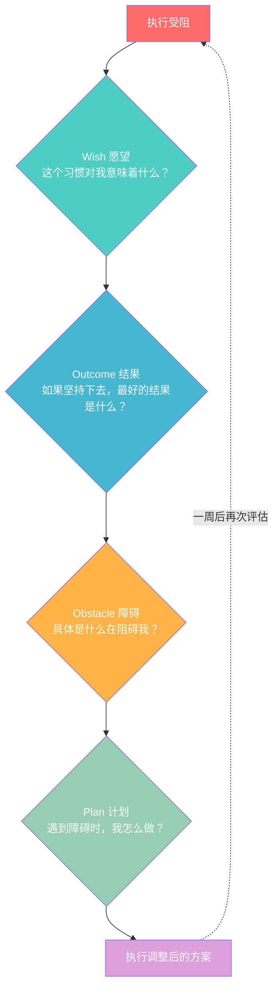

# 第07课：周总结与ABC策略

## Learning Objectives
- 掌握每周总结的标准模板和执行流程
- 理解 WOOP 策略在习惯调整中的具体应用
- 学会运用 ABC 三套策略应对不同能量状态
- 理解舒适区-甜蜜点-恐慌区的边界与应用

---

## 一、为什么必须做每周总结

> [!QUOTE]
> "没有回顾的目标只是一个愿望。没有调整的计划只是一张废纸。"
> — 100天行动核心理念

### 100天行动不是死板的

许多人在开始100天行动时，犯的最大错误就是把计划当作"宪法"——一旦制定就不可更改。这种僵化思维是放弃的首要原因。

**真实数据：**

| 统计维度 | 做每周总结的人 | 不做每周总结的人 |
|----------|----------------|------------------|
| 完成100天比例 | **78%** | 23% |
| 平均坚持天数 | 87 天 | 34 天 |
| 达成初始目标比例 | **71%** | 19% |
| 遇到挫折后放弃比例 | 12% | **67%** |

> [!THEOREM] 周总结的三大功能
> 1. **校准功能**：检查计划是否适合当前的生活状态，及时调整而非硬撑
> 2. **反馈功能**：提供数据化的进步证据，这是内在动力的核心来源
> 3. **预防功能**：在放弃发生之前识别预警信号——连续3天执行不佳是一个强烈预警

### 周总结的核心逻辑

100天不是100天的"复制粘贴"——每一周都是一个新的实验。你在上一周学到的东西，应该在下一周应用。

```
第一周：制定计划 → 执行 → 记录 → 总结 → 调整
                                               ↓
第二周：调整计划 → 执行 → 记录 → 总结 → 调整
                                               ↓
第三周：调整计划 → 执行 → 记录 → 总结 → 调整
                                               ↓
                                              ...
```

这个循环的关键在**总结 → 调整**这一步。没有这一步，执行就变成了盲目重复。

---

## 二、每周总结模板

> [!EXAMPLE] 周总结模板（复制到笔记软件中使用）
>
> ### 第 X 周总结（YYYY-MM-DD ~ YYYY-MM-DD）
>
> #### 1. 执行数据
> | 项目 | 数据 | 备注 |
> |------|------|------|
> | 计划执行次数 | __ / 7 天 | |
> | 成功执行次数 | __ 次 | |
> | 失败/跳过次数 | __ 次 | |
> | 最佳执行时间段 | 例如：早上 7:00~8:00 | |
> | 最差执行时间段 | 例如：下午 3:00~4:00 | |
> | 连续成功天数 | __ 天 | 当前最长连续记录 |
>
> #### 2. 收获（这周做得好的）
> - ...
>
> #### 3. 问题（这周遇到的阻碍）
> - ...
>
> #### 4. 原因分析
> - 每个问题背后的根本原因是什么？
> - 是环境问题？时间问题？能量问题？动机问题？
>
> #### 5. 改进方案
> - 下周将尝试的一个具体改变：...
> - 这个改变要解决的核心问题：...
>
> #### 6. 下周焦点
> - 本周最重要的一个目标（只选一个）：...

### 模板使用原则

> [!WARNING] 三个不要
> 1. **不要写长篇大论** — 周总结控制在 10~15 分钟内完成，写太多反而不会看
> 2. **不要只写问题** — 先写收获再写问题，避免负面偏见
> 3. **不要定太多改进** — 每周只选择一个改进点。贪多嚼不烂。

---

## 三、WOOP 在日常调整中的应用

回顾第02课学到的 **WOOP 策略**——它不仅用于设定目标，更是一个强大的**日常调整工具**。

### WOOP 调整循环

当执行遇到困难时，使用 WOOP 进行快速诊断：



### 周总结中的 WOOP 应用示例

> [!TIP] 实战场景
> **背景**：小王的习惯是"每天跑步 30 分钟"，执行到第三周开始出现连续 3 天中断。
>
> **WOOP 诊断过程：**
>
> | WOOP 步骤 | 小王的回答 |
> |-----------|-----------|
> | **W**ish（愿望）| 我真正想要的是更好的体能和充沛的精力，不是"跑30分钟"这个动作本身 |
> | **O**utcome（结果）| 如果坚持100天，我能在公司运动会上拿名次，精神状态也会大不一样 |
> | **O**bstacle（障碍）| 最近项目加班到很晚，回家已经9点，没有力气跑30分钟 |
> | **P**lan（计划）| 如果加班到8点后，我就不强求跑步，改成在家跳绳10分钟 |
>
> **效果**：调整后小王发现跳绳 10 分钟的执行率接近 100%，而且运动量其实比想象的更大。第三周结束后，他把"加班日"永久设为"跳绳日"。

### WOOP 调整的原则

- **每 7 天做一次 WOOP 检查**：太频繁会变成形式主义，太久则错过调整窗口
- **障碍要具体**：不要说"没时间"，要说"加班到8点后没有30分钟完整时间"
- **计划要是 if-then 格式**："如果 X，那么 Y"——这是执行意图的核心

---

## 四、ABC 策略详解

> [!THEOREM] ABC 策略核心思想
> **能量状态不同，执行策略不同。**
>
> 100天行动不是"每天都打鸡血"。你需要三套方案来应对不同的状态：
> - **A 计划**：状态爆棚时——挑战更高目标
> - **B 计划**：状态正常时——执行原定计划
> - **C 计划**：状态极差时——守住最低底线

### ABC 策略对照表

| 维度 | A 计划：跳出舒适区 | B 计划：正常执行 | C 计划：底线策略 |
|------|--------------------|------------------|------------------|
| **适用状态** | 精力充沛、时间充裕、情绪高涨 | 正常状态、无特殊情况 | 疲惫、生病、时间严重不足 |
| **核心目标** | 突破上限，制造超量恢复 | 保持稳定，持续积累 | 维持习惯链条不中断 |
| **运动示例** | 60分钟高强度训练 | 30分钟中等强度跑步 | 5分钟拉伸或散步 |
| **阅读示例** | 精读50页+做笔记 | 阅读20页 | 读1页或听5分钟有声书 |
| **写作示例** | 写2000字深度文章 | 写500字日记 | 写3句话记录想法 |
| **冥想示例** | 30分钟正念冥想 | 10分钟呼吸冥想 | 3次深呼吸 |
| **心态** | "今天我状态好，要充分利用" | "今天按计划来" | "做了就比不做强" |
| **频率建议** | 每周 1~2 次 | 每周 4~5 次 | 每周不超过 2 次 |
| **风险** | 过度消耗、次日恢复不足 | — | 持续使用会导致习惯缩水 |

> [!SUCCESS] 底线策略的黄金法则
> **"做了就比不做强。"**
>
> 底线策略不是为了偷懒，而是为了**不断链**。一条完整的习惯链条，比一次完美的执行重要100倍。

---

## 五、舒适区与甜蜜点

### 三个区域模型

> [!INFO] 核心概念
> 改变发生最快的地方，不是舒适区，也不是恐慌区，而是**舒适区边界之外一步之遥的甜蜜点**。

```mermaid
flowchart TD
    subgraph Comfort[”舒适区 (Comfort Zone)”]
        A1[”熟悉<br>无压力<br>无需意志力”]
    end
    
    subgraph Sweet[”甜蜜点 (Growth Zone)”]
        B1[”略感挑战<br>需要努力<br>改变最快”]
    end
    
    subgraph Panic[”恐慌区 (Panic Zone)”]
        C1[”压力过大<br>焦虑抗拒<br>容易放弃”]
    end
    
    Comfort -->|”超出当前能力<br>10%~20%”| Sweet
    Sweet -->|”超出过多<br>超出能力50%以上”| Panic
    
    style Comfort fill:#C8E6C9,color:#333
    style Sweet fill:#FFD54F,color:#333
    style Panic fill:#FFCDD2,color:#333
    style A1 fill:#A5D6A7,color:#333
    style B1 fill:#FFCA28,color:#333
    style C1 fill:#EF9A9A,color:#333
```

### 三个区域的详细特征

| 区域 | 你的感受 | 执行表现 | 改变效果 | 建议 |
|------|----------|----------|----------|------|
| **舒适区** | 轻松、无聊、提不起劲 | 100% 完成，但没有进步 | 无变化，停滞不前 | 必须增加难度 |
| **甜蜜点** | 有点压力，但能驾驭 | 70~90% 完成率 | 改变最快！ | 保持在这个区域 |
| **恐慌区** | 焦虑、抗拒、想逃 | 完成率 < 30% | 容易放弃和反弹 | 降低难度，退回甜蜜点 |

### 为什么甜蜜点改变最快？

这背后是**耶克斯-多德森定律（Yerkes-Dodson Law）**：

> 表现水平与压力水平呈**倒 U 型曲线**关系——中等程度的压力/挑战带来最优表现。

```
表现水平
    ↑
  高 │          ● 甜蜜点
    │        ↗   ↘
    │      ↗       ↘
    │    ↗           ↘
  低 │  ↗               ↘
    └────────────────────────→ 压力/挑战水平
      低       中等        高
     舒适区              恐慌区
```

### 如何找到你的甜蜜点？

> [!QUESTION] 自我诊断
> 找一个你正在坚持的习惯，回答以下问题：
>
> 1. 执行时你的**主观难度评分**是多少（1=极轻松，10=极困难）？
> 2. 如果评分在 **3~5** 之间：你可能还在舒适区，考虑增加难度
> 3. 如果评分在 **6~7** 之间：你在甜蜜点，保持！
> 4. 如果评分在 **8~10** 之间：你在恐慌区，需要降低难度或切换为 C 计划
>
> **理想甜蜜点标准**：
> - 执行时感觉到"有点挑战，但相信自己能做到"
> - 完成后有"充实感"而非"被掏空"的感觉
> - 第二天愿意再次执行，没有抵触情绪

---

## 六、渐进超载原则

> [!THEOREM] 渐进超载（Progressive Overload）
> **身体和大脑都需要不断增加难度才能持续进步。**
>
> 这个原则源于运动生理学——肌肉在适应某个负荷后会停止增长，只有持续增加负荷才能突破平台期。同样地，习惯也需要"升级"。

### 渐进超载的运作机制


### 渐进超载的应用方法（按习惯类型）

| 习惯类型 | 渐进方式 | 示例 |
|----------|----------|------|
| **运动** | 增加时长 / 增加强度 / 增加频率 | 跑步 20 分 → 25 分 → 30 分 |
| **阅读** | 增加页数 / 增加笔记量 / 增加思考深度 | 读 10 页 → 15 页 + 写 1 句感悟 |
| **冥想** | 增加时长 / 增加难度（如无引导） | 5 分钟引导 → 10 分钟自主冥想 |
| **写作** | 增加字数 / 增加频率 / 增加质量要求 | 每日 100 字 → 200 字 |
| **学习** | 缩短学习间隔 / 增加输出要求 | 看视频 → 写总结 → 教会别人 |
| **早起** | 每次提前 5~10 分钟，逐步调整 | 7:30 → 7:20 → 7:10 |
| **饮食** | 每餐减少一小口 / 替换一种不健康食物 | 少喝半杯奶茶 → 不喝奶茶 |

### 渐进超载的 ABC 对应关系

ABC 策略恰好是渐进超载的**日常操作工具**：

- **C 计划**：维持当前水平，确保不断链（这是"不退步"的底线）
- **B 计划**：保持在甜蜜点，持续稳定进步（这是"正常进步"的标准节奏）
- **A 计划**：主动增加难度，制造超量恢复（这是"突破平台"的关键手段）

> [!TIP] 最佳节奏建议
> | 周期 | A 计划次数 | B 计划次数 | C 计划次数 |
> |------|-----------|-----------|-----------|
> | 每周 | 1~2 次 | 4~5 次 | ≤2 次 |
> | 每月 | 4~8 次 | 16~20 次 | ≤8 次 |
>
> 你的 A 计划次数不应超过 C 计划次数——这意味着你更多时间在挑战自己，但偶尔也允许自己休息。如果反过来（C 比 A 多），说明你可能需要降低 B 计划的标准。

---

## 七、底线策略（C 计划）的使用限制

### 为什么 C 计划不能多用？

底线策略是一把双刃剑。它可以在你最困难的时候保住习惯链条，但如果使用不当，会变成"温水煮青蛙"式的习惯退化。

> [!WARNING] 红灯信号
> 当出现以下任何一种情况时，你的底线策略已经使用过度：
>
> 1. **连续 3 天使用 C 计划** — 这不再是一次偶尔的休息，而是习惯正在退化
> 2. **每周使用 C 计划超过 2 次** — 底线不是常态，常态应该是 B 计划
> 3. **C 计划的内容在执行时感到"太轻松"** — 如果5分钟运动都让你觉得"太轻松了"，你应该回到 B 计划
> 4. **用 C 计划来逃避 A 计划的机会** — "今天状态不错但我想用 C 计划"是一个危险信号

### C 计划的正确使用场景

| 允许使用 C 计划 | 不应该用 C 计划 |
|-----------------|-----------------|
| 生病（明显不适） | 单纯因为"不想做" |
| 睡眠不足 5 小时 | 前一天也用了 C 计划 |
| 当天有重大事件（婚礼、出差等） | 完成了 A 计划后想用 C 补偿 |
| 心理能量耗尽（如高压力会议后） | 为了凑满"每周 2 次"而用 |
| 客观时间不足（如加班到 11 点） | 有时间做 B 但选了 C |

### 从 C 回到 B 的策略

如果发现自己连续使用了 C 计划，不要自责——使用以下方法回到正轨：

1. **降低 B 计划的标准** —— 可能是你的 B 计划太难了，需要重新定义"正常"
2. **设计一个"从 C 到 B 的过渡周"** —— 先执行一周"加强版 C 计划"（比 C 多一点，比 B 少一点）
3. **找一个 accountability partner** —— 告诉朋友你下周要回到 B 计划，请他检查
4. **重新做一次 WOOP** —— 确认你的目标和动机仍然成立

---

## 八、本周行动

> [!SUCCESS] 本周任务
>
> **任务 A：完成第一次周总结**
> 使用本课提供的模板，为你已经执行的一周做一次完整的周总结。重点是"收获"和"改进方案"部分。
>
> **任务 B：制定你的 ABC 计划**
>
> | 我的习惯 | A 计划（挑战版） | B 计划（正常版） | C 计划（底线版） |
> |----------|-----------------|-----------------|-----------------|
> | 例：运动 | 跑步 45 分钟 | 跑步 25 分钟 | 散步 10 分钟 |
> | 你的习惯：____ | | | |
>
> **任务 C：找到你的甜蜜点**
> 连续 3 天，每天记录执行时的"主观难度评分"（1-10）：
> - 如果连续 3 天 ≤ 5 分 → 下周增加难度，用一次 A 计划
> - 如果连续 3 天 ≥ 8 分 → 降低难度，多用几次 C 计划
> - 如果在 6~7 分 → 保持！你正处在改变最快的甜蜜点

## 九、延伸阅读

**表现原理**指出，坐姿直接影响毅力——德克萨斯大学研究发现，挺直坐姿的人比弯腰驼背的人坚持时间翻了一倍。（显示器位置也很关键，保持屏幕与视线齐平有助于保持挺直坐姿。）**收紧肌肉可以增强意志力**。新加坡国立大学研究发现，攥拳头、收缩二头肌或交叉双臂都能显著提升自我控制能力。**DSB（做点不同的事）** 是打破固化模式的有效方法。当你卡住时，换一种方式继续——站着改坐着、电脑改纸笔——切换本身就能激活大脑不同区域，释放消耗模式。**女性生理期的运动调整建议**：生理期适当减量但不停止，卵泡期是燃脂高峰期效率是平时的3倍，黄体期逐渐减量，排卵期适合正常训练。**偶像力量/榜样人物的自控传染效应**：VanDellen的五步研究发现，看到身边自律的人会无意识地增强我们自己的自控力。选择偶像时，要选一个和你相似但稍微好一点的人。

- Anders Ericsson,《Peak: Secrets from the New Science of Expertise》—— 刻意练习与渐进超载的原始研究
- Gabriele Oettingen,《Rethinking Positive Thinking》—— WOOP 策略的完整理论
- Mihaly Csikszentmihalyi,《Flow》—— 甜蜜点与心流状态的关系
- James Clear,《Atomic Habits》—— 习惯调整与持续改进的实践指南

---

> [!QUESTION] Self-check
>
> 1. 为什么每周总结对于100天行动如此重要？不做的风险是什么？
> 2. 请为你的一个习惯制定 ABC 三套方案，确保它们之间有明显的难度梯度。
> 3. 什么是"甜蜜点"？如何判断你当前是否处于甜蜜点？
> 4. 底线策略（C 计划）的正确使用频率是多少？过度使用的信号是什么？

<details>
<summary>参考答案要点</summary>

1. **重要性**：周总结提供校准（调整不合适的计划）、反馈（数据化的进步证据）和预防（识别放弃前的预警信号）三大功能。不做的风险是：带着错误的计划重复执行 → 挫败感积累 → 第 30~50 天之间放弃。数据显示做周总结的人完成率是 78%，不做的人只有 23%。

2. **ABC 梯度示例**（以"每天学英语"为例）：
   - A 计划：精读一篇经济学人文章 + 整理 20 个生词 + 写 100 词摘要
   - B 计划：背 20 个单词 + 听 10 分钟播客并跟读
   - C 计划：打开 APP 记 3 个单词或看 1 分钟英文视频
   关键：梯度要真实可感——从 C 到 B 有 3 倍左右的差距。

3. **甜蜜点判断标准**：
   - 主观难度评分在 6~7 分
   - 执行时有适度挑战感但相信能完成
   - 完成后有充实感而非被掏空
   - 第二天愿意继续
   如果连续一周执行都很轻松（≤5分），就说明已经在舒适区了，需要增加难度。

4. **C 计划使用频率**：
   - 正确频率：每周 ≤ 2 次
   - 过度使用信号：连续 3 天使用 C 计划、每周超过 2 次、用 C 计划逃避挑战、C 计划执行时感到太轻松
   - 如果发现自己过度使用 C 计划，不要自责——降低 B 计划的标准或设计一个过渡周

</details>

---

## Next Step

Continue with the next lesson: **第08课：自我关怀**，学习如何在习惯中断时用自我关怀代替自我批评，以及如何从挫折中更快恢复。