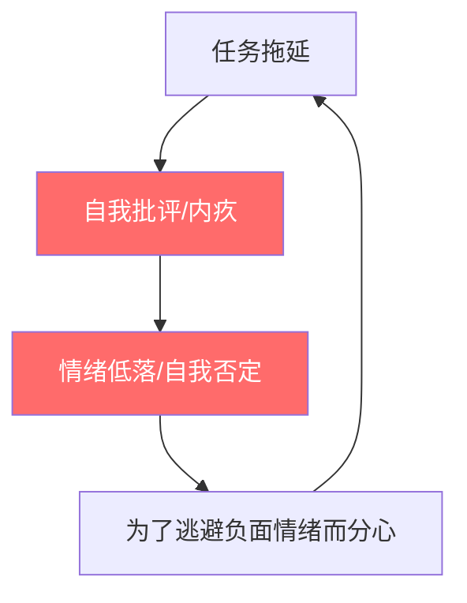
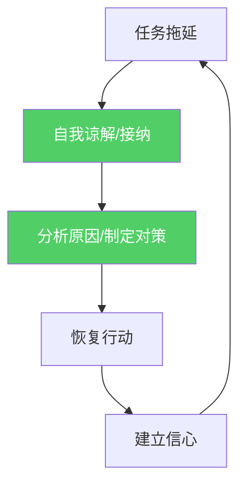

# 第08课：自我谅解的力量

## Learning Objectives

- 理解自我批评与自我谅解对习惯养成的截然不同影响
- 掌握自我谅解三视角法，在失败时有效自我修复
- 破除"一天不差"的完美主义陷阱，建立可持续的行动节奏

## 中断、失败和痛苦：你无法回避的三件事

当你开始100天行动，你很快就会遇到三个不速之客：**中断、失败和痛苦**。它们不是意外——它们是这个过程的必然组成部分。无论你多么努力、多么自律，在100天里，你一定会：

- 某一天忘记打卡
- 某一天状态极差
- 某一天被突发事件打断
- 某一天感到强烈的抗拒和痛苦

大多数人面对这些情况时的第一反应是**自我攻击**："我太没用了""我就是意志力差""算了，反正已经失败了"。这种反应看似在鞭策自己，实际上却是最危险的陷阱。

> [!WARNING] 关键时刻
> 失败本身不会毁掉你的习惯，**你对自己失败的反应**才会。在中断后的24小时内采取什么态度，决定了你是回归轨道还是彻底放弃。这是100天行动中最重要的决策点。

## 路易斯安那州立大学甜甜圈实验：自我批评让你吃得更多

2007年，路易斯安那州立大学的研究人员做了一项经典的实验。他们招募了一群正在节食的女性，让她们先吃一个甜甜圈——对于节食者来说，这已经是"违规"了。

吃完甜甜圈后，研究人员将参与者分为两组：

- **第一组**：被告知"请原谅自己，每个人都会有放纵的时候"
- **第二组**：被告知"请反思你有多后悔吃这个甜甜圈，你对自己的克制力感到羞愧吗？"

随后，每位参与者面前都摆上了一大盘糖果，研究人员告诉她们"可以随便吃，想尝多少都行"。

结果令人震惊：

| 组别 | 平均糖果摄入量 |
|------|---------------|
| 自我谅解组 | **28个** |
| 自责组 | **近70个** |

自责组的糖果摄入量是自我谅解组的**2.5倍**。

> [!NOTE] 实验背后的心理机制
> 当节食者"违规"吃了甜甜圈后，自责会触发一种"管他呢"效应（What-the-hell effect）。她们的内心对话是："反正我已经破坏了节食计划，那再多吃一点也无所谓了。"这种心态导致了一发不可收拾的暴食。相反，自我谅解组的人将违规视为一次小失误，而不是整个计划的崩溃，因此能迅速回归正常。

这个实验揭示了一个反直觉的核心洞见：**严厉的自我批评不是自律，而是放纵的催化剂。**

## 卡尔顿大学拖延研究：自我越严厉，后续拖延越严重

卡尔顿大学的研究者对数百名大学生进行了长达数月的跟踪研究。这些学生在学期初报告了自己的拖延倾向和对自己拖延行为的态度。研究人员定期测量他们后续的拖延行为和学习表现。

结果同样令人深思：

| 对待拖延的态度 | 后续拖延程度 | 期末成绩 |
|---------------|-------------|---------|
| 自我谅解型（"这次拖延了，下次改进"） | 逐步减少 | 稳步提升 |
| 自我批评型（"我太懒了，我永远改不了"） | **越来越严重** | 持续下降 |

研究还发现一个关键的动态关系：**越是对自己过去的拖延感到内疚和自责，下一次拖延的概率就越高。** 自责产生的负面情绪（羞愧、内疚、自我厌恶）不仅不能抑制拖延，反而会让人为了逃避这些情绪而进一步拖延——形成恶性循环。

### 拖延的恶性循环 vs 良性循环





## 完美主义的陷阱：100天必须一天不差的强迫症

在100天行动中，最常遇到的一种心态是**完美主义式的坚持**："我必须100天一天不差，如果有一天中断，我就彻底失败了。"

这种心态听起来很励志，实际上却是最大的破坏力之一。因为它建立在一个错误的假设上：习惯养成是一个**二进制开关**——要么全有，要么全无。但现实是：

- 习惯养成是一个**连续的曲线**
- 中断1-2天不会让你回到原点
- 真正让你回到原点的是"既然断了就彻底放弃"的决定

> [!DANGER] 完美主义的代价
> 完美主义不是追求卓越，而是**恐惧失败的伪装**。它让你把"完美的计划"置于"真实的进步"之上，最终导致你为了维护完美的自我形象而放弃行动。

### 完美主义 vs 卓越追求

| 维度 | 完美主义 | 卓越追求 |
|------|---------|---------|
| 对失败的态度 | 无法接受，视为灾难 | 视为反馈和学习机会 |
| 标准设定 | 僵化、绝对化 | 灵活、可调整 |
| 中断后反应 | "我完了"→放弃 | "没关系"→第二天继续 |
| 情绪体验 | 焦虑、恐惧、羞愧 | 平和、自信、坚韧 |
| 长期效果 | 高放弃率 | 高坚持率 |

## 自我谅解三视角法

当你中断习惯或表现不佳时，不要启动自我攻击模式。相反，请使用**自我谅解三视角法**进行自我对话。这套方法源自自我同情研究专家Kristin Neff的理论框架，经过100天行动的实践检验，具有极强的可操作性。

> [!TIP] 三视角法实践指南
> 在中断发生的15分钟内完成这三个视角的对话，效果最佳。超过24小时后，负面影响已经开始累积。

### 视角1：我现在感受如何？（关注并描述情绪）

**目标**：将模糊的情绪转化为具体的语言，让情绪被看见、被承认。

**操作方法**：停下来，深呼吸三次，问自己"我现在感受如何？"然后用词语描述你的情绪。

**常见情绪词汇表**：

| 情绪类别 | 具体词汇 |
|---------|---------|
| 愤怒类 | 愤怒、烦躁、恼火、不满、沮丧 |
| 悲伤类 | 失落、难过、伤心、沮丧、失望 |
| 焦虑类 | 担心、不安、紧张、恐慌、忧虑 |
| 羞愧类 | 尴尬、羞耻、丢脸、自责、内疚 |
| 无力类 | 疲惫、无力、消沉、缺乏动力、麻木 |

**示例对话**：
- "我现在感到深深的沮丧。我已经坚持了21天，今天因为加班没能跑步，我觉得很懊恼。"
- "我注意到自己正在感到羞愧，因为我告诉自己'必须每天打卡'，但我没有做到。"

### 视角2：告诉自己"我是一个凡人"，挫折是人性组成部分

**目标**：将个人的失败放在人类共通的背景下理解，避免"只有我这么差劲"的孤立感。

**操作方法**：告诉自己以下三句话之一：

- "所有人都会在习惯养成过程中遇到中断，这是人性的一部分，不是我的个人缺陷。"
- "凡人皆有不完美，这不是失败的证明，而是我是正常人的证明。"
- "100天里遇到中断是必然的，不是我运气不好或能力不足。"

**核心逻辑**：我们常常认为"只有我做不到""别人都做得很好"，这是一种认知偏差。实际上，几乎所有人的习惯养成之路都充满了中断和反复。当你接受这一点时，你就不再需要用完美的表现来证明自己的价值。

### 视角3：你会对朋友说什么？（用安慰朋友的方式安慰自己）

**目标**：跳出自我中心的批判视角，用对待朋友的善意对待自己。

**操作方法**：想象你最好的朋友正好遇到了和你一样的情况——他/她坚持了21天的习惯今天中断了，他/她正沮丧地来找你倾诉。你会说什么？

**常见的朋友式回应**：

| 你的自我批判 | 你会对朋友说的话 |
|-------------|-----------------|
| "我真是太废了，连这点事都做不好。" | "你已经坚持21天了，这已经很了不起了。一天的中断不代表什么。" |
| "既然断了，那这100天计划就废了。" | "别这么想，你今天继续就好了，100天里少一天完全没问题。" |
| "别人都能坚持，就我不行。" | "每个人都有自己的节奏，你不需要和别人比。" |
| "我永远都改不了这个坏毛病。" | "一次中断不等于永远失败，你之前已经证明了自己可以做到。" |

**关键原则**：**你给别人的建议，就是你最需要的建议。** 我们在安慰朋友时总是充满智慧和善意，但面对自己时却极其苛刻。视角3的目的就是让你把这些智慧用在自己身上。

> [!QUOTE] Kristin Neff
> "自我同情不是自我放纵。如果你做了伤害自己的事，自我同情会给你力量去承认它、修复它，而不是陷在自责的泥潭里无法动弹。"

## 66天研究的重要发现：偶尔中断1-2天不会影响习惯形成

伦敦大学学院的Philippa Lally团队在2009年发表了关于习惯养成的里程碑研究。他们跟踪了96名参与者，在84天内每天记录他们的行为自动化程度。这项研究得出了一些经常被引用但也被误解的结论。

**关于中断的关键发现**：

> [!NOTE]
> Lally（2009）的研究表明，偶尔中断1-2天不会显著影响习惯形成的整体进程。习惯强度的增长曲线在短暂中断后会继续上升，而不是回落到起点。

具体数据：

- 中断1天的参与者，回归后习惯强度平均恢复到中断前的**95%**
- 中断2天的参与者，回归后习惯强度平均恢复到中断前的**88%**
- 连续中断3天及以上，习惯强度才开始出现**明显下降**

这意味着：**只要你在中断后的第一时间恢复行动，1-2天的缺口几乎不会对你的100天计划产生实质性影响。**

## 失败时应该做记录，但不要自我攻击

在100天行动中，失败不是终点——它是宝贵的**数据点**。但关键在于你如何记录和解读这个数据点。

### 应该做的记录方式（客观数据化）

```
日期：7月15日
原计划：早起跑步30分钟
实际情况：没有起床
中断原因：昨晚加班到凌晨2点
情绪感受：疲惫、轻微沮丧
下一步行动：今晚早睡，明天按计划跑步
```

### 不应该做的记录方式（情绪化攻击）

```
又失败了。我真是没用。永远都起不来。 
这个100天行动我肯定坚持不下来。
算了，反正已经断了。
```

### 失败记录模板

> [!TIP] 失败记录模板
> 每次中断后，在你的日志中回答以下四个问题：
>
> 1. **发生了什么？**（客观描述事实，不加评判）
> 2. **为什么会发生？**（寻找根本原因，而非借口）
> 3. **我从中学到了什么？**（提取经验教训）
> 4. **我接下来要做什么？**（制定具体行动计划）

### 自我谅解 vs 自我批评：全面对比

| 维度 | 自我批评型反应 | 自我谅解型反应 | 对习惯的影响 |
|------|---------------|---------------|-------------|
| 中断后第一句话 | "我太差了" | "没关系，明天继续" | 批评→负面情绪→放弃 |
| 对失败的解释 | "我就是能力不行" | "这次是有原因的" | 谅解→分析→改进 |
| 情绪状态 | 羞愧、内疚、焦虑 | 平和、接纳、坚定 | 积极情绪利于坚持 |
| 后续行动力 | 减弱，甚至放弃 | 保持或增强 | 谅解→恢复行动 |
| 长期效果 | 三分钟热度、高放弃率 | 持续进步、低放弃率 | 差异显著 |

## 实践作业

> [!QUESTION] 今天的行动
> 请完成以下三个练习：
>
> 1. **情景演练**：回想最近一次习惯中断或计划失败的经历，用三视角法重新审视：
>    - 视角1：我当时感受如何？
>    - 视角2：如何告诉自己"这是一个凡人都会遇到的挫折"？
>    - 视角3：如果好朋友遇到同样的事，我会对他说什么？
>
> 2. **自我对话改写**：找出你常用的3条自我批评语句，将它们改写成自我谅解的表达方式。
>
> 3. **创建"中断应对清单"**：写下3件你可以在习惯中断后立即做的事（如：深呼吸、做一次三视角对话、写下失败记录的四问题）。

<details>
<summary>参考答案（在完成练习前不要展开）</summary>

**情景演练示例**：
- 假设你坚持了15天的阅读习惯中断了
- 视角1："我感到沮丧和自责，觉得自己的坚持被打破了。"
- 视角2："100天的行动中难免有一天中断，这是正常的，不是我的失败。"
- 视角3：对朋友说"你已经读了15天了，太棒了！明天再继续就好，一天不算什么。"

**中断应对清单示例**：
1. 做三次深呼吸，对自己说"没关系"
2. 打开笔记本，回答失败记录的四个问题
3. 明确写出明天的最小行动单元

</details>

## 核心公式回顾

本节课的核心公式：

```
中断 + 自我谅解 = 快速恢复 + 继续前进
中断 + 自我批评 = 负面情绪 + 彻底放弃
```

## 与上一课的关联

回顾第07课我们学到的**ABC模型**：

- **A（前因）**：中断习惯的事件
- **B（信念）**：你如何看待这次中断（自我批评或自我谅解）
- **C（后果）**：坚持或放弃

自我谅解正是调整B（信念）的关键技巧，它让你从"全有或全无"的极端信念转向"灵活坚持"的健康信念。

## 扩展阅读

- Kristin Neff,《自我同情》（Self-Compassion）
- David Burns,《好心情手册》（Feeling Good）——认知行为疗法的经典著作，其中关于认知扭曲的章节尤其相关
- Carol Dweck,《终身成长》（Mindset）——成长型思维与自我谅解的深层联系

## Next Step

继续学习第09课：结构化日志——学会用科学的方法记录和分析你的行为模式。
</details>