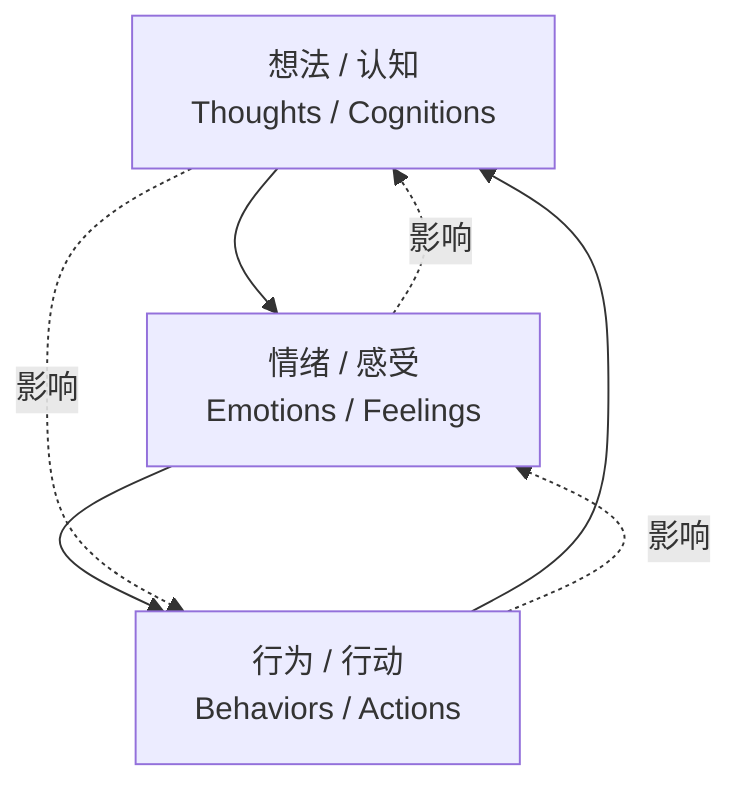
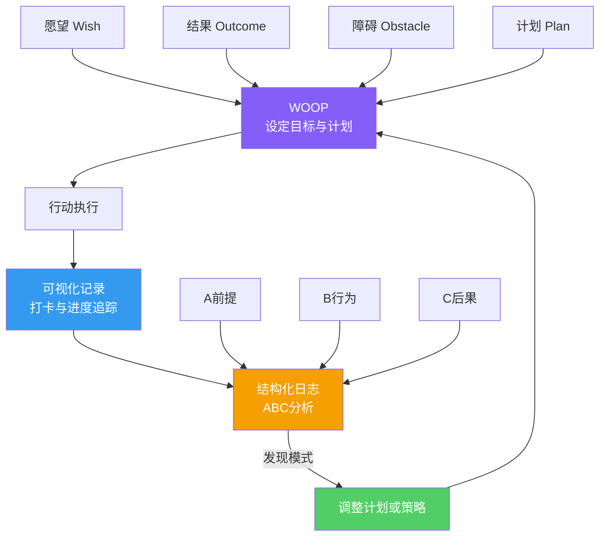

# 第09课：结构化日志

## Learning Objectives

- 理解认知行为疗法（CBT）在习惯养成中的基础应用
- 掌握结构化日志的三栏记录法（ABC模型）
- 学会通过日志分析找出行为的关键触发模式
- 将记录与WOOP、可视化形成完整的行动闭环

## 认知行为疗法（CBT）基础理念

认知行为疗法（Cognitive Behavioral Therapy, CBT）是心理学领域最具实证支持的疗法之一，由Aaron Beck在20世纪60年代创立。其核心思想极为简洁但强大：

> [!QUOTE] CBT核心理念
> 不是事件本身决定了你的感受和行为，而是**你对事件的解读**决定了后续的一切。

### 认知三角模型

CBT将人类的心理活动分为三个相互影响的维度：

**在日常生活中如何运作？**

| 场景 | 想法 | 情绪 | 行为 |
|------|------|------|------|
| 闹钟响了该起床 | "我太困了，起不来" | 疲惫、无力 | 按掉闹钟继续睡 |
| 闹钟响了该起床 | "再困也要起来，坚持30天就形成习惯了" | 坚定、期待 | 起床、洗漱、开始行动 |
| 朋友约你去吃夜宵 | "我就吃一次不会影响减肥" | 放松、放纵 | 去吃夜宵，第二天体重增加 |
| 朋友约你去吃夜宵 | "今晚我有运动计划，改天再约" | 自信、掌控 | 婉拒，按计划锻炼 |

**同样的事实，不同的想法，导致完全不同的行为和结果。** 结构化日志的目的就是让你看见自己脑海中的这些想法。

> [!NOTE] 这不是治疗
> 请理解：我们在这里学习的是CBT的自我管理工具，不是心理治疗。结构化日志是一个自我觉察的工具，它帮助你看清自己的行为模式，而不是替代专业心理咨询。如果你有严重的情绪问题，请寻求专业帮助。

## 为什么结构化日志对习惯养成至关重要

在第04课我们学习了可视化记录，在第06课我们学习了WOOP心理对比。这两个工具解决的是"设定目标"和"克服障碍"的问题。但它们有一个共同的盲点：**没有追踪你的日常行为模式和触发因素。**

结构化日志填补了这个空白。它回答了以下关键问题：

- 我的好习惯总是在什么情况下**被打破**？
- 我的坏习惯总是在什么情况下**被触发**？
- 我的情绪状态如何影响我的行动决策？
- 我是否有一些不自觉的思维模式在破坏我的习惯？

## 结构化日志三栏法：前提-行为-后果（ABC模型）

结构化日志的核心框架是**ABC模型**，它来自CBT的经典工具，经过调整后专门用于习惯分析。

### ABC模型结构

| 栏目 | 英文 | 含义 | 关键问题 |
|------|------|------|---------|
| **A - 前提** | Antecedent | 行为发生前的一切 | 什么触发了这个行为？当时的时间、地点、人物、情绪、想法是什么？ |
| **B - 行为** | Behavior | 你的具体行动 | 你具体做了什么？想了什么？感受了什么？ |
| **C - 后果** | Consequence | 行为带来的结果 | 结果如何？愉快的还是不愉快的？短期和长期分别有什么影响？ |

> [!TIP] 三栏记录法操作模板
> 每天记录1-2个关键行为，完成后复制以下模板到你的笔记中填写。
>
> ### A - 前提（Antecedent）
> - **时间**：[行为发生的具体时间]
> - **地点**：[行为发生的具体地点]
> - **人物**：[当时和谁在一起]
> - **情绪**：[行为发生前你的情绪状态]
> - **想法**：[脑海中闪过的想法和念头]
>
> ### B - 行为（Behavior）
> - **具体行动**：[你做了什么？]
> - **思维过程**：[你如何思考这个决定？]
> - **身体感受**：[身体有什么感觉？]
>
> ### C - 后果（Consequence）
> - **即时结果**：[立刻发生了什么？]
> - **感受评价**：[愉快/不愉快，程度1-10]
> - **长期影响**：[对这个选择你事后怎么看？]

### ABC模型在习惯养成中的完整分析流程

## 案例分析：早睡失败者的结构化日志

让我们看一个真实的案例。小王的目标是"每天晚上11:00前睡觉"，但在过去两周里，他只有3天做到了。通过结构化日志，他记录了几次典型的失败场景。

### 案例一：深夜打游戏

| 栏位 | 记录内容 |
|------|---------|
| **A-前提** | **时间**：晚上10:30 **地点**：卧室 **人物**：独自一人 **情绪**：有点兴奋，刚完成工作觉得应该放松一下 **想法**："今天工作很累，打一局游戏放松一下，就一局。" |
| **B-行为** | 打开手机游戏，告诉自己只玩一局。结果输了不服气，又开一局。连续玩了4局，抬眼已经12:15。 **身体感受**：眼睛酸涩，但大脑依然兴奋。 |
| **C-后果** | **即时**：第二天早上起不来，上班迟到。 **感受评价**：愉悦度6/10（游戏时），后悔度9/10（睡觉时） **长期**：形成"工作累了就打游戏"的条件反射。 |

### 案例二：闺蜜深夜来电

| 栏位 | 记录内容 |
|------|---------|
| **A-前提** | **时间**：晚上10:45 **地点**：卧室，已经换上睡衣准备睡觉 **人物**：闺蜜来电 **情绪**：担心、好奇 **想法**："这么晚打电话肯定有急事，不能不接。接了就聊两句吧。" |
| **B-行为** | 接了电话，闺蜜和男朋友吵架了。你安慰了她45分钟。 **身体感受**：开始清醒，共情后情绪被带动。 |
| **C-后果** | **即时**：挂电话已经11:30，躺下后还在想闺蜜的事，12:00才睡着。 **感受评价**：助人的满足感7/10，熬夜的后悔8/10 **长期**：闺蜜知道你会接电话，深夜倾诉成了习惯。 |

### 案例三：临时被叫去KTV

| 栏位 | 记录内容 |
|------|---------|
| **A-前提** | **时间**：晚上9:00 **地点**：公司加班刚结束 **人物**：同事3人 **情绪**：疲惫但社交压力大 **想法**："不去的话显得不合群，下次有项目合作会尴尬。而且已经加班很累了，去放松一下也好。" |
| **B-行为** | 和同事去了KTV，一直唱到凌晨1:00。期间喝了啤酒。 **身体感受**：开始疲惫，后来被气氛带动反而兴奋。 |
| **C-后果** | **即时**：回家已经凌晨1:30，洗漱后2:00才睡。 **感受评价**：社交愉悦7/10，熬夜后悔9/10 **长期**：同事知道你是"随叫随到"的人，类似邀约越来越多。 |

### 模式分析

通过三份结构化日志，小王发现了自己的**三个关键触发模式**：

1. **放松型触发**：工作压力大→想放松→打开游戏→无法自控（内部触发）
2. **社交型触发**：朋友/同事邀约→无法拒绝→熬夜（外部触发）
3. **情绪型触发**：他人的情绪需求→过度共情→牺牲自己的计划（关系触发）

这三个模式，如果小王没有记录日志，他可能永远不会清晰地意识到。他只会笼统地认为"我就是自控力差"。

> [!NOTE] 模式识别的力量
> 一旦你识别出具体的触发模式，解决方案就变得非常清晰：
> - 模式1的解决方案：用阅读或冥想替代游戏作为放松方式
> - 模式2的解决方案：学习拒绝技巧（详见第10课）
> - 模式3的解决方案：设定接电话的底线时间

## 反应性效应：记录本身就能改变行为

结构化日志有一个神奇的副作用——**反应性效应（Reactivity Effect）**。

> [!TIP] 反应性效应
> 当人们开始系统性地记录自己的行为时，行为本身就会开始发生改变。仅仅是被观察和被记录，就足以产生修正作用。

这背后的机制类似于"霍桑效应"——当人们意识到自己正在被关注时，表现会自然改善。在结构化日志中，当你把"晚上10:30打游戏"这个行为从"自动发生的无聊消遣"变成"一个需要被记录和分析的决策事件"，你的大脑会自动赋予它更多权重，让你在下一次触发时多犹豫几秒钟——而这短短的犹豫，往往就是改变的开始。

**反应性效应的实际表现**：

- 记录的第一周，你的"坏习惯"可能会自动减少20-30%
- 不是因为你想到了更好的解决方法，仅仅是因为记录本身
- 这就是为什么CBT中的"自我监测"是一个核心干预手段

## 记录注意事项

**四条基本记录规则**：即时记录（发生后立即记）、准确记录（不美化不省略）、持续记录（每天不间断）、简化记录（不超过2分钟）。

为了让结构化日志发挥最大作用，请遵循以下五个原则：

### 1. 行为发生后立刻记录，不要等

| 记录时机 | 效果 |
|---------|------|
| 行为发生后5分钟内 | 记忆鲜活，细节完整，情绪真实 |
| 行为发生后1小时内 | 大部分细节还在，但情绪开始淡化 |
| 第二天再记录 | 记忆模糊，容易合理化自己的行为 |
| 从来都不记录 | 永远看不清自己的行为模式 |

**实操建议**：在手机备忘录或笔记本中建立一个快速记录入口。行为发生后，花2分钟记录关键信息，等有空时再详细整理。

### 2. 保持客观中立

记录的核心原则是**描述事实，而非评判自己**。

| ❌ 主观评判 | ✅ 客观描述 |
|------------|------------|
| "我又没控制住自己，吃了那么多垃圾食品。" | "晚饭后吃了3块巧克力饼干。" |
| "我太懒了，又没去跑步。" | "原计划19:00跑步，但17:30开会到18:45，回到家已经19:10，没有出门跑步。" |
| "我意志力太差了。" | "22:00打开了短视频App，原计划看5分钟，实际看了45分钟。" |

### 3. 好的坏的一起记录

结构化日志不是只记录失败——记录成功同样重要。当你记录自己的"胜利时刻"时，你是在为大脑建立正面的神经通路。

**好的行为也需要分析**：

| 栏位 | 记录内容 |
|------|---------|
| **A-前提** | 今天下班后感觉很累，但想起自己的跑步计划 |
| **B-行为** | 还是换上了跑鞋，告诉自己"就跑5分钟"。结果跑了25分钟。 |
| **C-后果** | 跑步后精神状态明显好转，睡眠质量也很好。 |

**分析成功模式**：通过对比"成功日"和"失败日"的记录，你可以发现：
- 成功日在什么条件下发生的？
- 哪些因素促成了你的坚持？
- 你能否在更多日子里复制这些条件？

### 4. 找出关键项（Key Indicators）

记录几周后，回过头审视你的日志，寻找那些反复出现的模式。这就是你的**关键指标**（Key Indicators）。

**常见的关键项类型**：

| 关键项类型 | 示例 |
|-----------|------|
| **时间关键项** | 晚上10:00-11:00是最危险的时间段 |
| **地点关键项** | 在沙发上比在书桌前更容易刷手机 |
| **情绪关键项** | 焦虑和疲劳是最大的坏习惯触发器 |
| **人物关键项** | 和A同事在一起总会拖延，和B同事不会 |
| **活动关键项** | 加班后直接回家容易放弃运动计划 |

> [!TIP] 如何提取关键项
> 每周花15分钟回顾本周的所有ABC记录，问自己三个问题：
> 1. 哪些因素在我的"失败记录"中反复出现？
> 2. 哪些因素在我的"成功记录"中反复出现？
> 3. 我可以增加哪些促进因素？减少哪些阻碍因素？

## 与WOOP、可视化记录形成闭环

在第04课中，我们学习了可视化记录（打卡、进度追踪）。在第06课中，我们学习了WOOP（愿望-结果-障碍-计划）。本节课的结构化日志与它们形成了完整的**行动闭环**：

### 三个工具的职责分工

| 工具 | 解决的问题 | 使用频率 | 核心输出 |
|------|-----------|---------|---------|
| WOOP（第06课） | "我要去哪里？遇到障碍怎么办？" | 每周/每月 | 目标、计划、如果-那么预案 |
| 可视化记录（第04课） | "我坚持了吗？进度如何？" | 每天 | 打卡记录、连续天数、完成率 |
| 结构化日志（第09课） | "我的模式是什么？如何改进？" | 每天/每周 | 行为触发模式、关键指标、优化方向 |

### 完整的实操流程

1. **周一早晨**：用WOOP设定本周的具体目标和应对障碍的计划
2. **每天行动后**：完成可视化记录（打卡）+ 结构化日志（5分钟记录关键行为）
3. **每天早晨**：回顾昨天的日志，确认当天的行动重点
4. **周日晚上**：回顾一周的日志，提取关键项，调整下周的WOOP计划

> [!NOTE] 不要贪多
> 刚开始时，你不需要每天记录所有的行为。选1-2个你最想改变的行为，先从它们开始记录。等熟练后再扩展到更多行为。记录本身也要养成习惯——用最小的单位开始。

## 实践作业

> [!QUESTION] 今天的行动
>
> 1. **创建你的第一个ABC记录**：今天选择一个你想改变的习惯（如熬夜、吃零食、拖延），在行为发生后的10分钟内完成完整的ABC三栏记录。
>
> 2. **设置记录提醒**：在你的手机上设置一个21:00的闹钟，提醒你回顾今天的日志并完成记录。
>
> 3. **找出一条模式**：回顾过去一周的行为（不需要精确记录，凭记忆即可），尝试找出至少1个你反复出现的触发模式。
>
> 4. **组合三大工具**：在你的笔记本中创建一个"100天行动闭环"页面，将你的WOOP计划、可视化记录和结构化日志放在一起，形成系统的自我管理体系。

参考答案（在完成练习前不要展开）

**ABC记录示例**（以"下午吃零食"为例）：

**A-前提**：
- 时间：下午15:30
- 地点：办公室工位
- 人物：独自一人
- 情绪：无聊、略疲惫
- 想法："离下班还有2小时，有点饿了，去茶水间看看有什么吃的"

**B-行为**：
- 走到茶水间，看到同事放的薯片，拿了一把（约15片）
- 边工作边吃，不知不觉又去拿了两次
- 身体感受：开始觉得有点饱，但手还在往嘴里送

**C-后果**：
- 即时：吃了约半袋薯片
- 感受评价：短暂满足5/10，事后自责7/10
- 长期影响：发现"下午无聊"是自己最脆弱的时刻

**触发模式总结**：
- 关键项：下午15:00-16:00 + 无聊情绪 + 办公室 → 零食摄入
- 应对策略：在这个时间段准备健康的替代零食（水果、坚果），或设置一个5分钟的站立拉伸闹钟打断无聊感

**组合闭环示例**：
- WOOP计划：本周目标"减少下午零食摄入"
- 可视化记录：每天在日历上标记"是否吃零食"
- 结构化日志：记录每次吃零食的ABC

## 扩展阅读

- David Burns,《好心情手册》（Feeling Good）——CBT的经典入门读物
- Judith Beck,《认知行为疗法》（Cognitive Behavior Therapy: Basics and Beyond）——更深入的CBT技术
- Timothy Wilson,《最熟悉的陌生人》（Strangers to Ourselves）——关于自我觉察的局限性和如何突破

## 与下一课的关联

在第10课中，我们将学习**环境设计与拒绝技巧**。结构化日志中发现的关键触发模式，很多都和环境因素与社交压力有关。当你知道了自己的触发模式后，第10课的工具将帮助你从物理环境和社会环境两个维度进行改造。

## Next Step

继续学习第10课：环境设计与拒绝技巧——从被动应对到主动设计你的行为环境。

