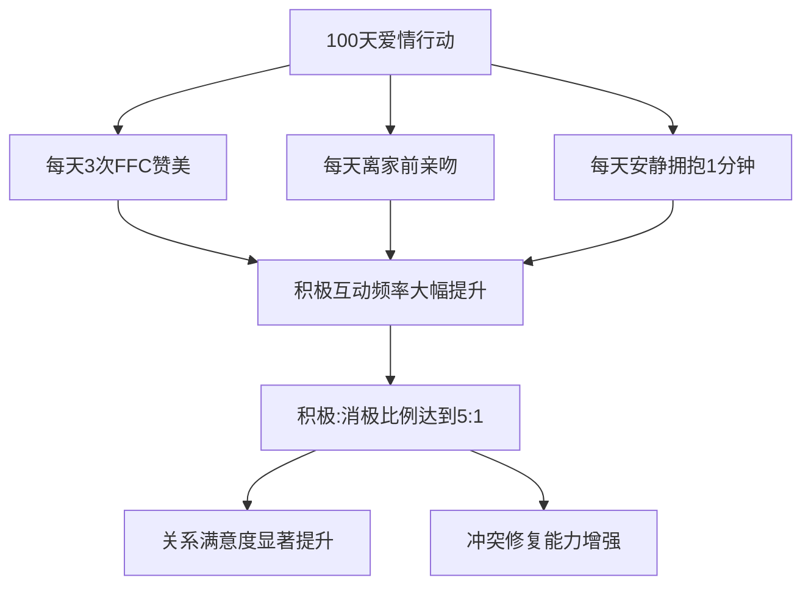
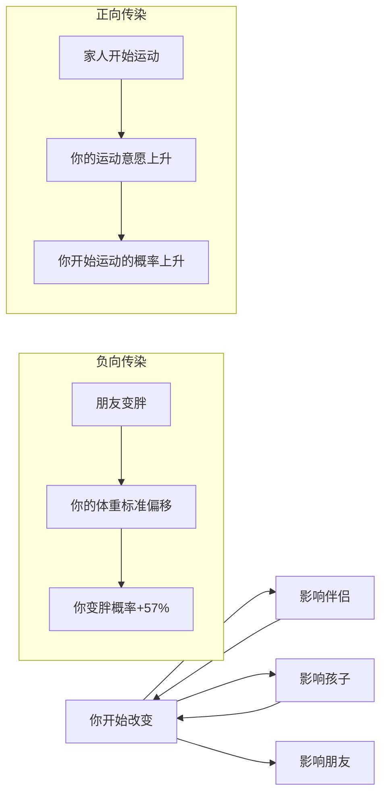

# 第17课：关系与亲子习惯

## Learning Objectives

- 掌握"100天爱情行动"的三条规则及科学原理
- 学会FFC赞美法则的具体运用
- 了解培养孩子坚持品质的三个关键因素
- 掌握家庭挑战方法的设计和执行要点
- 理解肥胖和习惯的社会传染性及其对家庭的影响

## Core Idea

习惯从来不只是"一个人的事"。你身边的人——伴侣、孩子、父母——构成了你习惯生态系统中最重要的环境。反过来，你的改变也在无形中影响着他们。

### 一、100天爱情行动

> [!QUOTE] 来自课程发起人的观察
> "我认识一对夫妻，结婚十几年，关系越来越冷淡。丈夫每天加班到很晚，回家后和妻子基本不说话，各自刷手机。妻子抱怨丈夫不关心她，丈夫觉得妻子不理解他工作的辛苦。两个人都没做错什么，只是**不再经营感情了**。"

感情和习惯一样——你不维护它，它会自然退化。100天爱情行动就是为了扭转这种自然退化而设计的三条简单规则：

#### 规则一：每天真心赞美伴侣3次

赞美不是敷衍的"你今天很好看"，而是使用 **FFC法则**：

| 要素 | 含义 | 错误示范 | 正确示范 |
|------|------|----------|----------|
| **F**eeling 感受 | 你的真实感受 | "你今天很好看" | "我觉得你今天特别有精神" |
| **F**act 事实 | 具体的事实依据 | "你做得很好" | "我看到你今天主动帮妈提了菜，走那么远的路" |
| **C**ompare 对比 | 与之前的对比 | "你最近不错" | "比上周你只睡5小时就出门的状态好太多了" |

完整的FFC赞美："**我觉得特别开心**（感受），因为**今天早上看到你把厨房收拾得那么干净，碗都洗好了**（事实），**以前你总是急着出门不收拾，这次你真的改变了很多**（对比）。"

> [!TIP] FFC的威力
> 普通的赞美听起来像"客气话"，FFC赞美听起来像"真心话"。因为事实+对比的加入，让对方感受到你是真的注意到了他的付出。

#### 规则二：每天离家前亲吻对方

这个规则的核心不是亲吻本身，而是**建立一种仪式感**。

研究发现，出门前有亲吻习惯的夫妻，离婚率比没有这个习惯的夫妻低约50%。原因很简单：这个动作在潜意识层面传递了一个信号——"即使我们要分开一天，我们的联结还在。"

实操建议：
- 设置在门口贴一张便利贴提醒自己
- 不管是否在吵架，都要执行——这个动作本身可以帮助打破冷战
- 如果出差或不在家，可以通过视频完成

#### 规则三：每天拥抱一分钟（安静拥抱，什么都不说）

这个规则可能是三条中最难的——因为一分钟的安静拥抱，对于关系冷淡的夫妻来说，会感觉"尴尬"和"漫长"。

但正是这种"尴尬"，说明这个规则有效。一分钟安静拥抱的作用：

- **催产素分泌**：拥抱促进催产素（"拥抱激素"）的分泌，它降低压力水平，增强信任感
- **非语言沟通**：很多时候，语言是多余的甚至是有害的（比如争吵时的气话）。安静拥抱绕过了语言的陷阱，直接进行"身体层面的沟通"
- **打破疏离惯性**：如果你们已经很久没有亲密接触了，最初的拥抱确实会尴尬。但这种尴尬恰恰说明你们需要这个习惯

> [!NOTE] 真实案例反馈
> 一对实践100天爱情行动的夫妻反馈：第一天拥抱时，两个人都觉得别扭，抱了不到10秒就松开了。到了第7天，丈夫主动说"还没抱够一分钟"。到了第30天，妻子说"每天最期待的就是这个拥抱"。

### 二、为什么赞美和拥抱能改善关系

心理学上的"积极回应理论"可以解释：关系中真正重要的不是"有没有冲突"，而是"积极互动与消极互动的比例"。

著名婚姻心理学家约翰·戈特曼（John Gottman）经过40年的研究发现：

- 稳定的婚姻：积极互动：消极互动 = **5:1**
- 走向离婚的婚姻：积极互动：消极互动 ≈ **0.8:1**

也就是说，每1次争吵、批评或抱怨，需要至少5次赞美、感谢或亲昵来弥补。100天爱情行动的本质，就是人为地增加积极互动的频率——每天3次赞美+1次亲吻+1分钟拥抱，至少创造了5次以上的积极互动。

### 三、培养孩子的坚持品质

> [!QUOTE] 三个关键因素
> 培养孩子的坚持品质，有三个关键因素：**父母的榜样、环境设计、课外活动选择**。

#### 因素一：父母榜样

孩子不会听你怎么说，但会看你怎么做。如果你一边要求孩子坚持练琴，一边自己刷手机刷到半夜——孩子会认为"坚持"只是父母用来管自己的工具，而不是真正重要的品质。

一个最简单的做法：**让孩子看到你在为自己的目标坚持**。无论是在学一门新技能、坚持运动还是练习一门语言，让孩子看到你也在"打卡"、也在"不想做但坚持做"。

#### 因素二：环境设计

孩子的自控力比成人弱得多——他们更需要环境的力量。

- 想要孩子多读书？把书放在他随手能拿到的地方，而不是锁在书柜里
- 想减少屏幕时间？把平板电脑和手机放在孩子看不到的地方充着电
- 想让孩子坚持运动？周末安排固定的家庭户外活动时间

#### 因素三：课外活动

任何需要长期投入的活动都可以培养坚持品质——但前提是**活动由孩子自己选择**。

#### 家庭挑战方法

这是一个特别有效的实操方法：

> [!IMPORTANT] 家庭挑战规则
> 1. 每位家庭成员选择一件"有难度但想做"的事
> 2. 共同打卡100天
> 3. **允许退出但不允许放弃**——退出是指在某个时间点决定不继续了；放弃是指还没有真正尝试就放弃了。如果是孩子尝试了一周后说不喜欢，可以换一个活动继续打卡，但不能"算了不做了"
> 4. 每天晚上一起汇报进度，互相鼓励
> 5. 100天结束后举办家庭庆祝仪式

**允许退出但不允许放弃**，这个原则为什么重要？

- 孩子的兴趣确实会变化——今天想学钢琴明天想学画画，这很正常
- "退出但不放弃"的意思是：你可以换一件事情继续坚持，但不可以什么都不坚持
- 这个原则教会孩子：坚持的形式可以变，但坚持的品质不能丢

家庭挑战打卡表示例：

| 日期 | 爸爸的打卡 | 妈妈的打卡 | 孩子的打卡 |
|------|-----------|-----------|-----------|
| 第1天 | 跑步30分钟 | 练瑜伽20分钟 | 练琴30分钟 |
| 第2天 | 跑步30分钟 | 练瑜伽20分钟 | 练琴30分钟 |
| 第3天 | 跑步30分钟 | 练瑜伽20分钟 | 练琴25分钟 |
| ...   | ...       | ...       | ...       |

### 四、带动家人一起改变

#### 肥胖的社会传染性

2011年发表在《新英格兰医学杂志》上的一项重磅研究发现：**肥胖具有"社会传染性"**。

具体数据令人震惊：

- 如果你的朋友变胖了，你变胖的概率增加 **57%**
- 如果你的兄弟姐妹变胖了，你变胖的概率增加 **40%**
- 如果你的配偶变胖了，你变胖的概率增加 **37%**

这个现象的背后机制不是病毒——而是**行为规范的社会化**。当身边的人开始变胖时，我们对"正常体重"的认知会发生偏移，对饮食和运动的容忍度也会变化。

好消息是：**健康行为也具有同样的传染性**。

- 当你的朋友开始运动时，你开始运动的概率也增加了
- 当家人开始健康饮食时，你也会不自觉地跟着改变

#### 丈夫对妻子的影响 vs 妻子对丈夫的影响

研究中还有一个有趣的发现：在夫妻之间，**丈夫对妻子体重的影响大于妻子对丈夫的影响**。这意味着——如果丈夫开始改变（比如开始健康饮食和运动），妻子随之改变的概率会非常高。

从这个角度说，你自己开始100天行动，本身就是带动家人改变的最有效方式。

#### 真实的成功案例

> [!NOTE] 案例一：异地情侣的共读100天
> 小陈和小李是异国恋，时差12小时。他们约定一起读100天书，每天读同一本书的同一章节，晚上各自写读后感发到群里。100天后，他们不仅各读了8本书，还发现共同话题多了很多。"以前视频的时候总是没话说，现在聊书能聊一个小时。"

> [!NOTE] 案例二：全家的运动100天
> 一家四口（父母+两个儿子）约定100天每天运动。爸爸跑步，妈妈跳操，大儿子跳绳，小儿子骑车。每天晚上八点，全家各自开始运动。100天后，爸爸说最开心的是"大儿子主动说想参加学校的跑步比赛"。

> [!NOTE] 案例三：母女的瑜伽100天
> 52岁的妈妈和24岁的女儿一起报名了瑜伽课，约定100天内每周至少上3次课。妈妈一开始连最简单的动作都做不了，到第80天可以完成一套完整的流瑜伽。女儿说："看到妈妈那么努力，我也不好意思偷懒。"

### 五、把100天行动带入家庭的核心建议

1. **从自己开始**——不要试图"改造"家人，先做出改变
2. **邀请而非要求**——"我在做一个100天的挑战，你想不想一起试试？"
3. **降低门槛**——家人的参与标准可以比你低（比如孩子每天练10分钟琴就算完成）
4. **创造仪式感**——设置家庭打卡板、完成100天后的庆祝仪式
5. **允许中断**——家人偶尔偷懒是正常的，不要因此批评或放弃

**重要边际行为的识别与应用**：边际行为是指那些看似微小但影响巨大的行为差异。比如在控制饮食中，'只吃七分饱'和'吃到十分饱'的边际差异，长期累积会导致显著的体重差异。

## Worked Example

**小刘的家庭挑战计划**：

小刘，男，35岁，有一个8岁的儿子。他报名了100天行动后，想带动家人一起参与。

他的做法：
1. 自己不声不响地坚持了30天——每天跑步30分钟
2. 第30天，儿子主动问："爸爸你每天在干什么？"
3. 他说："我在做一个挑战，要不要一起？你可以选一件你想坚持的事。"
4. 儿子选了"每天练习写字20分钟"
5. 妻子看他们父子俩都在坚持，主动说"那我每天练瑜伽吧"
6. 三人做了一个家庭打卡墙，贴了100个格子
7. 100天后，三人一起去了儿子最想去的游乐园庆祝

**关键点**：他没有一开始就拉家人参与，而是自己先坚持了一个月，用行动"吸引"而不是"说服"家人。

## Practice

> [!QUESTION] 自我检测
> 如果你有伴侣或家人，今天尝试做以下三件事中的一件：
> 1. 用FFC法则真心赞美伴侣或孩子一次
> 2. 给伴侣或孩子一个超过20秒的拥抱
> 3. 和家人聊一下："我想做一个100天挑战，你们要不要一起？"
>
> 记录下你尝试之后的感受和对方的反应。

参考思路

关系类习惯最难的障碍是"第一步的尴尬"。第一次用FFC法可能会觉得"好做作"，第一次长时间拥抱可能会觉得"好奇怪"。

关键是要理解：**这种尴尬感不是方法的问题，而是你和对方太久没有这样互动了**。如果你和伴侣已经很久没有真诚交流过，突然的赞美和拥抱当然会不自然。

但是，就像重新开始运动时肌肉会酸痛一样——这种"不自然"恰恰在说明，你们的关系正在被重新"拉伸"和"激活"。坚持一周，尴尬会变成温暖。

如果你是一个人生活，可以把今天的练习内容调整为：给自己一个重要的人（父母、朋友）打一个电话，用FFC法则表达一次真诚的感谢。

## Next Step

明天的课程是"成长型思维"，我们将探讨如何用成长型思维替代固定型思维，让100天行动变成终身成长的起点。

Continue with the next lesson or complete the review task above before moving on.