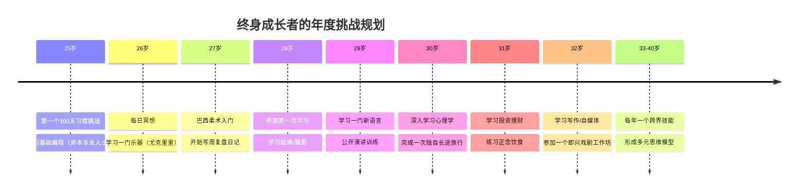
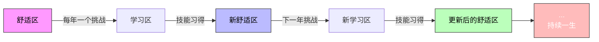

# 第18课：每年一次挑战与成长型思维

> **核心规则九：每年一次挑战跳出舒适区。** 这条规则没有终点——它需要重复一辈子。

---

## 固化思维 vs 成长型思维

斯坦福大学心理学家卡罗尔·德韦克（Carol Dweck）在其经典著作《终身成长》中提出了影响全球教育界和商业界的**思维模式理论**。她发现，人对自身能力的基本信念深刻地决定了他们的行为模式、抗挫能力和最终成就。

| 维度 | 固化思维 (Fixed Mindset) | 成长型思维 (Growth Mindset) |
|------|--------------------------|----------------------------|
| **对能力的看法** | 能力是固定的，天生注定 | 能力可以通过努力发展 |
| **面对挑战** | 回避挑战，怕暴露不足 | 拥抱挑战，视其为成长机会 |
| **面对障碍** | 轻易放弃 | 坚持不懈 |
| **对努力的看法** | 努力是"不够聪明"的表现 | 努力是通往精通的必经之路 |
| **对批评的反应** | 忽视或抵触建设性反馈 | 从批评中学习 |
| **他人的成功** | 感到威胁 | 获得启发和激励 |
| **结果** | 过早达到 plateau（平台期） | 持续突破上限 |
| **典型句式** | "我不是这块料" | "我暂时还不会，但可以学" |

> [!NOTE] 实验佐证
> 德韦克团队曾对数百名学生进行智力测试。表扬"聪明"的那组学生在后续选择中倾向于回避挑战，而表扬"努力"的那组则有90%选择了更难的挑战。仅仅一个表扬方式的差异，就彻底改变了学生的行为模式。

---

## 舒适区固化的陷阱

大多数人毕业入职的头3-5年成长最快——新环境迫使你不断学习。**但问题出在第5年之后。**

这时你已掌握了岗位所需的大部分技能，工作驾轻就熟。舒适区开始形成。表面上看这是一种"稳定"，但德韦克的研究揭示了一个残酷的事实：

> [!WARNING] 舒适区的四个隐蔽代价
> 1. **认知萎缩**：大脑的神经可塑性随年龄下降，如果不主动刺激，学习速度会逐年递减
> 2. **身份固化**：你会开始说"我就是这样的人"，而不是"我此刻处于这个状态"
> 3. **机会成本**：留在舒适区的每一年，都是你错过探索新领域可能性的那一年
> 4. **抗风险能力下降**：当行业突变时，舒适区最久的人受伤最深

这就是为什么本课程把**"每年一次挑战跳出舒适区"**列为九大核心规则中的最后一条——它不是选修课，而是必修课。

---

## 跨学科思维的力量

单一学科的思维模式就像一把锤子——看什么都像钉子。查理·芒格称之为"拿锤子的人"（Man with a Hammer Syndrome）。这位伯克希尔·哈撒韦的副董事长一生推崇**跨学科思维模型**，他的工具箱里装着一百多种来自不同学科的思维模型。

| 学科 | 思维模型示例 | 日常应用 |
|------|-------------|---------|
| 物理学 | 临界点、复利效应 | 理解习惯的"爆发点"——坚持到某个阈值后效果指数级增长 |
| 生物学 | 进化论、适者生存 | 不要把习惯当敌人，要与环境共舞 |
| 心理学 | 损失厌恶、锚定效应 | 设计奖励/惩罚机制驱动行为 |
| 经济学 | 机会成本、边际效用 | 每天的时间分配就是投资组合管理 |
| 工程学 | 反馈回路、冗余设计 | 建立检查机制和容错系统 |
| 哲学 | 第一性原理、奥卡姆剃刀 | 追问"为什么要做这个习惯"，剔除冗余 |

> [!TIP] 彼得·德鲁克的跨学科研究
> 现代管理学之父彼得·德鲁克一生研究了**16个不同学科**，他每隔三到四年就会选择一个全新领域深入研究。他说过一句著名的话："在一个人的职业生涯中，他需要掌握一门以上的专业，否则他就是一个'窄化的人'。"

德鲁克的做法给我们一个重要启示：**每年的挑战不必与工作直接相关。** 学一门看似"无用"的技能，反而可能带来最大的认知增益。

---

## 认知重构：每次学习都在重塑大脑

每一次跨领域的学习都不是简单的"知识叠加"，而是一次**认知重构**（Cognitive Restructuring）——你的大脑会建立起新的神经通路，让你用全新的方式感知世界。

### 理科生学艺术：用感性认知世界

程序员学绘画的过程，往往是痛苦的——因为他们的思维习惯了"对与错"的二元逻辑，而绘画中根本没有"正确"的路径。但正是这种痛苦带来了突破：

- 从"判断"到"观察"：不再急于判断好坏，而是真正去看光影、比例、色彩
- 从"分析"到"感受"：学会信任直觉，而不是一直在脑中运算
- 从"控制"到"接受"：接受"不完美"本身就是艺术的一部分

### 文科生学编程：用理性认知世界

一个学文学或历史的人第一次接触编程时，认知颠覆同样是剧烈的：

- 从"模糊"到"精确"：自然语言充满歧义，但计算机要求绝对精确
- 从"诠释"到"执行"：过去你解释世界，现在你构建世界
- 从"线性"到"系统"：学会用模块化、面向对象的方式思考复杂问题

### 绘画改变观察方式

有研究表明，经过三个月的绘画训练后，医学院学生的诊断准确率显著提升——因为他们学会了观察细节。绘画不是在教技巧，而是在教**"怎么看"**。这种观察方式一旦习得，就会迁移到你生活的方方面面：你能更快发现同事脸上的疲惫、会议中的微妙情绪、数据图表中的异常波动。

> [!NOTE] 战隋老师的学习经历：巴西柔术
> 战隋老师在学习巴西柔术之前，对"对抗"的理解是停留在概念层面的。当他真正被一个体重轻他20公斤的蓝带降服时，他的认知被彻底颠覆了：
> 
> **认知一：力量不是决定性因素。** 技术、杠杆和时机远比蛮力重要。这在工作和谈判中有同样的道理。
> 
> **认知二：舒服的位置不等于安全的位置。** 在柔术中，你感觉最舒服的位置常常是对方陷阱——你正在被一步步带入降服。这让他重新审视工作中那些"太顺利"的时刻。
> 
> **认知三：输是最好的老师。** 每次被降服都是一次免费的教学。如果你在乎面子而不愿"输"，你就放弃了最快的成长路径。
>
> 这些领悟无法通过读书获得——**只在真实的体验中，认知才会被重构。**

---

## 伟哥的诞生：思维的180度转变

也许历史上最经典的"认知重构"案例是**伟哥（Viagra）的发明故事**。

1980年代，辉瑞公司研发了一种代号为UK-92480的药物，目标是治疗心绞痛（心脏疾病）。临床试验结果令人失望——它对心脏病没有任何效果。按照固化思维的逻辑，这个项目应该被彻底放弃。

但研究团队注意到一个奇怪的副作用：参与试验的男性报告了一个"令人尴尬的问题"——勃起次数增多。辉瑞的高管面临着选择：是坚持"它本来是心脏病药"的初始定义，还是重新思考这个分子的价值？

他们选择了后者。这种思维转变催生了人类历史上最成功的药物之一——**伟哥在上市第一年就创造了超过10亿美元的销售额。**

> [!QUOTE]
> 辉瑞前CEO Henry McKinnell说："我们最成功的药物不是我们计划要开发的。它告诉我们，有时候你需要**重新定义问题**而不是解决问题。"

这个案例展示了成长型思维的精髓：**失败只是一个暂时的标签，它取决于你用什么框架来解读。** 切换框架，失败可能变成巨大的成功。

---

## 拳王阿里的"蝶舞蜂刺"

穆罕默德·阿里并非天生完美拳手。事实上，他的打法与传统拳击完全相反：

| 传统拳击 | 阿里的创新 |
|----------|------------|
| 双脚站稳地面出重拳 | 像蝴蝶一样不停移动 |
| 低头防守、格挡 | 上身摇晃、脚步后撤 |
| 追求一击KO | "蜂刺"战术——快速连续出拳消耗对方 |
| 依靠力量优势 | 依靠速度和节奏感 |

阿里的对手们普遍比他高大强壮。如果他按照传统打法，他的劣势——力量不足、臂展不够——会被放大。但他把自己的**劣势变成了优势**：既然打不过力量，就比速度；既然扛不住重拳，就不让对方打中。

阿里的"蝶舞蜂刺"（Float like a butterfly, sting like a bee）不仅是拳击战术，更是一种**思维方式**：不要在自己不擅长的领域和对手竞争，而是重新定义游戏规则。

> [!TIP] 将阿里原则运用到你的习惯养成
> - 如果你无法靠意志力硬撑，就**设计环境**（第10课）
> - 如果你无法每天早上5点起床，就**找到自己的最佳时间**（第13课）
> - 如果你无法坚持90分钟高强度的训练，就**从15分钟开始**（第3课）
>
> 成长型思维不是说"我必须按最痛苦的方式做"，而是**找到最适合自己的路径，同时保持挑战性。**

---

## 年度挑战的Mermaid时间线

以下是规划一生年度挑战的时间线模板：

> [!IMPORTANT] 关键原则
> 每年的时间线不需要填满所有格子。**一年只选一个主要挑战 + 一个辅助挑战。** 质量远比数量重要。

---

## 做一个终身成长者

本课是九大核心规则中的最后一条，也是最"宏大"的一条。前八条规则帮你在**具体的行为层面**做出改变，而第九条规则要求你在**身份认同层面**做出改变：

> **不要把"成长"看作一个项目，把它看作一种生活方式。**

成长型思维不是盲目乐观，而是一套关于**如何与不确定性共处**的心智武器库。德韦克在《终身成长》的结尾写道：

> [!QUOTE]
> "真正的自信是有勇气敞开心扉去欢迎新的变化和想法，不管它们来自何方。真正的自信并非来源于我们拥有什么，而是来源于我们愿意去学习什么。"

**第九条规则要重复一辈子。** 每年选一个让自己"害怕一点点"的挑战——今年学游泳，明年学编程，后年写一本书。不是因为你必须，而是因为**这是保持年轻、保持好奇、保持活着的最好方式。**

---

## 实践任务

> [!QUESTION] 今天的练习
> 1. **列出三个你曾经说过"我不是这块料"的事情。** 对每一项写一句替换句式："我现在还不会____，但通过____我可以学会它。"
>
> 2. **规划你接下来三年的年度挑战。** 选一个和工作无关的，选一个和工作有关的，选一个纯粹为了好玩的。
>
> 3. **找一位跨学科学习的前辈。** 可以是芒格、德鲁克这样的名人，也可以是你身边的同事或朋友。了解他们是如何把不同领域的知识串联起来的。

参考答案（思考方向）

1. "我不是这块料"的句式替换：
   - "我不是学数学的料" → "我目前的数学基础还不够，但每天练习30分钟，一年后会有巨大变化"
   - "我不会画画" → "我还不懂透视和光影原理，但通过三个月的系统练习可以掌握基础"

2. 年度挑战的核心标准：
   - **有明确的输出/成果**（而不是模糊的"学英语"）
   - **会让你感到一定压力**（完全轻松说明挑战度不够）
   - **有时间边界**（明确起止时间）

---

## 本课总结

| 核心观点 | 要点 |
|----------|------|
| 固化 vs 成长 | 能力是否可变，决定了你面对挑战的态度 |
| 舒适区陷阱 | 工作3-5年后最容易陷入，每年需要刻意打破 |
| 跨学科思维 | 芒格100种模型、德鲁克16个学科——打破"拿锤子"局限 |
| 认知重构 | 每次跨领域学习都在重塑大脑的感知方式 |
| 案例启示 | 伟哥的失败变成功、阿里的劣势变优势 |
| 关键习惯概念 | 有些习惯一旦建立会引发连锁反应，带动其他好习惯自动跟进。早起、运动、赞美他人、时间记录是四个最经典的关键习惯——选其中一个突破，其他方面会自然改善。 |
| 终身实践 | 第九条规则没有终点 |

---

## 下一步

完成本课的实践任务后，进入**第19课：组团打卡与社群力量**，学习如何把身边的人变成你成长路上的同行者。

> 参考书目：卡罗尔·德韦克《终身成长》、查理·芒格《穷查理宝典》、彼得·德鲁克《卓有成效的管理者》