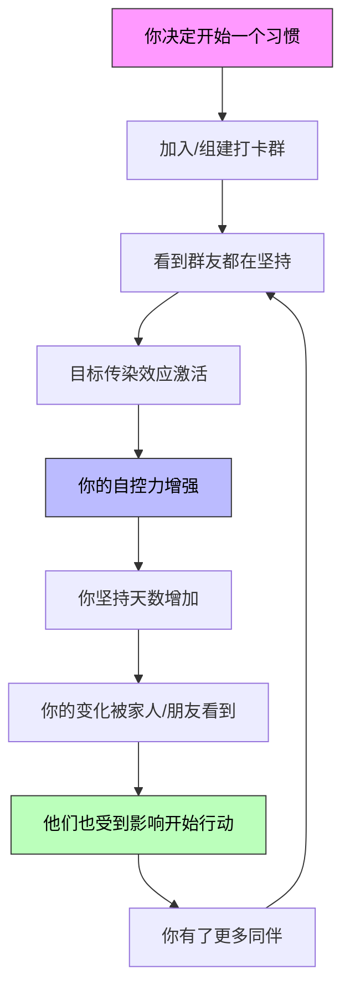

# 第19课：组团打卡与社群力量

> **核心规则八：帮你重视的人一起达成目标。** 改变从来不只是你一个人的事——你的变化会传染，你也能从他人的变化中获得力量。

---

## 肥胖的"社会传染性"

2007年，《新英格兰医学杂志》发表了一项震惊学界的追踪研究。哈佛大学医学院的尼古拉斯·克里斯塔基斯（Nicholas Christakis）和詹姆斯·福勒（James Fowler）对弗雷明汉心脏研究中的超过1.2万人进行了32年的追踪分析，发现了一个惊人的现象：

> [!QUOTE]
> **肥胖是会"传染"的。**
> - 如果你的朋友变胖，你变胖的概率增加 **57%**
> - 如果你的兄弟姐妹变胖，你变胖的概率增加 **40%**
> - 如果你的配偶变胖，你变胖的概率增加 **37%**
>
> 来源：Christakis & Fowler, NEJM 2007

更令人惊讶的是，这种影响不需要直接接触——即使朋友住在千里之外，影响依然存在。这说明社会影响不是通过"一起吃饭"这种直接行为传播的，而是通过**改变你对"正常"的认知**来起作用的。

### 好习惯也在传染

好消息是，这种社会传染性同样作用于好习惯：

| 坏习惯传染 | 好习惯传染 |
|-----------|-----------|
| 朋友变胖 → 你变胖 +57% | 朋友开始运动 → 你运动意愿增加（效果同等显著） |
| 朋友吸烟 → 你更可能吸烟 | 朋友戒烟 → 你戒烟成功率翻倍 |
| 朋友久坐 → 你久坐时间更长 | 朋友加入健身打卡群 → 你更可能加入 |
| 朋友熬夜 → 你觉得熬夜正常 | 朋友早起 → 你对"正常作息"的标准被重置 |

**核心理念：** 社会网络是习惯的双向高速公路。如果坏习惯能通过社交关系传播，好习惯同样可以——你只需要刻意设计传播的方向。

---

## 心理学的"自控传染"效应

除了社会传染，心理学还发现了另一个有趣的现象：

> [!NOTE] 仅仅看到自控力强的人就能增强自控
> 2010年，荷兰心理学家的一项实验发现：仅仅是**让受试者阅读一段关于自控力强的人的故事**，他们在后续的意志力测试中的表现就显著优于对照组。
>
> 更进一步的研究表明，**甚至只是想象一个自控力强的人（比如你的偶像）面对诱惑时的反应**，就能激活你的前额叶皮层，增强自控能力。
>
> 这被称为**"目标传染"（Goal Contagion）**——人类有一种无意识的倾向，会自动模仿周围人的目标和行为。

这对我们的实践意味着什么？

**与其一个人默默坚持，不如主动创造一个"好习惯传染"的环境。** 你不需要有超人般的意志力——你只需要让自己身处一群正在努力的人群中。

---

## 微信群打卡实操指南

微信群打卡是目前成本最低、效果最好的社群互督方式。但一个微信群能否产生效果，取决于它**如何被设计**。

### 群人数：15-20人最佳

| 人数区间 | 效果 | 原因分析 |
|----------|------|----------|
| 5人以下 | 氛围不足，容易整体放弃 | 缺少多样性，一个人断签容易带崩节奏 |
| **15-20人** | **最佳效果** | 既有足够的多样性，每个人又有存在感 |
| 30-50人 | 信息过载，沉默大多数 | 超过30人后，群聊信息量激增，大多数人会开启免打扰并失联 |
| 100人以上 | 完全的"潜水群" | 没有任何互督效果，沦为广告和沉默的混合体 |

### 运营机制模板

```yaml
# 微信群打卡规则模板

群名称: 100天行动·[挑战名称]·第X期
人数上限: 20人
挑战周期: 100天

规则:
  1. 每日打卡:
     时间: 每天 23:00 前
     格式: "[天数/100] 今日完成内容 + 一句话感受"
     示例: "[12/100] 跑步5公里，今天状态很好突破个人记录"

  2. 记录人:
     设置: 每周轮换一人担任"记录人"
     职责: 
       - 每晚统计当天打卡人数
       - 在群内公示"今日未打卡名单"
       - 每周日做周总结

  3. 未完成惩罚:
     方式: 未打卡者发红包，金额=未打卡天数×5元
     上限: 单次最多50元
     用途: 红包由记录人代收，作为"完成庆祝基金"

  4. 周总结会:
     时间: 每周日晚 21:00
     形式: 每人用语音/文字分享本周最大收获和最大困难
     时长: 30-45分钟

  5. 群生命周期:
     周期: 3-4个月（100天挑战 + 额外缓冲期）
     解散: 挑战完成后一周解散，不留"僵尸群"
     后续: 可组建"进阶群"或"新学期"
```

> [!IMPORTANT] 为什么3-4个月后建议解散
> 任何一个微信群的活跃周期都不会超过3-4个月。到第4个月，大多数群会进入"沉寂期"——这不是人的问题，而是社交网络的天然规律。与其让群变成"想退又不方便退"的负担，不如在使命完成后体面解散。**好的群组死于解散，坏的群组死于沉默。**

### 线上总结会的话术模板

**第一周总结会引导问题：**

1. 这一周你最骄傲的一个瞬间是什么？
2. 有没有哪一天你差点放弃？是什么让你坚持下来了？
3. 你发现自己在哪个环节还有改进空间？
4. 你需要群友给你什么支持？

**第50天（中途）总结会引导问题：**

1. 和30天前相比，你觉得自己有什么变化？
2. 这个习惯给你带来了没有预料到的"副产品"吗？
3. 接下来的50天，你想在哪些方面做得更好？

**第100天（结营）总结会引导问题：**

1. 写下100天前你对自己的期待。现在你实现了吗？
2. 这三个多月，你最想感谢群里的谁？为什么？
3. 这个习惯你会继续坚持吗？下一期你想挑战什么？

---

## 找偶像的力量

除了身边的同伴，你还有一个强大的工具——**偶像**。心理学家发现，"目标传染"效应甚至可以跨越时空：你不需要见到真人，只需要在心里清晰构建一个"榜样"的形象。

> [!TIP] 偶像效应实操方法
> 当你在坚持习惯的过程中面临困难时，问自己三个问题：
> 
> 1. **如果换作是[你的偶像]，TA面对这个情况会怎么做？**
>    - 示例："如果是村上春树遇到今天不想跑步，他会怎么做？"
> 
> 2. **TA可能会对我说什么？**
>    - 示例："科比可能会说：'这就是别人放弃的时刻，也是你拉开差距的时刻。'"
> 
> 3. **我现在能做的最小一步是什么？**
>    - 把"跑10公里"变成"穿上跑鞋走出门"
>
> 这个方法不是自我欺骗，而是用"认知启动"（Cognitive Priming）激活你内心已有的力量。

**常见偶像选择（供参考）：**

| 领域 | 适合的偶像 | 他们的习惯哲学 |
|------|-----------|---------------|
| 跑步/运动 | 村上春树 | "今天不想跑，所以才去跑" |
| 写作/创作 | 海明威 | "每天写500字，但必须在最佳状态时停笔" |
| 商业/管理 | 查理·芒格 | "每天阅读6小时，积累思维模型" |
| 自律/坚持 | 詹姆斯·克利尔 | "每天进步1%，不在乎当下的结果" |
| 科学/研究 | 爱因斯坦 | "保持好奇心，把问题当成朋友" |

---

## 改变也会改变他人

> [!NOTE] 真实故事：一个人的改变如何影响全家
>
> **故事一：母女瑜伽**
> 一位学员坚持练习瑜伽100天后，她的女儿——一个从不运动的高中生——开始主动问她："妈妈，你今天练什么？我能和你一起吗？"半年后，母女俩一起报了瑜伽教培班。这位学员说："我没有劝过她一次。我只是让她看到了改变后的妈妈是什么样子。"
>
> **故事二：不运动的父亲**
> 一位30岁的银行职员开始每天早晨5点起床跑步。他的父亲——一个五十多岁的办公室职员，有轻度高血压——最开始觉得儿子"有病"。三个月后，父亲问："你那个跑步软件叫什么？我也下一个。"现在父子俩每周日一起跑10公里。
>
> **故事三：异地恋的共读**
> 一对异地恋情侣，女生在坚持阅读习惯，每天读30分钟并写读书笔记。男朋友看到她每天发来的笔记，自己也开始读书。两个人开始了"共读计划"——每个月读同一本书，周末视频讨论。后来男生说："我们的关系从'吃饭了吗'变成了'你读完了第三章吗？'"
>
> **故事四：小学老师带学生跑步**
> 一位小学老师为了自己减肥开始晨跑。她在朋友圈打卡。班上的学生看到了，好奇地问："老师你在干什么？"她随口说了一句："老师在变强。"第二天，三个学生说要和她一起跑。一个月后，全班30多个孩子都加入了"和老师一起跑步"的行列。这位老师说："我没想过要教育他们什么，我只是在做自己的事。"

这些故事揭示了一个深刻的道理：

> [!QUOTE]
> **改变最好的方式不是说服，是示范。**
>
> 你不需要去教育任何人。你只需要坚持你的习惯，你的变化就是最好的说服力。

---

## 实践：建立你的社群支持系统

| 步骤 | 行动 | 时间节点 | 完成标志 |
|------|------|----------|----------|
| 第1步 | 找到3-5个有意愿的朋友组成"核心种子" | 第1天 | 确认5人以上参与意向 |
| 第2步 | 设定挑战规则（见上文模板） | 第3天 | 文档定稿并群内公示 |
| 第3步 | 拉满15-20人群 | 第5天 | 群成员确定 |
| 第4步 | 第一个人值班（记录人）已确认 | 第7天 | 排班表完成 |
| 第5步 | 第一次周总结会 | 第7天 | 完成30分钟语音会议 |
| 第6步 | 第50天中期复盘 | 第50天 | 每人分享阶段性收获 |
| 第7步 | 第100天结营庆祝 | 第100天 | 发红包、写结营总结 |
| 第8步 | 投票决定：解散/进阶/新挑战 | 第101天 | 群完成使命 |

> [!CHECKLIST] 群主检查清单
> - [ ] 挑战名称和周期是否明确写在群公告里？
> - [ ] 打卡格式是否在群公告中展示（附示例）？
> - [ ] 记录人排班表是否至少排到第50天？
> - [ ] 红包惩罚规则是否所有人都确认同意？
> - [ ] 第一次周总结会的时间是否在日历上标记？
> - [ ] 是否有备选记录人（以防有人临时退出）？
> - [ ] 群聊是否关闭了"非提醒时段"？（避免打扰）
> - [ ] 是否在群公告中注明"本群预计X月X日解散"？

---

## 社群力量与个人成长的协同



这个循环一旦启动，你的习惯就从"个人项目"变成了"生态事件"。你不只是在改变自己，你在创造一个**改变的环境**。

---

## 本课总结

| 核心观点 | 要点 |
|----------|------|
| 社会传染性 | 肥胖可传染，好习惯同样可传染——设计传播方向 |
| 目标传染 | 看到自控力强的人就能增强自控——偶像效应 |
| 微信群运营 | 15-20人、轮换记录人、红包惩罚、周总结、3-4个月解散 |
| 改变示范 | 你不需要说服任何人，你的坚持就是最好的教育 |
| 10分钟创意写作法 | 手不停（连续写10分钟不中断）、具体描述（写细节而非抽象概括）、不编辑（不要边写边改）。从"我记得"开始。 |
| 写作素材来源 | 主要有两个：你的记忆（过去经历和感受）和日常接触的人（他们的故事和对话）。从"我记得"开始写，你会发现自己有很多可写的。 |
| 第八条规则 | 帮你重视的人一起达成目标——你不是一个人在战斗 |

---

## 下一步

完成本课的实践任务后，进入最后一课——**第20课：全课总结与行动指南**，回顾九大核心规则，制定你的个人行动路线图。

> 参考书目：克里斯塔基斯《大连接》、詹姆斯·克利尔《掌控习惯》、凯利·麦格尼格尔《自控力》