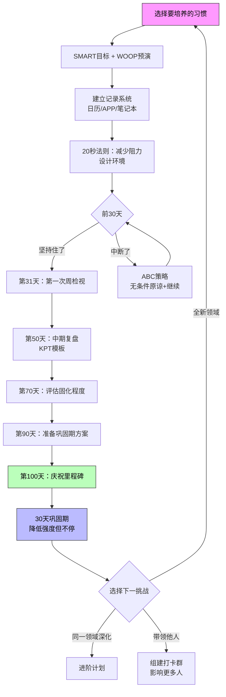

# 第20课：全课总结与行动指南

> **从"知道"到"做到"的最后一步，是把所有知识变成一张可以执行的路线图。**

---

## 九大核心规则完整回顾

整个课程围绕**九条核心规则**展开，它们是100天行动体系的理论基石。以下是每条规则的超浓缩版本：

| 序号 | 核心规则 | 一句话概括 | 对应课程 |
|:----:|----------|------------|:--------:|
| 1 | **制定合适的目标坚持100天** | 用SMART+WOOP设定一个不靠意志力也能完成的目标 | 第1-2课 |
| 2 | **一次一个习惯** | 聚焦一个习惯直到自动化，不要同时挑战多个 | 第3课 |
| 3 | **记录的力量** | 不记录就没有反馈，没有反馈就没有持续改进 | 第4课 |
| 4 | **没有检视的人生不值得活** | 每周固定时间检视进展，微调策略 | 第7课 |
| 5 | **中断、失败和痛苦必须面对** | 用自我关怀（Self-Compassion）代替自我批评 | 第8课 |
| 6 | **成长从复盘开始** | 结构化复盘（KPT/PDCA）是加速成长的引擎 | 第9课 |
| 7 | **100天只是一个起点** | 完成100天后的巩固期和新目标规划同样重要 | 第3课 |
| 8 | **帮你重视的人一起达成目标** | 组团打卡、社会支持系统、好习惯的社会传染 | 第19课 |
| 9 | **每年一次挑战跳出舒适区** | 终身成长型思维，跨学科学习，每年打破一次边界 | 第18课 |

> [!TIP] 规则之间的内在逻辑
> 这九条规则不是随机的清单，而是一个层层递进的体系。它们可以被归纳为**三个阶段**。

---

## 核心三阶段

```mermaid
flowchart LR
    subgraph 第一阶段[初期：建立基础]
        direction LR
        R1[规则1：目标] --> R2[规则2：聚焦] --> R3[规则3：记录]
    end
    
    subgraph 第二阶段[中期：优化迭代]
        direction LR
        R4[规则4：检视] --> R5[规则5：面对失败] --> R6[规则6：复盘]
    end
    
    subgraph 第三阶段[进阶：持续突破]
        direction LR
        R7[规则7：起点思维] --> R8[规则8：社交力量] --> R9[规则9：终身成长]
    end
    
    第一阶段 -->|习惯初步建立| 第二阶段 -->|行为已稳定| 第三阶段
    
    style R1 fill:#f9f,stroke:#333,color:#000
    style R2 fill:#f9f,stroke:#333,color:#000
    style R3 fill:#f9f,stroke:#333,color:#000
    style R4 fill:#bbf,stroke:#333,color:#000
    style R5 fill:#bbf,stroke:#333,color:#000
    style R6 fill:#bbf,stroke:#333,color:#000
    style R7 fill:#bfb,stroke:#333,color:#000
    style R8 fill:#bfb,stroke:#333,color:#000
    style R9 fill:#bfb,stroke:#333,color:#000
```



### 第一阶段：初期 — 建立基础（第1-3条规则）

| 规则 | 关键动作 | 核心工具 | 常见误区 |
|------|---------|----------|---------|
| 规则1 | 用SMART定义具体目标，用WOOP预演障碍 | SMART表格、WOOP工具 | 目标太模糊或太大 |
| 规则2 | 只选1个习惯，坚持100天再改下一个 | 习惯排他性声明 | 同时开启2-3个习惯 |
| 规则3 | 每日记录+可视化进度 | 日历打叉/APP记录 | 只做不记，凭感觉判断进度 |

**本阶段核心挑战：** 前30天是最容易放弃的时期。如果你在第10-20天感到强烈的不适甚至想放弃——这是完全正常的。**这个阶段的关键不是"做到完美"，而是"不要归零"。** 哪怕有一天只做了1分钟，也比完全不做要好。

### 第二阶段：中期 — 优化迭代（第4-6条规则）

| 规则 | 关键动作 | 核心工具 | 常见误区 |
|------|---------|----------|---------|
| 规则4 | 每周固定时间检视进展 | 周检视清单 | 只关心"做了没"不关心"怎么做更好" |
| 规则5 | 中断后用Self-Compassion替代自责 | ABC策略 | 断了一天就自我放弃 |
| 规则6 | 用KPT/PDCA做结构化复盘 | KPT模板 | 复盘流于形式，不写落实到行动 |

**本阶段核心挑战：** 第40-70天会出现"习惯疲劳"——不是做不到，而是觉得"没意思"。这时候需要规则4（检视）来调整节奏，规则5（面对失败）来处理偶尔的断签，规则6（复盘）来找到新的动力来源。

### 第三阶段：进阶 — 持续突破（第7-9条规则）

| 规则 | 关键动作 | 核心工具 | 常见误区 |
|------|---------|----------|---------|
| 规则7 | 100天后巩固30天，再规划下一挑战 | 巩固计划 | 认为100天就是终点，立刻停止 |
| 规则8 | 组建/加入打卡群，带动身边人 | 微信群模板、偶像效应 | 把所有希望寄托在社群上 |
| 规则9 | 每年选一个跨界挑战 | 年度挑战规划表 | 在同一个领域重复挑战 |

**本阶段核心挑战：** 100天完成后的"空虚感"。你可能会失去目标感——这是好事，说明你已经在考虑下一步了。利用规则7-9把单个习惯的胜利转化为**终身成长系统**。

---

## 行动路线图

以下是从零到一百再到下一个一百的行动路线图：



### 六步行动路线图

#### 第1步：选一个习惯（用SMART + WOOP）

**SMART目标公式：**
```
在[时间范围]内，我要[具体行动]，达到[可量化标准]。
示例：在100天内，我要每天跑步30分钟，目标是能连续跑完5公里。
```

**WOOP预演：**
- **Wish（愿望）：** 我想养成每天写作的习惯
- **Outcome（结果）：** 100天后我能写出逻辑清晰、有观点的长文
- **Obstacle（障碍）：** 下班后太累不想动笔；周末想睡懒觉
- **Plan（计划）：** 如果下班后太累，我就先写10分钟再说；如果周末想睡懒觉，我就在前一晚把电脑放在书桌上

> [!WARNING] 选习惯的"三不"原则
> - **不选太多**：一次只选一个
> - **不要太难**：选一个你至少有60%信心完成的
> - **不要和别人比**：你的习惯是你的，不是社交媒体上别人展示的

#### 第2步：建立记录系统

| 记录方式 | 优点 | 缺点 | 适合人群 |
|----------|------|------|----------|
| 纸质日历+打叉 | 视觉冲击强，有仪式感 | 不方便统计 | 喜欢手写的人 |
| 手机APP（Streaks/Productive） | 自动提醒，数据可视化 | 容易忽略 | 手机重度用户 |
| Excel/Notion表格 | 灵活自定义，便于复盘 | 设置门槛略高 | 喜欢数据分析的人 |
| 微信群打卡 | 社会监督，互相鼓励 | 依赖群活跃度 | 需要外部动力的人 |

**关键原则：** 不管你选什么方式，**每天花在记录上的时间不要超过2分钟。**

#### 第3步：使用20秒法则减少阻力

回顾第6课的核心工具——**20秒法则**：

> 如果一件事从开始到行动需要20秒以上，大脑就会判定"太麻烦"而拖延。
>
> - 想早起运动？**前一晚把运动服放在床边**
> - 想每天阅读？**把书放在枕头上**
> - 想多喝水？**把水杯放在办公桌正中央**

同时做反向操作：**增加坏习惯的阻力。**
- 想少刷短视频？**把APP移到屏幕最远一页**
- 想少喝奶茶？**把付款方式从面容支付改为手动输入密码**

#### 第4步：每周做总结

**每周检讨模板（10分钟完成）：**

```markdown
# 第X周习惯检讨

## 数据
- 本周计划完成天数：7天
- 实际完成天数：__天
- 最佳表现：___
- 最差表现：___

## 本周反思
1. 本周最顺利的是什么？（为什么？）
2. 本周最大的困难是什么？（如何改进？）
3. 我是否需要调整目标或方法？

## 下周计划
- 下周重点关注：___
- 需要尝试的新方法：___
```

#### 第5步：ABC策略应对特殊情况

中断是不可避免的。当它发生时，使用**ABC策略**（来自第7课）：

| 步骤 | 行动 | 示例对话 |
|------|------|----------|
| **A** — 承认（Acknowledge） | 承认现实，不否认不逃避 | "是的，我今天没有完成运动计划。" |
| **B** — 体谅（Be Kind） | 对自己表示理解 | "没关系，今天加班到很晚，谁都累。" |
| **C** — 继续（Continue） | 最小化行动，恢复节奏 | "明天至少做15分钟就好。" |

**千万不要**做的事：用"明天补回来"的心态来安慰自己。这会导致第二天压力过大，反而更容易放弃。

#### 第6步：完成100天 → 巩固 → 下一个挑战

完成100天后的黄金30天非常重要：

| 时间段 | 强度 | 聚焦点 |
|--------|------|--------|
| 第1-100天 | 全力冲刺 | 建立习惯，不追求完美 |
| 第101-130天（巩固期） | 降低到70%强度 | 让习惯融入生活，不过度消耗意志力 |
| 第131天起 | 恢复强度或开启新挑战 | 要么深化，要么转移 |

---

## 常见问题速查（FAQ）

| 问题 | 简短回答 | 详情参考 |
|------|----------|----------|
| **坚持了20天断了，要不要从头开始？** | 不需要。断了一天不等于归零。做ABC策略，第二天继续。 | 第8课 |
| **同时想培养运动和阅读两个习惯怎么办？** | 选一个做"主要习惯"，另一个做"附属习惯"（强度减半）。不要同时开启两个100天。 | 第3课 |
| **每天记录发现自己经常断签，很沮丧怎么办？** | 不要关注"断签了多少次"，关注"这个月比上个月多坚持了几天"。趋势比绝对值重要。 | 第4课 |
| **周检视做了几次后觉得没意义怎么办？** | 换一个检视模板。KPT觉得枯燥换成PDCA，或者改成"只问自己两个问题"的模式。 | 第9课 |
| **100天后停了，过了几个月又想捡起来？** | 正常。这不算失败——你只是休息了一段时间。重新开始只需要第1-3步。 | 第7课 |
| **找不到一起打卡的人怎么办？** | 先在社交媒体上打卡，吸引同频的人。或者参加线上社群（豆瓣小组、即刻圈子等）。 | 第19课 |
| **定了年挑战但觉得太难怎么办？** | 拆小目标。比如"学会编程"→"100天内写出一个Todo List网页应用" | 第2课 |
| **每次复盘都写同样的内容？** | 说明进入了舒适区。需要升级目标强度或者换一个新挑战。 | 第18课 |
| **习惯对别人有用但对自己没动力？** | 找到你的"为什么"。如果你对目标没有情感连接，它不会持久。 | 第1课 |
| **家人不支持甚至嘲笑怎么办？** | 不要争论，用结果说话。坚持30天后他们的态度会改变。 | 第19课 |

---

## 推荐阅读

以下是整个课程的核心参考书目，按推荐阅读顺序排列：

| 序号 | 书名 | 作者 | 核心价值 | 对应课程 |
|:----:|------|------|----------|:--------:|
| 1 | **《掌控习惯》** | 詹姆斯·克利尔 | 习惯养成的系统方法论，最实用的一本 | 全课程基础 |
| 2 | **《终身成长》** | 卡罗尔·德韦克 | 成长型思维的底层理论 | 第18课 |
| 3 | **《自控力》** | 凯利·麦格尼格尔 | 意志力的科学原理与提升方法 | 第5课 |
| 4 | **《心流》** | 米哈里·契克森米哈赖 | 如何进入最佳体验状态 | 第13课 |
| 5 | **《为什么我们这样生活，那样工作？》** | 查尔斯·都希格 | 习惯的神经学原理（习惯回路） | 第1课、第11课 |
| 6 | **《穷查理宝典》** | 查理·芒格 | 跨学科思维模型 | 第18课 |
| 7 | **《搞定》** | 戴维·艾伦 | GTD时间管理系统 | 第15课 |

**推荐书单汇总**：课程共推荐7本核心书籍，涵盖习惯养成（《掌控习惯》）、成长思维（《终身成长》）、意志力科学（《自控力》）、心流体验（《心流》）、习惯神经学（《习惯的力量》）、思维模型（《穷查理宝典》）和时间管理（《搞定》）。

> [!TIP] 阅读建议
> - **时间有限？** 先读《掌控习惯》一本就够了，它覆盖了课程中80%的实操方法。
> - **想深入理解原理？** 加读《终身成长》和《自控力》。
> - **想建立完整的知识体系？** 7本全读，每本间隔2-3周，边读边实践。

---

## 写在最后

这门课程的核心信息可以用一句话概括：

> **习惯不是目标，系统才是。100天只是一个开始，终身成长才是终点。**

你不需要完美。你不必做到100天一天不落。重要的是——**你开始了，你坚持了，你从过程中学到了关于自己的东西。**

九条规则中，前8条是关于"如何做"，第9条是关于"成为什么样的人"。如果你只记住一件事，请记住这条：

> 每年给自己一次机会，去做一件让你害怕一点点的事情。不是为了证明什么，而是为了保持"我还是一个会成长的人"这种感觉。

**你的第一个100天，从今天开始。**

---

## 实践任务

> [!QUESTION] 终极练习：你的个人行动计划
>
> 1. **回顾整个课程**，找到一条对你触动最大的规则。在本子上写下：这条规则为什么对你重要？你打算如何应用它？
>
> 2. **制定你的第一个100天计划**（或下一个100天计划），填写以下信息：
>    - **目标习惯：** ________
>    - **SMART目标：** ________
>    - **WOOP障碍预演：** 如果____，我就____
>    - **记录方式：** ________
>    - **20秒法则设置：** ________
>    - **周检视时间：** 每周____午____点
>    - **ABC策略准备：** 如果中断，我的A/B/C分别是什么
>    - **社群支持：** 我将邀请____一起参加
>
> 3. **写一段话给100天后的自己。** 密封保存，100天后打开。

<details>
<summary>参考答案（示例）</summary>

**写给100天后自己的一封信示例：**

> 亲爱的100天后的我：
>
> 今天我开始了一项新挑战——每天跑步30分钟。我不知道100天后我是不是真的能跑5公里，但我选择开始做这件事，因为在100天行动的课程里我学到：**不开始永远不会有结果。**
>
> 我预计中途会有想放弃的时刻。如果有，我希望那时的你记得：断了一天不代表失败，第二天穿上跑鞋就是胜利。
>
> 100天后见。
>
> ——2026年7月20日的我
</details>

---

## 本课总结

| 核心板块 | 内容 |
|----------|------|
| 九大规则 | 目标 → 聚焦 → 记录 → 检视 → 面对 → 复盘 → 起点 → 他人 → 终身 |
| 三个阶段 | 初期（建立基础）→ 中期（优化迭代）→ 进阶（持续突破） |
| 六步行动 | 选习惯 → 建记录 → 减阻力 → 周检视 → ABC策略 → 巩固进阶 |
| FAQ | 覆盖10个最常见卡点的快速解决方案 |
| 推荐阅读 | 7本核心书籍，从实操到理论全覆盖 |

---

## 下一步

课程已全部完成。现在轮到你行动了。

> **在所有的学习方式中，只有一种方式真正有效——那就是去做。**

祝你在100天行动中，不仅养成一个好习惯，更收获一个更好的自己。再见，加油。

---

*课程全部内容到此结束。*